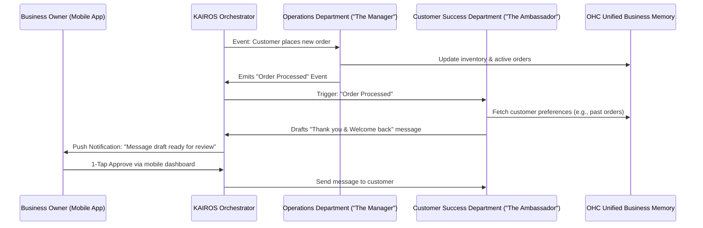

# Title: AI Agent Department Architecture

## Problem Statement
For a non-technical small business owner—like Maya the baker or Carlos the handyman—managing the day-to-day operations of a business is overwhelming. Between tracking inventory, replying to customer inquiries, scheduling appointments, and managing finances, owners are bogged down by administrative work that takes them away from their actual craft. They don't want to use isolated software tools or set up complicated automation workflows; they need an invisible support team that handles this complexity proactively, working in the background like actual employees in a well-run company.

## Research Report
Current SMB platforms (like Shopify or Wix) provide standalone tools that require manual configuration and constant attention. Even platforms with "AI assistants" rely on the user to prompt the AI for help.
- **The Gap:** Users want a platform that doesn't just wait for commands but actively anticipates needs and manages workflows without continuous manual intervention.
- **Opportunity:** By organizing our AI capabilities into recognizable "departments" (Operations, Customer Success, Marketing, etc.), we can create an understandable, trustworthy structure. These agents will monitor business events, draw on long-term business memory, and propose ready-to-approve actions (like drafting a customer reply or suggesting an inventory restock).

## Design Doc

### Key Design Decisions
- **Familiar Functional Boundaries:** We group agents into familiar departments (e.g., "The Manager" for Operations, "The Ambassador" for Customer Success) so owners instinctively know what each does without technical explanations.
- **Proactive vs. Reactive:** Agents are event-driven. They do not wait for a chat prompt; they observe the business flow (e.g., a new order, low stock, or a customer message) and queue actions for approval.
- **Draft-for-Review (1-Tap Approval):** To build trust, high-risk actions (like messaging a customer) are staged in a "Draft" state. The owner simply reviews the action on their mobile dashboard and taps once to approve or decline.
- **Shared Memory Context:** All departments draw from the same memory bank, so "The Ambassador" knows a customer's preference based on past interactions handled by "The Manager".

### Architecture Diagram

### UI Wireframes & Mobile UX Flow
**Target Breakpoint:** 375px (Mobile First)
- **Home Screen Dashboard:** Displays a simple, clean "Action Feed" at the top. Instead of raw data, the owner sees actionable cards.
- **Action Card UI:**
  - *Header:* "Draft from The Ambassador"
  - *Body:* A preview of a message to a customer regarding a recent order.
  - *Actions:* A large "Approve" button (44x44px touch target) and a secondary "Edit/Decline" button.
- **Department Settings Flow:** A single tap on the "My Team" icon shows the status of each agent (e.g., Marketing Agent is "Planning campaign", Operations Agent is "Monitoring orders").
- **Motion & Visuals:** Subtle glassmorphism and smooth, reassuring animations when an action is approved, reinforcing the premium, "grandmother test" compliant experience.

### AI Agent Integration Points
- **Event Mesh Subscription:** Each agent subscribes to business events (e.g., `order.created`, `customer.message_received`).
- **Memory Storage & Retrieval:** Agents read from and write to a centralized semantic memory store to maintain continuity across interactions.
- **Action Queueing:** Agents interact with an approval queue that surfaces their drafted actions to the mobile dashboard.

## Implementation Prompt
Implement the foundational AI Agent Department structure within the orchestrator. Create the event subscription model for at least two departments (e.g., Operations and Customer Success). Ensure that when an event (like a new order) occurs, the respective agent drafts an action and places it into an approval queue. Build the mobile-responsive (375px) "Action Feed" UI where the business owner can view these queued drafts and approve them with a single tap. Do not define specific database schemas or API contracts; focus on establishing the event-driven workflow, the unified memory context access pattern, and the frictionless mobile UX for reviewing and approving agent actions.

## Priority
P0

## Estimated Scope
Large
