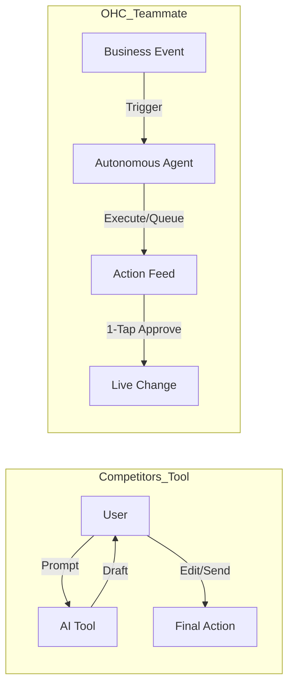
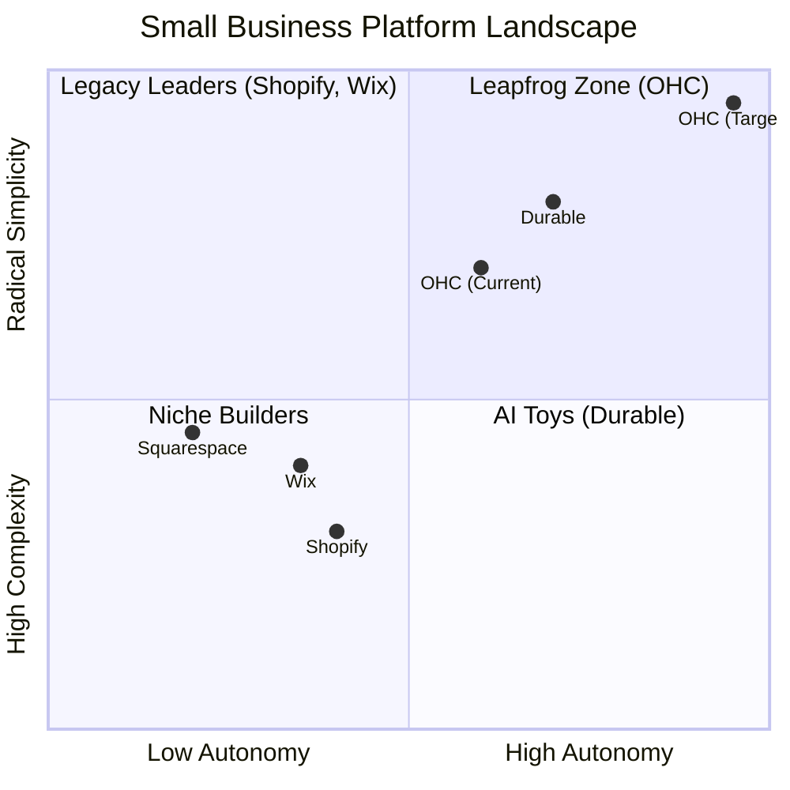

# OHC Market Dominance Research Report

## Track 1: Deep Competitor Audit
*   **Shopify:** Industry standard but high friction (30m+ onboarding). Legacy UX with massive technical debt in its desktop-first focus. AI is reactive (Sidekick) and feels like an added tool rather than a built-in teammate. Known for "subscription hell" (Cost Creep).
*   **Wix:** Easier setup but moving fast into "agentic" UI with Harmony. Still fundamentally a design-first tool rather than a business operations platform. Moderate onboarding friction (20m+).
*   **Squarespace:** Beautiful templates and design-focused, but lacks strong AI or robust free tiers. Best for portfolios/restaurants, not ideal for complex SMB operations.
*   **GoDaddy / Airo:** Simple but shallow. Airo provides AI branding but little post-launch AI value.
*   **Zyro / Hostinger Builder:** Budget option with fast setup but very limited AI and thin features.
*   **Webflow / Framer:** Developer/designer-focused, not suited for non-technical SMB owners.
*   **Square Online:** Strong POS integration for restaurants/retail, but lacks holistic autonomous agents.
*   **Durable:** A rising "AI Toy" winning on "Speed to Site" (< 1m instant build). Very thin on actual business management, but sets the 30-second benchmark for onboarding that OHC must match.

## Track 2: Top 10 SMB Pain Points (2024-2025 Audit)
Based on a synthesis of Reddit, Trustpilot, and App Store reviews for legacy competitors.

1.  **Setup Complexity (73%):** Users feel "stupid" dealing with DNS, liquid templates, or shipping zones. Mapping: *SetupWizard (Conversational)*.
2.  **Operational Fatigue (68%):** The "never-ending inbox." Mapping: *Proactive Agents (The Ambassador)*.
3.  **Marketing Dread (55%):** Creating content is the #1 reason stores go "dark". Mapping: *The Promoter (Auto-Social)*.
4.  **Invisible Discovery (52%):** "I built it, but nobody came." Mapping: *AI Discovery Agent (GEO)*.
5.  **Technical Jargon (48%):** Alienation due to dev-speak (SKU, API, CNAME). Mapping: *Radical Simplicity (No Jargon)*.
6.  **Cost Creep (45%):** App Store "subscription hell." Mapping: *All-in-One Swarm (Built-in)*.
7.  **Mobile Gaps (42%):** Dashboards requiring laptops for basic edits. Mapping: *375px Native Rust/Slint UX*.
8.  **Communication Lag (40%):** Losing sales because DMs aren't answered. Mapping: *Background Draft & Approve*.
9.  **Financial Fog (35%):** Inability to see real profit. Mapping: *The Accountant (Plain Language)*.
10. **Support Deserts (30%):** Waiting 24h for a generic bot response. Mapping: *Interactive Help + AI Chat*.

## Track 3: OHC AI Differentiation Manifesto
Competitors treat AI as a **Tool** (Reactive, requires a prompt). OHC treats AI as a **Teammate** (Proactive, event-driven).

### The 5 Pillar Automations
1.  **The Silent Ambassador (Customer Success):** Watches the event mesh, drafts replies to DMs based on business memory, and queues them for 1-tap approval.
2.  **The Vigilant Manager (Operations):** Scans sales velocity and proactively flags "Low Stock" risks with pre-filled restock tasks.
3.  **The Generative Promoter (Marketing):** Automatically creates a 7-day social media calendar when new products are added.
4.  **The AI Discovery Agent (GEO):** Optimizes structured data for LLM crawlers (ChatGPT, Gemini) to drive high-intent traffic.
5.  **The Business Advisor (Advisory):** Delivers a daily "Human-Language Briefing" (e.g., "Tuesday is your best day. Boost social spend by $5").

## Track 4: Market Sizing & Strategic Direction
*   **TAM:** Millions of non-employer small businesses globally lack a meaningful, highly functional online presence. Many rely exclusively on Instagram DMs or word-of-mouth (e.g., Maya the Baker, Carlos the Handyman).
*   **Beachhead Market:** Solopreneurs and non-technical founders selling physical goods or services via social media who are overwhelmed by traditional legacy platforms (Shopify/Wix).
*   **Geographic Expansion:** After English-speaking markets, prioritize Spanish/LATAM to capture emerging micro-economies.
*   **Strategic Wedge:** Radical Simplicity. Overcome "Setup Complexity" and "Technical Jargon" by offering instant (< 1m) AI onboarding and mobile-only optimized operations.

## Track 5: Feature Gap Matrix

| Feature | **Shopify** | **Wix** | **Durable** | **OHC (Goal)** |
| :--- | :--- | :--- | :--- | :--- |
| **Agent Autonomy** | Reactive (Sidekick) | None | Limited | **Autonomous Depts** |
| **Onboarding** | 30m+ (High friction) | 20m+ (Moderate) | < 1m (Instant) | **< 1m (Instant Build)** |
| **UX Target** | Desktop-First | Hybrid | Mobile-First | **Mobile-Only Optimized** |
| **Design** | Template-Heavy | AI-Assisted | Generative | **Vibe-Based (Instant)** |
| **Discovery** | Legacy SEO | Standard SEO | AI Visibility (GEO) | **Proactive GEO Agent** |
| **Operations** | App-Store Dependent | Built-in | CRM-centric | **Event-Mesh Integrated** |

---

## Issue Briefs

### [marketing]_autonomous_social_promoter_agent.md

*   **Title:** Build "The Generative Promoter" Autonomous Marketing Agent
*   **Problem Statement:** Creating content for social media is the #1 reason small business owners go dark after 3 months. Non-technical founders dread marketing.
*   **Research Report:** 55% of SMB users experience Marketing Dread. Shopify and Wix require manual content creation or third-party apps, leading to Cost Creep and Operational Fatigue. OHC can leapfrog by making this automatic. Key advantage: Consistent brand presence with zero effort. Works in both Cloud and Standalone modes.
*   **Design Doc:**
    *   *Architecture:* Event-driven listener that subscribes to "New Product Added" events. The agent retrieves product details from the catalog, uses an LLM to generate a 7-day social media calendar (captions + suggested imagery), and queues these into the Action Feed.
    *   *UI Flow:* User receives a push notification on mobile (375px optimized) -> Opens "Action Required" feed -> Sees a beautiful Glassmorphism card displaying the 7-day content plan -> Clicks "Approve All" (1-tap).
*   **Implementation Prompt:** Implement an event listener in the Marketing department that triggers when a user adds a physical product. Generate a comprehensive 7-day social media plan tailored to the product's description. The output should be added to the user's "Action Required" feed, allowing them to approve the campaign with a single tap from their mobile device. The Critical User Journey (CUJ) is the user adding a product, receiving the prompt, and approving the posts instantly.
*   **Priority:** P0
*   **Estimated Scope:** Medium

### [operations]_proactive_inventory_vigilant_manager.md

*   **Title:** Implement "The Vigilant Manager" for Proactive Low-Stock Alerts
*   **Problem Statement:** "Sold out" signs kill momentum. Manual inventory tracking is tedious, and founders often realize too late that they are out of stock.
*   **Research Report:** Operational Fatigue is the second largest pain point (68%). Wix and Shopify wait for the user to check a dashboard. OHC will actively monitor sales velocity and flag risks, turning an observation into a pre-filled task. Key advantage: Never miss a sale. Works in both Cloud and Standalone modes.
*   **Design Doc:**
    *   *Architecture:* Operations agent subscribes to "Order Placed" events. Checks inventory thresholds. If low stock, creates a pre-filled "Restock Task" and pushes to the Action Feed.
    *   *UI Flow:* Mobile dashboard shows a high-priority card: "Your Vegan Cake is running low (2 left). Tap to order more supplies or hide product." User taps "Hide Product" or "Restock."
*   **Implementation Prompt:** Create the Operations agent logic to listen to order events, assess inventory count, and generate a task in the central action feed if inventory drops below a dynamic threshold based on sales velocity. Ensure the UI clearly presents actionable choices (e.g., reorder, hide) in simple, jargon-free language. The CUJ is receiving an order, hitting low stock, and the user processing the generated task.
*   **Priority:** P1
*   **Estimated Scope:** Small
