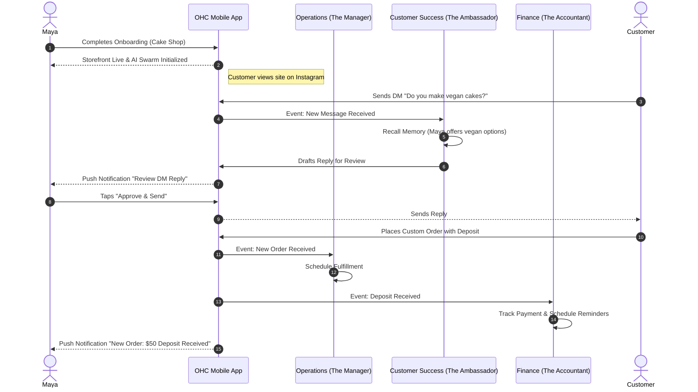
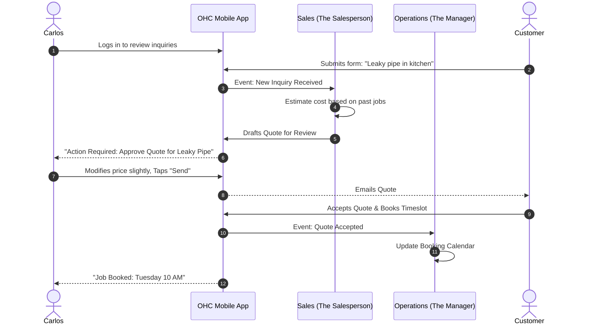

# [architecture] Business Journey Architecture: End-to-End User Journeys

## Problem Statement
The OneHumanCorp (OHC) platform aims to empower anyone, regardless of technical background, to launch and run a small business in under 10 minutes. A critical challenge is ensuring the entire end-to-end journey—from initial discovery to long-term retention—is seamless, jargon-free, and supported by invisible AI agents. The platform must cater to diverse personas (e.g., a home baker, a freelance handyman, a boutique owner) without overwhelming them with complexity or alienating them during crucial touchpoints like onboarding or scaling.

## Research Report
Our analysis of the small business platform landscape highlights significant friction points in traditional solutions:
- **Shopify & Wix:** Suffer from "Setup Complexity" (73% frequency in SMB pain point audits). Users often abandon the process when confronted with technical jargon (DNS, liquid templates) or overwhelming configuration screens.
- **Durable:** Excels at "Speed to Site" (often under 30 seconds) but lacks depth in operational workflows (e.g., booking, inventory, finance).
- **OHC Opportunity:** OHC must deliver an instantaneous, generative onboarding experience (matching Durable) while seamlessly integrating comprehensive, autonomous AI departments. The user journey must be mobile-first, proactive, and guided by plain-language insights rather than complex dashboards.

## Design Doc

### Key Personas and Core Needs
1. **Maya (The Home Baker):** Mobile-only. Needs a photo-heavy catalog, custom deposit-based orders, and AI customer support for Instagram DMs.
2. **Carlos (The Freelance Handyman):** Android-only. Needs service listings, booking calendars, and automated quoting.
3. **Priya (The Boutique Owner):** Omni-channel. Needs inventory sync, product variants, and in-person POS capabilities.
4. **Leo (The Music Tutor):** Needs recurring subscription billing, calendar sync, and automated follow-ups for inactive students.
5. **Fatima (The Food Cart Operator):** Low-end Android, limited English. Needs simple photo menus, pickup notifications, and dual-language support.

### End-to-End Journey Stages

#### 1. Acquisition
- **Trigger:** Discovery via organic search, social media ads (e.g., Instagram, TikTok), or word-of-mouth referral.
- **CTA:** "Launch your business in 10 minutes. No tech skills needed."
- **First Impression:** A 375px-optimized mobile landing page showcasing real, successful OHC businesses.

#### 2. Onboarding (The Wizard)
- **Philosophy:** Zero jargon. Conversational interface.
- **Flow:**
  1. *What do you do?* (e.g., "I bake custom cakes.") -> Determines business category and initializes relevant templates.
  2. *What's your business name?* -> Auto-suggests names if requested.
  3. *Add your first product/service.* -> Generates a description and placeholder image based on the category.
  4. *How do you want to get paid?* -> Simple Stripe integration or standard payment selection.
  5. *Review and Launch.* -> 1-tap deployment of the site and initialization of the AI Swarm.
- **Deferred Setup:** Custom domains, advanced tax rules, and complex shipping are deferred to post-launch.

#### 3. Activation
- **Milestones:** First product live, first visitor logged, first payment received.
- **AI Intervention:**
  - *The Promoter (Marketing)* automatically designs the initial storefront and queues a welcome post for social media.
  - *The Advisor (Advisory)* sends a celebratory "Your business is live!" plain-language notification.

#### 4. Retention & Daily Operations
- **The "Morning Check-In":** A daily push notification (e.g., "Good morning Maya! You have 3 new orders and 1 pending DM draft.").
- **Action Required Feed:** The mobile dashboard prioritizes items needing approval (Draft-for-Review), such as a drafted email to a customer or a generated quote for Carlos.
- **Weekly Health Report:** *The Advisor* delivers a plain-language summary every Monday: "Last week was great! Your vanilla cupcakes were top sellers. Consider running a weekend promotion."

#### 5. Revenue & Expansion
- **Upgrade Trigger:** Hitting AI action limits or needing a custom domain triggers an upgrade prompt.
- **Presentation:** Contextual and value-driven. "You're getting lots of traffic! Upgrade to the Starter Tier for a custom domain to look even more professional."

#### 6. Referral (The Viral Loop)
- **Mechanism:** Seamless sharing of the business link or specific products. Built-in referral tracking for owners who invite other businesses, offering perks (e.g., increased AI action limits).

### Architecture Diagrams (Mermaid.js)

#### Persona Journey: Maya (The Home Baker)

#### Persona Journey: Carlos (The Handyman)

## Implementation Prompt
**Task:** Implement the foundational telemtry and state tracking for the "Activation" stage of the user journey.
**CUJ:** A new user completes the onboarding wizard. The system must record the 'first_product_added' and 'storefront_published' events, updating the tenant's onboarding progress state. This state must be queryable by the AI Advisory department to trigger the "Your business is live!" celebratory notification.
**Acceptance Criteria:**
- Define database structures to track onboarding progression milestones per tenant.
- Implement API endpoints to safely update these milestones from the mobile application.
- Ensure the AI Advisory agent can read this state to proactively generate activation-related insights.
- Add comprehensive Playwright E2E tests covering the completion of the onboarding wizard and the subsequent verification of the updated state on the dashboard.

## Priority
P1

## Estimated Scope
Medium