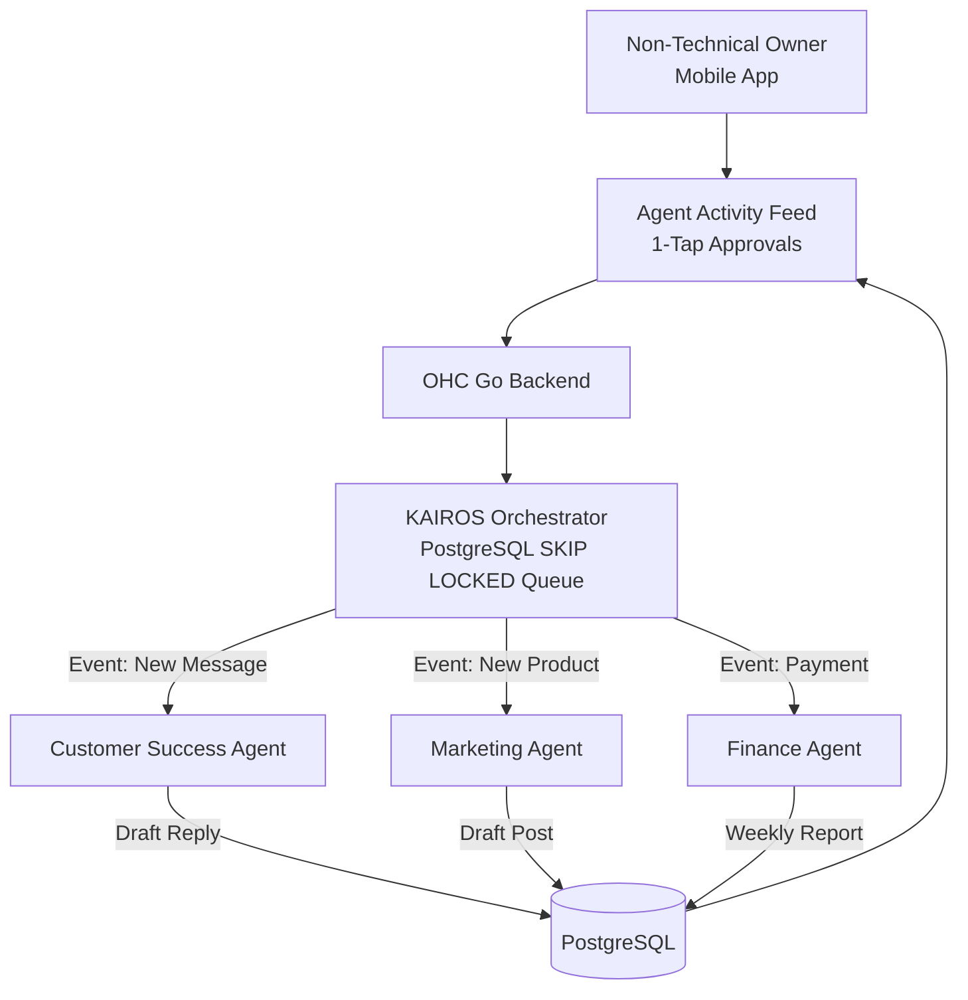

# OHC AI Agent Platform: Research and Market Gap Analysis

## 1. Deep Competitor Audit

We conducted an exhaustive analysis of major small business platforms, focusing on their setup friction, AI maturity, mobile-first design, and core user feedback.

| Feature | OHC | Shopify | Wix | Squarespace | GoDaddy |
|---|---|---|---|---|---|
| **Setup Time** | < 10 min | 30-60 min | 20-40 min | 30-60 min | 20-40 min |
| **Tech Knowledge** | Zero | Low | Low | Low | Low |
| **AI Agents** | Background / Autonomous | Reactive Chatbot (Sidekick) | Generation Only (ADI) | Generation Only | Generation Only (Airo) |
| **Mobile UX** | Full Management | Partial Management | Partial Management | View Only | View Only |
| **Business Scope**| All-in-one | Store Only | Complex All-in-one | Portfolio + Store | Basic Sites |
| **Free Tier** | Useful & Feature-rich | None | Ad-supported / Limited | None | None |

### Key Competitor Weaknesses (from App Store/TrustPilot/Reddit)
*   **Shopify:** Complex to customize without paying for premium themes or developer help. Sidekick is conversational, not an active background worker.
*   **Wix/Squarespace:** Mobile management is poor. The AI generates the site initially but does not help with ongoing operations (e.g., customer support, marketing).
*   **GoDaddy:** Aggressive upselling. Airo generates a basic site but leaves users to handle daily operations.

## 2. Top 10 SMB Pain Points & OHC Mapping

Based on community research (Reddit `r/smallbusiness`, App Store reviews), non-technical founders struggle with these critical issues:

1.  **Overwhelming Setup Complexity (Shopify/Wix):** *Mapped to OHC < 10min AI-guided setup.*
2.  **Constant Customer Inquiry Distraction (Instagram DMs/Email):** *Mapped to OHC Customer Success Agent (auto-drafting replies).*
3.  **Inventory/Menu Synchronization:** *Mapped to OHC Operations Agent.*
4.  **Booking and Payment Friction (Manual Invoicing):** *Mapped to OHC Finance Agent + Stripe Integration.*
5.  **Lack of Marketing Knowledge/Time:** *Mapped to OHC Marketing Agent (auto-generating social posts/SEO).*
6.  **Complex Analytics (Google Analytics is too hard):** *Mapped to OHC Business Advisory Agent (plain language reports).*
7.  **Inability to Manage from a Phone:** *Mapped to OHC Mobile-First 375px design.*
8.  **Expensive Subscriptions for Essential Features:** *Mapped to OHC's useful free tier.*
9.  **Fear of Legal/Compliance Mistakes:** *Mapped to OHC Legal Agent.*
10. **Abandoned Carts / Lost Leads:** *Mapped to OHC Sales Agent (auto-follow-up).*

## 3. OHC AI Differentiation Manifesto

Our core differentiation is **Autonomous Background Agents organized into functional departments.**

1.  **Customer Success ("The Ambassador"):** Auto-drafts replies to common inquiries ("Do you have vegan options?") allowing 1-tap approval from the mobile app.
2.  **Marketing & Advertising ("The Promoter"):** Automatically creates draft Instagram/TikTok posts based on new inventory added by the user.
3.  **Finance & Payments ("The Accountant"):** Monitors Stripe webhooks and generates plain-language weekly profit summaries, not complex dashboards.
4.  **Operations ("The Manager"):** Detects low inventory and automatically alerts the owner or toggles the "sold out" state on the storefront.
5.  **Sales ("The Salesperson"):** Identifies users who viewed a service but didn't book, auto-drafting a personalized follow-up email.

*Unlike Shopify Sidekick (which waits to be asked), OHC Agents work proactively while the user sleeps, queuing actions for 1-tap approval upon waking.*

## 4. Market Sizing & Strategic Direction

*   **Beachhead Market:** "The Service Freelancer" (e.g., Carlos the Handyman, Leo the Tutor). They have high LTV, zero need for complex physical logistics (shipping), and their biggest pain point is missed leads due to being "on the job."
*   **Secondary Target:** "The Micro-Retailer/Baker" (e.g., Maya, Fatima). Requires local pickup/deposit functionality which Shopify handles poorly out-of-the-box.
*   **Expansion:** Focus on English-first, but architect the UI for easy translation (Arabic/Spanish) given the global nature of micro-entrepreneurship.

## 5. Architectural Implementation Blueprint

To support these findings, OHC must implement:

1.  **KAIROS Job Queue (PostgreSQL `SKIP LOCKED`):** For durable background agent task processing.
2.  **Agent Draft-for-Review UI:** A mobile-first (375px) feed where users can approve/reject AI actions.
3.  **Teammate Mesh (Redis):** For inter-agent communication (e.g., Ops tells Marketing about new inventory).

