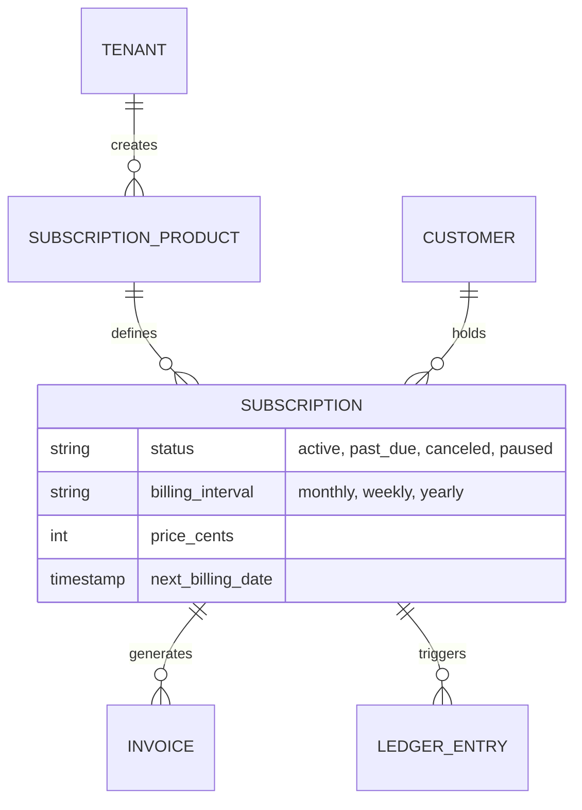
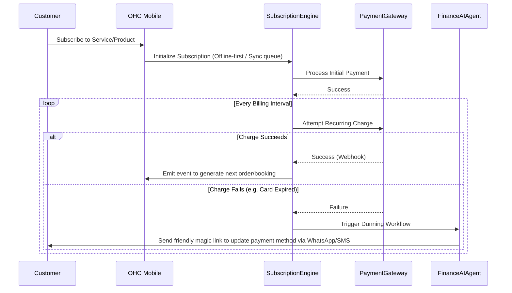

# [Architecture] Autonomous Subscription & Recurring Billing Engine

## 1. Executive Summary & Problem Statement

Small business owners—whether they are music tutors like Leo offering recurring lesson packages, or bakers like Maya curating a "Cake of the Month" club—struggle with managing recurring revenue. Today, offering subscriptions typically means bolting on expensive, complex third-party tools (like Recharge or Skio) that demand technical configuration and fracture the user experience.

**The Mission:** To provide a natively integrated, zero-configuration recurring billing engine within the OneHumanCorp (OHC) platform. A business owner should be able to toggle "Offer as Subscription" on any service or product, and OHC will handle the lifecycle, offline-first synchronization, and automated AI dunning workflows.

## 2. Competitive Differentiation & Offline-First CRDT Design

While competitors (Shopify, Wix) require active connections to manage inventory and subscription states, OHC differentiates by adopting an **Offline-First CRDT Architecture**.

- **Local-First Datastore:** Using SQLite/IndexedDB on mobile or desktop, local state is mutated immediately without blocking on a network connection.
- **CRDT Synchronization:** Using LWW-Element-Set CRDTs (Last-Write-Wins), mutations made offline are securely merged with the Cloud PostgreSQL multi-tenant backend once the connection is restored, preventing state drift.
- **AI Dunning vs. Static Emails:** Instead of generic "Payment Failed" emails, the built-in Finance AI Agent automatically engages customers via conversational channels (WhatsApp, SMS, Email) to recover failed renewals seamlessly.

## 3. Data Model & Architecture

### Entity-Relationship Diagram

### System Flow

## 4. AI Agents in the Subscription Lifecycle

- **Finance & Payments Agent ("The Accountant"):** Monitors billing intervals. Orchestrates the automated dunning process upon failed payments. Retries cards intelligently based on optimal times.
- **Operations Agent ("The Manager"):** Generates automated tasks for physical/service deliverables upon successful billing (e.g., adding "Leo's Guitar Lesson" to the calendar, or placing "Maya's Vegan Cake" into the prep queue).
- **Customer Success Agent ("The Ambassador"):** Answers customer queries regarding their subscription (e.g., "Can I skip next month?"), drafting replies and mutating the CRDT state automatically.

## 5. UI/UX Design & The Grandmother Test

Following the OHC Premium Token standard (Translucent Glass, `#0066FF` accents, mobile-first):
1. **The Subscription Toggle:** On the merchant side, complex billing concepts are reduced to a single toggle. "Offer as Subscription".
2. **Offline-Resilient Management:** The merchant dashboard displays upcoming renewals and active subscribers. If the device goes offline, changes (like pausing a subscription) update the local UI instantly and synchronize to the cloud via CRDT when online.
3. **Magic Link Portal:** Customers manage their own subscriptions without creating passwords, authenticating via secure magic links delivered via SMS/Email to update cards or skip deliveries.

## 6. Target Acceptance Criteria

1. Implement the `Subscription` and `SubscriptionProduct` schema in PostgreSQL with Row Level Security (`tenant_id`).
2. Integrate local CRDT mutation queue for offline-first creation/editing of subscriptions.
3. Establish webhooks mapped to the Finance AI Agent to manage dunning automatically.
4. Ensure all UI components follow the 375px mobile-first standard and utilize Translucent Glass aesthetics.
