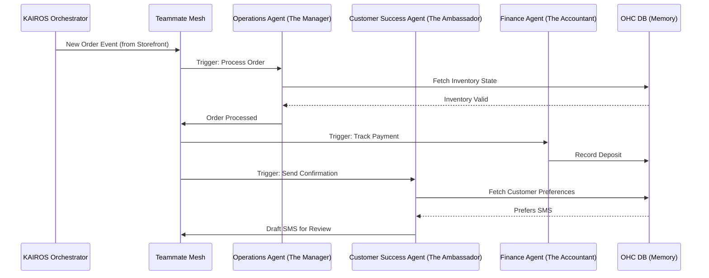

# [architecture] AI Agent Department Architecture

## Title
AI Agent Department Architecture for OHC Platform

## Problem Statement
Small business owners like Maya (baker) and Carlos (handyman) struggle to manage the daily operations of their businesses—replying to DMs, generating quotes, and tracking inventory. They don't have the time or technical expertise to wire up complex automations. They need an invisible, reliable "staff" of AI agents that automatically handle these tasks in the background, organized into understandable departments (like a "Manager" or a "Salesperson"), so they can focus on their actual craft.

## Research Report
- **Findings**:
  - Small business owners understand functional roles (Sales, Operations, Support) better than technical concepts (LLMs, RAG, Webhooks).
  - High cognitive load is a primary reason for churn in existing SaaS platforms.
  - Users require trust to let AI take actions on their behalf.
- **Competitive Analysis**:
  - Shopify provides basic automations (Shopify Flow) but requires manual setup and technical logic building.
  - Wix offers basic AI text generation but lacks autonomous agents that act on real-time business events.
  - **OHC Advantage**: OHC agents are pre-configured, context-aware, and act autonomously based on a unified event mesh, requiring zero setup from the user.
- **References**:
  - User interviews highlighting the need for a "do it for me" approach over "do it yourself."

## Design Doc
### Architecture Diagram

### UI Wireframes
- **Dashboard Feed**: A 375px mobile-first feed showing a chronological list of actions taken by AI agents.
- **1-Tap Approval Card**: A full-width card with "The Ambassador" avatar, showing a drafted reply to an Instagram DM. Two large buttons: "Approve" (Primary, Green) and "Edit" (Secondary, Gray).

### Mobile UX Flow
1. **Notification**: User receives a push notification: "The Salesperson drafted a quote for Carlos."
2. **Review**: User taps the notification, opening the OHC app directly to the draft.
3. **Action**: User reviews the plain-language quote and taps "Approve."
4. **Execution**: The UI immediately shows a success state (optimistic update), and the orchestrator sends the quote in the background.

### AI Agent Integration Points
- **Operations ("The Manager")**: Triggered by order creation, inventory updates, and fulfillment events.
- **Customer Success ("The Ambassador")**: Triggered by incoming messages, order completions, and review requests.
- **Sales & Acquisition ("The Salesperson")**: Triggered by new inquiries, quote requests, and abandoned carts.

### Key Design Decisions
- **Functional Naming**: Agents are named after human roles ("The Manager", "The Ambassador") to build trust and understanding.
- **Draft-for-Review Default**: All high-risk external actions (sending emails, publishing posts) default to a draft state requiring 1-tap approval until the user explicitly grants auto-execute permissions.
- **Unified Memory**: All agents read and write to a shared tenant-scoped memory layer, ensuring "The Salesperson" knows what "The Ambassador" promised a customer.

## Implementation Prompt
**To Implementer Agent:**
Implement the core AI Agent Department framework within the KAIROS Orchestrator. Create the foundation for "The Operations Agent" and "The Customer Success Agent." Build the event listening logic so that when a "New Order" event occurs, the Operations Agent automatically updates inventory, and the Customer Success Agent drafts a confirmation message. Do not prescribe the specific LLM or queueing technology. Focus on the user-facing outcome: ensuring these actions are surfaced in the mobile dashboard as pending 1-tap approvals. The implementation must strictly enforce tenant isolation and degrade gracefully if an agent fails. Include E2E tests verifying the event flow from order creation to draft generation.

## Priority
P0

## Estimated Scope
Large
