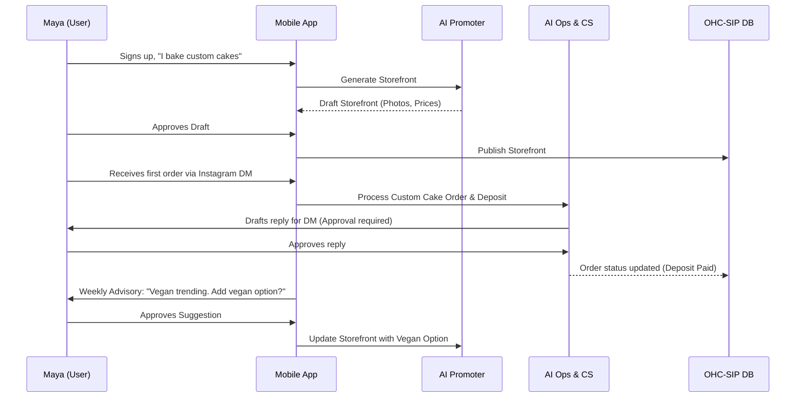
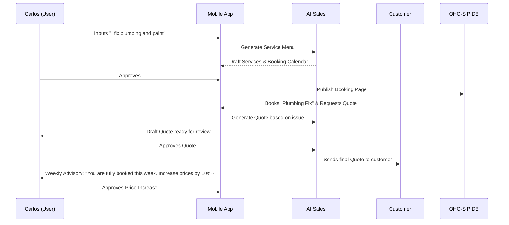
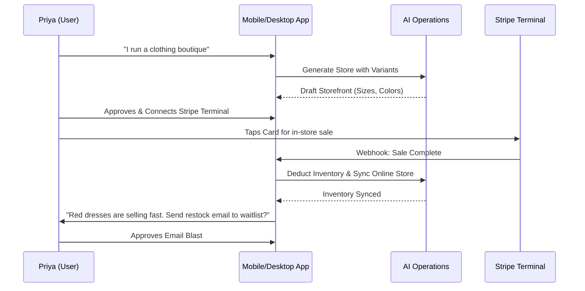
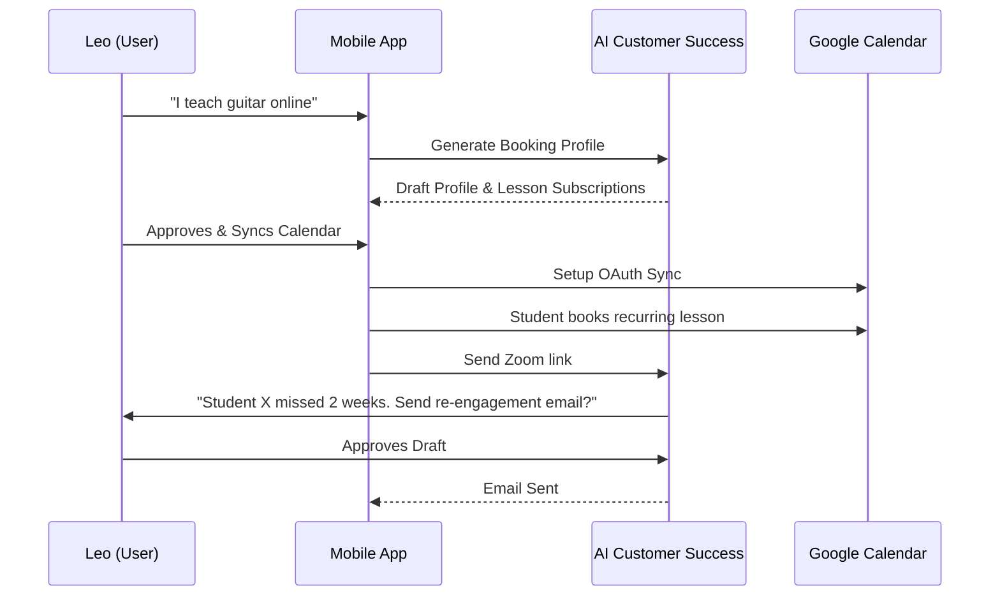
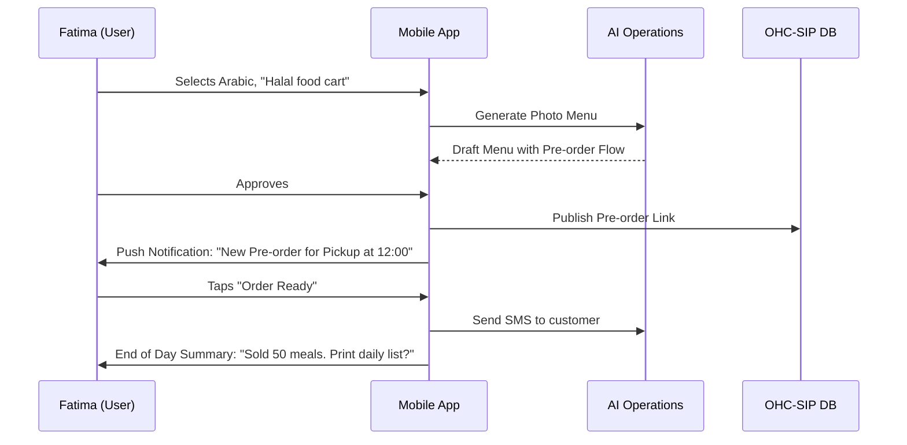

# Business Journey Architecture

## Title
Business Journey Architecture

## Problem Statement
Small business owners coming from non-technical backgrounds (like Maya the baker or Carlos the handyman) frequently abandon platform onboarding flows when confronted with technical jargon, complex setup processes, and overwhelming configuration options. OHC needs a seamless, end-to-end user journey across acquisition, onboarding, activation, retention, revenue, and referral that is tailored to different personas. This architecture will define how each persona moves from discovery to a live, money-making business in under 10 minutes, entirely on mobile, with AI handling the complexity.

## Research Report
- **Competitor Analysis**:
  - *Shopify / Wix / Squarespace*: Typically require 20-60 minutes of setup on a desktop. Onboarding flows are often generic and rely on the user to configure themes, set up products, and connect gateways. Mobile apps are mostly for managing an existing store, not building from scratch.
  - *GoDaddy*: Offers a simpler onboarding but lacks deep AI integration that performs real work (like writing product descriptions or answering customer DMs).
- **OHC's Differentiation**:
  - Zero technical knowledge required.
  - Setup in under 10 minutes.
  - Mobile-first onboarding.
  - Invisible AI agents doing the heavy lifting.
- **Key Persona Findings**:
  - **Maya (Baker)** needs image-heavy catalog creation and deposit tracking via DMs.
  - **Carlos (Handyman)** needs service scheduling and quote generation.
  - **Priya (Boutique)** needs POS integration and variant management.
  - **Leo (Tutor)** needs calendar sync and subscription billing.
  - **Fatima (Food Cart)** needs rapid pre-order notifications and a multi-language interface.

## Design Doc

### UI Wireframes & Screen Flow (375px first)
1. **Chat Onboarding**: A familiar, chat-bubble interface. "Welcome! What type of business are you launching today?"
2. **Photo Upload & Magic Draft**: A 375px optimized screen with a large primary action "Upload Photos". Shows a skeleton loading screen while AI generates the draft.
3. **Draft Review**: Full-screen preview of the generated storefront. A sticky bottom bar: "Looks Good (Publish)" or "Tweak it".
4. **Dashboard Home**: Top card: "Share your link". Below: AI Inbox (messages and tasks). Bottom Nav: Home, Orders/Bookings, Customers, Settings.
5. **Approval Center**: A Tinder-like swipe interface for AI draft approvals (e.g., swipe right to approve an AI-generated email reply).

### Mobile UX Flow
- The entire flow must never require horizontal scrolling.
- Inputs must trigger correct native mobile keyboards (e.g., numeric for prices).
- Modals should be bottom sheets (draggable to dismiss).
- Glassmorphism token usage for floating action buttons to maintain context.

### AI Agent Integration Points
- **Promoter Agent**: Integrated during onboarding (generating the site) and in the marketing tab (auto-generating social posts).
- **Sales & Operations Agents**: Integrated into the checkout and booking flows.
- **Customer Success Agent**: Integrated directly into the unified inbox, generating draft replies for review.
- **Advisory Agent**: Integrated via weekly push notifications and a "Health" tab on the dashboard.

### Business Lifecycle Stages (Cross-Persona)

#### 1. Acquisition
- **Maya**: Discovers OHC via Instagram ad showcasing "Turn your DMs into a bakery business." CTA: "Start selling in 5 minutes."
- **Carlos**: Finds OHC via Google Search for "easy booking app for handymen." CTA: "Get your booking link."
- **Priya**: Referred by another boutique owner in a Facebook group. CTA: "Launch your online boutique."
- **Leo**: Discovers OHC via TikTok highlighting a "Link in Bio that actually books lessons." CTA: "Create your booking link."
- **Fatima**: Finds a flyer at a local community center. Scans QR code. CTA: "Take orders on your phone."

#### 2. Onboarding
The onboarding is a conversational AI flow, not a traditional form.
- "What do you do?" (e.g., "I bake custom cakes")
- "What's your business name?"
- "Upload a few photos of your work."
- AI automatically generates the initial storefront, service list, and base pricing based on the photos and description.

#### 3. Activation
- **Day 1**: User connects Stripe (1-tap setup or simplified form) and shares their generated link on social media.
- **Week 1**: First order or booking received. The AI Operations Agent processes it and sends a push notification.

#### 4. Retention
- **Weekly Loop**: The AI Advisory Agent sends a plain-language summary every Monday: "You had 3 cake orders last week. Vegan is trending. Should I add a vegan option to your menu?"
- **Approval Flow**: Maya taps "Yes", and the AI updates her storefront automatically.
- **Re-engagement**: "Carlos, you have an open time slot tomorrow. Want me to email past clients a 10% discount to fill it?"

#### 5. Revenue
- **Free Tier**: Useful for the first 10 products/bookings.
- **Upgrade Prompt**: Triggered when the user hits 80% of their limit or tries to connect a custom domain. The prompt focuses on value: "You're growing fast! Upgrade to Starter to unlock unlimited bookings and a custom domain." (e.g., Maya upgrades when she needs a custom domain to look more professional).

#### 6. Referral
- **Viral Loop**: Priya shares her success with a boutique-owner friend by sending her a personalized invite link: "Setup your store like mine in 5 minutes and get 1 month Starter free."

### Friction Points & Solutions (Abandonment Risks)
- *Friction*: Complex Stripe onboarding drops off non-technical users.
  *Solution*: Deferred payment setup. Users can publish and accept bookings first; collect payment details later when the first order arrives.
- *Friction*: Writing SEO-friendly product descriptions is daunting.
  *Solution*: AI auto-generates descriptions from uploaded photos.
- *Friction*: Setting up shipping zones or variant grids manually.
  *Solution*: Operations Agent asks simple questions ("Do you ship outside your state?", "Does this come in sizes?") and configures it automatically.

### Architecture Diagrams (Mermaid.js) - Full Journeys

#### Maya (Baker) Full Journey


#### Carlos (Handyman) Full Journey


#### Priya (Boutique) Full Journey


#### Leo (Music Tutor) Full Journey


#### Fatima (Food Cart) Full Journey


## Implementation Prompt
"Implement the AI-driven conversational onboarding flow for new tenants. Create the Flutter mobile UI for the chat-based wizard that collects the business type and photos. Integrate with the backend KAIROS orchestrator to trigger the 'AI Promoter Agent', which will generate a draft storefront and return it to the UI for 1-tap approval. Ensure the flow is completely mobile-optimized (375px wide) and saves the approved tenant state to the OHC-SIP DB. Follow the sequence flows and UI wireframes defined in the architecture."

## Priority
P0

## Estimated Scope
Large

```yaml
issue_id: "business_journey_arch"
issue_title: "[architecture] Business Journey Architecture"
issue_priority: "P0"
issue_description: "Design and implement the complete end-to-end user journeys (Acquisition through Retention) and AI-driven conversational onboarding flow for new tenants across all target personas."
issue_todo_list:
  - [ ] Build Flutter conversational UI for onboarding.
  - [ ] Connect UI to AI Promoter Agent via KAIROS.
  - [ ] Implement AI Advisory loop for retention.
issue_label: ["architecture", "high-impact", "core-feature"]
Priority: "P0"
Estimated Scope: "Large"
```
