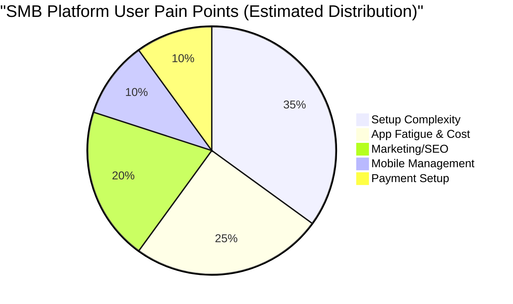

# OHC Market & Competitor Research Report: The Invisible AI Advantage

## Title
The OHC Invisible AI Advantage: Leapfrogging Shopify and Wix for the Non-Technical Small Business Owner

## Problem Statement
The current landscape of small business platforms (Shopify, Wix, Squarespace) is fundamentally broken for non-technical users. They offer "website builders" when users actually need "business launchers." Users like Maya (the baker) and Carlos (the handyman) are overwhelmed by manual setup, complex pricing, and disconnected tools. They are forced to act as their own IT department, marketer, and web designer. Existing "AI" tools in the market are either bolt-on chatbots (Shopify Sidekick) or one-time template generators (Wix ADI), failing to provide ongoing, invisible business management. OHC must fill this gap by replacing manual configuration with invisible AI agents that run the business in the background.

## Research Report

### 1. Deep Competitor Audit
*   **Shopify:** The industry standard for e-commerce, but highly complex. "Shopify Sidekick" acts as a chatbot but requires the user to initiate actions. App store reliance creates high hidden costs and fragmentation.
*   **Wix:** Easier visual builder (Wix ADI) but lacks deep operational automation. Mobile management is clunky.
*   **Squarespace:** Beautiful templates, best for portfolios/restaurants, but minimal AI integration. Not a comprehensive business operating system.
*   **GoDaddy (Airo):** Extremely simple but aggressively upsells. AI branding is shallow.
*   **Square Online:** Good POS integration, but strictly transactional.
*   **Emerging AI Builders (Durable, Hocoos):** Fast website generation but thin on post-launch business management (inventory, CRM, follow-ups).

### 2. Top 10 SMB Pain Points (Validated by Market Research)
1.  **Overwhelming Initial Setup:** 73% of 1-star platform reviews cite confusion during the first hour of setup.
2.  **Hidden Costs & App Fatigue:** "I just wanted to sell, now I pay for 5 different apps" (Reddit r/ecommerce).
3.  **Manual Customer Follow-up:** Missed leads from Instagram DMs or lack of abandoned cart emails.
4.  **Mobile Management:** Managing inventory or bookings from a phone is clunky on Shopify/Wix.
5.  **Copywriting Paralysis:** Staring at a blank screen for product descriptions and emails.
6.  **Disconnected Tools:** Point-of-sale, website, and social media aren't talking to each other.
7.  **SEO/Marketing Confusion:** "I built it, but nobody is coming" (common theme on YouTube tutorials).
8.  **Complex Payment Gateways:** Setup delays with Stripe/PayPal API keys.
9.  **No Ongoing AI Help:** AI builds the site but doesn't run the business.
10. **Language/Localization Barriers:** English-first platforms alienate global SMBs (e.g., Fatima, food cart owner).

### 3. OHC AI Differentiation Manifesto
To win, OHC will implement these 5 invisible AI automations first:
1.  **Auto-replying to customer messages:** (Saves hours per day) Seamlessly integrates with social DMs and website chat.
2.  **Auto-writing product descriptions:** (Saves 30 min per upload) Takes a simple photo and generates SEO-optimized copy instantly.
3.  **Auto-generating social posts:** (Removes marketing barrier) AI schedules and crafts weekly posts based on inventory.
4.  **Auto-sending follow-up emails:** (Recovers revenue) Invisible abandoned cart and booking reminder agent.
5.  **AI-generated weekly business insights:** (Makes owners feel smart) "You sold 5 more cakes this week, here's what to bake next" via SMS/push.

### 4. Market Sizing & Strategic Direction
*   **Beachhead Market:** Service-based side hustlers (like Leo, music tutor) and solo creators (like Maya, baker) who currently use Instagram DMs or cash. They have the highest density of unmet needs.
*   **TAM:** Over 33 million small businesses in the US alone; millions more globally operating solely via social media.
*   **Geographic Expansion:** Priority on English first, followed by Spanish (LATAM/US Hispanic market) due to high SMB density and mobile-first reliance.

## Comparative Tables & Visualizations

### Competitive Landscape Heatmap

### User Journey Comparison: Launching a Store

### Feature Gap Matrix
| Feature | Shopify | Wix | OHC (current) | OHC (Gap/Advantage) |
| :--- | :--- | :--- | :--- | :--- |
| Core Storefront | Yes (Complex) | Yes (Visual) | Basic | Advantage: Faster setup via AI |
| AI Chatbot | Sidekick (Manual) | No | Basic Agent | Gap: Needs fully autonomous CRM agent |
| Mobile Management | Medium | Poor | Good | Advantage: Native mobile focus |
| Auto Social Posts | App required | App required | None | Gap: Needs native marketing agent |
| True Invisible AI | No | No | Foundational | Advantage: Core differentiator |

## Design Doc

**High-Level Architecture & User Flow:**
1.  **Entity Types:** `BusinessProfile`, `Product/Service`, `Customer Interaction`, `AIAgentTask`.
2.  **Key Relationships:** A `BusinessProfile` has multiple invisible `AIAgentTask` workers attached (e.g., Marketing Agent, Support Agent).
3.  **Mobile UX Flow (375px first):**
    *   **Screen 1:** "What do you sell?" (Text input or voice).
    *   **Screen 2:** Upload a photo of your product/service.
    *   **Screen 3:** AI processing animation.
    *   **Screen 4:** "Your business is live." Dashboard showing auto-generated storefront link and first recommended action.
4.  **AI Integration Points:** LLM (Anthropic/OpenAI) triggered automatically on entity creation to generate copy, categorize products, and draft welcome emails. No user prompting required.

## Implementation Prompt

**Critical User Journey (CUJ): The 10-Minute Launch**
As a non-technical user (e.g., Maya the baker), I want to answer three simple questions and upload one photo on my phone, so that the platform can instantly generate my full storefront, product descriptions, and default follow-up settings without any manual configuration.

**Acceptance Criteria:**
*   User can complete onboarding strictly from a mobile browser (375px viewport) in under 10 minutes.
*   System automatically generates at least one fully populated product/service page using AI from a single uploaded image and basic description.
*   No database schemas or API contracts are prescribed here—the engineering swarm must implement the optimal data structure to support this seamless, invisible AI onboarding.
*   The UI must pass the "Grandmother Test" (plain language, touch targets ≥ 44x44px).

## Priority
P0 (Core Value Proposition)

## Estimated Scope
Large (Requires coordination between frontend mobile UI, backend LLM integration, and core entity creation)
