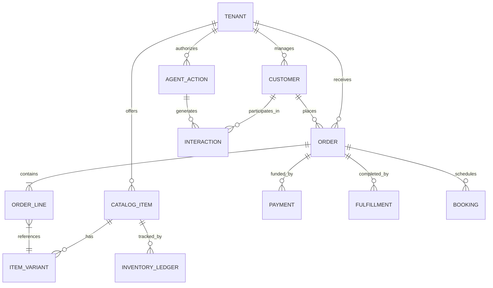

# [Research] Data Model Architecture for OneHumanCorp

## Problem Statement
The OneHumanCorp platform must support a broad variety of small businesses—from bakers taking custom cake pre-orders to freelance handymen offering services, and boutique owners selling physical inventory. Existing platforms like Shopify are optimized for traditional physical retail, while Wix and Squarespace offer generalized page builders with bolted-on e-commerce. A rigid e-commerce-only data model fails the needs of service providers (like Carlos the Handyman), while a pure booking system fails product sellers (like Priya the Boutique Owner). OHC requires a unified, multi-tenant Data Model Architecture that natively handles physical products, digital products, service bookings, and subscriptions, while maintaining strict isolation and empowering autonomous AI agents with cross-entity context.

## Research Report
Based on architectural requirements and analysis of the market:

- **Shopify:** Uses a complex, rigid structure primarily built around `Products`, `Variants`, and `Orders`. Service bookings and digital products often require third-party apps, complicating the data model and adding friction for non-technical users.
- **Wix/Squarespace:** Offer separate modules for "Stores" and "Bookings", resulting in fragmented data silos. A customer might exist in the Store database and the Bookings database independently, making unified AI agent advisory impossible.
- **Data Isolation:** For multi-tenant SaaS, row-level security (RLS) is the standard for ensuring strict logical isolation within a shared database, preventing cross-tenant data bleed while simplifying the application layer.
- **AI Context:** AI agents require rapid access to aggregated business context. A normalized, event-sourced data model allows agents to reconstruct state and understand the full customer journey (e.g., "Customer X bought a cake, then booked a consultation").

## Design Doc

### Entity Relationship Architecture

### Key Architectural Decisions and Invariants

1. **Strict Multi-Tenancy via PostgreSQL RLS:**
   - Every table in the system (except global configuration) MUST contain a `tenant_id` column.
   - Row-Level Security (RLS) policies MUST be enforced at the database level (`ENABLE ROW LEVEL SECURITY`), ensuring queries inherently filter by the current tenant's context, drastically reducing the risk of application-layer data bleed.

2. **Unified Catalog Model (`CATALOG_ITEM`):**
   - Instead of distinct tables for "Products", "Services", and "Digital Goods", the platform uses a unified `CATALOG_ITEM` entity with a polymorphic `item_type` (Physical, Service, Digital, Subscription).
   - This allows a single `ORDER` to seamlessly contain a physical product (a guitar) and a service booking (a guitar lesson).

3. **Event-Driven Inventory and Fulfillment:**
   - Inventory is managed via an append-only `INVENTORY_LEDGER` rather than absolute value updates, enabling robust history tracking and preventing race conditions during concurrent purchases.
   - The `ORDER` entity coordinates with `FULFILLMENT` (for physical shipping/pickup) or `BOOKING` (for scheduled services).

4. **AI-Ready Interaction History (`INTERACTION`):**
   - All customer touchpoints (Instagram DMs, email receipts, website inquiries) are stored as `INTERACTION` records linked to the `CUSTOMER`. This forms the contextual memory bank for the `Agent Departments`.

5. **Access Patterns:**
   - **Mobile App (Frontend):** Heavily relies on aggregated views (e.g., "Daily Summary", "Pending Orders") fetched via GraphQL or REST. These views should be materialized or aggressively cached in Redis for low-latency (<100ms) performance on 3G networks.
   - **AI Agents (Backend):** Leverage vector embeddings of `INTERACTION` and `CATALOG_ITEM` data (via `pgvector`) alongside structured queries to quickly answer customer inquiries or generate weekly business advisory reports.

### Migration Strategy
- **Phase 1:** Core Tenancy and Catalog. Deploy the `TENANT`, `CUSTOMER`, and unified `CATALOG_ITEM` schema with RLS enabled.
- **Phase 2:** Transactions. Introduce `ORDER`, `PAYMENT`, `FULFILLMENT`, and `BOOKING`.
- **Phase 3:** Agent Context. Deploy the `INTERACTION` and `AGENT_ACTION` tables, integrating `pgvector` for AI semantic search capabilities.

## Implementation Prompt
Implement the core multi-tenant data model in PostgreSQL. Create the foundational SQL schemas for `Tenant`, `Customer`, `CatalogItem`, `Order`, and `Interaction`. You must ensure that every table includes a `tenant_id` column and explicit Row-Level Security (RLS) policies to enforce tenant isolation. Do not implement the application API layer; focus strictly on establishing the robust, unified database schema that can natively support physical goods, digital downloads, and service bookings within a single transaction structure.

## Priority
P0

## Estimated Scope
Large
