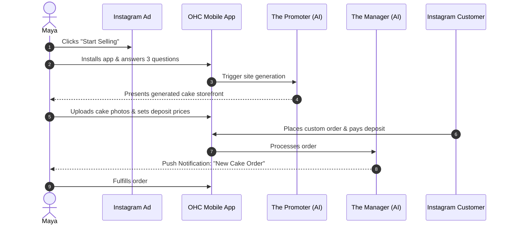
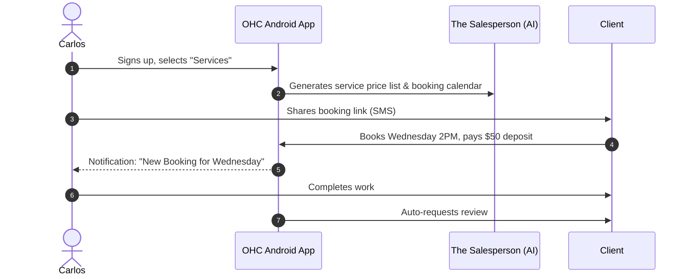
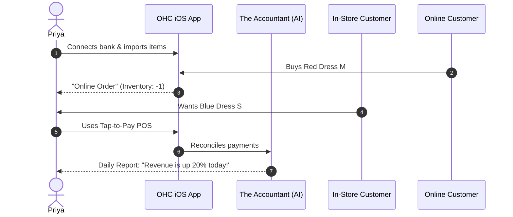
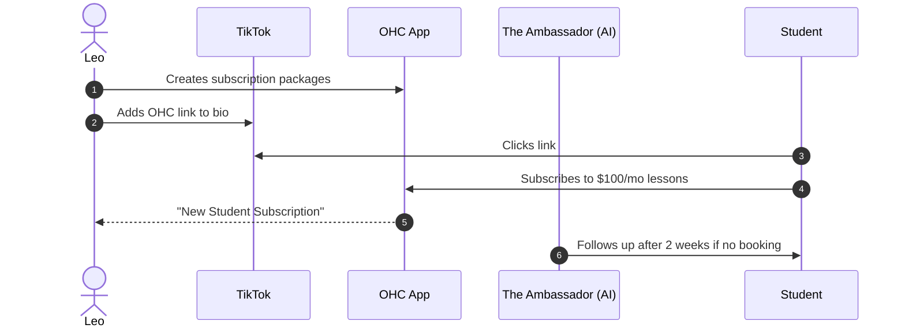
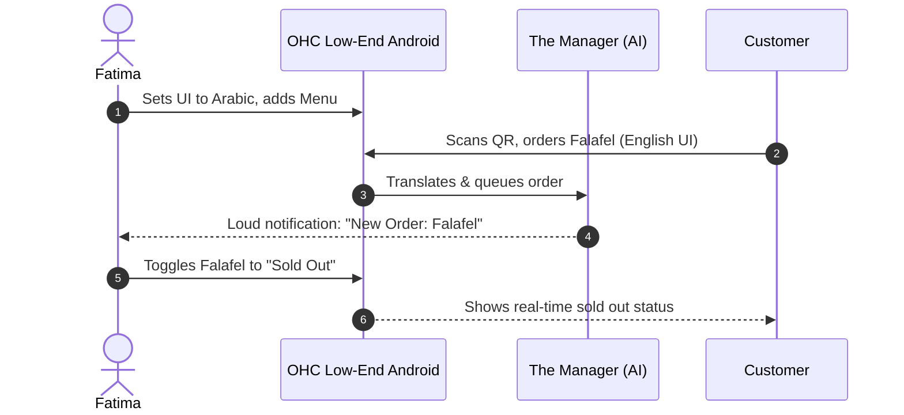

# [architecture] Business Journey Architecture

## Title
Business Journey Architecture: End-to-End User Journeys for All Personas

## Problem Statement
A non-technical small business owner needs to go from an idea to a live business in under 10 minutes, using just their mobile phone, without zero technical jargon. The platform must flawlessly guide users through acquisition, onboarding, activation, retention, revenue, and referral. Without a mapped architectural journey for every core persona (Maya, Carlos, Priya, Leo, Fatima), the system risks introducing friction points that cause abandonment.

## Research Report
The current small business software market (Shopify, Wix, Squarespace, GoDaddy) struggles with onboarding non-technical users. It typically takes 30-60 minutes to set up a basic storefront, requiring semi-technical knowledge.
By observing users like Maya (Baker), Carlos (Handyman), Priya (Boutique), Leo (Music Tutor), and Fatima (Food Cart):
- **Acquisition:** Users arrive from organic search, Instagram ads, or TikTok link-in-bio clicks. The CTA must be context-specific.
- **Onboarding:** Must be purely wizard-driven. "What do you sell?" -> "What is your business name?".
- **Activation:** A user is "activated" only when they have a live storefront and receive their first order/booking.
- **Retention:** AI Agents ("The Advisor", "The Manager") provide daily push notifications highlighting progress, orders, and action items.
- **Revenue:** Upsells from Free to Starter must be contextual (e.g., hitting the 100-action AI limit triggers a transparent upgrade prompt).
- **Referral:** Organic virality is created by watermarked free-tier storefronts and "Powered by OHC" links.

Key friction points to avoid:
- Requiring complex Stripe key integrations (OHC handles Stripe Connect invisibly).
- Asking for DNS records during initial setup (use OHC subdomains first).
- Overwhelming choices in theme builders (AI picks the best Glassmorphism template based on business type).

## Design Doc

### 1. Maya — The Home Baker (Physical Custom Products)
- **Acquisition**: Instagram Ad -> OHC Landing Page "Sell Custom Cakes on Instagram."
- **Onboarding**: "I sell Custom Food". AI Promoter drafts a glassmorphism bakery theme.
- **Activation**: She uploads 3 cake photos. Operations Agent processes her first deposit-based custom order.
- **Retention**: Customer Success Agent drafts replies to Instagram DMs ("do you do vegan?"). Maya approves via mobile push.
- **Revenue**: Upgrades to Starter tier when she exceeds 100 AI actions per month.
- **Referral**: Her link-in-bio states "Cake orders powered by OHC", bringing in new bakers.

*Friction Point:* Image sizing. (Solution: Auto-compress to WebP and auto-crop).

### 2. Carlos — The Freelance Handyman (Services & Bookings)
- **Acquisition**: Word of mouth / Search.
- **Onboarding**: Enters service types (Plumbing, Painting). AI generates pricing table.
- **Activation**: Shares booking link with client. Client books a slot and pays deposit.
- **Retention**: Receives weekly SMS/push from AI Advisor on busy days.
- **Revenue**: Upgrades to Pro to use custom domain.
- **Referral**: Clients receive a review link: "Leave Carlos a review via OHC."

*Friction Point:* Calendar sync. (Solution: Simple OAuth Google Calendar integration).

### 3. Priya — The Boutique Owner (Physical Inventory & POS)
- **Acquisition**: Searches "inventory sync online and in-store".
- **Onboarding**: Imports existing inventory list.
- **Activation**: Makes first online sale and first tap-to-pay POS sale using OHC mobile app.
- **Retention**: AI Finance Agent tracks daily revenue vs yesterday.
- **Revenue**: Subscribes to Business tier for unlimited AI marketing emails.
- **Referral**: Shares her store analytics growth with a fellow boutique owner.

*Friction Point:* Stripe Terminal setup. (Solution: Built-in Tap-to-Pay on iPhone/Android requires zero hardware).

### 4. Leo — The Music Tutor (Digital Subscriptions & Portfolio)
- **Acquisition**: Wants a link-in-bio for TikTok.
- **Onboarding**: Sets up a portfolio and monthly lesson subscription packages.
- **Activation**: First student signs up for the $100/mo package.
- **Retention**: AI Advisor flags students who haven't booked a lesson in 2 weeks.
- **Revenue**: Leo purchases a custom domain.
- **Referral**: TikTok followers see the OHC-powered link-in-bio.

*Friction Point:* Zoom link generation. (Solution: OHC automatically generates internal or Zoom meeting links).

### 5. Fatima — The Food Cart Operator (Pre-orders & Multi-language)
- **Acquisition**: Community center recommendation.
- **Onboarding**: UI set to Arabic. Adds menu items with photos.
- **Activation**: Customer orders lunch ahead of time.
- **Retention**: Prints daily order list from phone to portable Bluetooth printer.
- **Revenue**: Free tier is sufficient, but she pays transaction fees.
- **Referral**: Cart has a QR code linking to her OHC menu.

*Friction Point:* Low data/slow connectivity. (Solution: Offline-capable PWA, optimistic UI updates).

## Implementation Prompt
Implement the end-to-end "Onboarding Wizard" flow in the Flutter application. The wizard should sequentially capture the user's business type (Physical, Digital, Service, Food), their business name, and initial product/service offering, saving this context to the backend. Once complete, it must trigger the AI "Promoter" agent to generate an initial storefront template. The UI must be completely mobile-responsive (375px baseline), using OHC Glassmorphism tokens, and require absolutely zero technical inputs (no DNS, no API keys). Create complete E2E Playwright tests that walk through this wizard from start to finish.

## Priority
P0

## Estimated Scope
Large
