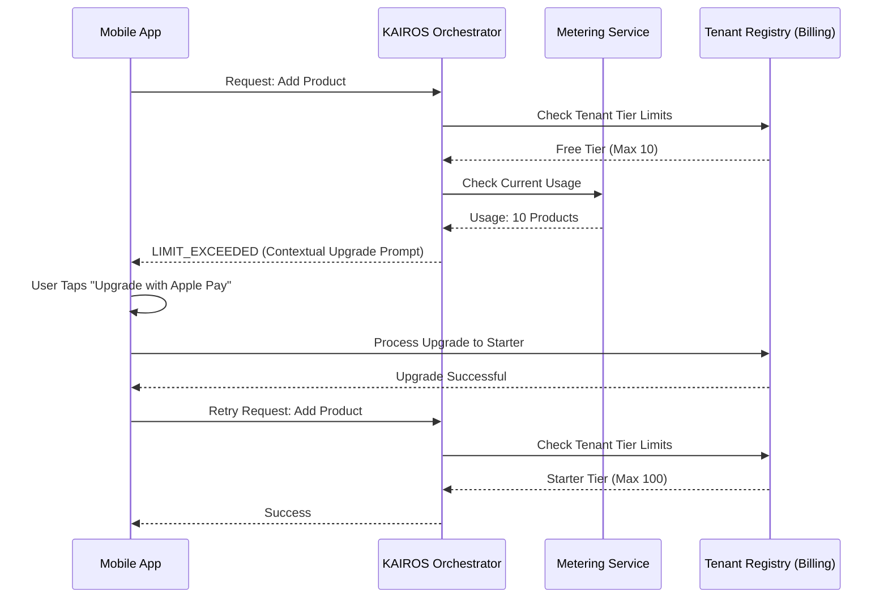

# OHC Multi-Tenant SaaS Tier Architecture

## Problem Statement
Small business owners often start with zero budget and minimal technical skills, requiring a frictionless "Free" tier to validate their ideas. However, as they grow, they need access to more powerful AI agents, custom domains, and higher resource limits without migrating platforms. Currently, OHC lacks a formalized, mobile-first SaaS tier architecture that seamlessly up-sells users when they hit capacity limits, resulting in a suboptimal upgrade experience and lost revenue.

## Research Report
Competitive analysis across major website builders highlights a gap in how upgrades are presented to non-technical users:
- **Shopify:** No free tier (only trials). Upgrades are heavily focused on transaction fees and complex feature matrices.
- **Wix:** Offers a free tier, but the upgrade path is intrusive and desktop-centric.
- **Squarespace:** No free tier. Pricing is straightforward but lacks usage-based flexibility.
- **GoDaddy:** Basic free tier, but aggressive up-selling confuses users.
**OHC's Differentiation:** OHC will leverage "The Advisor" AI agent to provide context-aware, plain-language upgrade recommendations exactly when the user reaches a limit, all via a mobile-first UI.

## Design Doc

### Core Philosophy
Upgrades are offered in-context. If a user tries to add an 11th product on the Free tier, they are prompted to upgrade to Starter exactly at that moment using a 1-tap mobile payment flow (Apple Pay/Google Pay).

### Tier Definitions
| Tier | Price | Products | AI Departments | AI Actions/mo | Storage | Custom Domain | Target Persona |
|---|---|---|---|---|---|---|---|
| **Free** | $0 | 10 | 1 | 100 | 500MB | No (OHC subdomain) | Side-hustlers, early validation |
| **Starter** | $9/mo | 100 | 3 | 1,000 | 5GB | Yes | Growing businesses, solopreneurs |
| **Pro** | $29/mo | Unlimited | 10 | Unlimited | 50GB | Yes + SSL | Established businesses, boutiques |
| **Business** | $79/mo | Unlimited | Unlimited | Unlimited | 500GB | Yes + multi-domain | Multi-location, high-volume |

### Architecture
Limits should be enforced near the edge or within the business logic layer, avoiding deep coupling with core data stores.

#### Architecture Diagram

#### Key Design Decisions
1. **Asynchronous Metering:** Usage tracking must be asynchronous to avoid blocking critical paths.
2. **Edge Enforcement:** The KAIROS Orchestrator acts as the gatekeeper, checking cached limits before executing actions.
3. **AI Integration:** The Business Advisory Agent analyzes usage patterns and proactively suggests upgrades when it identifies ROI (e.g., "You manually processed 50 orders this week. Upgrading to Starter would let the Operations Agent handle this automatically, saving you 5 hours.").

## Implementation Prompt
**For the Implementer Agent:**
Implement the Multi-Tenant SaaS Tier structure and limit enforcement mechanism within the KAIROS Orchestrator and Tenant Registry.

**User-Facing Outcome:** Business owners can operate within their tier's limits. When they attempt an action that exceeds their limit (e.g., adding an 11th product on the Free tier), they are gracefully blocked and presented with a contextual, mobile-friendly upgrade option. The Business Advisory Agent proactively suggests upgrades based on usage patterns.

**Critical User Journey (CUJ):**
1. User (Free tier) has 10 products.
2. User taps "Add Product" in the mobile app.
3. System blocks the action, returning a `LIMIT_EXCEEDED` response.
4. UI displays a bottom sheet: "You've reached your product limit. Upgrade to Starter to add up to 100 products."
5. User taps "Upgrade with Apple Pay".
6. Upgrade is processed; the user is immediately unblocked and can add the 11th product.

**Acceptance Criteria:**
- Tier definitions and limits are configurable and enforced at the Orchestrator level.
- Usage tracking is accurate and performant (no significant latency added to critical paths).
- `LIMIT_EXCEEDED` errors are consistently handled by the frontend.
- The Business Advisory Agent has access to usage data to formulate proactive upgrade recommendations.
- E2E tests cover limit enforcement and the upgrade path natively.

## Priority
P1

## Estimated Scope
Large
