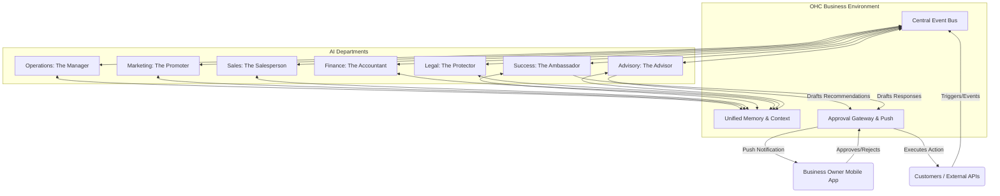

# [Architecture] AI Agent Department Architecture

## Problem Statement
For non-technical small business owners like Maya (the baker) or Carlos (the handyman), managing the day-to-day complexity of operations, marketing, sales, customer success, finance, and compliance is overwhelming. They don't have the time or expertise to configure complex automation rules or integrate multiple SaaS tools. They need an invisible, intelligent "staff" that simply runs their business for them in the background, matching the natural structure of a real-world company.

## Research Report
Current small business tools force users to act as system integrators, piecing together triggers and actions (e.g., Zapier, Shopify Flow). This is fundamentally flawed for our target personas.
- **Wix/Squarespace**: Require manual configuration of automated emails and manual review of analytics.
- **Shopify**: App ecosystem is fragmented; "AI" features are mostly siloed text generation tools rather than autonomous background workers.
- **GoDaddy**: Basic auto-responders, but no inter-departmental coordination.

Our research indicates that grouping AI agents into "Departments" with familiar names (e.g., "The Manager", "The Promoter") lowers the cognitive load for business owners to near zero. By abstracting the complex event-driven architecture into these familiar concepts, owners can trust the system to handle tasks autonomously, requiring their intervention only for critical approvals.

## Design Doc

### Core Concepts

The architecture is composed of seven distinct AI Departments, each operating with specific scopes, triggers, and coordination channels:

1.  **Operations ("The Manager")**: Handles order and booking processing, inventory tracking, fulfillment routing, and refunds.
2.  **Marketing & Advertising ("The Promoter")**: Manages website design, SEO, social media posting schedules, promotional content creation, QR codes, and link-in-bio pages.
3.  **Sales & Acquisition ("The Salesperson")**: Focuses on quote generation, lead follow-up, referral tracking, and intelligent upsell suggestions during checkout.
4.  **Customer Success ("The Ambassador")**: Replies to messages, sends order updates, requests reviews, and runs re-engagement campaigns for inactive customers.
5.  **Finance & Payments ("The Accountant")**: Processes payments, generates financial reports, manages subscription billing, and prepares tax summaries.
6.  **Legal & Compliance ("The Protector")**: Generates terms/policies, drafts contracts, ensures GDPR compliance, tracks licenses, and manages liability disclaimers.
7.  **Business Advisory ("The Advisor")**: Synthesizes data across all departments to provide weekly health reports, next-action suggestions, seasonal trend alerts, and pricing recommendations.

### Key Architectural Behaviors

-   **Triggers**: Departments operate via three main paradigms:
    -   *On Schedule*: E.g., The Advisor runs a weekly health check every Sunday at 8 PM.
    -   *On Event*: E.g., A new order event triggers Operations to update inventory, which cascades an event to Customer Success to send a confirmation.
    -   *On Demand*: E.g., Maya explicitly asks The Promoter to generate an Instagram post for a new cake design.
-   **Inter-Departmental Coordination**: Agents communicate via a centralized pub/sub event bus. When one department completes a task, it emits an event that other departments can subscribe to (e.g., Operations marks an order "Delivered" -> Customer Success asks for a review 3 days later).
-   **Memory & Context**: Agents share a unified, durable memory layer (tenant-isolated). This includes customer history, past interactions, and business constraints, allowing The Ambassador to know that a customer previously spoke with The Salesperson.
-   **Action Approvals**: Actions are categorized by risk. Low-risk actions (e.g., sending an order confirmation) are *auto-executed*. High-risk actions (e.g., issuing a large refund or signing a contract) are *draft-for-review*, requiring the business owner's tap-to-approve via mobile push notification.
-   **Budgeting & Throttling**: AI usage is tied to the SaaS tier. Usage is soft-throttled at the tenant level, with friendly upgrade prompts presented via The Advisor when limits are approached, preventing abrupt disruptions to business operations.

### Mobile UX Flow
1.  **Notification**: Business owner receives a push notification: "The Ambassador drafted a reply to an Instagram DM. Tap to review."
2.  **Review Screen (375px)**: A clean, glassmorphic card displays the drafted message.
3.  **Action Bar**: Floating buttons at the bottom: "Approve & Send", "Edit", "Regenerate".
4.  **Completion**: Upon approval, the card smoothly slides away, and the action is executed invisibly in the background.

### Architecture Diagram

## Implementation Prompt
**Objective**: Build the foundational routing and execution layer for the "AI Departments" architecture.
**User Journey**: When a business owner receives a customer inquiry or a system event occurs, the system must accurately route the event to the appropriate AI Department, retrieve relevant shared memory, and either auto-execute or draft an action for approval on the mobile app.
**Acceptance Criteria**:
-   Implement the event listening and routing logic to dispatch tasks to the seven defined departments.
-   Ensure state/memory is passed correctly to the department agent.
-   Implement the approval gateway logic: if an action is flagged as "draft-for-review", send a push notification payload and block execution until an approval event is received.
-   Implement tenant-level usage tracking to enforce soft-limits on AI actions.
-   Do not define the specific database schemas or LLM APIs; focus on the business logic layer, tenant isolation, and approval state machine.
-   All UI components related to the approval flow must be mobile-first and utilize the OHC glassmorphism tokens.

## Priority
P0

## Estimated Scope
Large