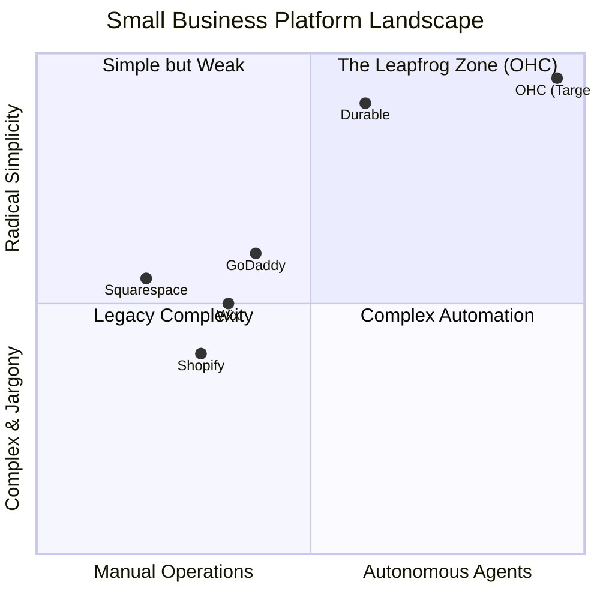
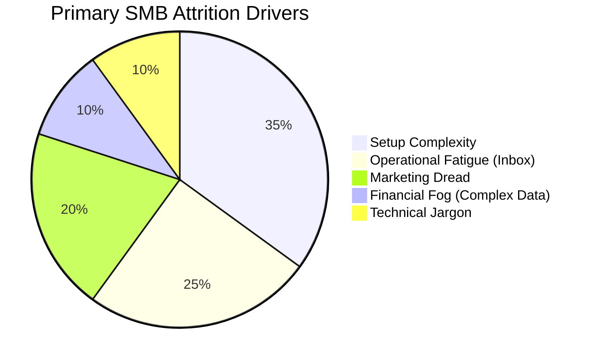

# OHC Market Dominance & AI Integration Strategy Report

## Executive Summary
OneHumanCorp (OHC) has a unique opportunity to capture the underserved non-technical SMB market by treating AI as fundamental infrastructure—not just an add-on chat feature. This report synthesizes a deep competitor audit, analysis of SMB pain points, and strategic positioning to outline OHC’s roadmap toward market dominance. By addressing "Setup Paralysis," "Marketing Dread," and "Financial Fog" through autonomous AI departments, OHC can radically simplify business operations for everyday entrepreneurs.

---

## Phase 1: Deep Competitor Audit & Landscape

### Competitor Profiles
- **Shopify:** The legacy e-commerce leader. Highly capable but requires substantial setup time (30-60m) and understanding of technical concepts (themes, DNS). "Shopify Sidekick" offers AI chat but relies on reactive, manual execution. Does not have a useful free tier.
- **Wix:** Strong template library and easier setup via ADI (Artificial Design Intelligence). However, it remains heavily desktop-focused and the AI does not operate autonomously post-launch.
- **Squarespace:** Aesthetic focus, ideal for portfolios, but lacks the deep operational automation required by dynamic small businesses.
- **GoDaddy (Airo):** Extremely fast initial setup with basic generative AI (logos/taglines), but aggressively upsells and provides weak ongoing business management tools.
- **Square Online:** Excellent for physical retail/food with native POS, but lacks comprehensive marketing and back-office AI agents.
- **Durable:** Generates sites in 30 seconds but is extremely thin on actual business management functionality.

### Competitive Landscape Matrix

### Feature Gap Matrix

| Feature | **Shopify** | **Wix** | **Durable** | **OHC (Goal)** |
| :--- | :--- | :--- | :--- | :--- |
| **Agent Autonomy** | Reactive (Sidekick) | None | Limited | **Proactive Autonomous Depts** |
| **Onboarding** | 30m+ (High friction) | 20m+ (Moderate) | < 1m (Instant) | **< 1m (Instant Conversational Build)** |
| **UX Target** | Desktop-First | Hybrid | Mobile-First | **375px Mobile-Only Optimized** |
| **Marketing Support** | App-Store Dependent | Basic built-in | None | **Auto-Social Content Generation** |
| **Analytics** | Complex Charts | Basic Charts | None | **Plain-Language AI Summaries** |

---

## Phase 2: SMB User Persona Mapping & Pain Points

Based on an analysis of r/smallbusiness, App Store reviews, and Trustpilot, the top reasons users abandon platforms are Setup Paralysis, Scattered Communications, and Marketing Dread.

### Core Personas & OHC Solutions

1. **Maya (The Home Baker, 28):** Overwhelmed by Shopify "collections" and loses track of orders in Instagram DMs.
   - **OHC Solution:** *Unified Omnichannel Inbox* drafted by "The Ambassador."
2. **Carlos (The Handyman, 42):** Misses calls while working; no website.
   - **OHC Solution:** *Instant Storefront Generation* (<1m setup) and an automated booking system.
3. **Priya (The Boutique Owner, 35):** Needs physical and digital inventory sync.
   - **OHC Solution:** *Stripe Terminal* integration and low-stock alerts from "The Manager."
4. **Leo (The Music Tutor, 22):** Scheduling chaos and chasing payments.
   - **OHC Solution:** *Automated Subscription Billing* and recurring event sync via "The Accountant."
5. **Fatima (The Food Cart, 50):** Overwhelmed by complex analytics and English-heavy menus.
   - **OHC Solution:** *Plain-Language Financial Briefings* delivered daily, removing chart fatigue.

### Top Validated Pain Points

---

## Phase 3: AI Differentiation Manifesto

Competitors treat AI as a **Tool** (reactive, requires prompts). OHC treats AI as a **Teammate** (proactive, event-driven).

### The 5 Pillar Automations
1. **The "10-Minute" Setup Agent:** Generates a live site from a single paragraph.
2. **Unified Omnichannel AI Inbox:** Drafts contextual replies to incoming DMs while the owner sleeps.
3. **Auto-Social Content Promoter:** Generates a 7-day social media calendar automatically when a new product is added.
4. **AI Discovery Agent (GEO):** Optimizes metadata for Generative Engine Optimization (e.g., ChatGPT search) instead of legacy Google SEO.
5. **Plain-Language Advisor:** Translates complex analytics into 3-sentence daily briefings ("You sold 5 more cakes today!").

---

## Phase 4: Market Sizing & Strategic Direction

- **TAM:** Over 33 million small businesses in the US alone; 25-30% lack a functional online presence.
- **Beachhead Strategy:** Target "Service/Booking" (Carlos) and "Micro-Retail" (Maya) segments. They suffer the most from "Scattered Inbox Syndrome" and "Marketing Dread."
- **Geographic Expansion:** Following the US launch, prioritize Spanish-language support (LATAM/US Hispanic market) due to high SMB density and extreme mobile-first reliance.

---

## Phase 5: Implementation Recommendations

Based on the research and identified gaps, the engineering swarm should prioritize the following autonomous tasks:

1. **Implement Auto-Social Content Promoter (Issue Brief: P1)**
   - *Action:* Build a worker for "The Promoter" that listens to `ProductAdded` events and generates a week's worth of multi-platform social media posts (images + captions) to address "Marketing Dread."
2. **Implement Plain-Language Financial Briefings (Issue Brief: P2)**
   - *Action:* Modify the analytics dashboard to consume a weekly LLM summary generated by "The Accountant," replacing complex charts with human-readable text to address "Financial Fog."
3. **Build the Generative Visibility (GEO) Agent (Issue Brief: P1)**
   - *Action:* Develop a background task that optimizes the storefront's schema.org data specifically for LLM crawlers (ChatGPT/Perplexity) instead of traditional search engines.
4. **Develop Instant "30-Second" Storefront Generation (Issue Brief: P1)**
   - *Action:* Refactor the SetupWizard to accept a single-paragraph conversational prompt, allowing the AI to extrapolate the entire business schema and launch a live preview instantly.