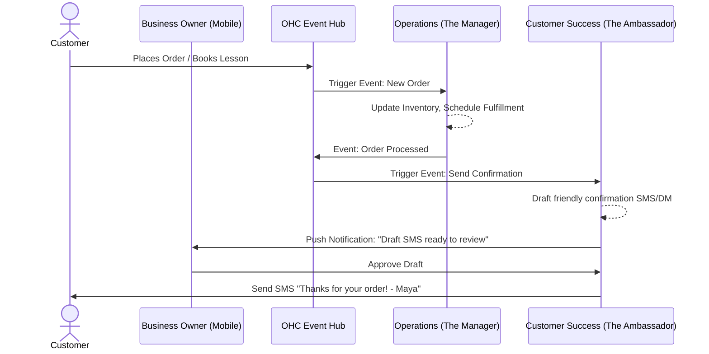

# 🔎 Oracle: AI Agent Department Architecture

## Title
AI Agent Department Architecture: Invisible Small Business Automation

## Problem Statement
Small business owners like Maya (baker), Carlos (handyman), and Fatima (food cart) spend disproportionate amounts of their time managing the operational, marketing, and communication aspects of their businesses. They don't have the technical expertise to set up complex automations (like Zapier), nor do they have the budget to hire a manager, salesperson, or customer success rep. They need AI that operates just like human employees—understanding business context, taking action automatically, but allowing the owner to oversee and approve when necessary. If the AI features feel technical or require "prompt engineering," users will fail the "grandmother test" and abandon the platform.

## Research Report
**Market Gap:**
Platforms like Shopify, Wix, and Squarespace have integrated AI, but it is typically isolated to discrete tasks (e.g., "generate a product description" or "write an email"). It lacks end-to-end operational context. GoDaddy's AI is similarly transactional.
Small businesses need *departments*—ongoing, continuous processes that handle everything from incoming DMs to generating end-of-week financial summaries.

**Key Insights:**
1. **Persona Mental Models:** Maya understands what "The Promoter" or "The Manager" should do. She doesn't understand what "LLM Workflow Queue" means.
2. **Approval Paradox:** AI making decisions without supervision scares users initially. The system must support an "auto-execute" vs. "draft-for-review" gradient, starting safely in "draft-for-review" mode.
3. **Usage Awareness:** The platform's tiering relies on AI action limits. AI resource consumption must be transparent but not anxiety-inducing.

## Design Doc

### Architecture Diagram

### Mobile UX Flow (375px First) & UI Wireframes
**Screen 1: AI Dashboard (Home)**
- **Header:** "Your Team" (Glassmorphism backdrop: `backdrop-filter: blur(20px) saturate(200%)`). Outfit font.
- **Content:** Grid of departments.
  - "The Manager (Operations)"
  - "The Ambassador (Customer Success)"
  - "The Promoter (Marketing)"
- **Badge:** "3 drafts waiting for review"

**Screen 2: Department View (The Ambassador)**
- **Recent Activity List:**
  - "Drafted reply to Carlos's Instagram DM." [Review Button - minimum 44x44px touch target]
  - "Sent 'Thank you' email to Priya." (Auto-executed).
- **Settings Toggle:** "Review all messages before sending" (Toggle Switch).

**Screen 3: Review Draft Modal**
- **Context:** "Customer asked: Do you do vegan cakes?"
- **Draft:** "Hi there! Yes, we offer vegan options for most of our cakes. Let me know what you're looking for!"
- **Actions:** [Send Now], [Edit], [Discard]. (Smooth slide-up entrance animation <= 300ms, `cubic-bezier(0.4, 0, 0.2, 1)`).

### AI Agent Integration Points
- **Trigger Layer:** Departments subscribe to real-world business events (Orders, DMs, Schedule changes, Schedule timers like "End of Week").
- **Context/Memory Layer:** Agents pull from a shared business context (current inventory, store policies, user persona) to avoid hallucinating.
- **Action Layer:** Departments enqueue actions (send message, update catalog, draft report) that are intercepted by the permissions layer (auto-execute vs. draft).
- **Resource Management:** Every action deducts from the tenant's monthly AI action quota, visible in a simple "Energy Meter" in the billing section.

### Key Design Decisions
1. **Humanized Naming:** We strictly use department metaphors ("The Manager", "The Ambassador") rather than technical AI terms. This satisfies the Grandmother Test.
2. **Draft-by-Default:** To build trust, destructive or outward-facing actions (like replying to a customer) default to "draft-for-review" until the owner explicitly enables "auto-execute".
3. **Event-Driven Coordination:** Departments do not call each other directly; they react to platform events. This ensures decoupling and easier addition of new departments later.

## Implementation Prompt
**Task:** Implement the "AI Department Dashboard" and the core "Draft-for-Review" coordination flow.
**User Journey (CUJ):**
1. Maya receives an Instagram DM.
2. The system triggers "The Ambassador" department.
3. The Ambassador drafts a response and creates a "Review Request".
4. Maya receives a push notification, taps it, sees the drafted response in the OHC Mobile App, and taps "Approve".
5. The message is sent.

**Acceptance Criteria:**
- Create the mobile-first UI for the "Your Team" dashboard and the Review Modal, using OHC premium design tokens (Glassmorphism, 44x44px touch targets).
- Implement the background processing logic that catches incoming customer messages and generates draft responses.
- Enforce the "draft-for-review" vs "auto-execute" preference setting.
- Ensure the feature passes the 'Grandmother Test' (zero technical jargon, clear instructions).
- Ensure 100% test coverage with Playwright E2E and/or Slint UI tests for the mobile flow.

## Priority
P0 (Critical)

## Estimated Scope
Large
