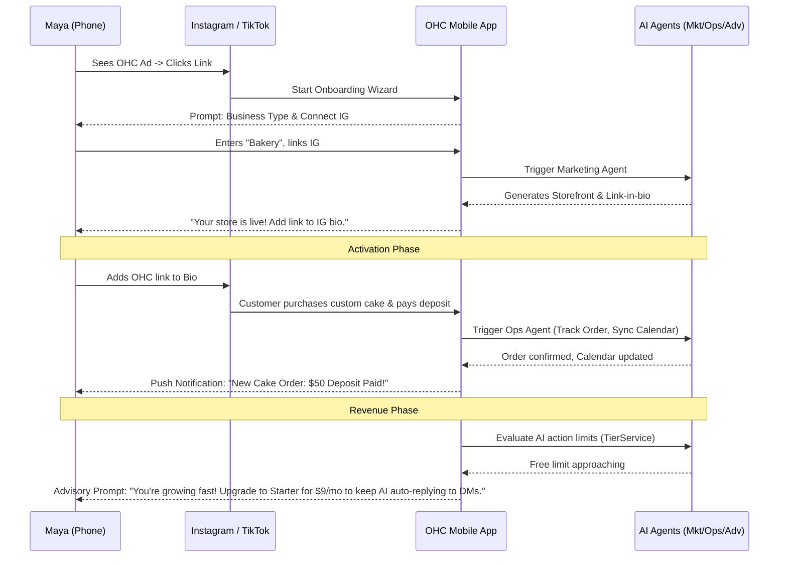
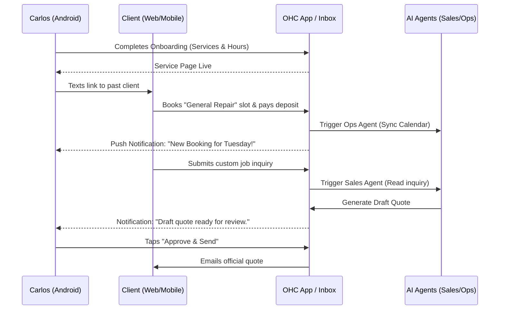
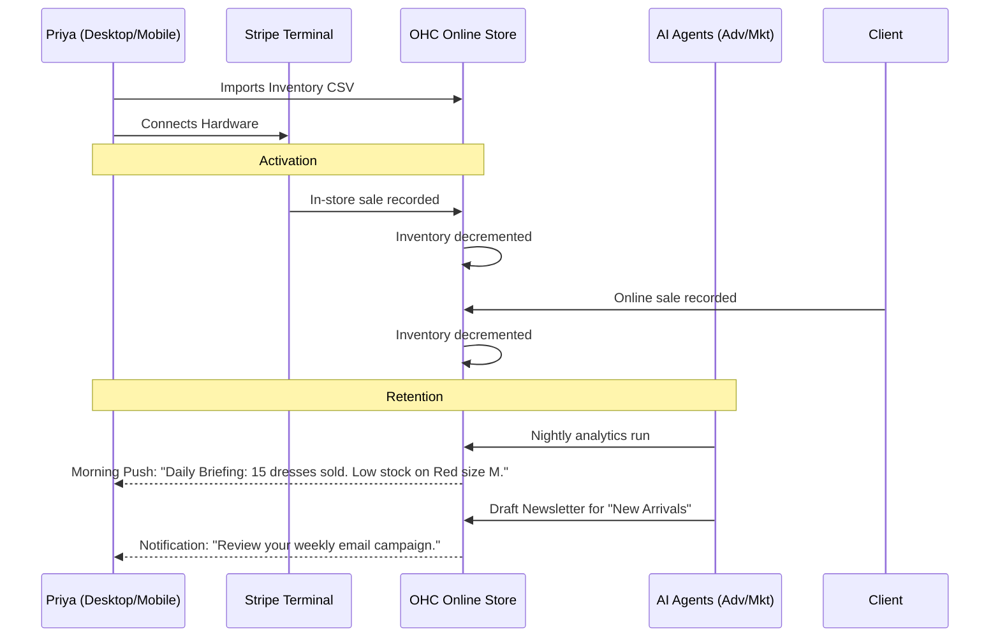
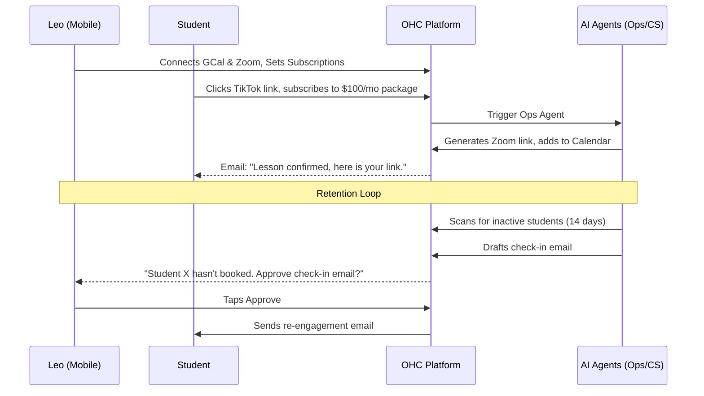
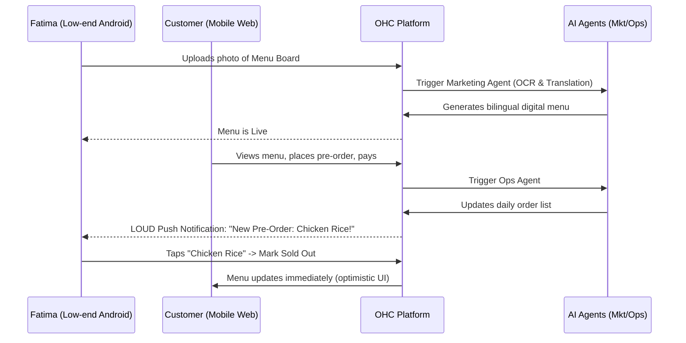

# Business Journey Architecture

## Overview
This document outlines the complete end-to-end user journey architecture for OneHumanCorp (OHC). The architecture focuses heavily on empowering non-technical small business owners to seamlessly launch and operate their businesses in under 10 minutes, with KAIROS AI agents invisibly handling complex orchestration.

The analysis is broken down by the core personas (Maya, Carlos, Priya, Leo, Fatima), exploring their path from Discovery (Acquisition) through Setup (Onboarding & Activation) to Daily Use (Retention) and Scale (Revenue & Referral).

## Core Personas & Journey Definitions

### 1. Maya — The Home Baker (28, Non-Technical, Mobile-Only)
**Goal:** Sell custom cakes via Instagram, process deposits, and manage orders without touching a computer.

- **Acquisition:** Maya discovers OHC via a TikTok ad highlighting "Stop taking orders in DMs, set up a shop in 5 minutes." CTA is "Start Selling Now".
- **Onboarding:** Wizard flow on iPhone. Needs only Business Name, Core Offering ("Cakes"), and Stripe connection. AI Marketing Agent auto-designs a mobile-first storefront with an integrated booking form based on her Instagram content.
- **Activation:** Success looks like receiving her first 50% deposit for a custom order via the new OHC link in her Instagram bio.
- **Retention:** The Customer Success Agent drafts replies to Instagram DMs ("Do you make vegan cakes?"), triggering a 1-tap push notification for Maya to approve. The Operations Agent syncs dates to her mobile calendar.
- **Revenue:** Maya hits the Free tier limit of 100 actions/mo. The TierService middleware gracefully intercepts a background task and prompts the Business Advisory Agent to suggest a $9/mo Starter upgrade directly on her phone, noting she has generated $500 in revenue already.
- **Referral:** Maya posts an Instagram story tagging OHC, showing how she manages her bakery from her phone.

### 2. Carlos — The Freelance Handyman (42, Non-Technical, Android)
**Goal:** Modernize his word-of-mouth business with clear pricing, online booking, and simple quote generation.

- **Acquisition:** Carlos hears about OHC from another contractor at a supply store. Searches Google on his Android phone and clicks "Set up your service business".
- **Onboarding:** Minimum inputs: Services offered (Plumbing, Painting) and working hours. The Marketing Agent generates a simple service listing page.
- **Activation:** Carlos shares his new OHC link via text message to a past client, who books a "General Repair" slot and pays a deposit.
- **Retention:** Carlos receives inbound requests via the shared inbox. The Sales Agent reads the customer's problem description and generates a draft quote for Carlos to review. Carlos clicks "Approve & Send" with 1 tap.
- **Revenue:** As Carlos gets more bookings, the Business Advisory Agent suggests adding an "Emergency Repair" service at a premium rate. Carlos upgrades to Starter to unlock more AI quote generation actions.
- **Referral:** Carlos uses the "Share with a friend" button in the OHC app to text a sign-up link to his plumber friend.

### 3. Priya — The Boutique Owner (35, Semi-Technical, Mac + iPhone)
**Goal:** Sync in-store and online inventory, track daily analytics, and manage a growing product catalog.

- **Acquisition:** Priya searches for "Shopify alternative with in-person POS" and finds an OHC comparison page.
- **Onboarding:** Imports existing inventory CSV. Connects Stripe Terminal for in-store payments.
- **Activation:** First day of unified sales—Priya sells a dress in-store (Terminal) and online (Storefront) simultaneously, and inventory auto-syncs.
- **Retention:** Priya checks the mobile dashboard daily for the Business Advisory Agent's plain-language report ("You sold 15 red dresses yesterday. Reorder soon!"). The Marketing Agent drafts an email newsletter for new arrivals.
- **Revenue:** Priya's catalog exceeds 100 items. The TierService gracefully prompts her to upgrade to the Pro tier ($29/mo) to support unlimited products and an SSL custom domain.
- **Referral:** Priya shows the daily analytics dashboard to a neighboring boutique owner.

### 4. Leo — The Music Tutor (22, Non-Technical, Link-in-Bio)
**Goal:** Sell monthly lesson packages via TikTok and automate Zoom links and calendar management.

- **Acquisition:** Sees a TikTok creator using an OHC link-in-bio.
- **Onboarding:** Connects Google Calendar and Zoom. Sets up subscription pricing (e.g., $100/mo for 4 lessons).
- **Activation:** A TikTok follower clicks his link and subscribes to the monthly package.
- **Retention:** The Operations Agent automatically generates Zoom links for booked slots. The Customer Success Agent follows up with students who haven't booked a lesson in 14 days, drafting a check-in message for Leo to approve.
- **Revenue:** Leo hits the 100-action AI limit as he scales to 30 students. He upgrades to Starter to keep the automated follow-ups running.
- **Referral:** Leo includes a "Powered by OHC" badge on his link-in-bio page, earning a referral credit when other creators sign up.

### 5. Fatima — The Food Cart Operator (50, Non-Technical, Android, Arabic/English)
**Goal:** Take online pre-orders to reduce lines, manage a daily pickup list, and easily mark items as "sold out".

- **Acquisition:** Fatima's daughter sets up the account for her after seeing an ad for "Simple online menus."
- **Onboarding:** Snaps photos of her menu board. AI Marketing Agent extracts text and creates a bilingual menu layout automatically.
- **Activation:** First customer places a pre-order for pickup. Fatima receives a loud, distinctive notification on her Android phone.
- **Retention:** Fatima uses the app exclusively to toggle item availability (e.g., "Chicken Over Rice -> Sold Out"). She prints the daily pre-order summary from the app.
- **Revenue:** Fatima remains on the Free tier as her product count is low (10 items), but OHC captures transaction fees on the high volume of daily pre-orders.
- **Referral:** Word of mouth among other street vendors in the neighborhood due to the bilingual support.

## Architectural Tenets for the Business Journey

1. **AI as Invisible Infrastructure:**
   - The user never "prompts" the AI directly in a chatbot interface to build their site. The AI departments (Marketing, Sales, Operations) are triggered autonomously by events (e.g., uploading an image, receiving an order) and interact with the user via context-aware push notifications ("Draft ready for review").
   - **Mechanism:** OHC's KAIROS orchestrator monitors system events and routes payloads to the relevant department based on predefined workflow definitions. Memory is managed via `pgvector` (`autodream_memories`) to recall past interactions.

2. **Mobile-First UX (375px Baseline):**
   - The primary management interface for 4 out of 5 personas is a smartphone.
   - All complex actions (approving quotes, viewing analytics) are distilled into plain-language summaries with 1-tap resolution buttons.
   - **Mechanism:** Flutter UI components using OHC premium design tokens ensure touch targets are large (>= 44px) and network operations retry gracefully in poor signal conditions.

3. **Graceful Tier Degradation:**
   - Platform monetization relies on usage volume rather than hard feature gates.
   - **Mechanism:** When a user hits an AI action limit or product limit, the `TierService` intercepts the background process. Instead of throwing a generic HTTP 403, the Business Advisory Agent generates an actionable notification: "You're growing! Upgrade to keep automated replies running." This aligns upgrading with business success.

## Next Steps
- Implement the "Draft-for-Review" UI flow for high-risk agent actions in the mobile app.
- Integrate the `TierService` limit checks into the KAIROS task queue to enable graceful pause-and-prompt flows.
- Refine the Business Advisory Agent's reporting logic to generate daily/weekly plain-language summaries based on core analytics data.
