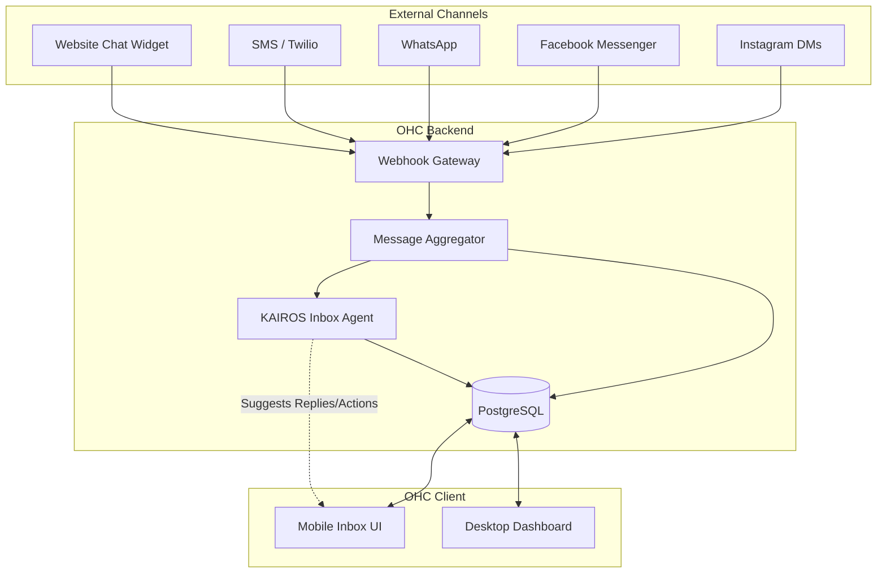

# Research Report: AI-Driven Omni-Channel Inbox for Small Businesses

## Problem Statement

Small business owners—whether they run a bakery from their phone or consult from a home office—are drowning in communication. A typical SMB owner receives messages across WhatsApp, Instagram DMs, Facebook Messenger, SMS, and email. Managing these disconnected channels is chaotic.

For example, **Maya (baker, 28)** loses custom cake orders because an Instagram DM gets buried under personal messages, while **Carlos (handyman, 42)** misses a lucrative lead when an SMS arrives while he's on a roof. These non-technical founders don't want a complex CRM or a separate app for each platform; they want a single, intelligent "command center" that not only aggregates messages but actively helps them respond, quote, and close deals.

The problem isn't just consolidation—it's automation. Existing tools just pile messages into one view, but the small business owner still has to manually read, interpret, and reply.

## Market Sizing & Strategic Direction

### Total Addressable Market (TAM)
- There are over 33 million small businesses in the US alone, with non-employer firms (solopreneurs, freelancers, independent contractors) accounting for over 27 million of those.
- Globally, the SMB market is vast, with estimates exceeding 400 million.
- An estimated 30-40% of these smallest businesses still do not have a dedicated online presence or rely entirely on a single social media platform (like Instagram or Facebook) for their business identity.

### Beachhead Market
**The "Mobile-First Solo-preneur"** (e.g., Maya the baker, Carlos the handyman). These users have high pain (lost leads = lost income), high smartphone usage, and zero patience for complex desktop software. They operate primarily on the go and need immediate, tangible value.

### Geographic Expansion
1. **US (English-speaking)**
2. **LATAM (Spanish-speaking)**: Huge density of WhatsApp-reliant micro-businesses.
3. **India (Hindi/English)**: Rapidly growing digital adoption among unorganized retail and services.

### Vertical Expansion
Launch horizontally to capture the broadest base, but quickly build vertical depth for service businesses (appointments/quoting) and micro-retail (inventory/ordering from chat).

## Competitor Audit & Feature Gap Matrix

| Feature | Shopify | Wix | Squarespace | Emerging AI (Durable, 10Web, Hocoos) | OHC (Current) | OHC (Gap/Advantage) |
| :--- | :--- | :--- | :--- | :--- | :--- | :--- |
| **Omni-channel Inbox** | Basic (Inbox app) | Basic (Wix Chat) | No | No | Basic | **Advantage**: Full integration with AI agents |
| **AI Auto-Reply** | Sidekick (advisor, not auto-reply) | No | No | No | No | **Gap**: Need autonomous agent replies |
| **Quote Generation via Chat**| No | No | No | No | No | **Gap**: AI drafting quotes from DMs |
| **Mobile App Quality** | Strong (but complex) | Mediocre | Good (but limited) | Web-focused | Needs improvement | **Advantage**: Mobile-first focus |
| **Booking from Chat** | No | No | No | No | No | **Gap**: Direct booking integration in chat |

**Competitor Insights:**
*   **Shopify:** Focuses heavily on the storefront. Shopify Inbox exists but acts as a traditional helpdesk tool, not an AI agent acting on the owner's behalf.
*   **Wix/Squarespace:** They offer rudimentary chat widgets for their websites, but do not deeply integrate external social channels (WhatsApp, IG) with an AI brain.
*   **Emerging AI (Durable, 10Web, Hocoos):** Excellent at generating the initial website (30-second creation), but extremely thin on post-launch operational tools like an intelligent inbox.

## User Personas & Pain Points

Based on reviews from Trustpilot, Reddit, and App Stores, here is the mapped pain point data for our personas:

1.  **"I miss messages because they are everywhere."** (Maya, baker) -> Need: Omni-channel aggregation.
2.  **"I don't have time to reply while I'm working."** (Carlos, handyman) -> Need: AI auto-reply and intent classification.
3.  **"Customers ask the same 5 questions."** (Priya, boutique owner) -> Need: AI knowledge base integration.
4.  **"I forget to follow up with leads."** (Leo, music tutor) -> Need: Automated lead follow-up.
5.  **"English is not my first language, writing professional replies is hard."** (Fatima, food cart) -> Need: AI translation and tone refinement.

## OHC AI Differentiation Manifesto

To leapfrog the competition, OHC will not just provide an inbox; we will provide an **AI Agent Inbox**.

1.  **Autonomous Auto-Reply:** The AI handles routine queries (hours, pricing, availability) autonomously, saving hours per day.
2.  **Intent-Driven Actions:** If a customer asks "How much for a cake?", the AI drafts a quote and asks the owner for approval.
3.  **Cross-Channel Memory:** The AI remembers that a customer DMed on Instagram last week and is now texting, providing a seamless experience.
4.  **Tone & Language Translation:** The AI automatically translates messages to the owner's preferred language and drafts replies in professional English (or local language).
5.  **Automated Follow-ups:** The AI detects "stale" leads in the inbox and suggests sending a follow-up message with a discount.

## Design Doc: AI-Driven Omni-Channel Inbox

### High-Level Architecture

### Mobile UX Flow (375px First)
1.  **Unified Feed:** A single list view of all messages, badged by channel icon (IG, WA, SMS).
2.  **Thread View:** Tapping a conversation opens the thread. The AI's suggested reply is pre-populated in the text field, waiting for a single tap to "Approve & Send".
3.  **Action Chips:** Above the keyboard, action chips appear based on the AI's intent detection (e.g., `[Create Quote]`, `[Send Booking Link]`, `[Mark as Spam]`).
4.  **Agent Toggle:** A toggle switch at the top of a thread: `[ ] Human | [x] AI Agent`. When set to AI Agent, routine queries are handled automatically without push notifications.

## Implementation Prompt

**Title:** AI-Driven Omni-Channel Inbox Core Infrastructure

**Description:**
Implement the core backend infrastructure and API endpoints for a unified, AI-driven inbox. This feature allows small business owners to connect multiple communication channels (starting with simulated/internal chat, SMS via Twilio, and a generic webhook for social channels) into a single feed. The critical differentiator is the integration of an AI Agent that reads incoming messages, determines intent, and drafts suggested replies or actions (like creating a quote) for the owner to approve.

**Critical User Journey (CUJ):**
1.  A customer sends a message to the business via an external channel (e.g., SMS asking about pricing).
2.  The message is ingested by the OHC backend and stored in the unified inbox.
3.  The KAIROS Inbox Agent reads the message, identifies the intent ("Pricing Inquiry"), and drafts a professional response based on the business's profile.
4.  The business owner opens the OHC mobile app, sees the new message in the unified feed, and sees the AI's suggested reply.
5.  The owner taps "Approve" to send the suggested reply back through the original channel.

**Acceptance Criteria:**
- Create the necessary database tables to store unified conversations and messages, linking them to specific tenants/businesses.
- Implement the webhook/ingestion API to receive messages from external providers.
- Integrate the AI agent pipeline to process incoming messages and generate `suggested_replies`.
- Build the API endpoints for the client to fetch the inbox feed, view a conversation, and approve/send a message.
- Ensure all operations enforce Row Level Security (RLS) based on the authenticated user's tenant ID.

**Priority:** P0
**Estimated Scope:** Large
