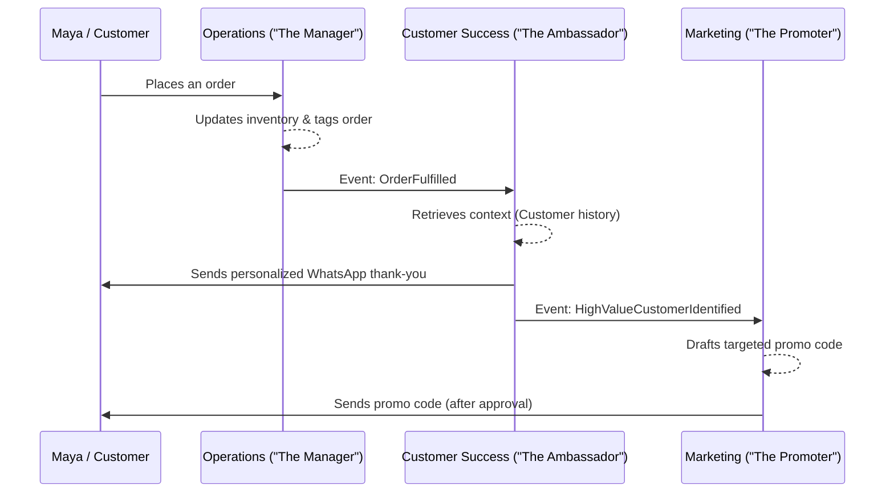

# [Architecture] AI Agent Department Architecture

## Title
AI Agent Department Architecture & Invisible Operations

## Problem Statement
Small business owners (like Maya the baker or Carlos the handyman) are overwhelmed by the administrative overhead of running a business—replying to DMs, updating inventory, generating quotes, and sending follow-ups. They lack the time, expertise, and mental bandwidth to manage a full software suite. They need their software to act like an invisible team of employees ("departments") that run operations autonomously in the background, allowing the owner to focus on their craft.

## Research Report
Current platforms (Shopify, Wix, Squarespace) require the user to act as the operator—configuring complex workflows, reading dashboards, and manually triggering actions. This "software as a tool" paradigm fails for time-poor, non-technical users.

**Competitive Analysis:**
- **Shopify/Wix:** Rely on third-party apps for automation (e.g., Klaviyo for marketing, Gorgias for support). High configuration overhead and fragmented UX.
- **OHC Vision:** "Software as a service provider." AI agents are first-class primitives organized into familiar departments (e.g., "The Manager", "The Promoter").

**Key Findings:**
1. Users understand organizational roles (e.g., an Accountant handles money, a Salesperson talks to leads) better than technical abstractions (e.g., cron jobs, webhooks, RAG pipelines).
2. Trust is the primary barrier to AI adoption. Agents must be able to draft actions for human review before auto-executing.
3. Cross-department communication is essential (e.g., Operations processes an order -> alerts Customer Success to send a thank-you message).

## Design Doc

### Architecture Diagram

### UI Wireframes & Screen Flow (375px first)
**Mobile UX Flow:**
1. **Home Feed:** A simple feed of AI actions and insights (e.g., "The Ambassador replied to 3 DMs while you slept").
2. **Department Tabs:** Bottom navigation for different departments (Ops, Sales, Marketing).
3. **Approval Inbox:** A Tinder-like swipe interface for approving AI drafts (e.g., "Swipe right to approve this Instagram post drafted by The Promoter").
4. **Settings:** Simple toggles ("Require approval for refunds over $50").

### Key Design Decisions and Why
1. **Departmental Abstraction:** Grouping AI capabilities into "Departments" (Manager, Promoter, Salesperson) maps perfectly to a business owner's mental model, hiding the underlying complexity of vector databases and LLM orchestration.
2. **Event-Driven Coordination:** Departments communicate via domain events (e.g., `OrderCreated`, `InventoryLow`) rather than direct API calls, enabling decoupled and scalable AI operations.
3. **Approval Workflows:** Implementing a "Draft vs. Auto-Execute" toggle for every action builds user trust, allowing them to supervise the AI before giving it full autonomy.
4. **Tenant-Scoped Context:** Each AI agent accesses only its specific tenant's data (memory, product catalog, past interactions) ensuring strict multi-tenancy and data privacy.

### AI Agent Integration Points
- **Triggers:** Webhooks from the storefront, scheduled cron jobs, and direct user DMs.
- **Context Retrieval:** Agents query a tenant-scoped vector database for past customer interactions and business rules.
- **Action Execution:** Agents interact with the core OHC APIs (e.g., creating a discount code, updating a booking) on behalf of the user.

## Implementation Prompt
**Context:** You are tasked with implementing the core scaffolding for the "AI Agent Department" architecture.
**User-Facing Outcome:** A mobile-first interface where a user can view a feed of actions taken by their AI departments and approve drafted actions.
**CUJ:**
1. The user opens the app and sees a notification from "The Manager" indicating a new order was processed.
2. The user navigates to the "Approval Inbox".
3. "The Ambassador" has drafted a follow-up message to the customer. The user reviews and taps "Approve" to send it.
**Acceptance Criteria:**
- Implement the Event Bus mechanism allowing departments to publish and subscribe to domain events.
- Create the data models for "Agent Actions" with states: `Draft`, `Approved`, `Executed`, `Rejected`.
- Build the mobile-responsive (375px baseline) UI for the "Approval Inbox" using the design system tokens (Glassmorphism, Outfit/Inter typography, touch targets >= 44x44px).
- Ensure all agent queries are strictly tenant-scoped.
**Note:** Do not worry about the specific LLM integration or vector DB schema; focus on the event orchestration and user approval flow.

## Priority
P0

## Estimated Scope
Large
