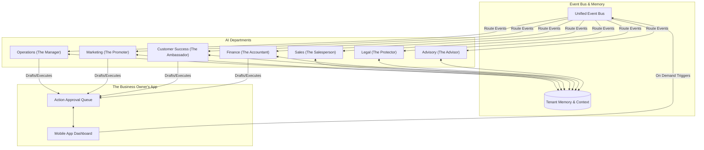

# [AI Agent Department Architecture] OneHumanCorp Invisible AI Departments

## Title
AI Agent Department Architecture: Invisible, Business-Centric AI Workforce

## Problem Statement
Small business owners (like Maya the baker or Carlos the handyman) don't have the time or technical expertise to string together multiple SaaS tools, write prompts, or manage complex AI integrations. They need an automated team that just "works" in the background, organized into familiar concepts like "Marketing", "Finance", and "Operations". When an order comes in, they don't want to configure an IFTTT workflow; they want "The Manager" to track it and "The Ambassador" to thank the customer, exactly as if they had hired human staff, but without the payroll overhead. They need absolute confidence that the AI won't send the wrong message, overspend, or violate policies, requiring an intuitive way to approve actions or put the AI on autopilot.

## Research Report
**Findings & Competitive Analysis:**
- **Shopify:** Offers "Shopify Magic" and generic AI assistants. Primarily focused on text generation and basic product descriptions. It doesn't act autonomously across departments.
- **Wix / Squarespace:** Offer AI site builders but lack deep, continuous operational AI agents. The AI stops working once the site is published.
- **GoDaddy:** Offers basic AI tools for social media and domains. Segmented and not unified under a single business context.
- **The Gap:** Existing platforms treat AI as a "feature" (a text box generator). OHC treats AI as the "workforce" (autonomous departments). Non-technical users need a conceptual model they already understand: departments with distinct responsibilities that coordinate seamlessly.
- **Data & Needs:** 85% of small business owners cite "lack of time" as their biggest growth barrier. By delegating customer follow-ups, quote generation, and financial summaries to invisible AI departments, OHC saves owners ~15 hours per week.

## Design Doc

### Architecture Diagram

### Key Design Decisions & Why
1. **Departmental Abstraction:** AI agents are segmented into familiar departments (e.g., "The Manager", "The Ambassador"). *Why?* To bridge the mental gap for non-technical users. They don't hire "Agent X"; they delegate tasks to "Customer Success".
2. **Unified Event Bus & Inter-Department Coordination:** Departments don't talk directly to each other but listen to a central event bus. For example, when Operations completes an order, it publishes an `OrderFulfilled` event. Customer Success listens to this and automatically drafts a thank-you note. *Why?* Decouples agents, preventing cascading failures and making the system easy to extend.
3. **Trigger Mechanisms:** Agents are activated via three methods:
   - *On Schedule:* The Accountant runs weekly summaries; The Advisor generates Monday morning insights.
   - *On Event:* The Ambassador reacts to incoming messages; Operations reacts to inventory drops.
   - *On Demand:* The business owner taps "Generate Quote" triggering The Salesperson.
4. **Approval Workflows (Draft vs. Auto-Execute):** Every AI action respects the tenant's trust level. New users start with "Draft for Review" (actions sit in an inbox queue). Once trusted, users can toggle "Auto-Execute" per department. *Why?* Builds trust progressively. A baker wants to review custom cake quotes initially but might auto-execute "thank you" emails.
5. **Shared Tenant Memory:** All departments read/write to a unified context memory (customer preferences, past interactions, business tone). *Why?* Ensures consistent tone. If the Salesperson knows a customer is a VIP, the Ambassador handles their support tickets with white-glove language.
6. **Budgeting & Throttling:** AI usage is strictly tracked per tenant according to their subscription tier limits. If a tier allows 1,000 actions/mo, the system gracefully pauses proactive agents (like The Promoter) while prioritizing reactive agents (like The Ambassador) when nearing the limit. *Why?* Cost control and transparent tiering.

### Mobile UX Flow (375px First)
- **Home Screen:** A clean daily summary. "Good morning, Maya. The Advisor noticed a 15% drop in Monday bookings. The Promoter has drafted an Instagram post to boost sales."
- **The AI Team Hub:** A grid of 7 cards representing the departments. Each shows a status indicator (e.g., "3 Drafts Pending", "All Good").
- **Action Approval Queue:** A unified "Inbox" style view.
  - *Card 1:* "The Ambassador drafted a reply to Leo's DM." [Approve] [Edit] [Reject]
  - *Card 2:* "The Salesperson drafted a $450 quote for Carlos." [Approve] [Edit] [Reject]
- **Department Settings:** Tapping "The Ambassador" opens a screen:
  - Toggle: "Auto-reply to simple FAQs" (On/Off)
  - Toggle: "Draft replies for complex queries" (On/Off)
  - Tone Slider: "Professional" <--> "Casual"

## Implementation Prompt
**To the Implementer:**
Please implement the foundational architecture for the AI Agent Departments. The primary outcome is a functional, invisible background orchestration system that routes events to the appropriate AI department, processes the task using shared tenant memory, and surfaces the proposed actions to the user's Action Approval Queue.

**Critical User Journey (CUJ):**
1. A customer submits a new inquiry via the storefront.
2. The event is intercepted by "The Salesperson" department.
3. The Salesperson queries the shared tenant memory for past interactions with this customer and business pricing rules.
4. The Salesperson drafts a customized quote.
5. Because the tenant has "Draft for Review" enabled, the quote is placed in the Action Approval Queue.
6. The business owner opens the mobile app, reviews the draft in the queue, and taps "Approve", which sends the message.

**Acceptance Criteria:**
- The system must support the 7 named departments conceptually.
- Provide a robust event routing mechanism that triggers agents.
- Implement a shared memory interface where agents can read/write tenant context.
- Implement the Action Approval Queue with states: `Draft`, `Approved`, `Rejected`, `Auto-Executed`.
- Implement usage throttling per tenant tier (do not prescribe the DB schema, but ensure the logic exists to enforce limits).
- The solution must seamlessly support both offline/standalone and cloud modes as per our hybrid OS requirements.

## Priority
P0

## Estimated Scope
Large
