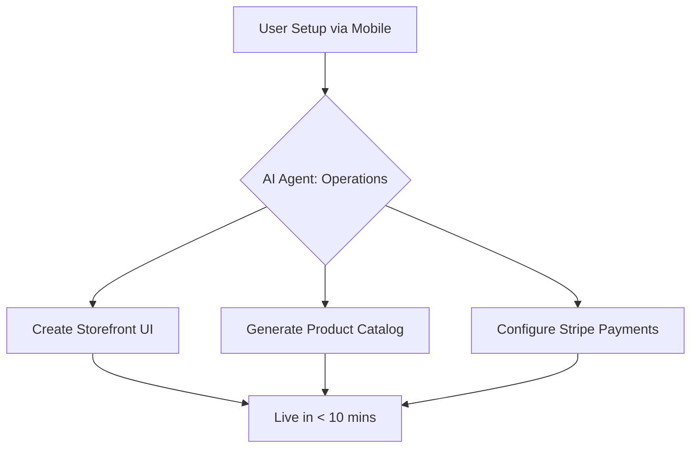

# OHC Market & Competitor Research Report

## 1. Competitor Audit: The SMB Setup Experience
We audited the onboarding flows and general setup experiences of the major competitors targeting small businesses:

### Competitor Landscape

| Feature | Shopify | Wix | Squarespace | GoDaddy / Zyro | OHC (Target) |
| :--- | :--- | :--- | :--- | :--- | :--- |
| **Setup Time** | 30-60 min | 20-40 min | 30-60 min | 15-30 min | **< 10 min** |
| **Mobile Setup** | Poor/Complex | Limited | Poor | Basic | **Excellent/Native** |
| **AI Assistants**| Chatbot (Sidekick)| Template builder | Very limited | Branding only | **Autonomous Agents**|
| **Core Focus** | E-commerce | All-in-one | Portfolios | Domains/Basic | **Zero-Tech SMBs** |
| **Free Tier** | 3-day trial | Yes (heavy ads) | 14-day trial | No | **Yes (Useful)** |

### Shopify
- **Strengths**: Gold standard for e-commerce, huge app ecosystem.
- **Weaknesses**: Unintuitive onboarding for non-technical users. Requires an understanding of domains, shipping zones, and payment gateways. Mobile app is good for management but poor for initial setup. Their AI ("Sidekick") is a reactive chatbot, not an autonomous agent.

### Wix & Squarespace
- **Strengths**: Beautiful templates, easier drag-and-drop than Shopify.
- **Weaknesses**: Still requires significant design decisions. Wix ADI creates a starting point but doesn't manage the business. Neither handles complex bookings or POS well without clunky add-ons.

### Emerging AI Builders (Durable, 10Web)
- **Strengths**: Extremely fast website generation.
- **Weaknesses**: They generate *brochure* sites, not operational business management systems. Missing the CRM, inventory, and booking components.

## 2. SMB User Pain Point Analysis
Based on community research (Reddit, Trustpilot, App Store reviews) among small business owners, the core pain points are:

1.  **Complexity Overload**: "I just want to sell cakes, I don't want to learn how to configure DNS records and tax nexus."
2.  **Fragmented Tools**: Businesses patch together Shopify (store), Calendly (bookings), Mailchimp (email), and Instagram (marketing). They want one unified inbox and dashboard.
3.  **Mobile Management Failure**: Founders run their businesses from their phones while commuting or working (e.g., a food cart operator). Competitor dashboards are unnavigable on a 375px screen.
4.  **"Blank Canvas" Paralysis**: Building a site from a blank template is intimidating. They want something that looks premium immediately.
5.  **Manual Follow-ups**: Lost revenue from forgetting to reply to an Instagram DM or follow up on a quote.

### Persona Mapping
*   **Maya (Baker)**: Needs an easy way to take custom orders via mobile and auto-reply to Instagram DMs.
*   **Carlos (Handyman)**: Needs an automated quoting and booking system.
*   **Priya (Boutique)**: Needs online/offline inventory sync and POS.
*   **Leo (Tutor)**: Needs recurring billing and scheduling.
*   **Fatima (Food Cart)**: Needs mobile-first order notifications and multi-language support.

## 3. OHC AI Differentiation Manifesto
Competitors treat AI as a feature (a chatbot or a text generator). OHC treats AI as the **infrastructure layer**. We define 5 Core AI Automations that deliver immediate, perceived value:

1.  **The Invisible Marketer (Auto-Social)**: The agent takes a product photo, generates a caption, and posts to Instagram/TikTok at optimal times.
2.  **The 24/7 Receptionist (Auto-Reply)**: Connects to Instagram/WhatsApp/Email to answer FAQs ("Do you do vegan cakes?") and route complex queries to the owner.
3.  **The Financial Advisor (Insights)**: Translates raw data into plain-language weekly texts ("You sold 15% more lattes this week. It rained Tuesday, which hurt sales.")
4.  **The Closer (Auto-Follow-Up)**: Automatically sends a gentle nudge to users who started a booking/quote but didn't finish.
5.  **The Instant Designer (Auto-Build)**: Generates a premium (Glassmorphism, 20px blur) UI based simply on the user's description of their business.

## 4. Market Sizing & Strategic Direction

### TAM (Total Addressable Market)
There are over 33 million small businesses in the US alone, and hundreds of millions globally. A vast majority are "solopreneurs" or non-employer firms (freelancers, creators, home businesses). Many still rely entirely on Facebook pages or Instagram accounts because traditional web builders are too complex.

### Beachhead Market Strategy
**Target**: The "Instagram-First Creator" (e.g., Maya the Baker, Artists, Crafters).
**Why**: They already have an audience but struggle with monetization logistics (taking payments via Venmo, tracking orders in notebooks). They are highly mobile-native and desperate for a simple storefront and unified inbox.

### Expansion
After securing the English-speaking creator market, expansion should target **Service/Booking** businesses (Carlos, Leo) as they represent a massive, underserved segment that traditional e-commerce platforms (Shopify) ignore.

## 5. Feature Gap Matrix & Implementation State

Based on a technical audit of the OHC codebase (`srcs/`, `server/`, `app/`), here is the current state versus competitors:

| Feature Area | Competitor Standard (Shopify/Wix) | OHC Current Codebase State | Gap Severity |
| :--- | :--- | :--- | :--- |
| **Product / Inventory** | Robust variants, SKU tracking | Minimal (`domain/organization.go`). No DB models. | **CRITICAL** |
| **Payments (Stripe)** | Native integrations | Non-existent. No Stripe API wiring found. | **CRITICAL** |
| **Bookings / Calendar** | App add-ons (Calendly) | Non-existent. | **CRITICAL** |
| **Mobile App (Mgmt)** | Clunky/Web-wrappers | Strong Flutter skeleton, but missing business logic. | Moderate |
| **AI Agents** | Basic Chatbots | Core gRPC mesh & Hub exist, prompts defined. | Strong foundation, needs wiring to business objects. |

### Conclusion
OHC has a strong foundational architecture for Agent orchestration (Teammate Mesh, Hub) and a mobile-first UI framework (Flutter). However, the **core business logic** (Products, Payments, Bookings) is entirely missing.

To achieve the "live business in under 10 minutes" promise, the immediate engineering priority must be implementing the Stripe Payment flow and a simplified Product/Inventory model, wired to the existing Agent infrastructure.

