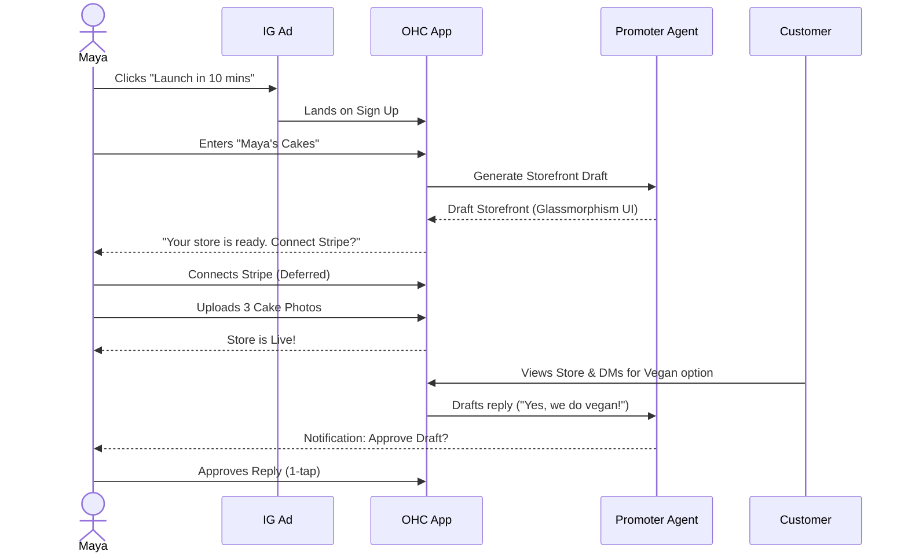
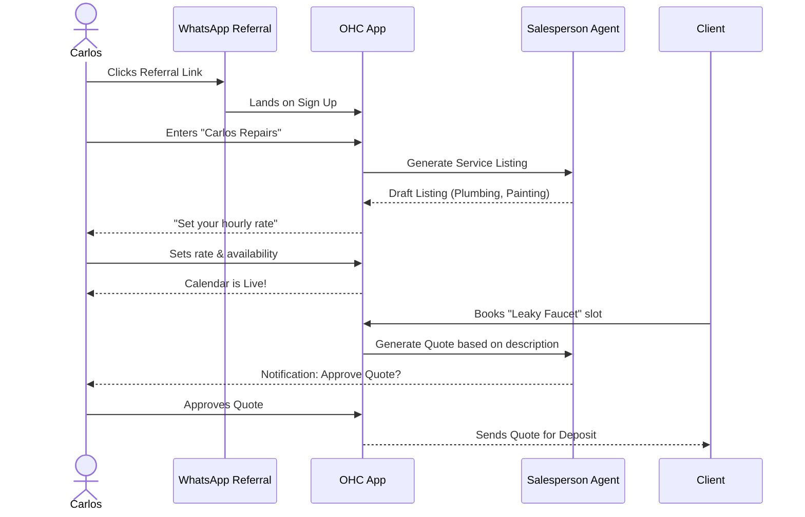
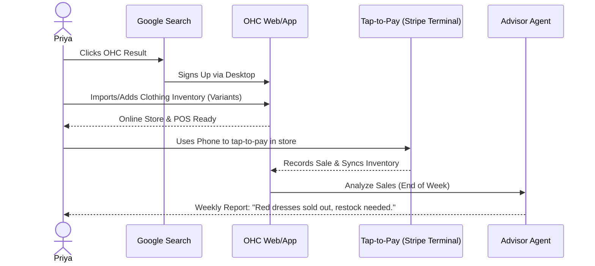
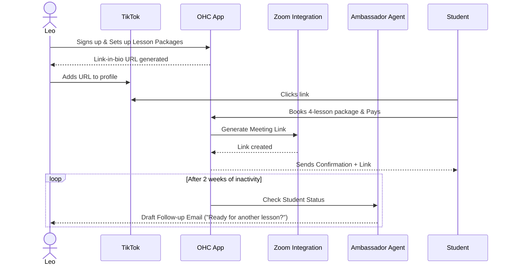
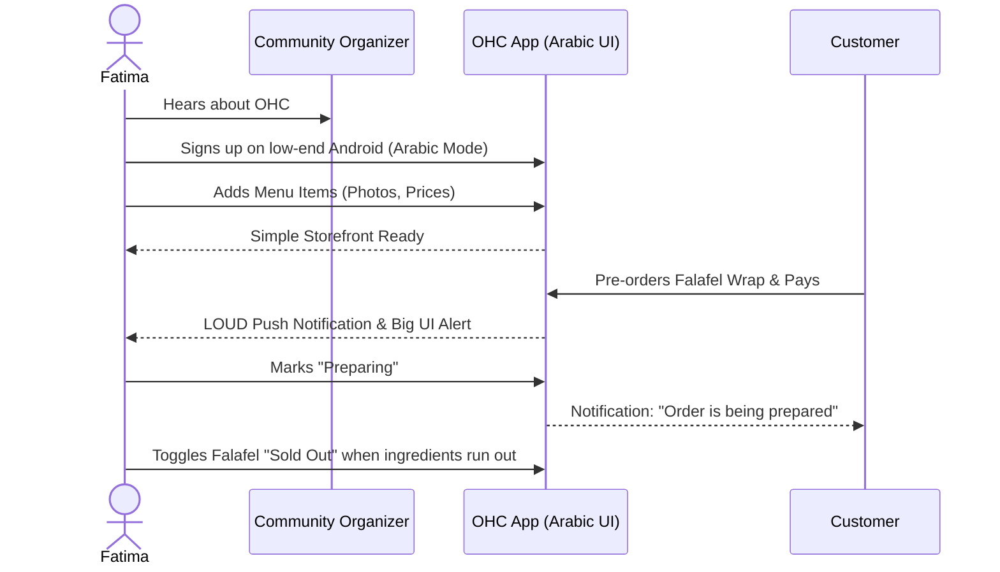

# OHC Business Journey Architecture

## 1. Overview
This document outlines the complete end-to-end user journey for each key persona on the OneHumanCorp (OHC) platform. It maps out the stages of Acquisition, Onboarding, Activation, Retention, Revenue, and Referral, detailing how non-technical small business owners interact with the system from discovery to scaling their business.

## 2. Core Personas
- **Maya (The Home Baker, 28)**: Needs a mobile-first catalog with deposit-based custom ordering and an AI agent to handle DMs.
- **Carlos (The Freelance Handyman, 42)**: Needs service listings, booking calendar with deposits, and automated quote generation.
- **Priya (The Boutique Owner, 35)**: Needs online-offline inventory sync, product variants, and in-person POS payments.
- **Leo (The Music Tutor, 22)**: Needs lesson bookings, auto-generated Zoom links, subscription packages, and a TikTok link-in-bio.
- **Fatima (The Food Cart Operator, 50)**: Needs a simple mobile UI for pre-orders/pickups, photo menus with sold-out toggles, and multi-language support.

## 3. Journey Phases

### 3.1 Acquisition
**How do they discover OHC?**
- **Maya**: Sees a targeted Instagram ad emphasizing "Turn your DMs into a real business in 10 minutes".
- **Carlos**: A friend (maybe another tradesperson) shares a referral link via WhatsApp.
- **Priya**: Searches Google for "easiest way to sell clothes online and in store".
- **Leo**: Clicks a "Built with OHC" link on another creator's TikTok bio.
- **Fatima**: A local community group organizer recommends OHC for its simplicity and Arabic language support.

**Landing Page CTA**: "Launch Your Business Now - Free" (with no credit card required).

### 3.2 Onboarding
**Step-by-step Wizard (Mobile-First 375px)**
1. **Name & Idea**: "What's the name of your business?" / "What do you sell?" (e.g., "Cakes", "Handyman Services").
2. **AI Magic**: OHC’s "Promoter" AI instantly generates a beautiful, premium (Glassmorphism, Outfit font) draft storefront/profile based on the input.
3. **Core Need**: Select primary feature (e.g., Maya selects "Take custom orders", Leo selects "Book appointments").
4. **Account Creation**: Sign up with Google/Apple or Email.
5. **Live in 10 Min**: The basic site goes live on an OHC subdomain (e.g., `maya-bakes.ohc.site`).

*Minimum Inputs*: Business Name, Category. Everything else is deferred.

### 3.3 Activation
**What defines success (Day 1 / Week 1)?**
- **Day 1**: The user adds their first product/service, connects their payment method (Stripe Onboarding), and views their live site.
- **Week 1**: Receiving the first real order or booking and processing it through the Operations Agent ("The Manager").

### 3.4 Retention
**What keeps them coming back?**
- **Push Notifications**: Real-time alerts for new orders, messages, or bookings.
- **AI Activity Feed**: The dashboard shows what the AI agents have done (e.g., "The Ambassador drafted 3 replies to your DMs").
- **Weekly Health Reports**: The "Business Advisory" agent sends plain-language summaries (e.g., "Tuesday was your busiest day!").

### 3.5 Revenue (Upgrade Triggers)
**Free → Starter ($9/mo)**
- **Trigger**: Maya wants a custom domain (`mayabakes.com`).
- **Trigger**: Carlos hits the 100 AI actions/month limit and needs more automated quotes.
- **Presentation**: In-context upgrade prompt when trying to access a premium feature or nearing a limit. "Upgrade to Starter to unlock custom domains and more AI power."

### 3.6 Referral
**The Viral Loop**
- "Built with OHC" badge on free tier sites.
- **In-App Prompt**: After a successful week (e.g., 5 orders processed), the "Salesperson" agent suggests: "Give a friend $20 off their first month, and you get a free month of Pro!"

## 4. Persona Sequence Diagrams

### 4.1 Maya's Journey (The Baker)

### 4.2 Carlos's Journey (The Handyman)

### 4.3 Priya's Journey (The Boutique Owner)

### 4.4 Leo's Journey (The Music Tutor)

### 4.5 Fatima's Journey (The Food Cart)

## 5. Identified Friction Points

1.  **Stripe Onboarding**: Standard KYC procedures can be intimidating. We must ensure the UI clearly explains *why* information is needed and allow deferring steps until the first payout.
2.  **Product/Inventory Entry**: Typing descriptions is tedious. The "Promoter" AI must auto-generate descriptions from simple titles and photos.
3.  **Trusting the AI**: Non-technical users may fear the AI will say the wrong thing to a customer. The "Draft-for-Review" workflow (1-tap approval) is critical for building trust before enabling full autonomy.
4.  **Language Barriers**: The UI, especially error messages and setup instructions, must be robustly translated (starting with Arabic and Spanish) to serve users like Fatima.
5.  **Offline/Poor Connectivity**: Fatima operating her cart might lose signal. The app must queue updates (like marking an item sold out) and sync when the connection is restored, showing optimistic UI updates in the meantime.