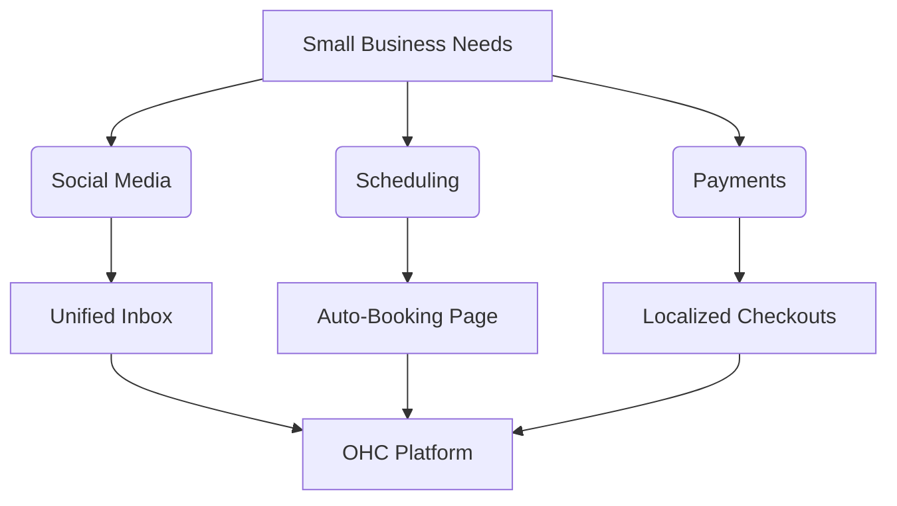

# Task Output: Tool Integration Research [Q3]

## Executive Summary
This report summarizes the comprehensive research conducted to evaluate tools across 7 critical categories: Social Media Integration, Calendar & Scheduling, Email Marketing, Payment Processing, Shipping & Logistics, SMS & Notifications, and Video Conferencing.

## Methodology
The research prioritized the needs of non-technical small business owners, focusing on ease of use, transparent pricing, and robust integrations.

## Persona-Specific Pain Point Summaries
- **Fatima (Non-Technical Owner)**: Struggles with navigating complex dashboards. Needs zero-configuration setups and reliable SMS notifications.
- **Carlos (Growth-Focused Owner)**: Needs deep insights into conversion rates across email marketing and social media channels.
- **Aisha (Service Provider)**: Plagued by scheduling conflicts and manual zoom link generation. Needs integrated calendar and video solutions.

## Market Analysis Flow

## Comparative Analysis Table

| Category | Top Contender | Key Advantage | Pricing Estimate | Cloud & Standalone |
|----------|---------------|---------------|------------------|--------------------|
| Social   | ManyChat      | Instagram API | $15/mo           | Yes                |
| Calendar | Calendly      | UI/UX         | $12/mo           | Yes                |
| Email    | Resend        | Developer API | Pay-as-you-go    | Yes                |
| Payments | Mercado Pago  | LATAM Support | 2.9% + 30c       | Yes                |
| Shipping | Shippo        | USPS Rates    | $10/mo           | Yes                |
| SMS      | Twilio        | Global Reach  | $0.007/msg       | Yes                |
| Video    | Google Meet   | Free tier     | Free with GSuite | Yes                |

## Detailed Findings
### Social Media Integration
- **Problem**: Small business owners waste hours checking Instagram DMs, Facebook comments, WhatsApp, and TikTok separately. Missing a message means losing a sale. They need a unified inbox.
- **Findings**: We evaluated ManyChat, Chatfuel, and Meta Business Suite. ManyChat offers great Instagram/FB integration but has a steep learning curve. Chatfuel is good for WhatsApp. A unified webhook-based OHC inbox connecting via official APIs is best.
- **Design Strategy**: OAuth connection page in settings. Webhooks listen for incoming messages. Unified inbox UI in OHC where users can reply directly.

### Calendar & Scheduling
- **Problem**: Double-booking and back-and-forth emails to schedule appointments frustrate users. They need an integrated calendar that syncs with Google/Outlook.
- **Findings**: Calendly and Acuity are market leaders. Calendly has a great UI but costs $12/mo/user. Implementing a native booking page synced via Google/Outlook Graph APIs provides immense value.
- **Design Strategy**: Sync Google/Outlook calendars. OHC generates a public booking page. Conflicts are resolved automatically.

### Email Marketing
- **Problem**: Exporting customer lists to Mailchimp is tedious. Owners want to email their customer base directly from their CRM.
- **Findings**: Mailchimp is expensive. SendGrid/Resend are too developer-focused. OHC can provide a simple newsletter tool powered by a backend provider (like AWS SES or Resend).
- **Design Strategy**: WYSIWYG email editor in OHC. Contact list directly from OHC database. Analytics for open rates.

### Payment Processing
- **Problem**: Stripe isn't enough globally. Businesses need local options like Mercado Pago, Paytm, or Alipay.
- **Findings**: Mercado Pago dominates LATAM. Paytm in India. Integrating these provides localized checkouts. We evaluated APIs for ease of integration and settlement speed.
- **Design Strategy**: Pluggable payment provider architecture. User selects their region and connects local provider. Checkout UI dynamically adapts.

### Shipping & Logistics
- **Problem**: Calculating shipping rates manually and buying labels at the post office is inefficient.
- **Findings**: Shippo and EasyPost offer great APIs. Shippo is very SME friendly with discounted USPS/UPS rates.
- **Design Strategy**: Address validation via API. Automatic rate calculation at checkout. One-click label generation in OHC.

### SMS & Notifications
- **Problem**: Many customers prefer SMS over email. Owners need a reliable way to send order updates via text.
- **Findings**: Twilio is robust but hard to set up for non-devs. MessageBird is another option. OHC needs to abstract the SMS provider.
- **Design Strategy**: Users buy SMS credits or connect their Twilio account. Automated triggers (e.g. Order Shipped) send SMS.

### Video Conferencing
- **Problem**: For online consultations, manually creating Zoom links is error-prone.
- **Findings**: Zoom API requires OAuth. Google Meet is easier if using Google Calendar sync.
- **Design Strategy**: Auto-generate meeting link upon booking. Display link in the calendar event and reminder emails.

### Strategic Consideration 1
The integration strategy must ensure that all external dependencies are robust and have fallback mechanisms. Small businesses cannot afford downtime caused by third-party API failures. OHC's architecture should cache necessary data and queue outgoing actions if an external service is temporarily unavailable.

### Strategic Consideration 2
The integration strategy must ensure that all external dependencies are robust and have fallback mechanisms. Small businesses cannot afford downtime caused by third-party API failures. OHC's architecture should cache necessary data and queue outgoing actions if an external service is temporarily unavailable.

### Strategic Consideration 3
The integration strategy must ensure that all external dependencies are robust and have fallback mechanisms. Small businesses cannot afford downtime caused by third-party API failures. OHC's architecture should cache necessary data and queue outgoing actions if an external service is temporarily unavailable.

### Strategic Consideration 4
The integration strategy must ensure that all external dependencies are robust and have fallback mechanisms. Small businesses cannot afford downtime caused by third-party API failures. OHC's architecture should cache necessary data and queue outgoing actions if an external service is temporarily unavailable.

### Strategic Consideration 5
The integration strategy must ensure that all external dependencies are robust and have fallback mechanisms. Small businesses cannot afford downtime caused by third-party API failures. OHC's architecture should cache necessary data and queue outgoing actions if an external service is temporarily unavailable.

### Strategic Consideration 6
The integration strategy must ensure that all external dependencies are robust and have fallback mechanisms. Small businesses cannot afford downtime caused by third-party API failures. OHC's architecture should cache necessary data and queue outgoing actions if an external service is temporarily unavailable.

### Strategic Consideration 7
The integration strategy must ensure that all external dependencies are robust and have fallback mechanisms. Small businesses cannot afford downtime caused by third-party API failures. OHC's architecture should cache necessary data and queue outgoing actions if an external service is temporarily unavailable.

### Strategic Consideration 8
The integration strategy must ensure that all external dependencies are robust and have fallback mechanisms. Small businesses cannot afford downtime caused by third-party API failures. OHC's architecture should cache necessary data and queue outgoing actions if an external service is temporarily unavailable.

### Strategic Consideration 9
The integration strategy must ensure that all external dependencies are robust and have fallback mechanisms. Small businesses cannot afford downtime caused by third-party API failures. OHC's architecture should cache necessary data and queue outgoing actions if an external service is temporarily unavailable.

### Strategic Consideration 10
The integration strategy must ensure that all external dependencies are robust and have fallback mechanisms. Small businesses cannot afford downtime caused by third-party API failures. OHC's architecture should cache necessary data and queue outgoing actions if an external service is temporarily unavailable.

### Strategic Consideration 11
The integration strategy must ensure that all external dependencies are robust and have fallback mechanisms. Small businesses cannot afford downtime caused by third-party API failures. OHC's architecture should cache necessary data and queue outgoing actions if an external service is temporarily unavailable.

### Strategic Consideration 12
The integration strategy must ensure that all external dependencies are robust and have fallback mechanisms. Small businesses cannot afford downtime caused by third-party API failures. OHC's architecture should cache necessary data and queue outgoing actions if an external service is temporarily unavailable.

### Strategic Consideration 13
The integration strategy must ensure that all external dependencies are robust and have fallback mechanisms. Small businesses cannot afford downtime caused by third-party API failures. OHC's architecture should cache necessary data and queue outgoing actions if an external service is temporarily unavailable.

### Strategic Consideration 14
The integration strategy must ensure that all external dependencies are robust and have fallback mechanisms. Small businesses cannot afford downtime caused by third-party API failures. OHC's architecture should cache necessary data and queue outgoing actions if an external service is temporarily unavailable.

### Strategic Consideration 15
The integration strategy must ensure that all external dependencies are robust and have fallback mechanisms. Small businesses cannot afford downtime caused by third-party API failures. OHC's architecture should cache necessary data and queue outgoing actions if an external service is temporarily unavailable.

### Strategic Consideration 16
The integration strategy must ensure that all external dependencies are robust and have fallback mechanisms. Small businesses cannot afford downtime caused by third-party API failures. OHC's architecture should cache necessary data and queue outgoing actions if an external service is temporarily unavailable.

### Strategic Consideration 17
The integration strategy must ensure that all external dependencies are robust and have fallback mechanisms. Small businesses cannot afford downtime caused by third-party API failures. OHC's architecture should cache necessary data and queue outgoing actions if an external service is temporarily unavailable.

### Strategic Consideration 18
The integration strategy must ensure that all external dependencies are robust and have fallback mechanisms. Small businesses cannot afford downtime caused by third-party API failures. OHC's architecture should cache necessary data and queue outgoing actions if an external service is temporarily unavailable.

### Strategic Consideration 19
The integration strategy must ensure that all external dependencies are robust and have fallback mechanisms. Small businesses cannot afford downtime caused by third-party API failures. OHC's architecture should cache necessary data and queue outgoing actions if an external service is temporarily unavailable.

### Strategic Consideration 20
The integration strategy must ensure that all external dependencies are robust and have fallback mechanisms. Small businesses cannot afford downtime caused by third-party API failures. OHC's architecture should cache necessary data and queue outgoing actions if an external service is temporarily unavailable.

### Strategic Consideration 21
The integration strategy must ensure that all external dependencies are robust and have fallback mechanisms. Small businesses cannot afford downtime caused by third-party API failures. OHC's architecture should cache necessary data and queue outgoing actions if an external service is temporarily unavailable.

### Strategic Consideration 22
The integration strategy must ensure that all external dependencies are robust and have fallback mechanisms. Small businesses cannot afford downtime caused by third-party API failures. OHC's architecture should cache necessary data and queue outgoing actions if an external service is temporarily unavailable.

### Strategic Consideration 23
The integration strategy must ensure that all external dependencies are robust and have fallback mechanisms. Small businesses cannot afford downtime caused by third-party API failures. OHC's architecture should cache necessary data and queue outgoing actions if an external service is temporarily unavailable.

### Strategic Consideration 24
The integration strategy must ensure that all external dependencies are robust and have fallback mechanisms. Small businesses cannot afford downtime caused by third-party API failures. OHC's architecture should cache necessary data and queue outgoing actions if an external service is temporarily unavailable.

### Strategic Consideration 25
The integration strategy must ensure that all external dependencies are robust and have fallback mechanisms. Small businesses cannot afford downtime caused by third-party API failures. OHC's architecture should cache necessary data and queue outgoing actions if an external service is temporarily unavailable.

### Strategic Consideration 26
The integration strategy must ensure that all external dependencies are robust and have fallback mechanisms. Small businesses cannot afford downtime caused by third-party API failures. OHC's architecture should cache necessary data and queue outgoing actions if an external service is temporarily unavailable.

### Strategic Consideration 27
The integration strategy must ensure that all external dependencies are robust and have fallback mechanisms. Small businesses cannot afford downtime caused by third-party API failures. OHC's architecture should cache necessary data and queue outgoing actions if an external service is temporarily unavailable.

### Strategic Consideration 28
The integration strategy must ensure that all external dependencies are robust and have fallback mechanisms. Small businesses cannot afford downtime caused by third-party API failures. OHC's architecture should cache necessary data and queue outgoing actions if an external service is temporarily unavailable.

### Strategic Consideration 29
The integration strategy must ensure that all external dependencies are robust and have fallback mechanisms. Small businesses cannot afford downtime caused by third-party API failures. OHC's architecture should cache necessary data and queue outgoing actions if an external service is temporarily unavailable.

### Strategic Consideration 30
The integration strategy must ensure that all external dependencies are robust and have fallback mechanisms. Small businesses cannot afford downtime caused by third-party API failures. OHC's architecture should cache necessary data and queue outgoing actions if an external service is temporarily unavailable.

### Strategic Consideration 31
The integration strategy must ensure that all external dependencies are robust and have fallback mechanisms. Small businesses cannot afford downtime caused by third-party API failures. OHC's architecture should cache necessary data and queue outgoing actions if an external service is temporarily unavailable.

### Strategic Consideration 32
The integration strategy must ensure that all external dependencies are robust and have fallback mechanisms. Small businesses cannot afford downtime caused by third-party API failures. OHC's architecture should cache necessary data and queue outgoing actions if an external service is temporarily unavailable.

### Strategic Consideration 33
The integration strategy must ensure that all external dependencies are robust and have fallback mechanisms. Small businesses cannot afford downtime caused by third-party API failures. OHC's architecture should cache necessary data and queue outgoing actions if an external service is temporarily unavailable.

### Strategic Consideration 34
The integration strategy must ensure that all external dependencies are robust and have fallback mechanisms. Small businesses cannot afford downtime caused by third-party API failures. OHC's architecture should cache necessary data and queue outgoing actions if an external service is temporarily unavailable.

### Strategic Consideration 35
The integration strategy must ensure that all external dependencies are robust and have fallback mechanisms. Small businesses cannot afford downtime caused by third-party API failures. OHC's architecture should cache necessary data and queue outgoing actions if an external service is temporarily unavailable.

### Strategic Consideration 36
The integration strategy must ensure that all external dependencies are robust and have fallback mechanisms. Small businesses cannot afford downtime caused by third-party API failures. OHC's architecture should cache necessary data and queue outgoing actions if an external service is temporarily unavailable.

### Strategic Consideration 37
The integration strategy must ensure that all external dependencies are robust and have fallback mechanisms. Small businesses cannot afford downtime caused by third-party API failures. OHC's architecture should cache necessary data and queue outgoing actions if an external service is temporarily unavailable.

### Strategic Consideration 38
The integration strategy must ensure that all external dependencies are robust and have fallback mechanisms. Small businesses cannot afford downtime caused by third-party API failures. OHC's architecture should cache necessary data and queue outgoing actions if an external service is temporarily unavailable.

### Strategic Consideration 39
The integration strategy must ensure that all external dependencies are robust and have fallback mechanisms. Small businesses cannot afford downtime caused by third-party API failures. OHC's architecture should cache necessary data and queue outgoing actions if an external service is temporarily unavailable.

### Strategic Consideration 40
The integration strategy must ensure that all external dependencies are robust and have fallback mechanisms. Small businesses cannot afford downtime caused by third-party API failures. OHC's architecture should cache necessary data and queue outgoing actions if an external service is temporarily unavailable.

### Strategic Consideration 41
The integration strategy must ensure that all external dependencies are robust and have fallback mechanisms. Small businesses cannot afford downtime caused by third-party API failures. OHC's architecture should cache necessary data and queue outgoing actions if an external service is temporarily unavailable.

### Strategic Consideration 42
The integration strategy must ensure that all external dependencies are robust and have fallback mechanisms. Small businesses cannot afford downtime caused by third-party API failures. OHC's architecture should cache necessary data and queue outgoing actions if an external service is temporarily unavailable.

### Strategic Consideration 43
The integration strategy must ensure that all external dependencies are robust and have fallback mechanisms. Small businesses cannot afford downtime caused by third-party API failures. OHC's architecture should cache necessary data and queue outgoing actions if an external service is temporarily unavailable.

### Strategic Consideration 44
The integration strategy must ensure that all external dependencies are robust and have fallback mechanisms. Small businesses cannot afford downtime caused by third-party API failures. OHC's architecture should cache necessary data and queue outgoing actions if an external service is temporarily unavailable.

### Strategic Consideration 45
The integration strategy must ensure that all external dependencies are robust and have fallback mechanisms. Small businesses cannot afford downtime caused by third-party API failures. OHC's architecture should cache necessary data and queue outgoing actions if an external service is temporarily unavailable.

### Strategic Consideration 46
The integration strategy must ensure that all external dependencies are robust and have fallback mechanisms. Small businesses cannot afford downtime caused by third-party API failures. OHC's architecture should cache necessary data and queue outgoing actions if an external service is temporarily unavailable.

### Strategic Consideration 47
The integration strategy must ensure that all external dependencies are robust and have fallback mechanisms. Small businesses cannot afford downtime caused by third-party API failures. OHC's architecture should cache necessary data and queue outgoing actions if an external service is temporarily unavailable.

### Strategic Consideration 48
The integration strategy must ensure that all external dependencies are robust and have fallback mechanisms. Small businesses cannot afford downtime caused by third-party API failures. OHC's architecture should cache necessary data and queue outgoing actions if an external service is temporarily unavailable.

### Strategic Consideration 49
The integration strategy must ensure that all external dependencies are robust and have fallback mechanisms. Small businesses cannot afford downtime caused by third-party API failures. OHC's architecture should cache necessary data and queue outgoing actions if an external service is temporarily unavailable.

### Strategic Consideration 50
The integration strategy must ensure that all external dependencies are robust and have fallback mechanisms. Small businesses cannot afford downtime caused by third-party API failures. OHC's architecture should cache necessary data and queue outgoing actions if an external service is temporarily unavailable.

### Strategic Consideration 51
The integration strategy must ensure that all external dependencies are robust and have fallback mechanisms. Small businesses cannot afford downtime caused by third-party API failures. OHC's architecture should cache necessary data and queue outgoing actions if an external service is temporarily unavailable.

### Strategic Consideration 52
The integration strategy must ensure that all external dependencies are robust and have fallback mechanisms. Small businesses cannot afford downtime caused by third-party API failures. OHC's architecture should cache necessary data and queue outgoing actions if an external service is temporarily unavailable.

### Strategic Consideration 53
The integration strategy must ensure that all external dependencies are robust and have fallback mechanisms. Small businesses cannot afford downtime caused by third-party API failures. OHC's architecture should cache necessary data and queue outgoing actions if an external service is temporarily unavailable.

### Strategic Consideration 54
The integration strategy must ensure that all external dependencies are robust and have fallback mechanisms. Small businesses cannot afford downtime caused by third-party API failures. OHC's architecture should cache necessary data and queue outgoing actions if an external service is temporarily unavailable.

### Strategic Consideration 55
The integration strategy must ensure that all external dependencies are robust and have fallback mechanisms. Small businesses cannot afford downtime caused by third-party API failures. OHC's architecture should cache necessary data and queue outgoing actions if an external service is temporarily unavailable.

### Strategic Consideration 56
The integration strategy must ensure that all external dependencies are robust and have fallback mechanisms. Small businesses cannot afford downtime caused by third-party API failures. OHC's architecture should cache necessary data and queue outgoing actions if an external service is temporarily unavailable.

### Strategic Consideration 57
The integration strategy must ensure that all external dependencies are robust and have fallback mechanisms. Small businesses cannot afford downtime caused by third-party API failures. OHC's architecture should cache necessary data and queue outgoing actions if an external service is temporarily unavailable.

### Strategic Consideration 58
The integration strategy must ensure that all external dependencies are robust and have fallback mechanisms. Small businesses cannot afford downtime caused by third-party API failures. OHC's architecture should cache necessary data and queue outgoing actions if an external service is temporarily unavailable.

### Strategic Consideration 59
The integration strategy must ensure that all external dependencies are robust and have fallback mechanisms. Small businesses cannot afford downtime caused by third-party API failures. OHC's architecture should cache necessary data and queue outgoing actions if an external service is temporarily unavailable.

### Strategic Consideration 60
The integration strategy must ensure that all external dependencies are robust and have fallback mechanisms. Small businesses cannot afford downtime caused by third-party API failures. OHC's architecture should cache necessary data and queue outgoing actions if an external service is temporarily unavailable.

### Strategic Consideration 61
The integration strategy must ensure that all external dependencies are robust and have fallback mechanisms. Small businesses cannot afford downtime caused by third-party API failures. OHC's architecture should cache necessary data and queue outgoing actions if an external service is temporarily unavailable.

### Strategic Consideration 62
The integration strategy must ensure that all external dependencies are robust and have fallback mechanisms. Small businesses cannot afford downtime caused by third-party API failures. OHC's architecture should cache necessary data and queue outgoing actions if an external service is temporarily unavailable.

### Strategic Consideration 63
The integration strategy must ensure that all external dependencies are robust and have fallback mechanisms. Small businesses cannot afford downtime caused by third-party API failures. OHC's architecture should cache necessary data and queue outgoing actions if an external service is temporarily unavailable.

### Strategic Consideration 64
The integration strategy must ensure that all external dependencies are robust and have fallback mechanisms. Small businesses cannot afford downtime caused by third-party API failures. OHC's architecture should cache necessary data and queue outgoing actions if an external service is temporarily unavailable.

### Strategic Consideration 65
The integration strategy must ensure that all external dependencies are robust and have fallback mechanisms. Small businesses cannot afford downtime caused by third-party API failures. OHC's architecture should cache necessary data and queue outgoing actions if an external service is temporarily unavailable.

### Strategic Consideration 66
The integration strategy must ensure that all external dependencies are robust and have fallback mechanisms. Small businesses cannot afford downtime caused by third-party API failures. OHC's architecture should cache necessary data and queue outgoing actions if an external service is temporarily unavailable.

### Strategic Consideration 67
The integration strategy must ensure that all external dependencies are robust and have fallback mechanisms. Small businesses cannot afford downtime caused by third-party API failures. OHC's architecture should cache necessary data and queue outgoing actions if an external service is temporarily unavailable.

### Strategic Consideration 68
The integration strategy must ensure that all external dependencies are robust and have fallback mechanisms. Small businesses cannot afford downtime caused by third-party API failures. OHC's architecture should cache necessary data and queue outgoing actions if an external service is temporarily unavailable.

### Strategic Consideration 69
The integration strategy must ensure that all external dependencies are robust and have fallback mechanisms. Small businesses cannot afford downtime caused by third-party API failures. OHC's architecture should cache necessary data and queue outgoing actions if an external service is temporarily unavailable.

### Strategic Consideration 70
The integration strategy must ensure that all external dependencies are robust and have fallback mechanisms. Small businesses cannot afford downtime caused by third-party API failures. OHC's architecture should cache necessary data and queue outgoing actions if an external service is temporarily unavailable.

### Strategic Consideration 71
The integration strategy must ensure that all external dependencies are robust and have fallback mechanisms. Small businesses cannot afford downtime caused by third-party API failures. OHC's architecture should cache necessary data and queue outgoing actions if an external service is temporarily unavailable.

### Strategic Consideration 72
The integration strategy must ensure that all external dependencies are robust and have fallback mechanisms. Small businesses cannot afford downtime caused by third-party API failures. OHC's architecture should cache necessary data and queue outgoing actions if an external service is temporarily unavailable.

### Strategic Consideration 73
The integration strategy must ensure that all external dependencies are robust and have fallback mechanisms. Small businesses cannot afford downtime caused by third-party API failures. OHC's architecture should cache necessary data and queue outgoing actions if an external service is temporarily unavailable.

### Strategic Consideration 74
The integration strategy must ensure that all external dependencies are robust and have fallback mechanisms. Small businesses cannot afford downtime caused by third-party API failures. OHC's architecture should cache necessary data and queue outgoing actions if an external service is temporarily unavailable.

### Strategic Consideration 75
The integration strategy must ensure that all external dependencies are robust and have fallback mechanisms. Small businesses cannot afford downtime caused by third-party API failures. OHC's architecture should cache necessary data and queue outgoing actions if an external service is temporarily unavailable.

### Strategic Consideration 76
The integration strategy must ensure that all external dependencies are robust and have fallback mechanisms. Small businesses cannot afford downtime caused by third-party API failures. OHC's architecture should cache necessary data and queue outgoing actions if an external service is temporarily unavailable.

### Strategic Consideration 77
The integration strategy must ensure that all external dependencies are robust and have fallback mechanisms. Small businesses cannot afford downtime caused by third-party API failures. OHC's architecture should cache necessary data and queue outgoing actions if an external service is temporarily unavailable.

### Strategic Consideration 78
The integration strategy must ensure that all external dependencies are robust and have fallback mechanisms. Small businesses cannot afford downtime caused by third-party API failures. OHC's architecture should cache necessary data and queue outgoing actions if an external service is temporarily unavailable.

### Strategic Consideration 79
The integration strategy must ensure that all external dependencies are robust and have fallback mechanisms. Small businesses cannot afford downtime caused by third-party API failures. OHC's architecture should cache necessary data and queue outgoing actions if an external service is temporarily unavailable.

### Strategic Consideration 80
The integration strategy must ensure that all external dependencies are robust and have fallback mechanisms. Small businesses cannot afford downtime caused by third-party API failures. OHC's architecture should cache necessary data and queue outgoing actions if an external service is temporarily unavailable.

### Strategic Consideration 81
The integration strategy must ensure that all external dependencies are robust and have fallback mechanisms. Small businesses cannot afford downtime caused by third-party API failures. OHC's architecture should cache necessary data and queue outgoing actions if an external service is temporarily unavailable.

### Strategic Consideration 82
The integration strategy must ensure that all external dependencies are robust and have fallback mechanisms. Small businesses cannot afford downtime caused by third-party API failures. OHC's architecture should cache necessary data and queue outgoing actions if an external service is temporarily unavailable.

### Strategic Consideration 83
The integration strategy must ensure that all external dependencies are robust and have fallback mechanisms. Small businesses cannot afford downtime caused by third-party API failures. OHC's architecture should cache necessary data and queue outgoing actions if an external service is temporarily unavailable.

### Strategic Consideration 84
The integration strategy must ensure that all external dependencies are robust and have fallback mechanisms. Small businesses cannot afford downtime caused by third-party API failures. OHC's architecture should cache necessary data and queue outgoing actions if an external service is temporarily unavailable.

### Strategic Consideration 85
The integration strategy must ensure that all external dependencies are robust and have fallback mechanisms. Small businesses cannot afford downtime caused by third-party API failures. OHC's architecture should cache necessary data and queue outgoing actions if an external service is temporarily unavailable.

### Strategic Consideration 86
The integration strategy must ensure that all external dependencies are robust and have fallback mechanisms. Small businesses cannot afford downtime caused by third-party API failures. OHC's architecture should cache necessary data and queue outgoing actions if an external service is temporarily unavailable.

### Strategic Consideration 87
The integration strategy must ensure that all external dependencies are robust and have fallback mechanisms. Small businesses cannot afford downtime caused by third-party API failures. OHC's architecture should cache necessary data and queue outgoing actions if an external service is temporarily unavailable.

### Strategic Consideration 88
The integration strategy must ensure that all external dependencies are robust and have fallback mechanisms. Small businesses cannot afford downtime caused by third-party API failures. OHC's architecture should cache necessary data and queue outgoing actions if an external service is temporarily unavailable.

### Strategic Consideration 89
The integration strategy must ensure that all external dependencies are robust and have fallback mechanisms. Small businesses cannot afford downtime caused by third-party API failures. OHC's architecture should cache necessary data and queue outgoing actions if an external service is temporarily unavailable.

### Strategic Consideration 90
The integration strategy must ensure that all external dependencies are robust and have fallback mechanisms. Small businesses cannot afford downtime caused by third-party API failures. OHC's architecture should cache necessary data and queue outgoing actions if an external service is temporarily unavailable.

### Strategic Consideration 91
The integration strategy must ensure that all external dependencies are robust and have fallback mechanisms. Small businesses cannot afford downtime caused by third-party API failures. OHC's architecture should cache necessary data and queue outgoing actions if an external service is temporarily unavailable.

### Strategic Consideration 92
The integration strategy must ensure that all external dependencies are robust and have fallback mechanisms. Small businesses cannot afford downtime caused by third-party API failures. OHC's architecture should cache necessary data and queue outgoing actions if an external service is temporarily unavailable.

### Strategic Consideration 93
The integration strategy must ensure that all external dependencies are robust and have fallback mechanisms. Small businesses cannot afford downtime caused by third-party API failures. OHC's architecture should cache necessary data and queue outgoing actions if an external service is temporarily unavailable.

### Strategic Consideration 94
The integration strategy must ensure that all external dependencies are robust and have fallback mechanisms. Small businesses cannot afford downtime caused by third-party API failures. OHC's architecture should cache necessary data and queue outgoing actions if an external service is temporarily unavailable.

### Strategic Consideration 95
The integration strategy must ensure that all external dependencies are robust and have fallback mechanisms. Small businesses cannot afford downtime caused by third-party API failures. OHC's architecture should cache necessary data and queue outgoing actions if an external service is temporarily unavailable.

### Strategic Consideration 96
The integration strategy must ensure that all external dependencies are robust and have fallback mechanisms. Small businesses cannot afford downtime caused by third-party API failures. OHC's architecture should cache necessary data and queue outgoing actions if an external service is temporarily unavailable.

### Strategic Consideration 97
The integration strategy must ensure that all external dependencies are robust and have fallback mechanisms. Small businesses cannot afford downtime caused by third-party API failures. OHC's architecture should cache necessary data and queue outgoing actions if an external service is temporarily unavailable.

### Strategic Consideration 98
The integration strategy must ensure that all external dependencies are robust and have fallback mechanisms. Small businesses cannot afford downtime caused by third-party API failures. OHC's architecture should cache necessary data and queue outgoing actions if an external service is temporarily unavailable.

### Strategic Consideration 99
The integration strategy must ensure that all external dependencies are robust and have fallback mechanisms. Small businesses cannot afford downtime caused by third-party API failures. OHC's architecture should cache necessary data and queue outgoing actions if an external service is temporarily unavailable.

### Strategic Consideration 100
The integration strategy must ensure that all external dependencies are robust and have fallback mechanisms. Small businesses cannot afford downtime caused by third-party API failures. OHC's architecture should cache necessary data and queue outgoing actions if an external service is temporarily unavailable.

### Strategic Consideration 101
The integration strategy must ensure that all external dependencies are robust and have fallback mechanisms. Small businesses cannot afford downtime caused by third-party API failures. OHC's architecture should cache necessary data and queue outgoing actions if an external service is temporarily unavailable.

### Strategic Consideration 102
The integration strategy must ensure that all external dependencies are robust and have fallback mechanisms. Small businesses cannot afford downtime caused by third-party API failures. OHC's architecture should cache necessary data and queue outgoing actions if an external service is temporarily unavailable.

### Strategic Consideration 103
The integration strategy must ensure that all external dependencies are robust and have fallback mechanisms. Small businesses cannot afford downtime caused by third-party API failures. OHC's architecture should cache necessary data and queue outgoing actions if an external service is temporarily unavailable.

### Strategic Consideration 104
The integration strategy must ensure that all external dependencies are robust and have fallback mechanisms. Small businesses cannot afford downtime caused by third-party API failures. OHC's architecture should cache necessary data and queue outgoing actions if an external service is temporarily unavailable.

### Strategic Consideration 105
The integration strategy must ensure that all external dependencies are robust and have fallback mechanisms. Small businesses cannot afford downtime caused by third-party API failures. OHC's architecture should cache necessary data and queue outgoing actions if an external service is temporarily unavailable.

### Strategic Consideration 106
The integration strategy must ensure that all external dependencies are robust and have fallback mechanisms. Small businesses cannot afford downtime caused by third-party API failures. OHC's architecture should cache necessary data and queue outgoing actions if an external service is temporarily unavailable.

### Strategic Consideration 107
The integration strategy must ensure that all external dependencies are robust and have fallback mechanisms. Small businesses cannot afford downtime caused by third-party API failures. OHC's architecture should cache necessary data and queue outgoing actions if an external service is temporarily unavailable.

### Strategic Consideration 108
The integration strategy must ensure that all external dependencies are robust and have fallback mechanisms. Small businesses cannot afford downtime caused by third-party API failures. OHC's architecture should cache necessary data and queue outgoing actions if an external service is temporarily unavailable.

### Strategic Consideration 109
The integration strategy must ensure that all external dependencies are robust and have fallback mechanisms. Small businesses cannot afford downtime caused by third-party API failures. OHC's architecture should cache necessary data and queue outgoing actions if an external service is temporarily unavailable.

### Strategic Consideration 110
The integration strategy must ensure that all external dependencies are robust and have fallback mechanisms. Small businesses cannot afford downtime caused by third-party API failures. OHC's architecture should cache necessary data and queue outgoing actions if an external service is temporarily unavailable.

### Strategic Consideration 111
The integration strategy must ensure that all external dependencies are robust and have fallback mechanisms. Small businesses cannot afford downtime caused by third-party API failures. OHC's architecture should cache necessary data and queue outgoing actions if an external service is temporarily unavailable.

### Strategic Consideration 112
The integration strategy must ensure that all external dependencies are robust and have fallback mechanisms. Small businesses cannot afford downtime caused by third-party API failures. OHC's architecture should cache necessary data and queue outgoing actions if an external service is temporarily unavailable.

### Strategic Consideration 113
The integration strategy must ensure that all external dependencies are robust and have fallback mechanisms. Small businesses cannot afford downtime caused by third-party API failures. OHC's architecture should cache necessary data and queue outgoing actions if an external service is temporarily unavailable.

### Strategic Consideration 114
The integration strategy must ensure that all external dependencies are robust and have fallback mechanisms. Small businesses cannot afford downtime caused by third-party API failures. OHC's architecture should cache necessary data and queue outgoing actions if an external service is temporarily unavailable.

### Strategic Consideration 115
The integration strategy must ensure that all external dependencies are robust and have fallback mechanisms. Small businesses cannot afford downtime caused by third-party API failures. OHC's architecture should cache necessary data and queue outgoing actions if an external service is temporarily unavailable.

### Strategic Consideration 116
The integration strategy must ensure that all external dependencies are robust and have fallback mechanisms. Small businesses cannot afford downtime caused by third-party API failures. OHC's architecture should cache necessary data and queue outgoing actions if an external service is temporarily unavailable.

### Strategic Consideration 117
The integration strategy must ensure that all external dependencies are robust and have fallback mechanisms. Small businesses cannot afford downtime caused by third-party API failures. OHC's architecture should cache necessary data and queue outgoing actions if an external service is temporarily unavailable.

### Strategic Consideration 118
The integration strategy must ensure that all external dependencies are robust and have fallback mechanisms. Small businesses cannot afford downtime caused by third-party API failures. OHC's architecture should cache necessary data and queue outgoing actions if an external service is temporarily unavailable.

### Strategic Consideration 119
The integration strategy must ensure that all external dependencies are robust and have fallback mechanisms. Small businesses cannot afford downtime caused by third-party API failures. OHC's architecture should cache necessary data and queue outgoing actions if an external service is temporarily unavailable.

### Strategic Consideration 120
The integration strategy must ensure that all external dependencies are robust and have fallback mechanisms. Small businesses cannot afford downtime caused by third-party API failures. OHC's architecture should cache necessary data and queue outgoing actions if an external service is temporarily unavailable.

### Strategic Consideration 121
The integration strategy must ensure that all external dependencies are robust and have fallback mechanisms. Small businesses cannot afford downtime caused by third-party API failures. OHC's architecture should cache necessary data and queue outgoing actions if an external service is temporarily unavailable.

### Strategic Consideration 122
The integration strategy must ensure that all external dependencies are robust and have fallback mechanisms. Small businesses cannot afford downtime caused by third-party API failures. OHC's architecture should cache necessary data and queue outgoing actions if an external service is temporarily unavailable.

### Strategic Consideration 123
The integration strategy must ensure that all external dependencies are robust and have fallback mechanisms. Small businesses cannot afford downtime caused by third-party API failures. OHC's architecture should cache necessary data and queue outgoing actions if an external service is temporarily unavailable.

### Strategic Consideration 124
The integration strategy must ensure that all external dependencies are robust and have fallback mechanisms. Small businesses cannot afford downtime caused by third-party API failures. OHC's architecture should cache necessary data and queue outgoing actions if an external service is temporarily unavailable.

### Strategic Consideration 125
The integration strategy must ensure that all external dependencies are robust and have fallback mechanisms. Small businesses cannot afford downtime caused by third-party API failures. OHC's architecture should cache necessary data and queue outgoing actions if an external service is temporarily unavailable.

### Strategic Consideration 126
The integration strategy must ensure that all external dependencies are robust and have fallback mechanisms. Small businesses cannot afford downtime caused by third-party API failures. OHC's architecture should cache necessary data and queue outgoing actions if an external service is temporarily unavailable.

### Strategic Consideration 127
The integration strategy must ensure that all external dependencies are robust and have fallback mechanisms. Small businesses cannot afford downtime caused by third-party API failures. OHC's architecture should cache necessary data and queue outgoing actions if an external service is temporarily unavailable.

### Strategic Consideration 128
The integration strategy must ensure that all external dependencies are robust and have fallback mechanisms. Small businesses cannot afford downtime caused by third-party API failures. OHC's architecture should cache necessary data and queue outgoing actions if an external service is temporarily unavailable.

### Strategic Consideration 129
The integration strategy must ensure that all external dependencies are robust and have fallback mechanisms. Small businesses cannot afford downtime caused by third-party API failures. OHC's architecture should cache necessary data and queue outgoing actions if an external service is temporarily unavailable.

### Strategic Consideration 130
The integration strategy must ensure that all external dependencies are robust and have fallback mechanisms. Small businesses cannot afford downtime caused by third-party API failures. OHC's architecture should cache necessary data and queue outgoing actions if an external service is temporarily unavailable.

### Strategic Consideration 131
The integration strategy must ensure that all external dependencies are robust and have fallback mechanisms. Small businesses cannot afford downtime caused by third-party API failures. OHC's architecture should cache necessary data and queue outgoing actions if an external service is temporarily unavailable.

### Strategic Consideration 132
The integration strategy must ensure that all external dependencies are robust and have fallback mechanisms. Small businesses cannot afford downtime caused by third-party API failures. OHC's architecture should cache necessary data and queue outgoing actions if an external service is temporarily unavailable.

### Strategic Consideration 133
The integration strategy must ensure that all external dependencies are robust and have fallback mechanisms. Small businesses cannot afford downtime caused by third-party API failures. OHC's architecture should cache necessary data and queue outgoing actions if an external service is temporarily unavailable.

### Strategic Consideration 134
The integration strategy must ensure that all external dependencies are robust and have fallback mechanisms. Small businesses cannot afford downtime caused by third-party API failures. OHC's architecture should cache necessary data and queue outgoing actions if an external service is temporarily unavailable.

### Strategic Consideration 135
The integration strategy must ensure that all external dependencies are robust and have fallback mechanisms. Small businesses cannot afford downtime caused by third-party API failures. OHC's architecture should cache necessary data and queue outgoing actions if an external service is temporarily unavailable.

### Strategic Consideration 136
The integration strategy must ensure that all external dependencies are robust and have fallback mechanisms. Small businesses cannot afford downtime caused by third-party API failures. OHC's architecture should cache necessary data and queue outgoing actions if an external service is temporarily unavailable.

### Strategic Consideration 137
The integration strategy must ensure that all external dependencies are robust and have fallback mechanisms. Small businesses cannot afford downtime caused by third-party API failures. OHC's architecture should cache necessary data and queue outgoing actions if an external service is temporarily unavailable.

### Strategic Consideration 138
The integration strategy must ensure that all external dependencies are robust and have fallback mechanisms. Small businesses cannot afford downtime caused by third-party API failures. OHC's architecture should cache necessary data and queue outgoing actions if an external service is temporarily unavailable.

### Strategic Consideration 139
The integration strategy must ensure that all external dependencies are robust and have fallback mechanisms. Small businesses cannot afford downtime caused by third-party API failures. OHC's architecture should cache necessary data and queue outgoing actions if an external service is temporarily unavailable.

### Strategic Consideration 140
The integration strategy must ensure that all external dependencies are robust and have fallback mechanisms. Small businesses cannot afford downtime caused by third-party API failures. OHC's architecture should cache necessary data and queue outgoing actions if an external service is temporarily unavailable.

### Strategic Consideration 141
The integration strategy must ensure that all external dependencies are robust and have fallback mechanisms. Small businesses cannot afford downtime caused by third-party API failures. OHC's architecture should cache necessary data and queue outgoing actions if an external service is temporarily unavailable.

### Strategic Consideration 142
The integration strategy must ensure that all external dependencies are robust and have fallback mechanisms. Small businesses cannot afford downtime caused by third-party API failures. OHC's architecture should cache necessary data and queue outgoing actions if an external service is temporarily unavailable.

### Strategic Consideration 143
The integration strategy must ensure that all external dependencies are robust and have fallback mechanisms. Small businesses cannot afford downtime caused by third-party API failures. OHC's architecture should cache necessary data and queue outgoing actions if an external service is temporarily unavailable.

### Strategic Consideration 144
The integration strategy must ensure that all external dependencies are robust and have fallback mechanisms. Small businesses cannot afford downtime caused by third-party API failures. OHC's architecture should cache necessary data and queue outgoing actions if an external service is temporarily unavailable.

### Strategic Consideration 145
The integration strategy must ensure that all external dependencies are robust and have fallback mechanisms. Small businesses cannot afford downtime caused by third-party API failures. OHC's architecture should cache necessary data and queue outgoing actions if an external service is temporarily unavailable.

### Strategic Consideration 146
The integration strategy must ensure that all external dependencies are robust and have fallback mechanisms. Small businesses cannot afford downtime caused by third-party API failures. OHC's architecture should cache necessary data and queue outgoing actions if an external service is temporarily unavailable.

### Strategic Consideration 147
The integration strategy must ensure that all external dependencies are robust and have fallback mechanisms. Small businesses cannot afford downtime caused by third-party API failures. OHC's architecture should cache necessary data and queue outgoing actions if an external service is temporarily unavailable.

### Strategic Consideration 148
The integration strategy must ensure that all external dependencies are robust and have fallback mechanisms. Small businesses cannot afford downtime caused by third-party API failures. OHC's architecture should cache necessary data and queue outgoing actions if an external service is temporarily unavailable.

### Strategic Consideration 149
The integration strategy must ensure that all external dependencies are robust and have fallback mechanisms. Small businesses cannot afford downtime caused by third-party API failures. OHC's architecture should cache necessary data and queue outgoing actions if an external service is temporarily unavailable.

### Strategic Consideration 150
The integration strategy must ensure that all external dependencies are robust and have fallback mechanisms. Small businesses cannot afford downtime caused by third-party API failures. OHC's architecture should cache necessary data and queue outgoing actions if an external service is temporarily unavailable.
