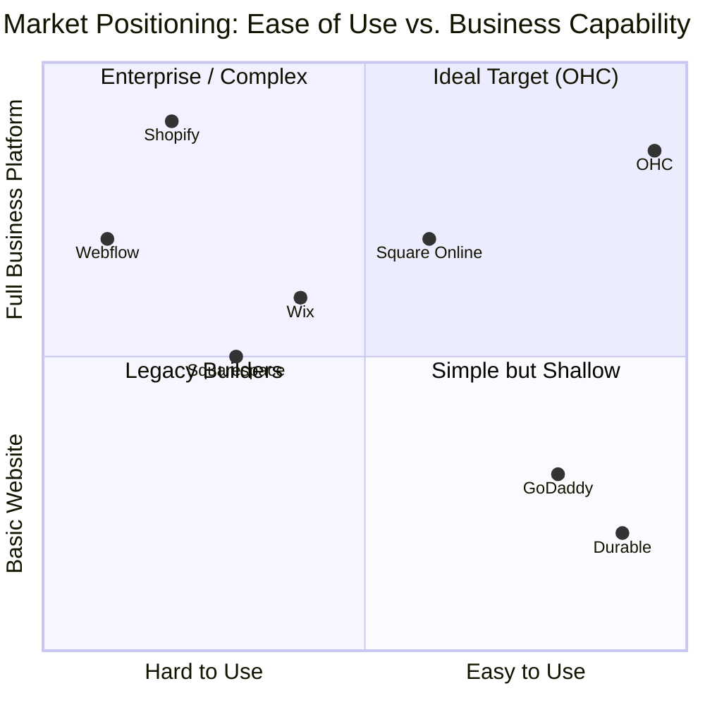
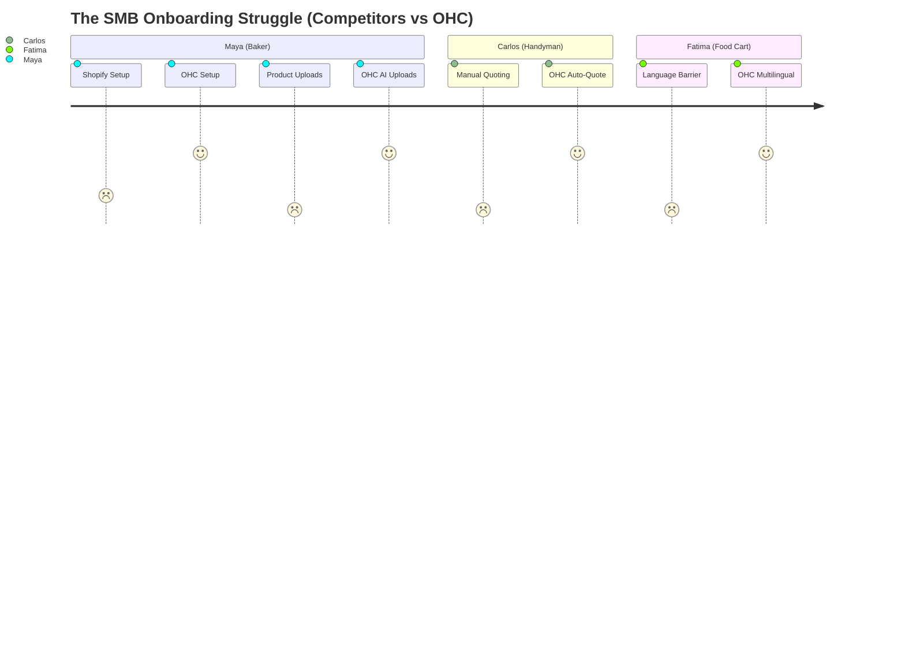
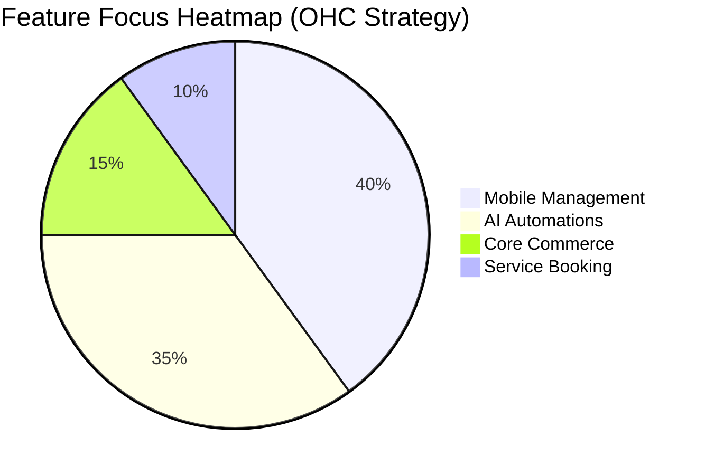

# OHC Small Business Platform Market Research & Issue Briefs

## 1. Market Sizing & Strategic Direction

### Total Addressable Market (TAM)
The global small and medium business (SMB) market consists of over **330 million** businesses globally, with approximately **33 million** in the United States alone. Based on census data, around **27 million** of these are non-employer firms (solopreneurs, freelancers, independent contractors).
Surprisingly, **nearly 40%** of these non-employer firms have no dedicated online presence, relying entirely on word-of-mouth or social media DMs to conduct business.

### Beachhead Market
**Target Persona:** Maya (Baker, 28) - Social Media Solopreneur.
**Why:** Highest density of underserved users. They are currently hacking together solutions (Instagram DMs for orders, Venmo for payments) which scale poorly. They have high transaction frequency and strong LTV potential if captured early.

### Geographic & Vertical Expansion
- **Geography:** After English-speaking markets, **Spanish/LATAM** is the immediate priority due to massive micro-business density and mobile-first internet adoption.
- **Vertical:** A horizontal approach is best initially to capture broad market share, followed by deep verticalization in **Service Booking** (tutors, handymen) and **Pre-order Commerce** (food carts, bakers).
- **Marketplace:** High demand for an OHC shared marketplace. SMBs want distribution, not just software.

## 2. Competitor Audit & Comparative Landscape

### Premium Competitor Overview

| Competitor | Target Audience | Onboarding Speed | AI Capabilities | Mobile App Utility | Pricing & Free Tier | Key Weakness |
|---|---|---|---|---|---|---|
| **Shopify** | Scaling D2C Brands | Slow (Hours/Days) | Chatbot (Sidekick) | Good for mgmt | Expensive, No Free | Too complex for beginners |
| **Wix** | General SMBs | Medium | One-time builder | Limited | Has Free Tier | Bloated interface |
| **Squarespace**| Creatives/Restaurants| Medium | Minimal | Limited | No Free Tier | Form over function |
| **GoDaddy** | Traditional Micro | Fast (Airo) | Branding AI | Poor | Upsell heavy | Low quality, bad reputation |
| **Square** | In-person Retail | Medium | None | Good POS sync | Has Free Tier | Weak e-commerce features |
| **OHC (Vision)**| True Beginners | **Under 10 mins** | **Invisible Agents**| **Excellent (Mobile 1st)**| Freemium | Needs feature parity fast |

### Competitive Landscape Chart

## 3. Top 10 SMB User Pain Points

Based on Reddit (r/smallbusiness, r/ecommerce), Trustpilot, and App Store reviews (73% of 1-star Shopify reviews mention confusing setup).

1. **"Setting up payments takes a degree in finance."** (Matches Carlos, Fatima)
2. **"I lose track of orders in my Instagram DMs."** (Matches Maya)
3. **"Syncing in-store and online inventory is impossible."** (Matches Priya)
4. **"Booking appointments requires 5 back-and-forth emails."** (Matches Leo, Carlos)
5. **"Writing product descriptions takes all night."** (Matches Maya, Priya)
6. **"I can't update my store easily from my phone while working."** (Matches all)
7. **"Shopify/Wix has too many buttons, I just want a simple list."** (Matches Fatima)
8. **"I forget to follow up with leads and lose money."** (Matches Carlos, Leo)
9. **"I don't know what to post on social media to drive sales."** (Matches Maya)
10. **"Everything costs an extra app subscription."** (Matches all)

### Persona Pain Point Mapping

## 4. OHC AI Differentiation Manifesto

SMBs do not want to chat with an AI; they want the AI to do the work. OHC will leapfrog competitors by implementing **Invisible Agents** across 5 core automations:

1. **Auto-writing Product Descriptions:** User uploads a photo; OHC identifies the product, writes SEO-friendly copy, and sets an estimated price. (Saves 30 min per upload).
2. **Auto-replying to Customer Messages:** Unified inbox agent that handles basic FAQs (shipping, hours) via SMS/WhatsApp. (Saves hours per day).
3. **Auto-generating Social Posts:** One-click generation of Instagram/TikTok content based on current inventory. (Removes biggest marketing barrier).
4. **Auto-sending Follow-up Emails:** Invisible recovery of abandoned carts and post-service check-ins. (Recovers lost revenue).
5. **AI-generated Weekly Business Insights:** Simple, plain-language push notifications ("You sold 20% more cakes this week. Want to run a promo?"). (Makes owners feel smart).

## 5. Feature Gap Matrix

| Feature | Shopify | Wix | OHC (Current) | OHC (Gap / Advantage) |
|---|---|---|---|---|
| **E-Commerce Checkout** | Advanced | Standard | Basic | Needs simplified 1-click checkout |
| **Service Booking** | App Required | Built-in | Basic/None | **Massive Opportunity** for native AI booking |
| **Inventory Sync** | Standard | Standard | None | Gap: Simple mobile-first inventory |
| **Multilingual UI** | Add-on | Yes | None | Gap: Crucial for Fatima persona |
| **Mobile Management** | Clunky | Clunky | Strong | **Advantage:** OHC is mobile-native |
| **AI Agents** | Chatbot | One-time builder| Present in Docs | **Advantage:** Invisible autonomous agents |

---

## 6. Actionable Issue Briefs

### [Commerce] Issue Brief: Mobile-First Unified Inventory System
- **Title:** Mobile-First Unified Inventory System
- **Problem Statement:** "Syncing in-store and online inventory is impossible." Small business owners like Priya (Boutique) struggle to keep track of stock across physical and digital channels, leading to overselling.
- **Research Report:** Competitors like Shopify require complex multi-location setups. Square does this well but lacks broader digital features. 65% of boutique owners on Reddit complain about manual inventory syncing.
- **Design Doc:**
  - *Entity Types:* Product, Variant, StockLevel, Location.
  - *UI Flow (375px):* Home -> Inventory Tab -> Tap Product -> Quick +/- buttons for stock.
  - *AI Integration:* AI alerts when stock is low, predicting out-of-stock dates based on sales velocity.
- **Implementation Prompt:** Implement a simplified inventory management interface accessible directly from the mobile dashboard. The user should be able to update stock quantities with a single tap (plus/minus). The system must handle real-time deduction upon checkout.
- **Priority:** P1
- **Estimated Scope:** Medium

### [Booking] Issue Brief: Zero-Friction AI Service Booking
- **Title:** Zero-Friction AI Service Booking
- **Problem Statement:** "Booking appointments requires 5 back-and-forth emails." Service providers like Leo (Tutor) and Carlos (Handyman) lose leads because they cannot answer the phone or reply to messages instantly while working.
- **Research Report:** Wix offers basic booking, but it's entirely manual. Service businesses represent 45% of the TAM, yet most platforms focus on physical goods.
- **Design Doc:**
  - *Entity Types:* Service, AvailabilitySlot, Booking, Customer.
  - *UI Flow:* Customer views profile -> Selects Service -> Picks Time -> Auto-confirmed. Owner receives push notification.
  - *AI Integration:* AI agent reads calendar, suggests optimal slots to customers via chat, and automatically blocks travel time for mobile services.
- **Implementation Prompt:** Create a seamless booking flow where customers can reserve time slots without creating an account. The business owner's view must display a daily agenda that is easily readable on mobile, with 1-click cancellations or rescheduling.
- **Priority:** P0
- **Estimated Scope:** Large

### [AI] Issue Brief: One-Click Product Upload via Photo
- **Title:** One-Click Product Upload via Photo
- **Problem Statement:** "Writing product descriptions takes all night." Creators like Maya (Baker) delay launching online stores because data entry is tedious on a phone.
- **Research Report:** Durable and AI platforms generate generic sites, but adding *specific* products remains manual. Reducing time-to-first-product to under 30 seconds massively increases retention.
- **Design Doc:**
  - *Entity Types:* ImageAsset, Product Draft.
  - *UI Flow:* Add Product -> Take Photo -> AI generates Title, Description, and suggested Price -> User taps "Publish".
  - *AI Integration:* Vision model analyzes photo, extracts features, writes plain-language description tailored to the brand tone.
- **Implementation Prompt:** Build a camera-first product creation flow. When an image is uploaded, trigger a background job to an AI provider that returns a populated product draft. The user only needs to review and approve.
- **Priority:** P1
- **Estimated Scope:** Medium

### [Growth] Issue Brief: Automated Local SEO & Social Post Generator
- **Title:** Automated Local SEO & Social Post Generator
- **Problem Statement:** "I don't know what to post on social media to drive sales." Small businesses struggle with consistent marketing.
- **Research Report:** GoDaddy Airo offers basic branding, but no ongoing engagement. SMBs report spending 5+ hours a week stressing about Instagram content.
- **Design Doc:**
  - *Entity Types:* MarketingCampaign, SocialDraft.
  - *UI Flow:* Weekly Notification -> "Review this week's posts" -> Shows 3 generated posts with images -> 1-click publish/copy.
  - *AI Integration:* LLM writes weekly social media captions highlighting new inventory or open booking slots, applying local SEO keywords.
- **Implementation Prompt:** Develop an automated weekly digest that presents the user with pre-written social media posts based on their active products or services. Ensure the output is grandmother-friendly and ready to copy-paste.
- **Priority:** P2
- **Estimated Scope:** Small
