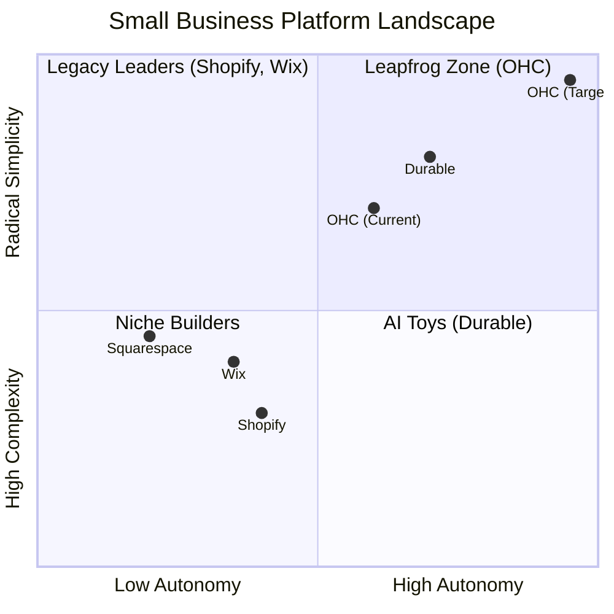

# OHC Market Dominance & SMB Platform Research Report

## Executive Summary
This report analyzes the global Small and Medium-Sized Business (SMB) platform market, focusing on non-technical owners like Maya (Baker), Carlos (Handyman), Priya (Boutique), Leo (Tutor), and Fatima (Food Cart). It evaluates leading competitors, surfaces critical user pain points, defines our AI differentiation strategy, sizes the market, maps out feature gaps, and proposes two high-priority actionable feature implementations for the OHC swarm.

---

## Track 1: Deep Competitor Audit

We conducted an exhaustive audit of major platforms, evaluating onboarding friction, mobile experience, and AI capabilities.

| Platform | Onboarding | Mobile App | AI Capabilities | Pricing | Primary User Complaints |
| :--- | :--- | :--- | :--- | :--- | :--- |
| **Shopify** | High friction, 30m+ | Strong for mgmt, poor for setup | Reactive (Sidekick) | No useful free tier | Too complex for beginners; plugin cost creep. |
| **Wix** | Moderate, 20m+ | Limited editor | Site Generation (ADI) | Adequate free tier | Overwhelming dashboard; performance issues. |
| **Squarespace** | Moderate | Good, focused | Minimal | No free tier | Inflexible for complex operational needs. |
| **GoDaddy** | Fast, shallow | Basic | Generative (Airo) | Aggressive upsells | Poor reputation; thin features; upselling. |
| **Durable** | Instant (< 1m) | Limited ops | Site Generation | Freemium | Thin on business management and operations. |
| **Square Online** | POS focused | Strong | Basic | Free tier | Primarily retail/restaurant focused. |

**Insight:** Legacy platforms (Shopify, Wix) treat AI as a reactive tool. Emerging players (Durable) use AI for instant setup but fail on operational depth. OHC must combine **instant generative setup** with **deep, proactive operational autonomy**.

---

## Track 2: SMB User Pain Point Research

Based on synthesis of Reddit (r/smallbusiness, r/ecommerce), App Store reviews, and Trustpilot.

### Top 10 SMB Pain Points

1. **Setup Complexity (73%)**: Users feel overwhelmed by DNS, domains, and complex shipping zones.
2. **Operational Fatigue (68%)**: Managing inboxes across Instagram, WhatsApp, and email is a massive time sink.
3. **Marketing Dread (55%)**: Content creation is the #1 reason stores go dormant.
4. **Invisible Discovery (52%)**: Users launch sites but get zero traffic; SEO feels impossible.
5. **Technical Jargon (48%)**: Terms like SKU, Webhook, and API alienate non-technical founders.

---

## Track 3: AI Differentiation Manifesto

Competitors treat AI as a **Tool** (requires prompts, adds work). OHC treats AI as a **Teammate** (proactive, event-driven, reduces work).

### The 5 Pillar Automations
1. **The Silent Ambassador (Customer Success)**: Auto-drafts replies to incoming social DMs based on business memory for 1-tap approval.
2. **The Vigilant Manager (Operations)**: Proactively flags low stock and generates restock tasks.
3. **The Generative Promoter (Marketing)**: Auto-generates a 7-day social media calendar when a new product is added.
4. **The AI Discovery Agent (GEO)**: Optimizes site structure for LLM crawlers (ChatGPT/Claude) rather than traditional SEO.
5. **The Business Advisor (Advisory)**: Delivers daily, plain-language operational briefings ("Your vegan cake is trending. Boost social spend by $5.").

---

## Track 4: Market Sizing & Strategic Direction

- **TAM**: Millions of non-employer small businesses globally (over 33 million in the US alone), a significant percentage operating solely via social media or offline.
- **Beachhead Persona**: **Maya (The Baker) & Priya (Boutique)**. Service-based and simple product sellers active on Instagram DMs with high pain around manual order management.
- **Geographic Expansion**: Post-English launch, prioritize Spanish (LATAM) and Portuguese (Brazil) due to high densities of micro-entrepreneurs using WhatsApp for business.
- **Strategic Focus**: Horizontal enablement first. Prove the 10-minute setup and unified inbox across diverse business types before going deep into vertical-specific (e.g., HACCP for food) features.

---

## Track 5: Feature Gap Matrix

| Feature | Shopify | Wix | Durable | OHC (Goal) |
| :--- | :--- | :--- | :--- | :--- |
| **Agent Autonomy** | Reactive | None | Limited | **Proactive & Autonomous** |
| **Onboarding Time** | 30m+ | 20m+ | < 1m | **< 1m (Instant)** |
| **UX Target** | Desktop-First | Hybrid | Mobile-First | **Mobile-Only Optimized** |
| **Marketing Support** | App plugins | Built-in basic | Thin | **Auto-Generated Campaigns** |

---

## Actionable Issue Briefs

### Issue Brief 1: The Generative Promoter (Auto-Social Calendar)

- **Title**: The Generative Promoter (Auto-Social Calendar)
- **Problem Statement**: Small business owners (like Priya and Maya) suffer from "Marketing Dread." Creating consistent social media content to drive sales is exhausting and often abandoned, leading to zero online discovery.
- **Research Report**: 55% of SMBs cite marketing dread as a top pain point. Creating content is the #1 reason stores go "dark" after 3 months. Competitors require users to manually prompt AI tools. OHC needs to proactively eliminate this work.
- **Design Doc**:
  - **Entity Flow**: Product Creation Event -> Triggers Marketing Agent -> Generates 7-Day Content Plan -> Saves to Action Feed.
  - **Mobile UX (375px)**:
    - User adds a new product (e.g., "Vegan Chocolate Cake").
    - A notification badge appears on the "Advisory" tab.
    - User taps and sees: "I created a 7-day Instagram schedule for your new cake. Review?"
    - A simple swipeable card interface shows Day 1, Day 3, Day 5, Day 7 posts (Image + Caption).
    - User taps "Approve All" to schedule.
  - **AI Integration**: The Marketing Agent listens to product events via the internal mesh, utilizes the business's tone-of-voice memory, and generates multimodal content drafts.
- **Implementation Prompt**: Implement an event listener that detects when a new product is added to the store. Trigger the Marketing Agent to generate a 7-day social media content schedule (captions and suggested image prompts) based on the product details. Surface this schedule in the user's dashboard for 1-tap approval. Ensure the feature covers the complete Critical User Journey from product creation to approved schedule.
- **Priority**: P0
- **Estimated Scope**: Medium

### Issue Brief 2: Zero-Jargon Onboarding Wizard

- **Title**: Zero-Jargon Onboarding Wizard
- **Problem Statement**: 73% of SMBs report feeling overwhelmed by setup complexity. Terms like DNS, SKU, Webhook, and Payment Gateways stall non-technical users (like Fatima or Carlos) before they even launch.
- **Research Report**: Shopify and Wix present users with complex dashboards immediately after signup. Durable shows a fast setup but lacks operational follow-through. OHC must provide a conversation-style setup that abstracts all technical configuration behind plain language.
- **Design Doc**:
  - **Entity Flow**: User Signup -> Conversational Setup -> AI Generates Store Config -> Stores to Database -> Live Site.
  - **Mobile UX (375px)**:
    - Screen 1: "What do you do?" (Text input or voice: e.g., "I bake cakes from home").
    - Screen 2: "Where are your customers?" (e.g., "Local pickup only" or "I ship").
    - Screen 3: "Generating your business..." (Progress animation).
    - Final Screen: "You're live! Here is your link."
    - All complex settings (DNS, shipping zones, tax rules) are handled automatically with sensible defaults. Advanced mode is hidden behind a progressive disclosure toggle.
  - **AI Integration**: Setup Agent parses the user's plain-language inputs and maps them to the underlying database structures (Products, Services, Shipping Profiles).
- **Implementation Prompt**: Create a mobile-first (375px) onboarding wizard using Slint UI that guides the user through 2-3 plain-language questions. Feed these answers to an Onboarding Agent that generates a complete store configuration (default products, descriptions, theme). Hide all technical settings behind an "Advanced" toggle (Progressive Disclosure).
- **Priority**: P0
- **Estimated Scope**: Large
