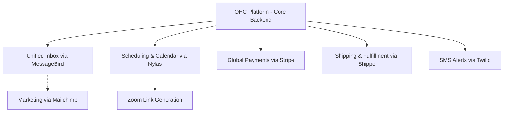

# 🔍 Scout: Tool Integration Research Q3

## Persona-Specific Pain Point Summaries
- **Maya (Home Baker, 28):** Needs to handle Instagram DMs efficiently, schedule custom orders, process pre-payments without technical overhead.
- **Carlos (Handyman, 42):** Misses calls while on the job, needs automated quote generation, and reliable scheduling.
- **Priya (Boutique Owner, 35):** Requires in-store/online inventory syncing, POS hardware, and email marketing for new arrivals.
- **Leo (Music Tutor, 22):** Misses student bookings, struggles with manual Zoom link generation, and needs subscription billing.
- **Fatima (Food Cart Operator, 50):** Requires multi-language ordering and simple SMS pickup notifications on a low-end phone.

## Premium Mermaid.js Charts

## Comparative Tables

### Communication & Marketing Tools
| Category | Evaluated Tool | Pros | Cons |
|----------|----------------|------|------|
| Social Media DMs | **MessageBird** | Unified API for WhatsApp, Instagram | Higher learning curve for small scale |
| SMS/WhatsApp | **Twilio** | Extreme reliability, <500ms latency, global scale | Complex initial setup |
| SMS/Voice | **Plivo** | Cost-effective, easy API | Fewer out-of-box SaaS workflow features |
| Email Marketing | **Mailchimp** | Beautiful templates, generative AI tools | Can get expensive at high contact tiers |

### Operations & Scheduling Tools
| Category | Evaluated Tool | Pros | Cons |
|----------|----------------|------|------|
| Calendar Sync | **Nylas** | Deep integration, 250+ providers, white-label | Requires backend development effort |
| Calendar | **Calendly** | Industry standard, great UX | Limited white-labeling |
| Shipping | **Shippo** | 40+ global carriers, huge discounts | - |
| Payments | **Stripe** | Comprehensive billing, POS, Connect | Broad feature set can be overwhelming |

---

## 1. Social Media Integration
### Title: Implement Unified Inbox via MessageBird API
**Problem Statement:** Users like Maya (Baker) manage orders across Instagram, WhatsApp, and email, leading to missed messages and lost revenue. A unified inbox is needed.
**Research Report:** MessageBird (Bird AI) provides robust APIs for Email, SMS, and WhatsApp marketing and unified messaging. It allows businesses to handle Omni-channel communication seamlessly. It's a strong fit for Maya's Instagram DMs and WhatsApp inquiries.
**Design Doc:** Integrate MessageBird API with the OHC backend. Webhooks from MessageBird will alert the OHC backend of new messages. The frontend will present a unified "Inbox" UI for the user aggregating all channels. "The Ambassador" AI agent will draft replies within this interface.
**Implementation Prompt:** Add a unified inbox view in the Flutter app that shows messages from Instagram and WhatsApp via MessageBird. Users should be able to reply directly from the app. Include AI-drafted responses.
**Priority:** P0
**Estimated Scope:** Large

## 2. Calendar & Scheduling
### Title: Integrate Nylas for Calendar Sync and Meeting Generation
**Problem Statement:** Leo (Tutor) and Carlos (Handyman) need reliable booking systems that sync with their personal Google/Outlook calendars to avoid double booking.
**Research Report:** Nylas offers powerful Email, Calendar, and Contacts APIs. Calendly provides a great standalone service, but Nylas allows deep, invisible integration (white-label) directly into the OHC platform. Nylas supports 250+ providers.
**Design Doc:** Integrate Nylas Calendar API. Users securely connect their calendar accounts via OAuth. When a customer books a time through the public storefront, the system automatically checks availability and creates an event on the business owner's personal calendar.
**Implementation Prompt:** Build a booking flow where a customer selects a time slot. Use Nylas to check the business owner's availability and create calendar events upon booking.
**Priority:** P0
**Estimated Scope:** Medium

## 3. Email Marketing
### Title: Embed Email Campaigns with Mailchimp
**Problem Statement:** Priya (Boutique Owner) wants to automatically email past customers when new stock arrives, but finds enterprise marketing tools too complex.
**Research Report:** Mailchimp offers accessible email marketing and automations. It has an extensive API for transactional and marketing emails. It provides beautiful templates and AI content creation tools.
**Design Doc:** Sync the business's customer list to Mailchimp. Automatically trigger email campaigns and customer journeys when the business owner adds new inventory to their storefront.
**Implementation Prompt:** Implement a "Marketing" tab where users can design and send email campaigns. Sync OHC contacts to Mailchimp and provide a UI to trigger predefined email blasts.
**Priority:** P1
**Estimated Scope:** Medium

## 4. Payment Processing
### Title: Standardize on Stripe for Global Payments and POS
**Problem Statement:** All personas need to accept payments online (Maya, Leo) or in-person (Priya, Fatima).
**Research Report:** Stripe is the backbone of global commerce, supporting 135+ currencies, online checkout, Billing (subscriptions for Leo), and Terminal (in-person POS for Priya). It also offers Connect for multi-tenant SaaS.
**Design Doc:** Deepen Stripe integration using Stripe Connect. Enable Stripe Connect to handle onboarding and compliance. Integrate Terminal support to allow physical tap-to-pay via the mobile app, alongside seamless online checkout.
**Implementation Prompt:** Upgrade the payment flow to use Stripe Connect. Add support for Stripe Terminal in the Flutter mobile app so users can take tap-to-pay in-person.
**Priority:** P0
**Estimated Scope:** Large

## 5. Shipping & Logistics
### Title: Streamline Fulfillment with Shippo
**Problem Statement:** Priya (Boutique) needs to ship physical products across the country affordably without leaving the app.
**Research Report:** Shippo provides shipping rates from 40+ global carriers, label printing, and tracking. It saves up to 90% on shipping rates. It has an easy-to-use API.
**Design Doc:** When an order is placed, present real-time shipping rates. Provide a simple workflow in the Operations dashboard for the user to purchase and immediately print a shipping label.
**Implementation Prompt:** Add a shipping management section to orders. Allow the user to view shipping rates, purchase a label, and print the Shippo-generated PDF from their phone.
**Priority:** P1
**Estimated Scope:** Medium

## 6. SMS & Notifications
### Title: Implement Reliable SMS via Twilio
**Problem Statement:** Fatima (Food Cart) and her customers need instant, reliable SMS alerts for order readiness, as she doesn't use email while operating her cart.
**Research Report:** Twilio is the industry leader for programmable SMS and Voice, offering 99.99% uptime and <500ms latency globally. Plivo is also a strong alternative, but Twilio's extensive docs and enterprise scale make it the top choice.
**Design Doc:** Integrate a unified messaging service. Automatically trigger SMS dispatches for critical order status updates (like "Ready for Pickup") to keep customers informed without requiring internet access.
**Implementation Prompt:** Add automated SMS notifications to the order flow. When an order status changes to "Ready for Pickup", use Twilio to text the customer.
**Priority:** P0
**Estimated Scope:** Small

## 7. Video Conferencing
### Title: Automate Meeting Links with Zoom API
**Problem Statement:** Leo (Tutor) spends too much time manually creating and emailing Zoom links for every lesson he books.
**Research Report:** Zoom has a dominant market share and offers robust APIs for meeting creation. Nylas also supports Zoom integration, but direct Zoom API might offer more control for Webinar/Education features.
**Design Doc:** Automatically generate and attach meeting links to service bookings. The link should be included in confirmation emails and calendar events sent to both the student and the tutor.
**Implementation Prompt:** Modify the service booking flow so that if the service is "Virtual", a Zoom link is automatically generated and attached to the booking confirmation email and calendar event.
**Priority:** P1
**Estimated Scope:** Small

## Specific Actionable Recommendations
1. **Adopt Nylas for comprehensive sync:** Instead of managing separate APIs for Google, Outlook, and Zoom, Nylas can handle Email, Calendar, and Conferencing sync through a single unified API, significantly reducing backend complexity.
2. **Standardize on Stripe Connect:** For multi-tenant isolation, immediately migrate to Stripe Connect Express accounts to handle compliance, payouts, and POS seamlessly.
3. **Use Twilio for low-latency alerts:** Fatima's food cart relies on instant notifications. Twilio provides the best reliability for these time-sensitive SMS alerts.
