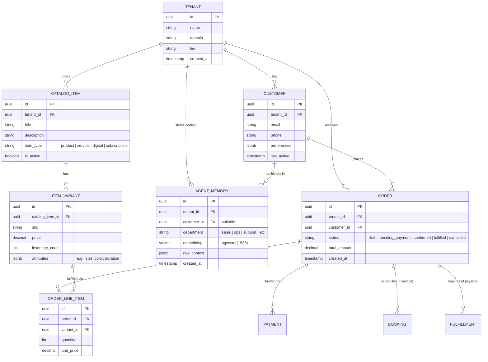

# [architecture] Core Platform Data Model Architecture

## Problem Statement
Small business owners coming to OneHumanCorp (OHC) need a platform that "just works" out of the box, regardless of whether they sell custom cakes, hourly handyman services, or digital downloads. Currently, typical SaaS data models either over-index on generic EAV (Entity-Attribute-Value) anti-patterns that perform poorly at scale, or are too rigidly coupled to a single vertical (e.g., e-commerce only). OHC requires a highly extensible, multi-tenant data model that natively supports hybrid business operations (products + services + subscriptions) while ensuring strict tenant isolation and performant AI context retrieval. The data model must seamlessly bridge standard relational operations and the embedded vector memory required by the AI agent departments.

## Research Report
An analysis of competitor data models (Shopify, Wix, Squarespace) reveals significant friction points when users attempt hybrid business models:
- **Shopify:** Heavily biased towards physical/digital products. Booking a service or managing a subscription requires complex, often conflicting third-party apps with disjointed data schemas.
- **Wix/Squarespace:** Offer fragmented data stores for different modules (Store vs. Bookings vs. Events), leading to unified customer profiles being difficult or impossible to maintain without manual syncing.
- **OHC Opportunity:** By designing a unified primitive system (e.g., `PurchasableItem` encompassing both goods and services) and centralizing the `CustomerProfile`, OHC can provide a truly holistic view. Furthermore, unlike competitors, OHC's data model must treat AI Agent memory (pgvector embeddings) as a first-class citizen linked directly to tenant entities, rather than as an isolated afterthought.

## Design Doc

### Architecture Diagram (ERD)

### Key Design Decisions and Invariants
1. **Strict Multi-Tenancy via RLS:** Every table (except system-wide global configs) MUST include a `tenant_id` column. PostgreSQL Row-Level Security (RLS) policies will enforce isolation: `CREATE POLICY tenant_isolation_policy ON table_name USING (tenant_id = current_setting('app.current_tenant')::uuid);`. A business owner can *only* see their own tenant's data.
2. **Unified Catalog Primitive:** Instead of separate tables for "Products" and "Services", the `CATALOG_ITEM` entity uses an `item_type` discriminator. This allows a single shopping cart (`ORDER`) to seamlessly contain a physical custom cake, a delivery fee (service), and a monthly consultation subscription.
3. **Agent Memory Integration:** `AGENT_MEMORY` is a core entity, directly linked to `TENANT` and optionally `CUSTOMER`. This allows the Customer Success agent to quickly query all past interactions (via vector similarity search on the `embedding` column) filtered strictly to the current customer, ensuring highly contextual and safe AI responses.
4. **JSONB for Extensibility:** While core relational integrity is maintained, columns like `preferences` on `CUSTOMER` and `attributes` on `ITEM_VARIANT` use `jsonb`. This allows the UI to define custom fields without requiring expensive database schema migrations, catering to the diverse needs of different business types.
5. **Idempotency and Consistency:** Key state transitions (Orders, Payments) rely on strict state machines enforced at the database level using constraints and triggers to prevent double-booking or double-charging.

### UI Wireframes & Mobile UX Flow
**Target Persona:** Priya (Boutique Owner)
- **Screen 1: Unified Catalog Management (375px)**
  - A glassmorphic list view displaying all offerings.
  - A floating action button (FAB) "+" opens a bottom sheet.
  - Options: "Add Physical Product", "Add Service", "Add Digital Download".
- **Screen 2: Add Product Variant Flow**
  - Native mobile inputs.
  - Form fields: Title, Base Price.
  - "Add Variant" button expands inline: inputs for Size (S/M/L) and Color, automatically generating sub-SKUs.
  - **UX Detail:** AI Agent (The Manager) proactively suggests pricing based on historical data or similar items in the platform (anonymized).
- **Screen 3: Customer Profile View**
  - Consolidates all history: Total Spent, Recent Orders (spanning physical and services).
  - A prominent "AI Insights" card at the top summarizing the customer's sentiment and preferences based on `AGENT_MEMORY` (e.g., "Usually prefers weekend delivery").

### AI Integration Points
- **Retrieval-Augmented Generation (RAG):** AI agents (like The Ambassador) use the `AGENT_MEMORY` table coupled with the `CUSTOMER` profile to draft personalized replies. The query is scoped to `tenant_id` and `customer_id`.
- **Proactive Insights (The Advisor):** A background worker periodically aggregates `ORDER` and `CATALOG_ITEM` data, running analytics to generate weekly health reports. These insights are inserted into `AGENT_MEMORY` to inform future interactions.
- **Data Entry Automation:** When an owner uploads a picture of a new menu item, the AI extracts the title, description, and price, automatically populating the `CATALOG_ITEM` and `ITEM_VARIANT` schemas, drafting the entry for approval.

### Migration Strategy
1. Introduce the core tables (`TENANT`, `CUSTOMER`, `CATALOG_ITEM`, `ORDER`) using a greenfield schema in the staging environment.
2. Implement the Go gRPC services to wrap these entities with RLS enforcement.
3. Migrate existing mock data or pilot users by mapping legacy structures to the new unified primitives.
4. Deploy the `pgvector` extension and establish the `AGENT_MEMORY` table, seeding it with initial synthetic data for testing agent retrieval.

## Implementation Prompt
**Task:** Implement the core database schema migrations and corresponding Go entity structs for the unified OHC Data Model.
**CUJ:** As the system, I need to instantiate a new tenant, create a hybrid catalog item (e.g., a physical product with variants), process an order containing that item for a specific customer, and securely store an AI interaction regarding that order in the agent memory table.
**Acceptance Criteria:**
- Write PostgreSQL migration files (using goose or equivalent) to create `tenant`, `customer`, `catalog_item`, `item_variant`, `order`, `order_line_item`, and `agent_memory` tables.
- All tables MUST include a `tenant_id` and enforce PostgreSQL Row-Level Security (RLS).
- The `agent_memory` table must utilize the `pgvector` extension for the `embedding` column.
- Create the corresponding Go structs in the `src/server/lib/models` (or appropriate) directory, including struct tags for ORM/DB mapping and JSON serialization.
- Write a unit test demonstrating the creation of an order with a unified catalog item, ensuring RLS constraints prevent cross-tenant data access.

## Priority
P0

## Estimated Scope
Large
