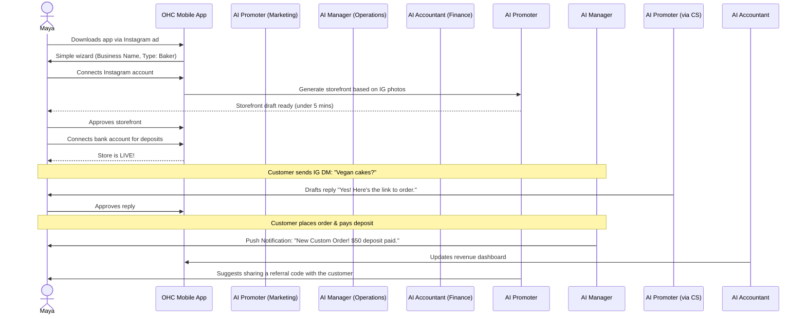
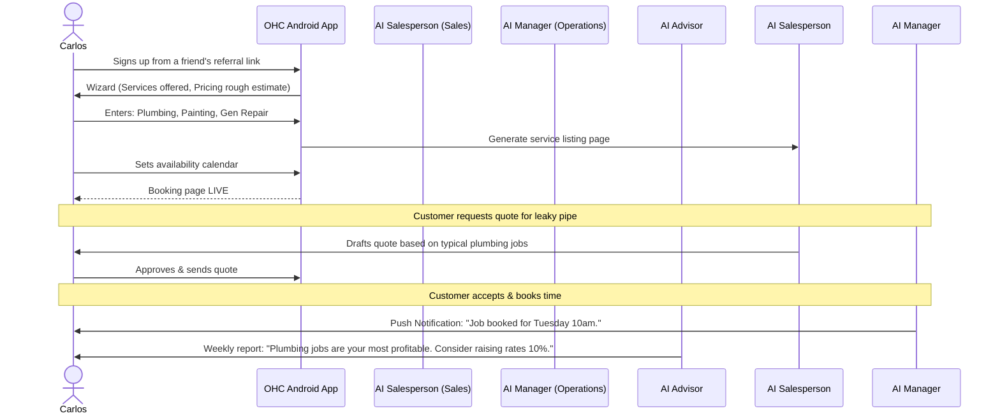
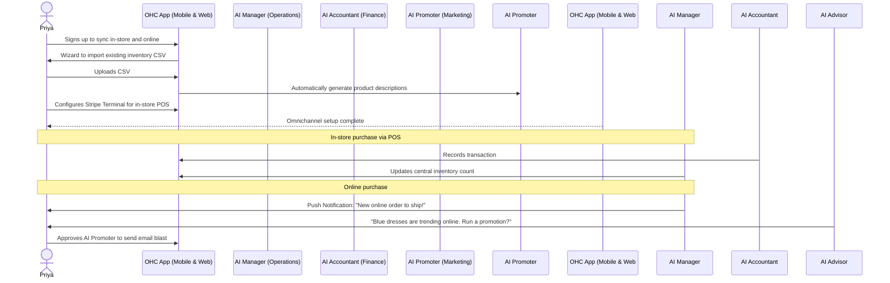
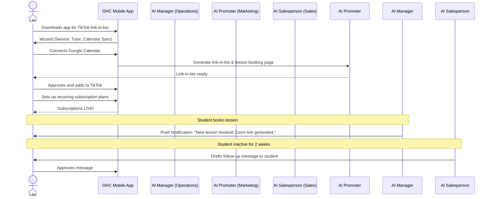
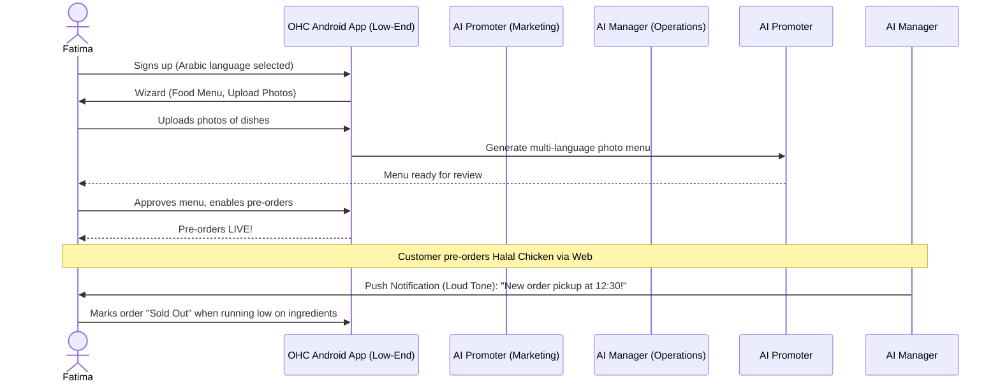

# [architecture] Business Journey Architecture for OneHumanCorp

## Problem Statement
Small business owners—whether they are a baker like Maya, a handyman like Carlos, or a boutique owner like Priya—need a frictionless path to start, run, and grow their businesses. Existing solutions are often fragmented and require significant technical knowledge. There is a need to clearly map out the end-to-end user journeys for these real personas across Acquisition, Onboarding, Activation, Retention, Revenue, and Referral, to identify friction points and ensure a cohesive, mobile-first experience powered by invisible AI agents.

## Research Report
Based on the OneHumanCorp product vision and real user personas, we have analyzed the business journeys for our key target demographics:
- **Maya (Home Baker, 28):** Mobile-first, Instagram-driven, needs simple booking and deposit payments.
- **Carlos (Freelance Handyman, 42):** Word-of-mouth, needs service listings, calendar booking, and quoting.
- **Priya (Boutique Owner, 35):** Omni-channel, needs inventory sync, POS, and analytics.
- **Leo (Music Tutor, 22):** Online/in-person, needs scheduling, recurring subscriptions, and a link-in-bio.
- **Fatima (Food Cart Operator, 50):** Low-end Android, limited English, needs simple pre-orders and notifications.

Competitor analysis (Shopify, Wix, Squarespace) shows that these platforms often require 30-60 minutes of setup and technical knowledge. OHC's goal is to reduce this to under 10 minutes with zero technical knowledge.

### Key Friction Points Identified
1. **Initial Setup Overwhelm:** Asking for too much information upfront during onboarding.
2. **Payment Configuration:** Setting up Stripe/payments is often complex.
3. **Mobile Management:** Existing platforms often have subpar mobile management experiences.
4. **Content Generation:** Writing descriptions and taking good photos is a barrier.

## Design Doc

### Business Journey Maps (Sequence Diagrams)

#### 1. Maya (The Home Baker)

#### 2. Carlos (The Freelance Handyman)

#### 3. Priya (The Boutique Owner)

#### 4. Leo (The Music Tutor)

#### 5. Fatima (The Food Cart Operator)

### UI Wireframes & Mobile UX Flow
**1. Home Dashboard (375px first):**
- **Top:** Glassmorphic card summarizing today's key metric (e.g., "$150 Revenue Today").
- **Middle (Action Queue):** A prominent list of tasks drafted by AI requiring review (e.g., "Draft reply to customer DM", "Review weekly report").
- **Bottom:** Quick actions (e.g., "Add Product", "New Booking").
- **UX Flow:** All actions are presented as simple conversational prompts. Tapping an action opens a focused screen.

**2. Draft Review Screen (375px first):**
- **Content:** The AI-generated draft (e.g., a quote or email) displayed clearly.
- **Actions:** Large, thumb-friendly buttons at the bottom: "Approve" (Primary), "Edit" (Secondary).
- **UX Flow:** Tapping "Approve" executes the action and triggers a micro-animation confirming success, returning to the Home Dashboard.

**3. Onboarding Wizard (375px first):**
- **Content:** One question per screen (e.g., "What type of business do you run?").
- **Actions:** Large selection buttons or simple text inputs.
- **UX Flow:** Progress bar at the top. Skips complex setup (like bank details) until the user sees their generated storefront, reducing drop-off.

### Key Design Decisions
1. **Deferred Onboarding:** Only ask for absolute minimums (Business Type, Name) to get a storefront draft. Defer complex tasks (bank linking, domain setup) until the user has experienced value (seeing their site).
2. **AI Content Generation:** Use the AI Promoter to auto-generate descriptions and sites based on social media or minimal input, lowering the barrier to entry.
3. **Mobile-First Notifications:** Retention is driven by high-value push notifications (new orders, drafts to review) on 375px screens.
4. **Actionable Advisory:** The Business Advisor provides plain-language, actionable insights to drive revenue and upgrades.

## Implementation Prompt
**Task:** Implement the unified deferred onboarding flow and core event routing for the AI Promoter.
**CUJ:** A new user (e.g., Maya) signs up on a mobile device, provides only their business type and connects an Instagram account. The system must immediately trigger the AI Promoter to generate a draft storefront and present it to the user. The user can then approve the draft and is guided to the next activation step (e.g., connecting a bank account).
**Acceptance Criteria:**
- Create the deferred onboarding data models in the database.
- Implement the integration with the AI Promoter to generate storefront drafts from minimal input.
- Develop the mobile-first UI for reviewing and approving the generated storefront.
- Ensure E2E tests cover the full flow from sign-up to storefront approval without mocking the network (AI model responses may be mocked).

## Priority
P0

## Estimated Scope
Medium
