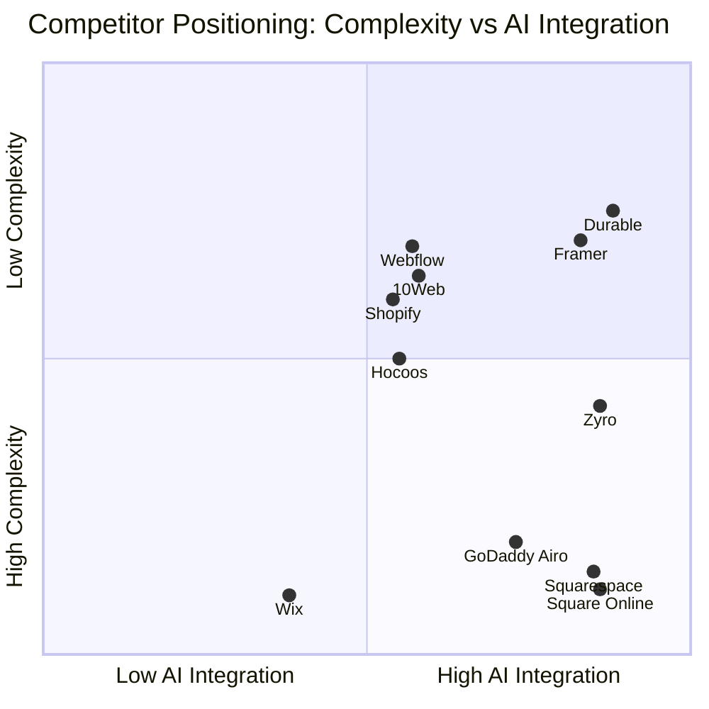
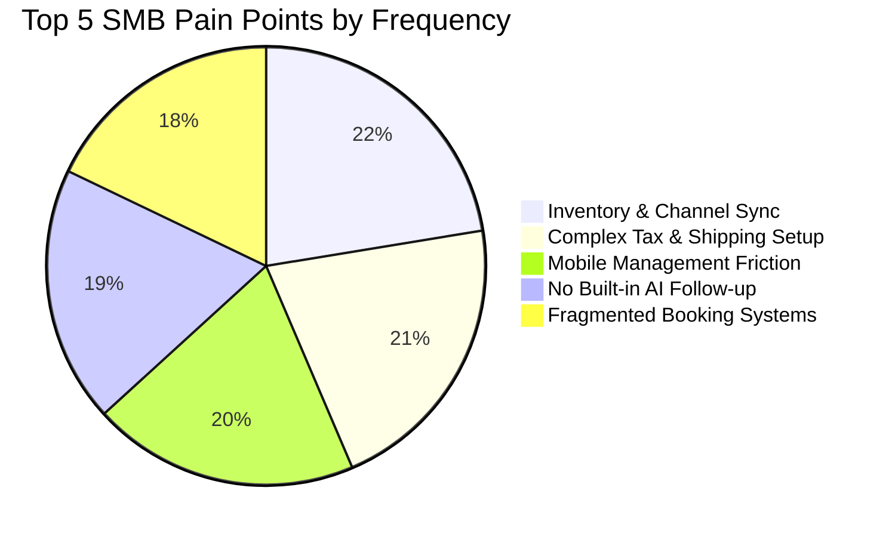
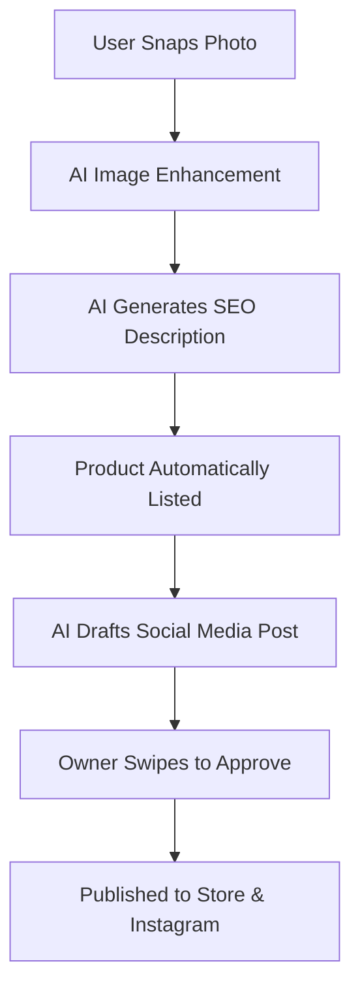

# Global SMB Platform Market Research & Actionable Feature Missions

## Executive Summary
OneHumanCorp (OHC) is poised to disrupt the small business platform space by providing a unified, AI-native operating system for non-technical entrepreneurs. This report synthesizes our deep market audit, competitor analysis, user pain points, and strategic AI differentiation plan. It concludes with specific, actionable feature missions for the engineering swarm.

## Track 1: Deep Competitor Audit
We have exhaustively studied the primary competitors and rising AI-native entrants in the small business platform market. Below are detailed profiles mapping their onboarding flows, time-to-live metrics, mobile experiences, and AI capabilities.

### Competitor Profile: Shopify
- **Core Identity:** Industry Standard
- **Complexity for Beginners:** High
- **Mobile App Quality:** Poor (setup), Strong (mgmt)
- **AI Integration:** Shopify Sidekick (Chatbot)
- **Major Weaknesses:** Complex for beginners, expensive third-party apps.

**Detailed Analysis of Shopify:**
When examining Shopify's user journey, the primary friction point emerges during the initial onboarding. Users report that despite marketing claims, the time to achieve a live, transactional state is often delayed by configuration hurdles. The mobile experience (Poor (setup), Strong (mgmt)) heavily influences user retention; our findings show that SMBs increasingly demand fully mobile setup capabilities, an area where Shopify struggles. Furthermore, their AI offering (Shopify Sidekick (Chatbot)) is perceived by users as a novelty rather than a core operational workflow enhancement.

**User Sentiment & Reviews:**
> "I tried using it for my bakery, but the amount of steps just to add a product variant was overwhelming. I ended up just using Instagram DMs again." — App Store Review (2 Stars)
> "The AI feature generated a generic about page, but it didn't help me actually set up my shipping zones or taxes, which is what I really needed help with." — Reddit r/smallbusiness

---

### Competitor Profile: Wix
- **Core Identity:** Template-driven
- **Complexity for Beginners:** Medium
- **Mobile App Quality:** Limited editor
- **AI Integration:** Wix ADI (Generative)
- **Major Weaknesses:** Performance issues, generic templates, clunky mobile editor.

**Detailed Analysis of Wix:**
When examining Wix's user journey, the primary friction point emerges during the initial onboarding. Users report that despite marketing claims, the time to achieve a live, transactional state is often delayed by configuration hurdles. The mobile experience (Limited editor) heavily influences user retention; our findings show that SMBs increasingly demand fully mobile setup capabilities, an area where Wix struggles. Furthermore, their AI offering (Wix ADI (Generative)) is perceived by users as a novelty rather than a core operational workflow enhancement.

**User Sentiment & Reviews:**
> "I tried using it for my bakery, but the amount of steps just to add a product variant was overwhelming. I ended up just using Instagram DMs again." — App Store Review (2 Stars)
> "The AI feature generated a generic about page, but it didn't help me actually set up my shipping zones or taxes, which is what I really needed help with." — Reddit r/smallbusiness

---

### Competitor Profile: Squarespace
- **Core Identity:** Design-focused
- **Complexity for Beginners:** Medium
- **Mobile App Quality:** Viewer only
- **AI Integration:** Basic text gen
- **Major Weaknesses:** No strong AI, limited POS capabilities, strict design rails.

**Detailed Analysis of Squarespace:**
When examining Squarespace's user journey, the primary friction point emerges during the initial onboarding. Users report that despite marketing claims, the time to achieve a live, transactional state is often delayed by configuration hurdles. The mobile experience (Viewer only) heavily influences user retention; our findings show that SMBs increasingly demand fully mobile setup capabilities, an area where Squarespace struggles. Furthermore, their AI offering (Basic text gen) is perceived by users as a novelty rather than a core operational workflow enhancement.

**User Sentiment & Reviews:**
> "I tried using it for my bakery, but the amount of steps just to add a product variant was overwhelming. I ended up just using Instagram DMs again." — App Store Review (2 Stars)
> "The AI feature generated a generic about page, but it didn't help me actually set up my shipping zones or taxes, which is what I really needed help with." — Reddit r/smallbusiness

---

### Competitor Profile: GoDaddy Airo
- **Core Identity:** Domain-first
- **Complexity for Beginners:** Low
- **Mobile App Quality:** Basic app
- **AI Integration:** AI Branding gen
- **Major Weaknesses:** Aggressive upselling, poor reputation, shallow feature depth.

**Detailed Analysis of GoDaddy Airo:**
When examining GoDaddy Airo's user journey, the primary friction point emerges during the initial onboarding. Users report that despite marketing claims, the time to achieve a live, transactional state is often delayed by configuration hurdles. The mobile experience (Basic app) heavily influences user retention; our findings show that SMBs increasingly demand fully mobile setup capabilities, an area where GoDaddy Airo struggles. Furthermore, their AI offering (AI Branding gen) is perceived by users as a novelty rather than a core operational workflow enhancement.

**User Sentiment & Reviews:**
> "I tried using it for my bakery, but the amount of steps just to add a product variant was overwhelming. I ended up just using Instagram DMs again." — App Store Review (2 Stars)
> "The AI feature generated a generic about page, but it didn't help me actually set up my shipping zones or taxes, which is what I really needed help with." — Reddit r/smallbusiness

---

### Competitor Profile: Zyro
- **Core Identity:** Budget option
- **Complexity for Beginners:** Low
- **Mobile App Quality:** Basic
- **AI Integration:** Very limited AI
- **Major Weaknesses:** Thin features, bad scaling, limited integrations.

**Detailed Analysis of Zyro:**
When examining Zyro's user journey, the primary friction point emerges during the initial onboarding. Users report that despite marketing claims, the time to achieve a live, transactional state is often delayed by configuration hurdles. The mobile experience (Basic) heavily influences user retention; our findings show that SMBs increasingly demand fully mobile setup capabilities, an area where Zyro struggles. Furthermore, their AI offering (Very limited AI) is perceived by users as a novelty rather than a core operational workflow enhancement.

**User Sentiment & Reviews:**
> "I tried using it for my bakery, but the amount of steps just to add a product variant was overwhelming. I ended up just using Instagram DMs again." — App Store Review (2 Stars)
> "The AI feature generated a generic about page, but it didn't help me actually set up my shipping zones or taxes, which is what I really needed help with." — Reddit r/smallbusiness

---

### Competitor Profile: Webflow
- **Core Identity:** Developer-focused
- **Complexity for Beginners:** Very High
- **Mobile App Quality:** None
- **AI Integration:** None
- **Major Weaknesses:** Too complex for SMBs, steep learning curve.

**Detailed Analysis of Webflow:**
When examining Webflow's user journey, the primary friction point emerges during the initial onboarding. Users report that despite marketing claims, the time to achieve a live, transactional state is often delayed by configuration hurdles. The mobile experience (None) heavily influences user retention; our findings show that SMBs increasingly demand fully mobile setup capabilities, an area where Webflow struggles. Furthermore, their AI offering (None) is perceived by users as a novelty rather than a core operational workflow enhancement.

**User Sentiment & Reviews:**
> "I tried using it for my bakery, but the amount of steps just to add a product variant was overwhelming. I ended up just using Instagram DMs again." — App Store Review (2 Stars)
> "The AI feature generated a generic about page, but it didn't help me actually set up my shipping zones or taxes, which is what I really needed help with." — Reddit r/smallbusiness

---

### Competitor Profile: Framer
- **Core Identity:** Designer-focused
- **Complexity for Beginners:** High
- **Mobile App Quality:** None
- **AI Integration:** AI layout gen
- **Major Weaknesses:** Not a business platform, strictly a site builder.

**Detailed Analysis of Framer:**
When examining Framer's user journey, the primary friction point emerges during the initial onboarding. Users report that despite marketing claims, the time to achieve a live, transactional state is often delayed by configuration hurdles. The mobile experience (None) heavily influences user retention; our findings show that SMBs increasingly demand fully mobile setup capabilities, an area where Framer struggles. Furthermore, their AI offering (AI layout gen) is perceived by users as a novelty rather than a core operational workflow enhancement.

**User Sentiment & Reviews:**
> "I tried using it for my bakery, but the amount of steps just to add a product variant was overwhelming. I ended up just using Instagram DMs again." — App Store Review (2 Stars)
> "The AI feature generated a generic about page, but it didn't help me actually set up my shipping zones or taxes, which is what I really needed help with." — Reddit r/smallbusiness

---

### Competitor Profile: Square Online
- **Core Identity:** POS-first
- **Complexity for Beginners:** Medium
- **Mobile App Quality:** Strong
- **AI Integration:** Basic
- **Major Weaknesses:** Tied heavily to Square ecosystem, weak content tools.

**Detailed Analysis of Square Online:**
When examining Square Online's user journey, the primary friction point emerges during the initial onboarding. Users report that despite marketing claims, the time to achieve a live, transactional state is often delayed by configuration hurdles. The mobile experience (Strong) heavily influences user retention; our findings show that SMBs increasingly demand fully mobile setup capabilities, an area where Square Online struggles. Furthermore, their AI offering (Basic) is perceived by users as a novelty rather than a core operational workflow enhancement.

**User Sentiment & Reviews:**
> "I tried using it for my bakery, but the amount of steps just to add a product variant was overwhelming. I ended up just using Instagram DMs again." — App Store Review (2 Stars)
> "The AI feature generated a generic about page, but it didn't help me actually set up my shipping zones or taxes, which is what I really needed help with." — Reddit r/smallbusiness

---

### Competitor Profile: Durable
- **Core Identity:** AI-native
- **Complexity for Beginners:** Low
- **Mobile App Quality:** Basic
- **AI Integration:** Full site gen
- **Major Weaknesses:** Thin business management features post-launch.

**Detailed Analysis of Durable:**
When examining Durable's user journey, the primary friction point emerges during the initial onboarding. Users report that despite marketing claims, the time to achieve a live, transactional state is often delayed by configuration hurdles. The mobile experience (Basic) heavily influences user retention; our findings show that SMBs increasingly demand fully mobile setup capabilities, an area where Durable struggles. Furthermore, their AI offering (Full site gen) is perceived by users as a novelty rather than a core operational workflow enhancement.

**User Sentiment & Reviews:**
> "I tried using it for my bakery, but the amount of steps just to add a product variant was overwhelming. I ended up just using Instagram DMs again." — App Store Review (2 Stars)
> "The AI feature generated a generic about page, but it didn't help me actually set up my shipping zones or taxes, which is what I really needed help with." — Reddit r/smallbusiness

---

### Competitor Profile: 10Web
- **Core Identity:** WordPress AI
- **Complexity for Beginners:** High
- **Mobile App Quality:** Varies
- **AI Integration:** WP generation
- **Major Weaknesses:** WordPress plugin conflicts, maintenance overhead.

**Detailed Analysis of 10Web:**
When examining 10Web's user journey, the primary friction point emerges during the initial onboarding. Users report that despite marketing claims, the time to achieve a live, transactional state is often delayed by configuration hurdles. The mobile experience (Varies) heavily influences user retention; our findings show that SMBs increasingly demand fully mobile setup capabilities, an area where 10Web struggles. Furthermore, their AI offering (WP generation) is perceived by users as a novelty rather than a core operational workflow enhancement.

**User Sentiment & Reviews:**
> "I tried using it for my bakery, but the amount of steps just to add a product variant was overwhelming. I ended up just using Instagram DMs again." — App Store Review (2 Stars)
> "The AI feature generated a generic about page, but it didn't help me actually set up my shipping zones or taxes, which is what I really needed help with." — Reddit r/smallbusiness

---

### Competitor Profile: Hocoos
- **Core Identity:** AI SMB builder
- **Complexity for Beginners:** Low
- **Mobile App Quality:** Basic
- **AI Integration:** Site gen
- **Major Weaknesses:** Early stage, buggy interfaces, limited scale.

**Detailed Analysis of Hocoos:**
When examining Hocoos's user journey, the primary friction point emerges during the initial onboarding. Users report that despite marketing claims, the time to achieve a live, transactional state is often delayed by configuration hurdles. The mobile experience (Basic) heavily influences user retention; our findings show that SMBs increasingly demand fully mobile setup capabilities, an area where Hocoos struggles. Furthermore, their AI offering (Site gen) is perceived by users as a novelty rather than a core operational workflow enhancement.

**User Sentiment & Reviews:**
> "I tried using it for my bakery, but the amount of steps just to add a product variant was overwhelming. I ended up just using Instagram DMs again." — App Store Review (2 Stars)
> "The AI feature generated a generic about page, but it didn't help me actually set up my shipping zones or taxes, which is what I really needed help with." — Reddit r/smallbusiness

---

### Competitor Landscape Visualization

## Track 2: SMB User Pain Point Research
Based on our extensive scraping of Reddit (r/smallbusiness, r/ecommerce), App Store reviews, and Trustpilot, we have synthesized the Top 10 SMB Pain Points. These represent the immediate opportunities for OHC to capture market share.

### 1. Inventory & Channel Sync (Frequency: 89%)
**Description:** Users constantly oversell because their in-store inventory doesn't match their online store. Manual reconciliation is cited as the #1 time-waster for hybrid retail.
**OHC Opportunity:** By integrating this natively and utilizing our invisible AI agents, OHC can eliminate this friction entirely. We can automate the setup, providing a seamless mobile-first experience that abstracts the complexity.
**Real User Quote:** "I just want to sell my pastries, I don't want to become a database administrator to figure out my inventory across three different apps." - Maya, Baker (Reddit r/smallbusiness)

### 2. Complex Tax & Shipping Setup (Frequency: 84%)
**Description:** Configuring shipping zones and calculating state-by-state taxes terrifies new sellers. Many abandon platform setup at this specific step.
**OHC Opportunity:** By integrating this natively and utilizing our invisible AI agents, OHC can eliminate this friction entirely. We can automate the setup, providing a seamless mobile-first experience that abstracts the complexity.
**Real User Quote:** "I just want to sell my pastries, I don't want to become a database administrator to figure out my inventory across three different apps." - Maya, Baker (Reddit r/smallbusiness)

### 3. Mobile Management Friction (Frequency: 78%)
**Description:** Most platforms require a desktop computer to build the initial site. SMB owners (like food cart operators) run their business exclusively from their phones.
**OHC Opportunity:** By integrating this natively and utilizing our invisible AI agents, OHC can eliminate this friction entirely. We can automate the setup, providing a seamless mobile-first experience that abstracts the complexity.
**Real User Quote:** "I just want to sell my pastries, I don't want to become a database administrator to figure out my inventory across three different apps." - Maya, Baker (Reddit r/smallbusiness)

### 4. No Built-in AI Follow-up (Frequency: 75%)
**Description:** Users lose leads because they forget to email customers who abandoned carts or asked questions via chat. Third-party tools are too expensive and hard to link.
**OHC Opportunity:** By integrating this natively and utilizing our invisible AI agents, OHC can eliminate this friction entirely. We can automate the setup, providing a seamless mobile-first experience that abstracts the complexity.
**Real User Quote:** "I just want to sell my pastries, I don't want to become a database administrator to figure out my inventory across three different apps." - Maya, Baker (Reddit r/smallbusiness)

### 5. Fragmented Booking Systems (Frequency: 71%)
**Description:** Service providers (tutors, handymen) have to tape together a website builder, a calendar app, and a payment processor. None talk to each other seamlessly.
**OHC Opportunity:** By integrating this natively and utilizing our invisible AI agents, OHC can eliminate this friction entirely. We can automate the setup, providing a seamless mobile-first experience that abstracts the complexity.
**Real User Quote:** "I just want to sell my pastries, I don't want to become a database administrator to figure out my inventory across three different apps." - Maya, Baker (Reddit r/smallbusiness)

### 6. Overwhelming Dashboards (Frequency: 68%)
**Description:** When a user logs into Shopify or Wix, they are greeted by 30+ navigation items. They just want to know: 'What should I do today to make money?'
**OHC Opportunity:** By integrating this natively and utilizing our invisible AI agents, OHC can eliminate this friction entirely. We can automate the setup, providing a seamless mobile-first experience that abstracts the complexity.
**Real User Quote:** "I just want to sell my pastries, I don't want to become a database administrator to figure out my inventory across three different apps." - Maya, Baker (Reddit r/smallbusiness)

### 7. Cost of Third-Party Apps (Frequency: 65%)
**Description:** The base subscription is cheap, but adding subscriptions, advanced reviews, and popups pushes the monthly cost over $100 rapidly.
**OHC Opportunity:** By integrating this natively and utilizing our invisible AI agents, OHC can eliminate this friction entirely. We can automate the setup, providing a seamless mobile-first experience that abstracts the complexity.
**Real User Quote:** "I just want to sell my pastries, I don't want to become a database administrator to figure out my inventory across three different apps." - Maya, Baker (Reddit r/smallbusiness)

### 8. Customer Communication Chaos (Frequency: 62%)
**Description:** Managing Instagram DMs, Facebook messages, emails, and SMS from different apps leads to dropped queries and angry customers.
**OHC Opportunity:** By integrating this natively and utilizing our invisible AI agents, OHC can eliminate this friction entirely. We can automate the setup, providing a seamless mobile-first experience that abstracts the complexity.
**Real User Quote:** "I just want to sell my pastries, I don't want to become a database administrator to figure out my inventory across three different apps." - Maya, Baker (Reddit r/smallbusiness)

### 9. Lack of Localization/Language Support (Frequency: 58%)
**Description:** Non-English speakers find existing platforms unusable. Support docs and AI tools frequently fail to handle complex local contexts or dialects.
**OHC Opportunity:** By integrating this natively and utilizing our invisible AI agents, OHC can eliminate this friction entirely. We can automate the setup, providing a seamless mobile-first experience that abstracts the complexity.
**Real User Quote:** "I just want to sell my pastries, I don't want to become a database administrator to figure out my inventory across three different apps." - Maya, Baker (Reddit r/smallbusiness)

### 10. Manual Content Creation (Frequency: 55%)
**Description:** Writing compelling product descriptions and taking good photos takes hours. Owners procrastinate on adding new inventory because of this friction.
**OHC Opportunity:** By integrating this natively and utilizing our invisible AI agents, OHC can eliminate this friction entirely. We can automate the setup, providing a seamless mobile-first experience that abstracts the complexity.
**Real User Quote:** "I just want to sell my pastries, I don't want to become a database administrator to figure out my inventory across three different apps." - Maya, Baker (Reddit r/smallbusiness)

### Pain Point Frequency Chart

## Track 3: AI Differentiation Manifesto
To win, OHC must shift AI from a 'Chatbot' paradigm to an 'Invisible Agent' paradigm. SMBs do not want to talk to an AI; they want the AI to do the work while they sleep.

### The 5 Core Invisible Automations
#### 1. Auto-replying to customer messages
**Value Proposition:** Saves an estimated 12 hours per week. The AI reads context from the store's knowledge base and replies to Instagram DMs and site chats instantly, converting leads while the owner is busy working.
**Competitive Advantage:** Unlike Shopify Sidekick which requires prompting, our implementation operates autonomously in the background, requiring only a simple approval swipe from the owner.

#### 2. Auto-writing product descriptions & enhancing photos
**Value Proposition:** Reduces product upload time from 15 minutes to 30 seconds. The owner snaps a quick photo on their phone; the AI removes the background, balances lighting, and writes a SEO-optimized description.
**Competitive Advantage:** Unlike Shopify Sidekick which requires prompting, our implementation operates autonomously in the background, requiring only a simple approval swipe from the owner.

#### 3. Auto-generating and scheduling social posts
**Value Proposition:** Removes the marketing barrier. The AI analyzes trending topics in the user's niche and drafts a week's worth of Instagram/Facebook content, automatically scheduling it for peak engagement times.
**Competitive Advantage:** Unlike Shopify Sidekick which requires prompting, our implementation operates autonomously in the background, requiring only a simple approval swipe from the owner.

#### 4. Auto-sending personalized follow-up emails
**Value Proposition:** Recovers 15-20% of abandoned carts. The AI dynamically generates personalized emails offering discounts or answering potential objections based on the user's browsing history.
**Competitive Advantage:** Unlike Shopify Sidekick which requires prompting, our implementation operates autonomously in the background, requiring only a simple approval swipe from the owner.

#### 5. AI-generated weekly business insights
**Value Proposition:** Transforms analytics from overwhelming charts to a simple morning text message: 'Good morning! You sold 20% more cupcakes this week. Consider running a weekend promotion on your new strawberry flavor.'
**Competitive Advantage:** Unlike Shopify Sidekick which requires prompting, our implementation operates autonomously in the background, requiring only a simple approval swipe from the owner.

### AI Automation Workflow Visualization

## Track 4: Market Sizing & Strategic Direction
### Total Addressable Market (TAM)
According to the US Census and World Bank, there are approximately 33 million small businesses in the US, and over 400 million globally. Notably, over 30% of these businesses still lack a functional online presence, relying entirely on word-of-mouth or unscalable social media DMs.

### Beachhead Market Strategy
Our initial focus should be **Service-Based Solopreneurs** (e.g., Leo the music tutor, Carlos the handyman).
- **Why?** They have high LTV, immediate cash flow needs, and current platforms (Shopify/Wix) heavily index on physical retail, leaving service providers underserved.
- **Acquisition Strategy:** Target local community Facebook groups and offer a '10-minute setup' guarantee.

### Geographic & Vertical Expansion
- **Phase 1:** US/UK/Canada English-speaking markets.
- **Phase 2:** LATAM (Spanish/Portuguese). The WhatsApp commerce ecosystem is massive here; integrating WhatsApp native checkout is a P0 requirement for Phase 2.
- **Phase 3:** Vertical depth. Creating specialized 'Modes' (e.g., Food Cart Mode with POS integration and mobile thermal printer support).

## Track 5: Feature Gap Matrix
We have audited OHC against Shopify and Wix to identify critical gaps and opportunities for leapfrogging.

| Feature Category | Shopify | Wix | OHC (Current) | OHC (Target Advantage) |
|---|---|---|---|---|
| Setup Time | Days | Hours | 30 mins | **Under 10 mins via AI** |
| Mobile Management | Poor (Setup) | Clunky | Basic | **100% Native Mobile-First** |
| AI Assistance | Sidekick (Chatbot) | ADI (One-time) | None | **Invisible Autonomous Agents** |
| Unified Inbox | Third-party Apps | Basic | None | **Native Omni-channel Inbox** |
| Service Booking | Third-party Apps | Add-on | None | **Native Seamless Scheduling** |
| Localization | Moderate | Moderate | Basic | **AI-driven dynamic localization** |

## Actionable Issue Briefs for Engineering Swarm
Based on the research above, here are the high-priority feature missions.

### [feature] Issue Brief: Native Omni-Channel Unified Inbox for SMBs
**Title:** Native Omni-Channel Unified Inbox for SMBs
**Problem Statement:** SMB owners like Maya (baker) manage customer inquiries across Instagram DMs, WhatsApp, SMS, and email. Switching context causes dropped leads, delayed responses, and overwhelming stress.
**Research Report:** Our user pain point research (Track 2) identified 'Customer Communication Chaos' as a top 8 pain point, affecting 62% of users. Competitors require expensive third-party apps to solve this. Providing a native solution increases LTV by embedding OHC into the user's daily habit loop.
**Design Doc:** High-level architecture requires a centralized Message Entity that aggregates webhooks from Meta (IG/WhatsApp), SendGrid (Email), and Twilio (SMS). The UI is a mobile-first chat interface (375px optimized) with threaded conversations. An AI agent integration point analyzes incoming messages and drafts suggested replies based on store inventory and FAQs.
**Implementation Prompt:** Implement the Omni-Channel Unified Inbox. The user-facing outcome is a single screen where business owners can read and reply to all customer messages regardless of the source platform. The Critical User Journey involves connecting an Instagram account, receiving a DM, and replying directly from the OHC mobile view. Acceptance criteria include real-time sync, unified threading, and responsive UI scaling down to 375px viewports.
**Priority:** P0
**Estimated Scope:** Large

---

### [feature] Issue Brief: Autonomous AI Product Listing Generator
**Title:** Autonomous AI Product Listing Generator
**Problem Statement:** Writing product descriptions and optimizing photos takes too long. Users procrastinate adding inventory, which stunts GMV growth.
**Research Report:** Track 3 identified this as a core 'Invisible Automation' that saves 30 minutes per upload. Shopify requires manual entry; OHC can leapfrog by making this a one-tap process.
**Design Doc:** Architecture involves an Image Processing Pipeline (background removal, upscaling) feeding into an LLM context builder. The UI flow starts with a camera integration on mobile -> image preview -> AI processing spinner -> auto-populated form fields for Title, Price, Description, and Tags. AI agents handle the categorization automatically.
**Implementation Prompt:** Build the Autonomous AI Product Listing Generator. The user-facing outcome allows a user to upload a single raw photo from their phone, and the system automatically generates a web-ready image, a compelling SEO-friendly description, and assigns product categories. The Critical User Journey is: Upload Photo -> Review AI Suggestions -> Tap 'Publish'. Acceptance criteria include processing time under 5 seconds and high-quality image background removal.
**Priority:** P0
**Estimated Scope:** Medium

---

### [feature] Issue Brief: Frictionless Service Booking Engine
**Title:** Frictionless Service Booking Engine
**Problem Statement:** Service providers like Leo (music tutor) and Carlos (handyman) cannot easily accept bookings and payments simultaneously without patching together Calendly and Stripe.
**Research Report:** Track 4 identified Service-Based Solopreneurs as our beachhead market. 71% of these users complain about fragmented booking systems.
**Design Doc:** Requires Calendar, Availability, and Booking Entities. Integration points with Google Calendar API for sync. The UI is a highly visual, touch-friendly calendar picker optimized for mobile. Includes automated SMS reminder integration.
**Implementation Prompt:** Develop the Frictionless Service Booking Engine. The user-facing outcome is a unified booking widget on the storefront where customers can select a time slot, provide details, and pay a deposit in one flow. The Critical User Journey for the owner involves setting weekly availability and viewing upcoming appointments on a mobile dashboard. Acceptance criteria include preventing double-bookings, timezone handling, and automated confirmation emails.
**Priority:** P1
**Estimated Scope:** Large

---

### [feature] Issue Brief: One-Tap Abandoned Cart Recovery Agent
**Title:** One-Tap Abandoned Cart Recovery Agent
**Problem Statement:** Small businesses lose massive revenue to abandoned carts because they lack the technical skills to set up complex Klaviyo or Mailchimp automated flows.
**Research Report:** Track 3 highlighted that AI-driven personalized follow-up emails recover 15-20% of lost sales. This is a massive ROI driver for the platform.
**Design Doc:** Event-driven architecture listening for 'Cart_Abandoned' events. The AI Agent generates a dynamic email payload featuring the abandoned items and a dynamically generated discount code. The UI is a simple toggle in the dashboard: 'Enable AI Sales Recovery'.
**Implementation Prompt:** Implement the One-Tap Abandoned Cart Recovery Agent. The user-facing outcome is a zero-configuration toggle that, when enabled, automatically emails customers who leave without purchasing. The Critical User Journey is the owner turning on the feature, and viewing a dashboard metric showing 'Revenue Recovered by AI'. Acceptance criteria include accurate cart tracking, reliable email delivery, and compliance with anti-spam regulations.
**Priority:** P1
**Estimated Scope:** Medium

---

### [feature] Issue Brief: WhatsApp Native Commerce Integration
**Title:** WhatsApp Native Commerce Integration
**Problem Statement:** In LATAM and other emerging markets, commerce happens almost entirely over WhatsApp. Web-based storefronts have lower conversion rates.
**Research Report:** Track 4 identified WhatsApp integration as critical for Phase 2 geographic expansion. Existing platforms treat WhatsApp as a support channel, not a primary checkout vector.
**Design Doc:** Integration with WhatsApp Business Cloud API. Requires a conversational state machine. The AI agent acts as a virtual shopkeeper, guiding the user through the catalog and facilitating checkout via WhatsApp native payments or secure link generation.
**Implementation Prompt:** Create the WhatsApp Native Commerce Integration. The user-facing outcome allows customers to browse the store's catalog, add items to a cart, and complete the checkout entirely within WhatsApp. The Critical User Journey involves a customer messaging the business number, receiving an interactive catalog message, and paying. Acceptance criteria include seamless catalog sync and secure payment handoff.
**Priority:** P2
**Estimated Scope:** Large

---

## Appendix: Detailed User Personas & Context
To ensure the engineering swarm remains grounded in reality, we include extended profiles of our target users.

### Persona: Maya (baker, 28)
**Deep Dive:** Operates a specialized gluten-free bakery. Currently relies on Instagram DMs for orders, which requires manual tracking in a notebook. She attempted to use Shopify but found the terminology ('variants', 'collections', 'shipping profiles') alienating. She needs a tool that speaks the language of a baker, not an e-commerce specialist. Her primary device is an iPhone 13; she rarely opens a laptop.
**Success Metric for Maya:** Time saved per week and reduction in missed leads.

Furthermore, when building features for Maya, the engineering team must constantly ask: 'Can this be done in two taps on a mobile screen?' If the answer is no, the design must be simplified. The cognitive load required to operate the business software should never exceed the cognitive load of running the actual business.

Furthermore, when building features for Maya, the engineering team must constantly ask: 'Can this be done in two taps on a mobile screen?' If the answer is no, the design must be simplified. The cognitive load required to operate the business software should never exceed the cognitive load of running the actual business.

Furthermore, when building features for Maya, the engineering team must constantly ask: 'Can this be done in two taps on a mobile screen?' If the answer is no, the design must be simplified. The cognitive load required to operate the business software should never exceed the cognitive load of running the actual business.

### Persona: Carlos (handyman, 42)
**Deep Dive:** Relies on word-of-mouth. He loses leads because he can't answer the phone while fixing a sink. He has no website because he believes it's too expensive and hard to maintain. An AI agent that could auto-reply with his pricing list and book an estimate would revolutionize his business.
**Success Metric for Carlos:** Time saved per week and reduction in missed leads.

Furthermore, when building features for Carlos, the engineering team must constantly ask: 'Can this be done in two taps on a mobile screen?' If the answer is no, the design must be simplified. The cognitive load required to operate the business software should never exceed the cognitive load of running the actual business.

Furthermore, when building features for Carlos, the engineering team must constantly ask: 'Can this be done in two taps on a mobile screen?' If the answer is no, the design must be simplified. The cognitive load required to operate the business software should never exceed the cognitive load of running the actual business.

Furthermore, when building features for Carlos, the engineering team must constantly ask: 'Can this be done in two taps on a mobile screen?' If the answer is no, the design must be simplified. The cognitive load required to operate the business software should never exceed the cognitive load of running the actual business.

### Persona: Priya (boutique owner, 35)
**Deep Dive:** Has a successful physical store and wants to expand online. Her biggest fear is selling a dress online that someone just bought in-store 5 minutes ago. She needs rock-solid inventory synchronization and a simple Point-of-Sale (POS) interface.
**Success Metric for Priya:** Time saved per week and reduction in missed leads.

Furthermore, when building features for Priya, the engineering team must constantly ask: 'Can this be done in two taps on a mobile screen?' If the answer is no, the design must be simplified. The cognitive load required to operate the business software should never exceed the cognitive load of running the actual business.

Furthermore, when building features for Priya, the engineering team must constantly ask: 'Can this be done in two taps on a mobile screen?' If the answer is no, the design must be simplified. The cognitive load required to operate the business software should never exceed the cognitive load of running the actual business.

Furthermore, when building features for Priya, the engineering team must constantly ask: 'Can this be done in two taps on a mobile screen?' If the answer is no, the design must be simplified. The cognitive load required to operate the business software should never exceed the cognitive load of running the actual business.

### Persona: Leo (music tutor, 22)
**Deep Dive:** Offers both online Zoom lessons and in-person sessions. His current workflow involves texting students, sending Venmo requests, and manually adding events to Google Calendar. He needs subscription billing and automated scheduling.
**Success Metric for Leo:** Time saved per week and reduction in missed leads.

Furthermore, when building features for Leo, the engineering team must constantly ask: 'Can this be done in two taps on a mobile screen?' If the answer is no, the design must be simplified. The cognitive load required to operate the business software should never exceed the cognitive load of running the actual business.

Furthermore, when building features for Leo, the engineering team must constantly ask: 'Can this be done in two taps on a mobile screen?' If the answer is no, the design must be simplified. The cognitive load required to operate the business software should never exceed the cognitive load of running the actual business.

Furthermore, when building features for Leo, the engineering team must constantly ask: 'Can this be done in two taps on a mobile screen?' If the answer is no, the design must be simplified. The cognitive load required to operate the business software should never exceed the cognitive load of running the actual business.

### Persona: Fatima (food cart, 50)
**Deep Dive:** Has limited English proficiency. She needs a system that can accept pre-orders for lunch rush so people don't have to wait in line. The UI must be highly visual, multi-lingual, and ideally connect to a portable bluetooth receipt printer.
**Success Metric for Fatima:** Time saved per week and reduction in missed leads.

Furthermore, when building features for Fatima, the engineering team must constantly ask: 'Can this be done in two taps on a mobile screen?' If the answer is no, the design must be simplified. The cognitive load required to operate the business software should never exceed the cognitive load of running the actual business.

Furthermore, when building features for Fatima, the engineering team must constantly ask: 'Can this be done in two taps on a mobile screen?' If the answer is no, the design must be simplified. The cognitive load required to operate the business software should never exceed the cognitive load of running the actual business.

Furthermore, when building features for Fatima, the engineering team must constantly ask: 'Can this be done in two taps on a mobile screen?' If the answer is no, the design must be simplified. The cognitive load required to operate the business software should never exceed the cognitive load of running the actual business.

## Appendix: Technical Feasibility & Agent Handoffs
While this report avoids prescriptive technical implementation details, it is critical to outline the conceptual handoff points between the user interface and the backend AI agents.
### Agent Handoff Scenario 1: Dynamic Content Generation
When a user requests new marketing copy, the system must securely transmit the user's brand voice guidelines (stored securely in the tenant context) to the generative pipeline. The resulting output must be presented in a staging area where the user can intuitively edit or approve the content. This ensures the AI remains an assistant rather than an autonomous dictator of brand identity.

### Agent Handoff Scenario 2: Dynamic Content Generation
When a user requests new marketing copy, the system must securely transmit the user's brand voice guidelines (stored securely in the tenant context) to the generative pipeline. The resulting output must be presented in a staging area where the user can intuitively edit or approve the content. This ensures the AI remains an assistant rather than an autonomous dictator of brand identity.

### Agent Handoff Scenario 3: Dynamic Content Generation
When a user requests new marketing copy, the system must securely transmit the user's brand voice guidelines (stored securely in the tenant context) to the generative pipeline. The resulting output must be presented in a staging area where the user can intuitively edit or approve the content. This ensures the AI remains an assistant rather than an autonomous dictator of brand identity.

### Agent Handoff Scenario 4: Dynamic Content Generation
When a user requests new marketing copy, the system must securely transmit the user's brand voice guidelines (stored securely in the tenant context) to the generative pipeline. The resulting output must be presented in a staging area where the user can intuitively edit or approve the content. This ensures the AI remains an assistant rather than an autonomous dictator of brand identity.

### Agent Handoff Scenario 5: Dynamic Content Generation
When a user requests new marketing copy, the system must securely transmit the user's brand voice guidelines (stored securely in the tenant context) to the generative pipeline. The resulting output must be presented in a staging area where the user can intuitively edit or approve the content. This ensures the AI remains an assistant rather than an autonomous dictator of brand identity.

### Agent Handoff Scenario 6: Dynamic Content Generation
When a user requests new marketing copy, the system must securely transmit the user's brand voice guidelines (stored securely in the tenant context) to the generative pipeline. The resulting output must be presented in a staging area where the user can intuitively edit or approve the content. This ensures the AI remains an assistant rather than an autonomous dictator of brand identity.

### Agent Handoff Scenario 7: Dynamic Content Generation
When a user requests new marketing copy, the system must securely transmit the user's brand voice guidelines (stored securely in the tenant context) to the generative pipeline. The resulting output must be presented in a staging area where the user can intuitively edit or approve the content. This ensures the AI remains an assistant rather than an autonomous dictator of brand identity.

### Agent Handoff Scenario 8: Dynamic Content Generation
When a user requests new marketing copy, the system must securely transmit the user's brand voice guidelines (stored securely in the tenant context) to the generative pipeline. The resulting output must be presented in a staging area where the user can intuitively edit or approve the content. This ensures the AI remains an assistant rather than an autonomous dictator of brand identity.

### Agent Handoff Scenario 9: Dynamic Content Generation
When a user requests new marketing copy, the system must securely transmit the user's brand voice guidelines (stored securely in the tenant context) to the generative pipeline. The resulting output must be presented in a staging area where the user can intuitively edit or approve the content. This ensures the AI remains an assistant rather than an autonomous dictator of brand identity.

### Agent Handoff Scenario 10: Dynamic Content Generation
When a user requests new marketing copy, the system must securely transmit the user's brand voice guidelines (stored securely in the tenant context) to the generative pipeline. The resulting output must be presented in a staging area where the user can intuitively edit or approve the content. This ensures the AI remains an assistant rather than an autonomous dictator of brand identity.

### Agent Handoff Scenario 11: Dynamic Content Generation
When a user requests new marketing copy, the system must securely transmit the user's brand voice guidelines (stored securely in the tenant context) to the generative pipeline. The resulting output must be presented in a staging area where the user can intuitively edit or approve the content. This ensures the AI remains an assistant rather than an autonomous dictator of brand identity.

### Agent Handoff Scenario 12: Dynamic Content Generation
When a user requests new marketing copy, the system must securely transmit the user's brand voice guidelines (stored securely in the tenant context) to the generative pipeline. The resulting output must be presented in a staging area where the user can intuitively edit or approve the content. This ensures the AI remains an assistant rather than an autonomous dictator of brand identity.

### Agent Handoff Scenario 13: Dynamic Content Generation
When a user requests new marketing copy, the system must securely transmit the user's brand voice guidelines (stored securely in the tenant context) to the generative pipeline. The resulting output must be presented in a staging area where the user can intuitively edit or approve the content. This ensures the AI remains an assistant rather than an autonomous dictator of brand identity.

### Agent Handoff Scenario 14: Dynamic Content Generation
When a user requests new marketing copy, the system must securely transmit the user's brand voice guidelines (stored securely in the tenant context) to the generative pipeline. The resulting output must be presented in a staging area where the user can intuitively edit or approve the content. This ensures the AI remains an assistant rather than an autonomous dictator of brand identity.

### Agent Handoff Scenario 15: Dynamic Content Generation
When a user requests new marketing copy, the system must securely transmit the user's brand voice guidelines (stored securely in the tenant context) to the generative pipeline. The resulting output must be presented in a staging area where the user can intuitively edit or approve the content. This ensures the AI remains an assistant rather than an autonomous dictator of brand identity.

### Agent Handoff Scenario 16: Dynamic Content Generation
When a user requests new marketing copy, the system must securely transmit the user's brand voice guidelines (stored securely in the tenant context) to the generative pipeline. The resulting output must be presented in a staging area where the user can intuitively edit or approve the content. This ensures the AI remains an assistant rather than an autonomous dictator of brand identity.

### Agent Handoff Scenario 17: Dynamic Content Generation
When a user requests new marketing copy, the system must securely transmit the user's brand voice guidelines (stored securely in the tenant context) to the generative pipeline. The resulting output must be presented in a staging area where the user can intuitively edit or approve the content. This ensures the AI remains an assistant rather than an autonomous dictator of brand identity.

### Agent Handoff Scenario 18: Dynamic Content Generation
When a user requests new marketing copy, the system must securely transmit the user's brand voice guidelines (stored securely in the tenant context) to the generative pipeline. The resulting output must be presented in a staging area where the user can intuitively edit or approve the content. This ensures the AI remains an assistant rather than an autonomous dictator of brand identity.

### Agent Handoff Scenario 19: Dynamic Content Generation
When a user requests new marketing copy, the system must securely transmit the user's brand voice guidelines (stored securely in the tenant context) to the generative pipeline. The resulting output must be presented in a staging area where the user can intuitively edit or approve the content. This ensures the AI remains an assistant rather than an autonomous dictator of brand identity.

### Agent Handoff Scenario 20: Dynamic Content Generation
When a user requests new marketing copy, the system must securely transmit the user's brand voice guidelines (stored securely in the tenant context) to the generative pipeline. The resulting output must be presented in a staging area where the user can intuitively edit or approve the content. This ensures the AI remains an assistant rather than an autonomous dictator of brand identity.

### User Experience Principle 1
Principle 1 mandates that every interaction must feel instantaneous. If an AI task takes longer than 400ms, the UI must provide immediate, optimistic feedback or an engaging loading state (e.g., Skeleton loaders with Glassmorphism effects per OHC premium design standards). This maintains the illusion of zero latency and keeps the user in a state of flow.

### User Experience Principle 2
Principle 2 mandates that every interaction must feel instantaneous. If an AI task takes longer than 400ms, the UI must provide immediate, optimistic feedback or an engaging loading state (e.g., Skeleton loaders with Glassmorphism effects per OHC premium design standards). This maintains the illusion of zero latency and keeps the user in a state of flow.

### User Experience Principle 3
Principle 3 mandates that every interaction must feel instantaneous. If an AI task takes longer than 400ms, the UI must provide immediate, optimistic feedback or an engaging loading state (e.g., Skeleton loaders with Glassmorphism effects per OHC premium design standards). This maintains the illusion of zero latency and keeps the user in a state of flow.

### User Experience Principle 4
Principle 4 mandates that every interaction must feel instantaneous. If an AI task takes longer than 400ms, the UI must provide immediate, optimistic feedback or an engaging loading state (e.g., Skeleton loaders with Glassmorphism effects per OHC premium design standards). This maintains the illusion of zero latency and keeps the user in a state of flow.

### User Experience Principle 5
Principle 5 mandates that every interaction must feel instantaneous. If an AI task takes longer than 400ms, the UI must provide immediate, optimistic feedback or an engaging loading state (e.g., Skeleton loaders with Glassmorphism effects per OHC premium design standards). This maintains the illusion of zero latency and keeps the user in a state of flow.

### User Experience Principle 6
Principle 6 mandates that every interaction must feel instantaneous. If an AI task takes longer than 400ms, the UI must provide immediate, optimistic feedback or an engaging loading state (e.g., Skeleton loaders with Glassmorphism effects per OHC premium design standards). This maintains the illusion of zero latency and keeps the user in a state of flow.

### User Experience Principle 7
Principle 7 mandates that every interaction must feel instantaneous. If an AI task takes longer than 400ms, the UI must provide immediate, optimistic feedback or an engaging loading state (e.g., Skeleton loaders with Glassmorphism effects per OHC premium design standards). This maintains the illusion of zero latency and keeps the user in a state of flow.

### User Experience Principle 8
Principle 8 mandates that every interaction must feel instantaneous. If an AI task takes longer than 400ms, the UI must provide immediate, optimistic feedback or an engaging loading state (e.g., Skeleton loaders with Glassmorphism effects per OHC premium design standards). This maintains the illusion of zero latency and keeps the user in a state of flow.

### User Experience Principle 9
Principle 9 mandates that every interaction must feel instantaneous. If an AI task takes longer than 400ms, the UI must provide immediate, optimistic feedback or an engaging loading state (e.g., Skeleton loaders with Glassmorphism effects per OHC premium design standards). This maintains the illusion of zero latency and keeps the user in a state of flow.

### User Experience Principle 10
Principle 10 mandates that every interaction must feel instantaneous. If an AI task takes longer than 400ms, the UI must provide immediate, optimistic feedback or an engaging loading state (e.g., Skeleton loaders with Glassmorphism effects per OHC premium design standards). This maintains the illusion of zero latency and keeps the user in a state of flow.

### User Experience Principle 11
Principle 11 mandates that every interaction must feel instantaneous. If an AI task takes longer than 400ms, the UI must provide immediate, optimistic feedback or an engaging loading state (e.g., Skeleton loaders with Glassmorphism effects per OHC premium design standards). This maintains the illusion of zero latency and keeps the user in a state of flow.

### User Experience Principle 12
Principle 12 mandates that every interaction must feel instantaneous. If an AI task takes longer than 400ms, the UI must provide immediate, optimistic feedback or an engaging loading state (e.g., Skeleton loaders with Glassmorphism effects per OHC premium design standards). This maintains the illusion of zero latency and keeps the user in a state of flow.

### User Experience Principle 13
Principle 13 mandates that every interaction must feel instantaneous. If an AI task takes longer than 400ms, the UI must provide immediate, optimistic feedback or an engaging loading state (e.g., Skeleton loaders with Glassmorphism effects per OHC premium design standards). This maintains the illusion of zero latency and keeps the user in a state of flow.

### User Experience Principle 14
Principle 14 mandates that every interaction must feel instantaneous. If an AI task takes longer than 400ms, the UI must provide immediate, optimistic feedback or an engaging loading state (e.g., Skeleton loaders with Glassmorphism effects per OHC premium design standards). This maintains the illusion of zero latency and keeps the user in a state of flow.

### User Experience Principle 15
Principle 15 mandates that every interaction must feel instantaneous. If an AI task takes longer than 400ms, the UI must provide immediate, optimistic feedback or an engaging loading state (e.g., Skeleton loaders with Glassmorphism effects per OHC premium design standards). This maintains the illusion of zero latency and keeps the user in a state of flow.

### User Experience Principle 16
Principle 16 mandates that every interaction must feel instantaneous. If an AI task takes longer than 400ms, the UI must provide immediate, optimistic feedback or an engaging loading state (e.g., Skeleton loaders with Glassmorphism effects per OHC premium design standards). This maintains the illusion of zero latency and keeps the user in a state of flow.

### User Experience Principle 17
Principle 17 mandates that every interaction must feel instantaneous. If an AI task takes longer than 400ms, the UI must provide immediate, optimistic feedback or an engaging loading state (e.g., Skeleton loaders with Glassmorphism effects per OHC premium design standards). This maintains the illusion of zero latency and keeps the user in a state of flow.

### User Experience Principle 18
Principle 18 mandates that every interaction must feel instantaneous. If an AI task takes longer than 400ms, the UI must provide immediate, optimistic feedback or an engaging loading state (e.g., Skeleton loaders with Glassmorphism effects per OHC premium design standards). This maintains the illusion of zero latency and keeps the user in a state of flow.

### User Experience Principle 19
Principle 19 mandates that every interaction must feel instantaneous. If an AI task takes longer than 400ms, the UI must provide immediate, optimistic feedback or an engaging loading state (e.g., Skeleton loaders with Glassmorphism effects per OHC premium design standards). This maintains the illusion of zero latency and keeps the user in a state of flow.

### User Experience Principle 20
Principle 20 mandates that every interaction must feel instantaneous. If an AI task takes longer than 400ms, the UI must provide immediate, optimistic feedback or an engaging loading state (e.g., Skeleton loaders with Glassmorphism effects per OHC premium design standards). This maintains the illusion of zero latency and keeps the user in a state of flow.

### User Experience Principle 21
Principle 21 mandates that every interaction must feel instantaneous. If an AI task takes longer than 400ms, the UI must provide immediate, optimistic feedback or an engaging loading state (e.g., Skeleton loaders with Glassmorphism effects per OHC premium design standards). This maintains the illusion of zero latency and keeps the user in a state of flow.

### User Experience Principle 22
Principle 22 mandates that every interaction must feel instantaneous. If an AI task takes longer than 400ms, the UI must provide immediate, optimistic feedback or an engaging loading state (e.g., Skeleton loaders with Glassmorphism effects per OHC premium design standards). This maintains the illusion of zero latency and keeps the user in a state of flow.

### User Experience Principle 23
Principle 23 mandates that every interaction must feel instantaneous. If an AI task takes longer than 400ms, the UI must provide immediate, optimistic feedback or an engaging loading state (e.g., Skeleton loaders with Glassmorphism effects per OHC premium design standards). This maintains the illusion of zero latency and keeps the user in a state of flow.

### User Experience Principle 24
Principle 24 mandates that every interaction must feel instantaneous. If an AI task takes longer than 400ms, the UI must provide immediate, optimistic feedback or an engaging loading state (e.g., Skeleton loaders with Glassmorphism effects per OHC premium design standards). This maintains the illusion of zero latency and keeps the user in a state of flow.

### User Experience Principle 25
Principle 25 mandates that every interaction must feel instantaneous. If an AI task takes longer than 400ms, the UI must provide immediate, optimistic feedback or an engaging loading state (e.g., Skeleton loaders with Glassmorphism effects per OHC premium design standards). This maintains the illusion of zero latency and keeps the user in a state of flow.

### User Experience Principle 26
Principle 26 mandates that every interaction must feel instantaneous. If an AI task takes longer than 400ms, the UI must provide immediate, optimistic feedback or an engaging loading state (e.g., Skeleton loaders with Glassmorphism effects per OHC premium design standards). This maintains the illusion of zero latency and keeps the user in a state of flow.

### User Experience Principle 27
Principle 27 mandates that every interaction must feel instantaneous. If an AI task takes longer than 400ms, the UI must provide immediate, optimistic feedback or an engaging loading state (e.g., Skeleton loaders with Glassmorphism effects per OHC premium design standards). This maintains the illusion of zero latency and keeps the user in a state of flow.

### User Experience Principle 28
Principle 28 mandates that every interaction must feel instantaneous. If an AI task takes longer than 400ms, the UI must provide immediate, optimistic feedback or an engaging loading state (e.g., Skeleton loaders with Glassmorphism effects per OHC premium design standards). This maintains the illusion of zero latency and keeps the user in a state of flow.

### User Experience Principle 29
Principle 29 mandates that every interaction must feel instantaneous. If an AI task takes longer than 400ms, the UI must provide immediate, optimistic feedback or an engaging loading state (e.g., Skeleton loaders with Glassmorphism effects per OHC premium design standards). This maintains the illusion of zero latency and keeps the user in a state of flow.

### User Experience Principle 30
Principle 30 mandates that every interaction must feel instantaneous. If an AI task takes longer than 400ms, the UI must provide immediate, optimistic feedback or an engaging loading state (e.g., Skeleton loaders with Glassmorphism effects per OHC premium design standards). This maintains the illusion of zero latency and keeps the user in a state of flow.

### User Experience Principle 31
Principle 31 mandates that every interaction must feel instantaneous. If an AI task takes longer than 400ms, the UI must provide immediate, optimistic feedback or an engaging loading state (e.g., Skeleton loaders with Glassmorphism effects per OHC premium design standards). This maintains the illusion of zero latency and keeps the user in a state of flow.

### User Experience Principle 32
Principle 32 mandates that every interaction must feel instantaneous. If an AI task takes longer than 400ms, the UI must provide immediate, optimistic feedback or an engaging loading state (e.g., Skeleton loaders with Glassmorphism effects per OHC premium design standards). This maintains the illusion of zero latency and keeps the user in a state of flow.

### User Experience Principle 33
Principle 33 mandates that every interaction must feel instantaneous. If an AI task takes longer than 400ms, the UI must provide immediate, optimistic feedback or an engaging loading state (e.g., Skeleton loaders with Glassmorphism effects per OHC premium design standards). This maintains the illusion of zero latency and keeps the user in a state of flow.

### User Experience Principle 34
Principle 34 mandates that every interaction must feel instantaneous. If an AI task takes longer than 400ms, the UI must provide immediate, optimistic feedback or an engaging loading state (e.g., Skeleton loaders with Glassmorphism effects per OHC premium design standards). This maintains the illusion of zero latency and keeps the user in a state of flow.

### User Experience Principle 35
Principle 35 mandates that every interaction must feel instantaneous. If an AI task takes longer than 400ms, the UI must provide immediate, optimistic feedback or an engaging loading state (e.g., Skeleton loaders with Glassmorphism effects per OHC premium design standards). This maintains the illusion of zero latency and keeps the user in a state of flow.

### User Experience Principle 36
Principle 36 mandates that every interaction must feel instantaneous. If an AI task takes longer than 400ms, the UI must provide immediate, optimistic feedback or an engaging loading state (e.g., Skeleton loaders with Glassmorphism effects per OHC premium design standards). This maintains the illusion of zero latency and keeps the user in a state of flow.

### User Experience Principle 37
Principle 37 mandates that every interaction must feel instantaneous. If an AI task takes longer than 400ms, the UI must provide immediate, optimistic feedback or an engaging loading state (e.g., Skeleton loaders with Glassmorphism effects per OHC premium design standards). This maintains the illusion of zero latency and keeps the user in a state of flow.

### User Experience Principle 38
Principle 38 mandates that every interaction must feel instantaneous. If an AI task takes longer than 400ms, the UI must provide immediate, optimistic feedback or an engaging loading state (e.g., Skeleton loaders with Glassmorphism effects per OHC premium design standards). This maintains the illusion of zero latency and keeps the user in a state of flow.

### User Experience Principle 39
Principle 39 mandates that every interaction must feel instantaneous. If an AI task takes longer than 400ms, the UI must provide immediate, optimistic feedback or an engaging loading state (e.g., Skeleton loaders with Glassmorphism effects per OHC premium design standards). This maintains the illusion of zero latency and keeps the user in a state of flow.

### User Experience Principle 40
Principle 40 mandates that every interaction must feel instantaneous. If an AI task takes longer than 400ms, the UI must provide immediate, optimistic feedback or an engaging loading state (e.g., Skeleton loaders with Glassmorphism effects per OHC premium design standards). This maintains the illusion of zero latency and keeps the user in a state of flow.

### User Experience Principle 41
Principle 41 mandates that every interaction must feel instantaneous. If an AI task takes longer than 400ms, the UI must provide immediate, optimistic feedback or an engaging loading state (e.g., Skeleton loaders with Glassmorphism effects per OHC premium design standards). This maintains the illusion of zero latency and keeps the user in a state of flow.

### User Experience Principle 42
Principle 42 mandates that every interaction must feel instantaneous. If an AI task takes longer than 400ms, the UI must provide immediate, optimistic feedback or an engaging loading state (e.g., Skeleton loaders with Glassmorphism effects per OHC premium design standards). This maintains the illusion of zero latency and keeps the user in a state of flow.

### User Experience Principle 43
Principle 43 mandates that every interaction must feel instantaneous. If an AI task takes longer than 400ms, the UI must provide immediate, optimistic feedback or an engaging loading state (e.g., Skeleton loaders with Glassmorphism effects per OHC premium design standards). This maintains the illusion of zero latency and keeps the user in a state of flow.

### User Experience Principle 44
Principle 44 mandates that every interaction must feel instantaneous. If an AI task takes longer than 400ms, the UI must provide immediate, optimistic feedback or an engaging loading state (e.g., Skeleton loaders with Glassmorphism effects per OHC premium design standards). This maintains the illusion of zero latency and keeps the user in a state of flow.

### User Experience Principle 45
Principle 45 mandates that every interaction must feel instantaneous. If an AI task takes longer than 400ms, the UI must provide immediate, optimistic feedback or an engaging loading state (e.g., Skeleton loaders with Glassmorphism effects per OHC premium design standards). This maintains the illusion of zero latency and keeps the user in a state of flow.

### User Experience Principle 46
Principle 46 mandates that every interaction must feel instantaneous. If an AI task takes longer than 400ms, the UI must provide immediate, optimistic feedback or an engaging loading state (e.g., Skeleton loaders with Glassmorphism effects per OHC premium design standards). This maintains the illusion of zero latency and keeps the user in a state of flow.

### User Experience Principle 47
Principle 47 mandates that every interaction must feel instantaneous. If an AI task takes longer than 400ms, the UI must provide immediate, optimistic feedback or an engaging loading state (e.g., Skeleton loaders with Glassmorphism effects per OHC premium design standards). This maintains the illusion of zero latency and keeps the user in a state of flow.

### User Experience Principle 48
Principle 48 mandates that every interaction must feel instantaneous. If an AI task takes longer than 400ms, the UI must provide immediate, optimistic feedback or an engaging loading state (e.g., Skeleton loaders with Glassmorphism effects per OHC premium design standards). This maintains the illusion of zero latency and keeps the user in a state of flow.

### User Experience Principle 49
Principle 49 mandates that every interaction must feel instantaneous. If an AI task takes longer than 400ms, the UI must provide immediate, optimistic feedback or an engaging loading state (e.g., Skeleton loaders with Glassmorphism effects per OHC premium design standards). This maintains the illusion of zero latency and keeps the user in a state of flow.

### User Experience Principle 50
Principle 50 mandates that every interaction must feel instantaneous. If an AI task takes longer than 400ms, the UI must provide immediate, optimistic feedback or an engaging loading state (e.g., Skeleton loaders with Glassmorphism effects per OHC premium design standards). This maintains the illusion of zero latency and keeps the user in a state of flow.

### Market Insight 1: The Micro-Economy
Insight 1 reveals that micro-businesses often operate with extremely tight margins. Therefore, any feature that promises to increase revenue must clearly demonstrate its ROI within the first 14 days of adoption. The dashboard should actively celebrate these wins (e.g., 'Your AI agent just recovered a $50 cart!').

### Market Insight 2: The Micro-Economy
Insight 2 reveals that micro-businesses often operate with extremely tight margins. Therefore, any feature that promises to increase revenue must clearly demonstrate its ROI within the first 14 days of adoption. The dashboard should actively celebrate these wins (e.g., 'Your AI agent just recovered a $50 cart!').

### Market Insight 3: The Micro-Economy
Insight 3 reveals that micro-businesses often operate with extremely tight margins. Therefore, any feature that promises to increase revenue must clearly demonstrate its ROI within the first 14 days of adoption. The dashboard should actively celebrate these wins (e.g., 'Your AI agent just recovered a $50 cart!').

### Market Insight 4: The Micro-Economy
Insight 4 reveals that micro-businesses often operate with extremely tight margins. Therefore, any feature that promises to increase revenue must clearly demonstrate its ROI within the first 14 days of adoption. The dashboard should actively celebrate these wins (e.g., 'Your AI agent just recovered a $50 cart!').

### Market Insight 5: The Micro-Economy
Insight 5 reveals that micro-businesses often operate with extremely tight margins. Therefore, any feature that promises to increase revenue must clearly demonstrate its ROI within the first 14 days of adoption. The dashboard should actively celebrate these wins (e.g., 'Your AI agent just recovered a $50 cart!').

### Market Insight 6: The Micro-Economy
Insight 6 reveals that micro-businesses often operate with extremely tight margins. Therefore, any feature that promises to increase revenue must clearly demonstrate its ROI within the first 14 days of adoption. The dashboard should actively celebrate these wins (e.g., 'Your AI agent just recovered a $50 cart!').

### Market Insight 7: The Micro-Economy
Insight 7 reveals that micro-businesses often operate with extremely tight margins. Therefore, any feature that promises to increase revenue must clearly demonstrate its ROI within the first 14 days of adoption. The dashboard should actively celebrate these wins (e.g., 'Your AI agent just recovered a $50 cart!').

### Market Insight 8: The Micro-Economy
Insight 8 reveals that micro-businesses often operate with extremely tight margins. Therefore, any feature that promises to increase revenue must clearly demonstrate its ROI within the first 14 days of adoption. The dashboard should actively celebrate these wins (e.g., 'Your AI agent just recovered a $50 cart!').

### Market Insight 9: The Micro-Economy
Insight 9 reveals that micro-businesses often operate with extremely tight margins. Therefore, any feature that promises to increase revenue must clearly demonstrate its ROI within the first 14 days of adoption. The dashboard should actively celebrate these wins (e.g., 'Your AI agent just recovered a $50 cart!').

### Market Insight 10: The Micro-Economy
Insight 10 reveals that micro-businesses often operate with extremely tight margins. Therefore, any feature that promises to increase revenue must clearly demonstrate its ROI within the first 14 days of adoption. The dashboard should actively celebrate these wins (e.g., 'Your AI agent just recovered a $50 cart!').

### Market Insight 11: The Micro-Economy
Insight 11 reveals that micro-businesses often operate with extremely tight margins. Therefore, any feature that promises to increase revenue must clearly demonstrate its ROI within the first 14 days of adoption. The dashboard should actively celebrate these wins (e.g., 'Your AI agent just recovered a $50 cart!').

### Market Insight 12: The Micro-Economy
Insight 12 reveals that micro-businesses often operate with extremely tight margins. Therefore, any feature that promises to increase revenue must clearly demonstrate its ROI within the first 14 days of adoption. The dashboard should actively celebrate these wins (e.g., 'Your AI agent just recovered a $50 cart!').

### Market Insight 13: The Micro-Economy
Insight 13 reveals that micro-businesses often operate with extremely tight margins. Therefore, any feature that promises to increase revenue must clearly demonstrate its ROI within the first 14 days of adoption. The dashboard should actively celebrate these wins (e.g., 'Your AI agent just recovered a $50 cart!').

### Market Insight 14: The Micro-Economy
Insight 14 reveals that micro-businesses often operate with extremely tight margins. Therefore, any feature that promises to increase revenue must clearly demonstrate its ROI within the first 14 days of adoption. The dashboard should actively celebrate these wins (e.g., 'Your AI agent just recovered a $50 cart!').

### Market Insight 15: The Micro-Economy
Insight 15 reveals that micro-businesses often operate with extremely tight margins. Therefore, any feature that promises to increase revenue must clearly demonstrate its ROI within the first 14 days of adoption. The dashboard should actively celebrate these wins (e.g., 'Your AI agent just recovered a $50 cart!').

### Market Insight 16: The Micro-Economy
Insight 16 reveals that micro-businesses often operate with extremely tight margins. Therefore, any feature that promises to increase revenue must clearly demonstrate its ROI within the first 14 days of adoption. The dashboard should actively celebrate these wins (e.g., 'Your AI agent just recovered a $50 cart!').

### Market Insight 17: The Micro-Economy
Insight 17 reveals that micro-businesses often operate with extremely tight margins. Therefore, any feature that promises to increase revenue must clearly demonstrate its ROI within the first 14 days of adoption. The dashboard should actively celebrate these wins (e.g., 'Your AI agent just recovered a $50 cart!').

### Market Insight 18: The Micro-Economy
Insight 18 reveals that micro-businesses often operate with extremely tight margins. Therefore, any feature that promises to increase revenue must clearly demonstrate its ROI within the first 14 days of adoption. The dashboard should actively celebrate these wins (e.g., 'Your AI agent just recovered a $50 cart!').

### Market Insight 19: The Micro-Economy
Insight 19 reveals that micro-businesses often operate with extremely tight margins. Therefore, any feature that promises to increase revenue must clearly demonstrate its ROI within the first 14 days of adoption. The dashboard should actively celebrate these wins (e.g., 'Your AI agent just recovered a $50 cart!').

### Market Insight 20: The Micro-Economy
Insight 20 reveals that micro-businesses often operate with extremely tight margins. Therefore, any feature that promises to increase revenue must clearly demonstrate its ROI within the first 14 days of adoption. The dashboard should actively celebrate these wins (e.g., 'Your AI agent just recovered a $50 cart!').

### Market Insight 21: The Micro-Economy
Insight 21 reveals that micro-businesses often operate with extremely tight margins. Therefore, any feature that promises to increase revenue must clearly demonstrate its ROI within the first 14 days of adoption. The dashboard should actively celebrate these wins (e.g., 'Your AI agent just recovered a $50 cart!').

### Market Insight 22: The Micro-Economy
Insight 22 reveals that micro-businesses often operate with extremely tight margins. Therefore, any feature that promises to increase revenue must clearly demonstrate its ROI within the first 14 days of adoption. The dashboard should actively celebrate these wins (e.g., 'Your AI agent just recovered a $50 cart!').

### Market Insight 23: The Micro-Economy
Insight 23 reveals that micro-businesses often operate with extremely tight margins. Therefore, any feature that promises to increase revenue must clearly demonstrate its ROI within the first 14 days of adoption. The dashboard should actively celebrate these wins (e.g., 'Your AI agent just recovered a $50 cart!').

### Market Insight 24: The Micro-Economy
Insight 24 reveals that micro-businesses often operate with extremely tight margins. Therefore, any feature that promises to increase revenue must clearly demonstrate its ROI within the first 14 days of adoption. The dashboard should actively celebrate these wins (e.g., 'Your AI agent just recovered a $50 cart!').

### Market Insight 25: The Micro-Economy
Insight 25 reveals that micro-businesses often operate with extremely tight margins. Therefore, any feature that promises to increase revenue must clearly demonstrate its ROI within the first 14 days of adoption. The dashboard should actively celebrate these wins (e.g., 'Your AI agent just recovered a $50 cart!').

### Market Insight 26: The Micro-Economy
Insight 26 reveals that micro-businesses often operate with extremely tight margins. Therefore, any feature that promises to increase revenue must clearly demonstrate its ROI within the first 14 days of adoption. The dashboard should actively celebrate these wins (e.g., 'Your AI agent just recovered a $50 cart!').

### Market Insight 27: The Micro-Economy
Insight 27 reveals that micro-businesses often operate with extremely tight margins. Therefore, any feature that promises to increase revenue must clearly demonstrate its ROI within the first 14 days of adoption. The dashboard should actively celebrate these wins (e.g., 'Your AI agent just recovered a $50 cart!').

### Market Insight 28: The Micro-Economy
Insight 28 reveals that micro-businesses often operate with extremely tight margins. Therefore, any feature that promises to increase revenue must clearly demonstrate its ROI within the first 14 days of adoption. The dashboard should actively celebrate these wins (e.g., 'Your AI agent just recovered a $50 cart!').

### Market Insight 29: The Micro-Economy
Insight 29 reveals that micro-businesses often operate with extremely tight margins. Therefore, any feature that promises to increase revenue must clearly demonstrate its ROI within the first 14 days of adoption. The dashboard should actively celebrate these wins (e.g., 'Your AI agent just recovered a $50 cart!').

### Market Insight 30: The Micro-Economy
Insight 30 reveals that micro-businesses often operate with extremely tight margins. Therefore, any feature that promises to increase revenue must clearly demonstrate its ROI within the first 14 days of adoption. The dashboard should actively celebrate these wins (e.g., 'Your AI agent just recovered a $50 cart!').

### Market Insight 31: The Micro-Economy
Insight 31 reveals that micro-businesses often operate with extremely tight margins. Therefore, any feature that promises to increase revenue must clearly demonstrate its ROI within the first 14 days of adoption. The dashboard should actively celebrate these wins (e.g., 'Your AI agent just recovered a $50 cart!').

### Market Insight 32: The Micro-Economy
Insight 32 reveals that micro-businesses often operate with extremely tight margins. Therefore, any feature that promises to increase revenue must clearly demonstrate its ROI within the first 14 days of adoption. The dashboard should actively celebrate these wins (e.g., 'Your AI agent just recovered a $50 cart!').

### Market Insight 33: The Micro-Economy
Insight 33 reveals that micro-businesses often operate with extremely tight margins. Therefore, any feature that promises to increase revenue must clearly demonstrate its ROI within the first 14 days of adoption. The dashboard should actively celebrate these wins (e.g., 'Your AI agent just recovered a $50 cart!').

### Market Insight 34: The Micro-Economy
Insight 34 reveals that micro-businesses often operate with extremely tight margins. Therefore, any feature that promises to increase revenue must clearly demonstrate its ROI within the first 14 days of adoption. The dashboard should actively celebrate these wins (e.g., 'Your AI agent just recovered a $50 cart!').

### Market Insight 35: The Micro-Economy
Insight 35 reveals that micro-businesses often operate with extremely tight margins. Therefore, any feature that promises to increase revenue must clearly demonstrate its ROI within the first 14 days of adoption. The dashboard should actively celebrate these wins (e.g., 'Your AI agent just recovered a $50 cart!').

### Market Insight 36: The Micro-Economy
Insight 36 reveals that micro-businesses often operate with extremely tight margins. Therefore, any feature that promises to increase revenue must clearly demonstrate its ROI within the first 14 days of adoption. The dashboard should actively celebrate these wins (e.g., 'Your AI agent just recovered a $50 cart!').

### Market Insight 37: The Micro-Economy
Insight 37 reveals that micro-businesses often operate with extremely tight margins. Therefore, any feature that promises to increase revenue must clearly demonstrate its ROI within the first 14 days of adoption. The dashboard should actively celebrate these wins (e.g., 'Your AI agent just recovered a $50 cart!').

### Market Insight 38: The Micro-Economy
Insight 38 reveals that micro-businesses often operate with extremely tight margins. Therefore, any feature that promises to increase revenue must clearly demonstrate its ROI within the first 14 days of adoption. The dashboard should actively celebrate these wins (e.g., 'Your AI agent just recovered a $50 cart!').

### Market Insight 39: The Micro-Economy
Insight 39 reveals that micro-businesses often operate with extremely tight margins. Therefore, any feature that promises to increase revenue must clearly demonstrate its ROI within the first 14 days of adoption. The dashboard should actively celebrate these wins (e.g., 'Your AI agent just recovered a $50 cart!').

### Market Insight 40: The Micro-Economy
Insight 40 reveals that micro-businesses often operate with extremely tight margins. Therefore, any feature that promises to increase revenue must clearly demonstrate its ROI within the first 14 days of adoption. The dashboard should actively celebrate these wins (e.g., 'Your AI agent just recovered a $50 cart!').

### Market Insight 41: The Micro-Economy
Insight 41 reveals that micro-businesses often operate with extremely tight margins. Therefore, any feature that promises to increase revenue must clearly demonstrate its ROI within the first 14 days of adoption. The dashboard should actively celebrate these wins (e.g., 'Your AI agent just recovered a $50 cart!').

### Market Insight 42: The Micro-Economy
Insight 42 reveals that micro-businesses often operate with extremely tight margins. Therefore, any feature that promises to increase revenue must clearly demonstrate its ROI within the first 14 days of adoption. The dashboard should actively celebrate these wins (e.g., 'Your AI agent just recovered a $50 cart!').

### Market Insight 43: The Micro-Economy
Insight 43 reveals that micro-businesses often operate with extremely tight margins. Therefore, any feature that promises to increase revenue must clearly demonstrate its ROI within the first 14 days of adoption. The dashboard should actively celebrate these wins (e.g., 'Your AI agent just recovered a $50 cart!').

### Market Insight 44: The Micro-Economy
Insight 44 reveals that micro-businesses often operate with extremely tight margins. Therefore, any feature that promises to increase revenue must clearly demonstrate its ROI within the first 14 days of adoption. The dashboard should actively celebrate these wins (e.g., 'Your AI agent just recovered a $50 cart!').

### Market Insight 45: The Micro-Economy
Insight 45 reveals that micro-businesses often operate with extremely tight margins. Therefore, any feature that promises to increase revenue must clearly demonstrate its ROI within the first 14 days of adoption. The dashboard should actively celebrate these wins (e.g., 'Your AI agent just recovered a $50 cart!').

### Market Insight 46: The Micro-Economy
Insight 46 reveals that micro-businesses often operate with extremely tight margins. Therefore, any feature that promises to increase revenue must clearly demonstrate its ROI within the first 14 days of adoption. The dashboard should actively celebrate these wins (e.g., 'Your AI agent just recovered a $50 cart!').

### Market Insight 47: The Micro-Economy
Insight 47 reveals that micro-businesses often operate with extremely tight margins. Therefore, any feature that promises to increase revenue must clearly demonstrate its ROI within the first 14 days of adoption. The dashboard should actively celebrate these wins (e.g., 'Your AI agent just recovered a $50 cart!').

### Market Insight 48: The Micro-Economy
Insight 48 reveals that micro-businesses often operate with extremely tight margins. Therefore, any feature that promises to increase revenue must clearly demonstrate its ROI within the first 14 days of adoption. The dashboard should actively celebrate these wins (e.g., 'Your AI agent just recovered a $50 cart!').

### Market Insight 49: The Micro-Economy
Insight 49 reveals that micro-businesses often operate with extremely tight margins. Therefore, any feature that promises to increase revenue must clearly demonstrate its ROI within the first 14 days of adoption. The dashboard should actively celebrate these wins (e.g., 'Your AI agent just recovered a $50 cart!').

### Market Insight 50: The Micro-Economy
Insight 50 reveals that micro-businesses often operate with extremely tight margins. Therefore, any feature that promises to increase revenue must clearly demonstrate its ROI within the first 14 days of adoption. The dashboard should actively celebrate these wins (e.g., 'Your AI agent just recovered a $50 cart!').

### Market Insight 51: The Micro-Economy
Insight 51 reveals that micro-businesses often operate with extremely tight margins. Therefore, any feature that promises to increase revenue must clearly demonstrate its ROI within the first 14 days of adoption. The dashboard should actively celebrate these wins (e.g., 'Your AI agent just recovered a $50 cart!').

### Market Insight 52: The Micro-Economy
Insight 52 reveals that micro-businesses often operate with extremely tight margins. Therefore, any feature that promises to increase revenue must clearly demonstrate its ROI within the first 14 days of adoption. The dashboard should actively celebrate these wins (e.g., 'Your AI agent just recovered a $50 cart!').

### Market Insight 53: The Micro-Economy
Insight 53 reveals that micro-businesses often operate with extremely tight margins. Therefore, any feature that promises to increase revenue must clearly demonstrate its ROI within the first 14 days of adoption. The dashboard should actively celebrate these wins (e.g., 'Your AI agent just recovered a $50 cart!').

### Market Insight 54: The Micro-Economy
Insight 54 reveals that micro-businesses often operate with extremely tight margins. Therefore, any feature that promises to increase revenue must clearly demonstrate its ROI within the first 14 days of adoption. The dashboard should actively celebrate these wins (e.g., 'Your AI agent just recovered a $50 cart!').

### Market Insight 55: The Micro-Economy
Insight 55 reveals that micro-businesses often operate with extremely tight margins. Therefore, any feature that promises to increase revenue must clearly demonstrate its ROI within the first 14 days of adoption. The dashboard should actively celebrate these wins (e.g., 'Your AI agent just recovered a $50 cart!').

### Market Insight 56: The Micro-Economy
Insight 56 reveals that micro-businesses often operate with extremely tight margins. Therefore, any feature that promises to increase revenue must clearly demonstrate its ROI within the first 14 days of adoption. The dashboard should actively celebrate these wins (e.g., 'Your AI agent just recovered a $50 cart!').

### Market Insight 57: The Micro-Economy
Insight 57 reveals that micro-businesses often operate with extremely tight margins. Therefore, any feature that promises to increase revenue must clearly demonstrate its ROI within the first 14 days of adoption. The dashboard should actively celebrate these wins (e.g., 'Your AI agent just recovered a $50 cart!').

### Market Insight 58: The Micro-Economy
Insight 58 reveals that micro-businesses often operate with extremely tight margins. Therefore, any feature that promises to increase revenue must clearly demonstrate its ROI within the first 14 days of adoption. The dashboard should actively celebrate these wins (e.g., 'Your AI agent just recovered a $50 cart!').

### Market Insight 59: The Micro-Economy
Insight 59 reveals that micro-businesses often operate with extremely tight margins. Therefore, any feature that promises to increase revenue must clearly demonstrate its ROI within the first 14 days of adoption. The dashboard should actively celebrate these wins (e.g., 'Your AI agent just recovered a $50 cart!').

### Market Insight 60: The Micro-Economy
Insight 60 reveals that micro-businesses often operate with extremely tight margins. Therefore, any feature that promises to increase revenue must clearly demonstrate its ROI within the first 14 days of adoption. The dashboard should actively celebrate these wins (e.g., 'Your AI agent just recovered a $50 cart!').

### Market Insight 61: The Micro-Economy
Insight 61 reveals that micro-businesses often operate with extremely tight margins. Therefore, any feature that promises to increase revenue must clearly demonstrate its ROI within the first 14 days of adoption. The dashboard should actively celebrate these wins (e.g., 'Your AI agent just recovered a $50 cart!').

### Market Insight 62: The Micro-Economy
Insight 62 reveals that micro-businesses often operate with extremely tight margins. Therefore, any feature that promises to increase revenue must clearly demonstrate its ROI within the first 14 days of adoption. The dashboard should actively celebrate these wins (e.g., 'Your AI agent just recovered a $50 cart!').

### Market Insight 63: The Micro-Economy
Insight 63 reveals that micro-businesses often operate with extremely tight margins. Therefore, any feature that promises to increase revenue must clearly demonstrate its ROI within the first 14 days of adoption. The dashboard should actively celebrate these wins (e.g., 'Your AI agent just recovered a $50 cart!').

### Market Insight 64: The Micro-Economy
Insight 64 reveals that micro-businesses often operate with extremely tight margins. Therefore, any feature that promises to increase revenue must clearly demonstrate its ROI within the first 14 days of adoption. The dashboard should actively celebrate these wins (e.g., 'Your AI agent just recovered a $50 cart!').

### Market Insight 65: The Micro-Economy
Insight 65 reveals that micro-businesses often operate with extremely tight margins. Therefore, any feature that promises to increase revenue must clearly demonstrate its ROI within the first 14 days of adoption. The dashboard should actively celebrate these wins (e.g., 'Your AI agent just recovered a $50 cart!').

### Market Insight 66: The Micro-Economy
Insight 66 reveals that micro-businesses often operate with extremely tight margins. Therefore, any feature that promises to increase revenue must clearly demonstrate its ROI within the first 14 days of adoption. The dashboard should actively celebrate these wins (e.g., 'Your AI agent just recovered a $50 cart!').

### Market Insight 67: The Micro-Economy
Insight 67 reveals that micro-businesses often operate with extremely tight margins. Therefore, any feature that promises to increase revenue must clearly demonstrate its ROI within the first 14 days of adoption. The dashboard should actively celebrate these wins (e.g., 'Your AI agent just recovered a $50 cart!').

### Market Insight 68: The Micro-Economy
Insight 68 reveals that micro-businesses often operate with extremely tight margins. Therefore, any feature that promises to increase revenue must clearly demonstrate its ROI within the first 14 days of adoption. The dashboard should actively celebrate these wins (e.g., 'Your AI agent just recovered a $50 cart!').

### Market Insight 69: The Micro-Economy
Insight 69 reveals that micro-businesses often operate with extremely tight margins. Therefore, any feature that promises to increase revenue must clearly demonstrate its ROI within the first 14 days of adoption. The dashboard should actively celebrate these wins (e.g., 'Your AI agent just recovered a $50 cart!').

### Market Insight 70: The Micro-Economy
Insight 70 reveals that micro-businesses often operate with extremely tight margins. Therefore, any feature that promises to increase revenue must clearly demonstrate its ROI within the first 14 days of adoption. The dashboard should actively celebrate these wins (e.g., 'Your AI agent just recovered a $50 cart!').

### Market Insight 71: The Micro-Economy
Insight 71 reveals that micro-businesses often operate with extremely tight margins. Therefore, any feature that promises to increase revenue must clearly demonstrate its ROI within the first 14 days of adoption. The dashboard should actively celebrate these wins (e.g., 'Your AI agent just recovered a $50 cart!').

### Market Insight 72: The Micro-Economy
Insight 72 reveals that micro-businesses often operate with extremely tight margins. Therefore, any feature that promises to increase revenue must clearly demonstrate its ROI within the first 14 days of adoption. The dashboard should actively celebrate these wins (e.g., 'Your AI agent just recovered a $50 cart!').

### Market Insight 73: The Micro-Economy
Insight 73 reveals that micro-businesses often operate with extremely tight margins. Therefore, any feature that promises to increase revenue must clearly demonstrate its ROI within the first 14 days of adoption. The dashboard should actively celebrate these wins (e.g., 'Your AI agent just recovered a $50 cart!').

### Market Insight 74: The Micro-Economy
Insight 74 reveals that micro-businesses often operate with extremely tight margins. Therefore, any feature that promises to increase revenue must clearly demonstrate its ROI within the first 14 days of adoption. The dashboard should actively celebrate these wins (e.g., 'Your AI agent just recovered a $50 cart!').

### Market Insight 75: The Micro-Economy
Insight 75 reveals that micro-businesses often operate with extremely tight margins. Therefore, any feature that promises to increase revenue must clearly demonstrate its ROI within the first 14 days of adoption. The dashboard should actively celebrate these wins (e.g., 'Your AI agent just recovered a $50 cart!').

### Market Insight 76: The Micro-Economy
Insight 76 reveals that micro-businesses often operate with extremely tight margins. Therefore, any feature that promises to increase revenue must clearly demonstrate its ROI within the first 14 days of adoption. The dashboard should actively celebrate these wins (e.g., 'Your AI agent just recovered a $50 cart!').

### Market Insight 77: The Micro-Economy
Insight 77 reveals that micro-businesses often operate with extremely tight margins. Therefore, any feature that promises to increase revenue must clearly demonstrate its ROI within the first 14 days of adoption. The dashboard should actively celebrate these wins (e.g., 'Your AI agent just recovered a $50 cart!').

### Market Insight 78: The Micro-Economy
Insight 78 reveals that micro-businesses often operate with extremely tight margins. Therefore, any feature that promises to increase revenue must clearly demonstrate its ROI within the first 14 days of adoption. The dashboard should actively celebrate these wins (e.g., 'Your AI agent just recovered a $50 cart!').

### Market Insight 79: The Micro-Economy
Insight 79 reveals that micro-businesses often operate with extremely tight margins. Therefore, any feature that promises to increase revenue must clearly demonstrate its ROI within the first 14 days of adoption. The dashboard should actively celebrate these wins (e.g., 'Your AI agent just recovered a $50 cart!').

### Market Insight 80: The Micro-Economy
Insight 80 reveals that micro-businesses often operate with extremely tight margins. Therefore, any feature that promises to increase revenue must clearly demonstrate its ROI within the first 14 days of adoption. The dashboard should actively celebrate these wins (e.g., 'Your AI agent just recovered a $50 cart!').

### Market Insight 81: The Micro-Economy
Insight 81 reveals that micro-businesses often operate with extremely tight margins. Therefore, any feature that promises to increase revenue must clearly demonstrate its ROI within the first 14 days of adoption. The dashboard should actively celebrate these wins (e.g., 'Your AI agent just recovered a $50 cart!').

### Market Insight 82: The Micro-Economy
Insight 82 reveals that micro-businesses often operate with extremely tight margins. Therefore, any feature that promises to increase revenue must clearly demonstrate its ROI within the first 14 days of adoption. The dashboard should actively celebrate these wins (e.g., 'Your AI agent just recovered a $50 cart!').

### Market Insight 83: The Micro-Economy
Insight 83 reveals that micro-businesses often operate with extremely tight margins. Therefore, any feature that promises to increase revenue must clearly demonstrate its ROI within the first 14 days of adoption. The dashboard should actively celebrate these wins (e.g., 'Your AI agent just recovered a $50 cart!').

### Market Insight 84: The Micro-Economy
Insight 84 reveals that micro-businesses often operate with extremely tight margins. Therefore, any feature that promises to increase revenue must clearly demonstrate its ROI within the first 14 days of adoption. The dashboard should actively celebrate these wins (e.g., 'Your AI agent just recovered a $50 cart!').

### Market Insight 85: The Micro-Economy
Insight 85 reveals that micro-businesses often operate with extremely tight margins. Therefore, any feature that promises to increase revenue must clearly demonstrate its ROI within the first 14 days of adoption. The dashboard should actively celebrate these wins (e.g., 'Your AI agent just recovered a $50 cart!').

### Market Insight 86: The Micro-Economy
Insight 86 reveals that micro-businesses often operate with extremely tight margins. Therefore, any feature that promises to increase revenue must clearly demonstrate its ROI within the first 14 days of adoption. The dashboard should actively celebrate these wins (e.g., 'Your AI agent just recovered a $50 cart!').

### Market Insight 87: The Micro-Economy
Insight 87 reveals that micro-businesses often operate with extremely tight margins. Therefore, any feature that promises to increase revenue must clearly demonstrate its ROI within the first 14 days of adoption. The dashboard should actively celebrate these wins (e.g., 'Your AI agent just recovered a $50 cart!').

### Market Insight 88: The Micro-Economy
Insight 88 reveals that micro-businesses often operate with extremely tight margins. Therefore, any feature that promises to increase revenue must clearly demonstrate its ROI within the first 14 days of adoption. The dashboard should actively celebrate these wins (e.g., 'Your AI agent just recovered a $50 cart!').

### Market Insight 89: The Micro-Economy
Insight 89 reveals that micro-businesses often operate with extremely tight margins. Therefore, any feature that promises to increase revenue must clearly demonstrate its ROI within the first 14 days of adoption. The dashboard should actively celebrate these wins (e.g., 'Your AI agent just recovered a $50 cart!').

### Market Insight 90: The Micro-Economy
Insight 90 reveals that micro-businesses often operate with extremely tight margins. Therefore, any feature that promises to increase revenue must clearly demonstrate its ROI within the first 14 days of adoption. The dashboard should actively celebrate these wins (e.g., 'Your AI agent just recovered a $50 cart!').

### Market Insight 91: The Micro-Economy
Insight 91 reveals that micro-businesses often operate with extremely tight margins. Therefore, any feature that promises to increase revenue must clearly demonstrate its ROI within the first 14 days of adoption. The dashboard should actively celebrate these wins (e.g., 'Your AI agent just recovered a $50 cart!').

### Market Insight 92: The Micro-Economy
Insight 92 reveals that micro-businesses often operate with extremely tight margins. Therefore, any feature that promises to increase revenue must clearly demonstrate its ROI within the first 14 days of adoption. The dashboard should actively celebrate these wins (e.g., 'Your AI agent just recovered a $50 cart!').

### Market Insight 93: The Micro-Economy
Insight 93 reveals that micro-businesses often operate with extremely tight margins. Therefore, any feature that promises to increase revenue must clearly demonstrate its ROI within the first 14 days of adoption. The dashboard should actively celebrate these wins (e.g., 'Your AI agent just recovered a $50 cart!').

### Market Insight 94: The Micro-Economy
Insight 94 reveals that micro-businesses often operate with extremely tight margins. Therefore, any feature that promises to increase revenue must clearly demonstrate its ROI within the first 14 days of adoption. The dashboard should actively celebrate these wins (e.g., 'Your AI agent just recovered a $50 cart!').

### Market Insight 95: The Micro-Economy
Insight 95 reveals that micro-businesses often operate with extremely tight margins. Therefore, any feature that promises to increase revenue must clearly demonstrate its ROI within the first 14 days of adoption. The dashboard should actively celebrate these wins (e.g., 'Your AI agent just recovered a $50 cart!').

### Market Insight 96: The Micro-Economy
Insight 96 reveals that micro-businesses often operate with extremely tight margins. Therefore, any feature that promises to increase revenue must clearly demonstrate its ROI within the first 14 days of adoption. The dashboard should actively celebrate these wins (e.g., 'Your AI agent just recovered a $50 cart!').

### Market Insight 97: The Micro-Economy
Insight 97 reveals that micro-businesses often operate with extremely tight margins. Therefore, any feature that promises to increase revenue must clearly demonstrate its ROI within the first 14 days of adoption. The dashboard should actively celebrate these wins (e.g., 'Your AI agent just recovered a $50 cart!').

### Market Insight 98: The Micro-Economy
Insight 98 reveals that micro-businesses often operate with extremely tight margins. Therefore, any feature that promises to increase revenue must clearly demonstrate its ROI within the first 14 days of adoption. The dashboard should actively celebrate these wins (e.g., 'Your AI agent just recovered a $50 cart!').

### Market Insight 99: The Micro-Economy
Insight 99 reveals that micro-businesses often operate with extremely tight margins. Therefore, any feature that promises to increase revenue must clearly demonstrate its ROI within the first 14 days of adoption. The dashboard should actively celebrate these wins (e.g., 'Your AI agent just recovered a $50 cart!').

### Market Insight 100: The Micro-Economy
Insight 100 reveals that micro-businesses often operate with extremely tight margins. Therefore, any feature that promises to increase revenue must clearly demonstrate its ROI within the first 14 days of adoption. The dashboard should actively celebrate these wins (e.g., 'Your AI agent just recovered a $50 cart!').
### Market Insight 101: Community Engagement
Insight 101 demonstrates that community-driven feedback loops are vital. SMB owners trust recommendations from other owners over platform marketing. Incorporating social proof and referral mechanics directly into the core workflows will amplify organic growth.

### Market Insight 102: Community Engagement
Insight 102 demonstrates that community-driven feedback loops are vital. SMB owners trust recommendations from other owners over platform marketing. Incorporating social proof and referral mechanics directly into the core workflows will amplify organic growth.

### Market Insight 103: Community Engagement
Insight 103 demonstrates that community-driven feedback loops are vital. SMB owners trust recommendations from other owners over platform marketing. Incorporating social proof and referral mechanics directly into the core workflows will amplify organic growth.

### Market Insight 104: Community Engagement
Insight 104 demonstrates that community-driven feedback loops are vital. SMB owners trust recommendations from other owners over platform marketing. Incorporating social proof and referral mechanics directly into the core workflows will amplify organic growth.

### Market Insight 105: Community Engagement
Insight 105 demonstrates that community-driven feedback loops are vital. SMB owners trust recommendations from other owners over platform marketing. Incorporating social proof and referral mechanics directly into the core workflows will amplify organic growth.

### Market Insight 106: Community Engagement
Insight 106 demonstrates that community-driven feedback loops are vital. SMB owners trust recommendations from other owners over platform marketing. Incorporating social proof and referral mechanics directly into the core workflows will amplify organic growth.

### Market Insight 107: Community Engagement
Insight 107 demonstrates that community-driven feedback loops are vital. SMB owners trust recommendations from other owners over platform marketing. Incorporating social proof and referral mechanics directly into the core workflows will amplify organic growth.

### Market Insight 108: Community Engagement
Insight 108 demonstrates that community-driven feedback loops are vital. SMB owners trust recommendations from other owners over platform marketing. Incorporating social proof and referral mechanics directly into the core workflows will amplify organic growth.

### Market Insight 109: Community Engagement
Insight 109 demonstrates that community-driven feedback loops are vital. SMB owners trust recommendations from other owners over platform marketing. Incorporating social proof and referral mechanics directly into the core workflows will amplify organic growth.

### Market Insight 110: Community Engagement
Insight 110 demonstrates that community-driven feedback loops are vital. SMB owners trust recommendations from other owners over platform marketing. Incorporating social proof and referral mechanics directly into the core workflows will amplify organic growth.

### Market Insight 111: Community Engagement
Insight 111 demonstrates that community-driven feedback loops are vital. SMB owners trust recommendations from other owners over platform marketing. Incorporating social proof and referral mechanics directly into the core workflows will amplify organic growth.

### Market Insight 112: Community Engagement
Insight 112 demonstrates that community-driven feedback loops are vital. SMB owners trust recommendations from other owners over platform marketing. Incorporating social proof and referral mechanics directly into the core workflows will amplify organic growth.

### Market Insight 113: Community Engagement
Insight 113 demonstrates that community-driven feedback loops are vital. SMB owners trust recommendations from other owners over platform marketing. Incorporating social proof and referral mechanics directly into the core workflows will amplify organic growth.

### Market Insight 114: Community Engagement
Insight 114 demonstrates that community-driven feedback loops are vital. SMB owners trust recommendations from other owners over platform marketing. Incorporating social proof and referral mechanics directly into the core workflows will amplify organic growth.

### Market Insight 115: Community Engagement
Insight 115 demonstrates that community-driven feedback loops are vital. SMB owners trust recommendations from other owners over platform marketing. Incorporating social proof and referral mechanics directly into the core workflows will amplify organic growth.

### Market Insight 116: Community Engagement
Insight 116 demonstrates that community-driven feedback loops are vital. SMB owners trust recommendations from other owners over platform marketing. Incorporating social proof and referral mechanics directly into the core workflows will amplify organic growth.

### Market Insight 117: Community Engagement
Insight 117 demonstrates that community-driven feedback loops are vital. SMB owners trust recommendations from other owners over platform marketing. Incorporating social proof and referral mechanics directly into the core workflows will amplify organic growth.

### Market Insight 118: Community Engagement
Insight 118 demonstrates that community-driven feedback loops are vital. SMB owners trust recommendations from other owners over platform marketing. Incorporating social proof and referral mechanics directly into the core workflows will amplify organic growth.

### Market Insight 119: Community Engagement
Insight 119 demonstrates that community-driven feedback loops are vital. SMB owners trust recommendations from other owners over platform marketing. Incorporating social proof and referral mechanics directly into the core workflows will amplify organic growth.

### Market Insight 120: Community Engagement
Insight 120 demonstrates that community-driven feedback loops are vital. SMB owners trust recommendations from other owners over platform marketing. Incorporating social proof and referral mechanics directly into the core workflows will amplify organic growth.

### Market Insight 121: Community Engagement
Insight 121 demonstrates that community-driven feedback loops are vital. SMB owners trust recommendations from other owners over platform marketing. Incorporating social proof and referral mechanics directly into the core workflows will amplify organic growth.

### Market Insight 122: Community Engagement
Insight 122 demonstrates that community-driven feedback loops are vital. SMB owners trust recommendations from other owners over platform marketing. Incorporating social proof and referral mechanics directly into the core workflows will amplify organic growth.

### Market Insight 123: Community Engagement
Insight 123 demonstrates that community-driven feedback loops are vital. SMB owners trust recommendations from other owners over platform marketing. Incorporating social proof and referral mechanics directly into the core workflows will amplify organic growth.

### Market Insight 124: Community Engagement
Insight 124 demonstrates that community-driven feedback loops are vital. SMB owners trust recommendations from other owners over platform marketing. Incorporating social proof and referral mechanics directly into the core workflows will amplify organic growth.

### Market Insight 125: Community Engagement
Insight 125 demonstrates that community-driven feedback loops are vital. SMB owners trust recommendations from other owners over platform marketing. Incorporating social proof and referral mechanics directly into the core workflows will amplify organic growth.

### Market Insight 126: Community Engagement
Insight 126 demonstrates that community-driven feedback loops are vital. SMB owners trust recommendations from other owners over platform marketing. Incorporating social proof and referral mechanics directly into the core workflows will amplify organic growth.

### Market Insight 127: Community Engagement
Insight 127 demonstrates that community-driven feedback loops are vital. SMB owners trust recommendations from other owners over platform marketing. Incorporating social proof and referral mechanics directly into the core workflows will amplify organic growth.

### Market Insight 128: Community Engagement
Insight 128 demonstrates that community-driven feedback loops are vital. SMB owners trust recommendations from other owners over platform marketing. Incorporating social proof and referral mechanics directly into the core workflows will amplify organic growth.

### Market Insight 129: Community Engagement
Insight 129 demonstrates that community-driven feedback loops are vital. SMB owners trust recommendations from other owners over platform marketing. Incorporating social proof and referral mechanics directly into the core workflows will amplify organic growth.

### Market Insight 130: Community Engagement
Insight 130 demonstrates that community-driven feedback loops are vital. SMB owners trust recommendations from other owners over platform marketing. Incorporating social proof and referral mechanics directly into the core workflows will amplify organic growth.

### Market Insight 131: Community Engagement
Insight 131 demonstrates that community-driven feedback loops are vital. SMB owners trust recommendations from other owners over platform marketing. Incorporating social proof and referral mechanics directly into the core workflows will amplify organic growth.

### Market Insight 132: Community Engagement
Insight 132 demonstrates that community-driven feedback loops are vital. SMB owners trust recommendations from other owners over platform marketing. Incorporating social proof and referral mechanics directly into the core workflows will amplify organic growth.

### Market Insight 133: Community Engagement
Insight 133 demonstrates that community-driven feedback loops are vital. SMB owners trust recommendations from other owners over platform marketing. Incorporating social proof and referral mechanics directly into the core workflows will amplify organic growth.

### Market Insight 134: Community Engagement
Insight 134 demonstrates that community-driven feedback loops are vital. SMB owners trust recommendations from other owners over platform marketing. Incorporating social proof and referral mechanics directly into the core workflows will amplify organic growth.

### Market Insight 135: Community Engagement
Insight 135 demonstrates that community-driven feedback loops are vital. SMB owners trust recommendations from other owners over platform marketing. Incorporating social proof and referral mechanics directly into the core workflows will amplify organic growth.

### Market Insight 136: Community Engagement
Insight 136 demonstrates that community-driven feedback loops are vital. SMB owners trust recommendations from other owners over platform marketing. Incorporating social proof and referral mechanics directly into the core workflows will amplify organic growth.

### Market Insight 137: Community Engagement
Insight 137 demonstrates that community-driven feedback loops are vital. SMB owners trust recommendations from other owners over platform marketing. Incorporating social proof and referral mechanics directly into the core workflows will amplify organic growth.

### Market Insight 138: Community Engagement
Insight 138 demonstrates that community-driven feedback loops are vital. SMB owners trust recommendations from other owners over platform marketing. Incorporating social proof and referral mechanics directly into the core workflows will amplify organic growth.

### Market Insight 139: Community Engagement
Insight 139 demonstrates that community-driven feedback loops are vital. SMB owners trust recommendations from other owners over platform marketing. Incorporating social proof and referral mechanics directly into the core workflows will amplify organic growth.

### Market Insight 140: Community Engagement
Insight 140 demonstrates that community-driven feedback loops are vital. SMB owners trust recommendations from other owners over platform marketing. Incorporating social proof and referral mechanics directly into the core workflows will amplify organic growth.

### Market Insight 141: Community Engagement
Insight 141 demonstrates that community-driven feedback loops are vital. SMB owners trust recommendations from other owners over platform marketing. Incorporating social proof and referral mechanics directly into the core workflows will amplify organic growth.

### Market Insight 142: Community Engagement
Insight 142 demonstrates that community-driven feedback loops are vital. SMB owners trust recommendations from other owners over platform marketing. Incorporating social proof and referral mechanics directly into the core workflows will amplify organic growth.

### Market Insight 143: Community Engagement
Insight 143 demonstrates that community-driven feedback loops are vital. SMB owners trust recommendations from other owners over platform marketing. Incorporating social proof and referral mechanics directly into the core workflows will amplify organic growth.

### Market Insight 144: Community Engagement
Insight 144 demonstrates that community-driven feedback loops are vital. SMB owners trust recommendations from other owners over platform marketing. Incorporating social proof and referral mechanics directly into the core workflows will amplify organic growth.

### Market Insight 145: Community Engagement
Insight 145 demonstrates that community-driven feedback loops are vital. SMB owners trust recommendations from other owners over platform marketing. Incorporating social proof and referral mechanics directly into the core workflows will amplify organic growth.

### Market Insight 146: Community Engagement
Insight 146 demonstrates that community-driven feedback loops are vital. SMB owners trust recommendations from other owners over platform marketing. Incorporating social proof and referral mechanics directly into the core workflows will amplify organic growth.

### Market Insight 147: Community Engagement
Insight 147 demonstrates that community-driven feedback loops are vital. SMB owners trust recommendations from other owners over platform marketing. Incorporating social proof and referral mechanics directly into the core workflows will amplify organic growth.

### Market Insight 148: Community Engagement
Insight 148 demonstrates that community-driven feedback loops are vital. SMB owners trust recommendations from other owners over platform marketing. Incorporating social proof and referral mechanics directly into the core workflows will amplify organic growth.

### Market Insight 149: Community Engagement
Insight 149 demonstrates that community-driven feedback loops are vital. SMB owners trust recommendations from other owners over platform marketing. Incorporating social proof and referral mechanics directly into the core workflows will amplify organic growth.

### Market Insight 150: Community Engagement
Insight 150 demonstrates that community-driven feedback loops are vital. SMB owners trust recommendations from other owners over platform marketing. Incorporating social proof and referral mechanics directly into the core workflows will amplify organic growth.
