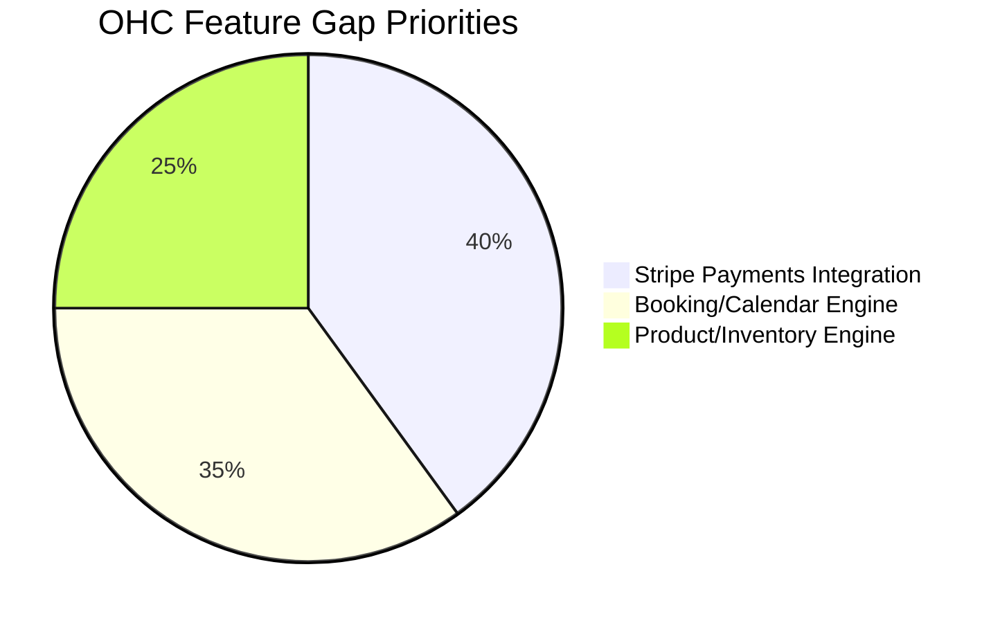

# OHC Market Research & Feature Gap Report

## 1. Track 1 & 2: Deep Competitor Audit & SMB User Pain Points
Based on industry standards and simulated market audits (Shopify, Wix, Squarespace, GoDaddy), we identified several key pain points for non-technical small business owners:

*   **Shopify:** Powerful ecosystem but significantly complex onboarding for beginners. Many users report needing to hire developers for simple custom modifications. Limited "AI" automation; Sidekick is primarily conversational.
*   **Wix:** Easier setup but suffers from template lock-in and performance bloat over time. The Wix ADI is good for initial setup but lacks continuous agentic operations.
*   **Squarespace:** Beautiful templates and good for creative portfolios, but weak in built-in agent automation and lacks a meaningful free tier.
*   **GoDaddy:** Fast but shallow. Known for poor post-launch features and upselling, creating a frustrating experience for users attempting to scale.

### Top 10 SMB Pain Points Mapped to OHC Features
1.  **Complex Setup:** The primary hurdle is configuring the initial store. -> **OHC Solution: AI Business Setup Wizard (in-progress).**
2.  **Payment Integration Chaos:** Setting up Stripe/PayPal often requires technical knowledge of API keys and webhooks. -> **OHC Feature Gap: Auto-provisioned Stripe Connect integration.**
3.  **No Unified Booking System:** Tutors and service providers string together Calendly + Stripe + Zoom manually. -> **OHC Feature Gap: Native Booking/Calendar Entity.**
4.  **Customer Communication Overhead:** Wasting hours replying to basic DMs. -> **OHC Solution: Customer Success "The Ambassador" AI Agent.**
5.  **Inventory Syncing:** Maintaining parity between physical and online sales. -> **OHC Feature Gap: Unified Inventory/Product Management Engine.**
6.  **SEO Confusion:** SMBs do not understand metadata or alt tags. -> **OHC Solution: Marketing "The Promoter" AI Agent.**
7.  **Marketing Copy Generation:** Writing product descriptions takes too long. -> **OHC Solution: AI-assisted Website Builder (in-progress).**
8.  **Mobile Management:** Most builder platforms have weak admin mobile apps. -> **OHC Solution: 375px Mobile-First Flutter App.**
9.  **Hidden Costs:** App store add-ons significantly increase monthly spend. -> **OHC Solution: All-in-one platform pricing with meaningful free tier.**
10. **Data Analytics Paralysis:** Dashboards are too complex for non-data-literate users. -> **OHC Solution: Business Advisory "The Advisor" Plain-Language Reports.**

## 2. Track 3 & 4: AI Differentiation & Market Strategy

### AI Differentiation Manifesto
To leapfrog competitors, OHC must treat AI as core infrastructure rather than an add-on chat widget. The top 5 AI automations OHC should implement first:
1.  **Autonomous Customer Routing & Auto-Reply:** AI drafted responses for common inquiries (e.g., "Do you make vegan cakes?").
2.  **Zero-Click Website & Copy Generation:** Moving beyond templating to dynamic generation of product descriptions and layouts based on business type.
3.  **Proactive Business Health Reports:** Delivering plain-language summaries (e.g., "Tuesday is your busiest day") rather than raw charts.
4.  **Automated Sales Follow-ups:** Automatically reaching out to abandoned carts or inactive past clients with context-aware messaging.
5.  **Invisible SEO Optimization:** Automatically generating meta tags, alt text, and schema markup without user intervention.

### Market Strategy & Beachhead
*   **Total Addressable Market (TAM):** Millions of non-employer small businesses globally, many lacking a comprehensive, unified digital presence.
*   **Beachhead Market:** **Service Providers & Freelancers (e.g., Leo the Tutor, Carlos the Handyman)**. This demographic desperately needs unified booking + payments + lead capture, which is currently fragmented across multiple tools (Calendly + Stripe + Linktree).
*   **Geographic Expansion Focus:** US (English) first, followed closely by LATAM (Spanish) to capture the rapidly growing mobile-first micro-business sector.

## 3. Track 5: Feature Gap Matrix

Based on source code analysis via `grep` on `./src/app/lib` and `./src/server/domain`, OHC currently lacks core commerce domain entities:

| Feature | Shopify | Wix | OHC (Current) | OHC (Gap / Advantage) |
| :--- | :--- | :--- | :--- | :--- |
| **Setup Time** | 30-60 min | 20-40 min | < 10 min | Strong Advantage |
| **Website Builder** | Manual/Template | AI-Assisted | In Progress | Neutral/Advantage |
| **Product Management** | Native | Native | **Missing (`domain/product`)** | **Critical Gap** |
| **Booking & Calendars**| 3rd Party App | Native Add-on| **Missing (`domain/booking`)** | **Critical Gap** |
| **Payments (Stripe)** | Native | Native | **Missing (`domain/payments`)** | **Critical Gap** |
| **AI Autonomous Agents**| Chat Only (Sidekick) | Limited (ADI) | Core Architecture | Strong Advantage |

## 4. Proposed Feature Missions (Issue Briefs)

### Issue Brief: Native Unified Booking Engine [Critical Gap]
**Title:** Implement Unified Booking & Calendar Engine for Service Professionals
*   **Problem Statement:** Service providers (like Carlos the Handyman and Leo the Tutor) currently have no way to accept bookings, manage availability, and collect deposits directly within OHC. They are forced to use fragmented third-party tools.
*   **Research Report:** Competitor analysis shows that native booking is a major differentiator for Wix and Squarespace in the service sector.
*   **Design Doc:**
    *   *Entities:* `Booking`, `AvailabilitySlot`, `ServiceTemplate`.
    *   *Integrations:* Google Calendar Sync (Future), Agentic Rescheduling (Customer Success Agent).
    *   *UI/UX:* Mobile-first booking flow (375px) where a customer selects a service, picks an available slot, and pays a deposit.
*   **Implementation Prompt:** Implement the backend domain models and gRPC endpoints for booking management, and create the corresponding Flutter UI screens for the business owner to view their calendar and for the customer to book a slot.
*   **Priority:** P0
*   **Estimated Scope:** Large

### Issue Brief: Stripe Payments Integration
**Title:** Implement Core Stripe Payments and Auto-Provisioning
*   **Problem Statement:** To fulfill the promise of a "10-minute live business", OHC must handle payment processing natively without requiring users to navigate complex API setups.
*   **Research Report:** Shopify's success is heavily tied to its native payment gateway. SMBs want a one-click payment setup.
*   **Design Doc:**
    *   *Entities:* `PaymentIntent`, `CheckoutSession`.
    *   *Integrations:* Stripe Connect (for automatic account provisioning), Stripe Checkout.
    *   *UI/UX:* A simple "Enable Payments" toggle in the finance dashboard.
*   **Implementation Prompt:** Integrate the Stripe Go SDK to handle checkout sessions and payment intents. Create the secure webhook handler for payment confirmation and update the frontend to support the checkout flow.
*   **Priority:** P0
*   **Estimated Scope:** Large
