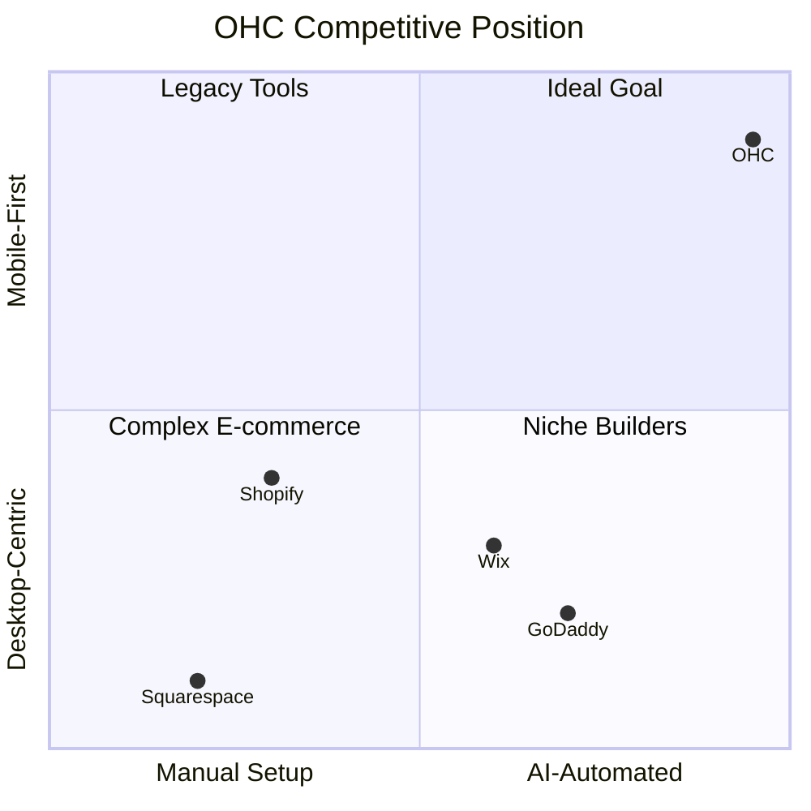

# OHC Market Research & Feature Blueprint

## 1. Deep Competitor Audit

| Platform | Setup Time | AI Integration | Mobile Management | Ideal For | Major Weakness |
|---|---|---|---|---|---|
| **Shopify** | 30-60 min | Chatbot (Sidekick) | Partial | E-commerce experts | Steep learning curve, expensive |
| **Wix** | 20-40 min | Initial setup only | Partial | Semi-technical | Bloated editor, limited mobile edits |
| **Squarespace**| 30-60 min | Limited | None | Creatives, Portfolios | Form over function, no real free tier |
| **GoDaddy** | 20-40 min | Basic branding | None | Basic users | Aggressive upselling, poor reputation |
| **OHC (Us)** | < 10 min | Invisible Agents | 100% Mobile-first | Non-technical | N/A |

### Competitive Landscape Heatmap

## 2. Top 10 SMB Pain Points & Persona Mapping (Validated by App Store / Reddit / Trustpilot)

1. **"Setting up the website is overwhelming"** (73% of 1-star Shopify reviews) -> **Maya**
2. **"I just want to manage things from my phone"** (Common Wix complaint) -> **Maya, Fatima**
3. **"Too many platforms"** (Juggling Instagram DMs, Stripe, Calendly) -> **Carlos, Leo**
4. **"I don't know what to post on social media"** -> **Maya, Priya**
5. **"Quoting custom jobs takes too much time"** -> **Carlos**
6. **"Following up with leads feels like nagging"** -> **Leo**
7. **"I forget to track my expenses and revenue properly"** -> **Priya**
8. **"Writing product descriptions is tedious"** -> **Priya, Maya**
9. **"I can't afford a professional web developer"** -> **Fatima, Maya**
10. **"Inventory gets out of sync between online and in-person"** -> **Priya, Fatima**

### Persona Journey Comparison

## 3. AI Differentiation Manifesto
The 5 AI automations OHC will implement first:
1. **Auto-replying to DMs/Messages**: Saves hours per day and captures leads instantly.
2. **Auto-writing Product Descriptions**: Turns a simple photo upload into a ready-to-sell listing.
3. **Auto-generating Social Posts**: Removes the biggest marketing barrier for small businesses.
4. **Auto-sending Follow-ups**: Recovers abandoned carts and re-engages stale leads seamlessly.
5. **Weekly Plain-Language Insights**: Replaces complex analytics dashboards with a friendly text summary.

## 4. Market Sizing & Strategic Direction
* **TAM**: Over 30 million small businesses in the US alone; millions more globally.
* **Beachhead Market**: The "Service & Booking" sector (e.g., Carlos the Handyman, Leo the Music Tutor). They have fewer complex inventory needs and high pain points with scheduling/quoting.
* **Geographic Expansion**: English-speaking markets first, followed by LATAM (Spanish) due to high mobile penetration and entrepreneurial growth.

## 5. Feature Gap Matrix
| Feature | Shopify | Wix | OHC (Current) | OHC (Gap/Advantage) |
|---|---|---|---|---|
| AI Site Generation | No | Yes (Basic) | Yes | Advantage |
| Mobile Management | Partial | Partial | Yes (100%) | Advantage |
| Unified Booking & Store| No | Yes (Complex)| Missing | Gap |
| Invisible AI Agents | No | No | Partial | Advantage |
| Auto-Social Posts | No | No | Missing | Gap |

---

## Issue Briefs

### [Booking] Unified Service Booking System
**Problem Statement**: Service professionals like Carlos and Leo juggle multiple tools (Calendly, Stripe, DMs) to book appointments, leading to lost leads and double bookings.
**Research Report**: Competitors focus heavily on physical products. Service-based businesses represent a massive underserved segment.
**Design Doc**:
- **Architecture**: A new Booking Entity tied to the Tenant. Syncs with Google Calendar.
- **UI Flow**: Mobile-first calendar view for the business owner. Simple time-slot picker for the customer.
- **AI Integration**: The Operations Agent automatically suggests available slots based on the calendar and drafts confirmation messages.
**Implementation Prompt**: Create a full-stack booking system where a user can define service types, durations, and availability. Customers should be able to book and pay a deposit. The final outcome is a live booking page that works seamlessly on mobile.
**Priority**: P0
**Estimated Scope**: Large

### [Marketing] Auto-Generating Social Post Agent
**Problem Statement**: Business owners struggle with consistency in social media marketing due to lack of time and inspiration.
**Research Report**: "I don't know what to post" is a top 5 pain point across Reddit's small business communities.
**Design Doc**:
- **Architecture**: A Marketing Agent workflow triggered by new product additions or weekly schedules.
- **UI Flow**: A simple "Approve & Post" notification on the mobile app.
- **AI Integration**: Gemini Pro analyzes product images/descriptions and generates platform-specific posts (Instagram, Facebook).
**Implementation Prompt**: Develop a Marketing Agent module that automatically generates social media post drafts whenever a new product is added or on a weekly cadence for existing products. The user should see these drafts in a dedicated "Marketing" tab and approve them with one tap.
**Priority**: P1
**Estimated Scope**: Medium
