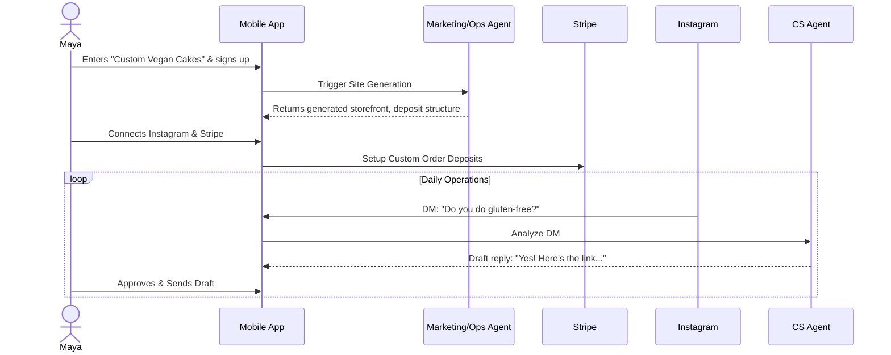
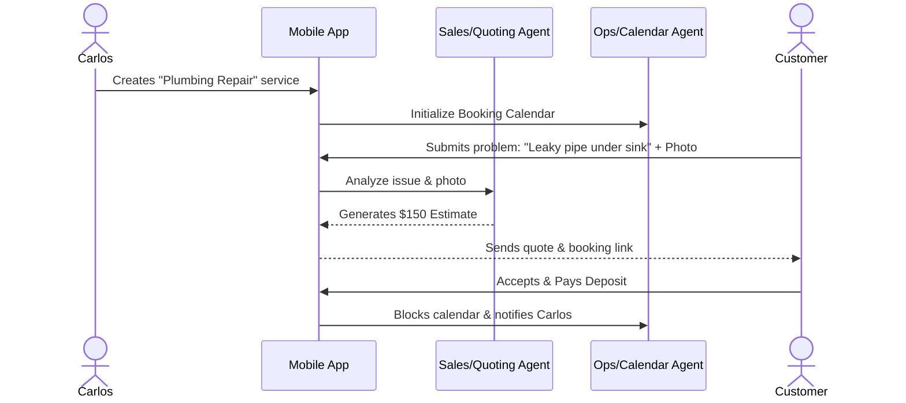
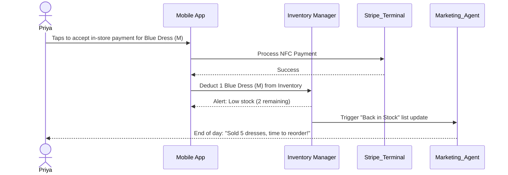
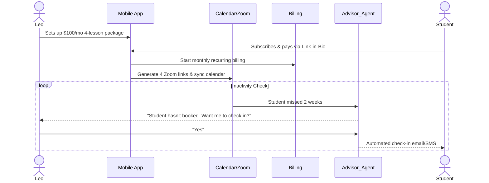
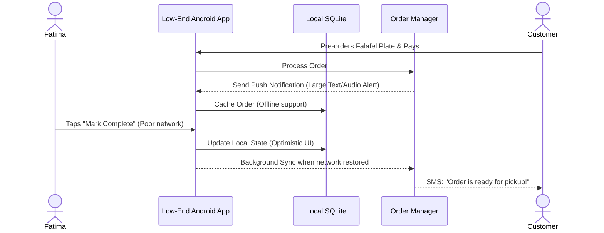

# [Architecture] End-to-End User Journey Architecture

## Title
End-to-End User Journey Architecture for Core OHC Personas

## Problem Statement
The OneHumanCorp (OHC) platform promises a 10-minute "idea to live business" journey for non-technical small business owners. However, without a meticulously mapped architecture for the user journey across different business archetypes (physical products, digital services, bookings, food/beverage, portfolios), users face friction during onboarding, activation, and daily management. There is a need to establish a unified architectural flow that caters to these varied personas while enforcing OHC's core tenets: mobile-first (375px), zero technical jargon, and invisible AI orchestration. If a grandmother or a first-time smartphone user cannot navigate the journey seamlessly, the flow fails.

## Research Report
**Market Analysis:**
- **Shopify:** Complex onboarding tailored towards tech-savvy e-commerce owners. Requires extensive configuration before activation. AI is an afterthought (Sidekick chatbot).
- **Wix / Squarespace:** Visual builders that are desktop-first. They overwhelm non-technical users with design choices rather than automating them.
- **GoDaddy:** Simpler but rigid. Lacks deep integration for bookings, custom orders, and proactive AI management.
- **OHC's Differentiation:** OHC integrates AI directly into the critical path as "departments" (Operations, Marketing, Sales, etc.). The onboarding isn't about building a website; it's about "hiring your team." The mobile app isn't just a dashboard; it's the primary point of sale, management, and creation.

**Key Findings:**
1. **Acquisition to Activation Gap:** The biggest drop-off in competitors is the setup of payments and inventory. By deferring non-critical setup and utilizing AI to infer business details from social media or brief text, OHC can hit the <10 min activation target.
2. **Mobile Parity is a Myth:** Most platforms treat the mobile app as a reporting tool. OHC must treat the mobile interface as the *primary* management console.
3. **Proactive over Reactive:** Users don't want to dig through charts. They need actionable insights (Business Advisory AI).

## Design Doc

### Key Design Decisions
1. **Progressive Disclosure Onboarding:** Ask only for Business Name, Type, and Primary Goal. AI generates the initial storefront, policies, and product stubs automatically. Detailed configurations (like tax rates, custom domains) are deferred to post-activation.
2. **AI Department Delegation:** Instead of "Settings", users interact with "Departments". To change a refund policy, they notify the "Legal & Compliance" agent. To schedule a post, they notify "Marketing".
3. **Mobile-First Data Density:** All screens are designed for 375px width. Large tables are replaced with card-based lists and swipe actions. Forms use native numeric/email keyboards.
4. **Optimistic UI with Background Sync:** For low-data environments (like Fatima's food cart), the app utilizes local SQLite storage for read-only data and queues mutations to be synced when connectivity is restored.

### AI Agent Integration Points
- **Onboarding (Marketing & Ops):** Generates site copy, layout, and initial catalog based on natural language description.
- **Daily Operations (Ops & Customer Success):** Auto-drafts replies to DMs, categorizes inbox messages, auto-approves standard refunds.
- **Reporting (Business Advisory):** Converts tabular metrics into plain-language weekly summaries ("You sold 12 cakes this week!").
- **Legal (Protector):** Automatically drafts deposit contracts and terms of service based on jurisdiction and business type.

### UI Wireframes & Screen Flow (375px Mobile-First)
1. **Landing/Auth:** "What's your business idea?" (Large text input) -> Phone Number/OTP Auth.
2. **Onboarding Wizard (AI Generating):** "Meet your new team..." (Progress bar while AI drafts the storefront, policies, and agents).
3. **Activation Dashboard:** Card layout. "Your site is live at maya-cakes.ohc.app". Next Steps: "Connect Stripe", "Add first product photo".
4. **Daily Management (The Hub):**
   - **Top:** Plain-language AI summary ("3 new messages, 1 order for pickup").
   - **Middle:** Action buttons (New Order, Add Product, Messages).
   - **Bottom:** Persistent navigation (Home, Orders, Team/AI, Settings).

### Architecture Sequence Diagrams

#### 1. Maya (Home Baker) - Acquisition to Daily Management

#### 2. Carlos (Handyman) - Booking & Quoting

#### 3. Priya (Boutique) - In-Person POS & Inventory

#### 4. Leo (Music Tutor) - Subscription & Retention

#### 5. Fatima (Food Cart) - Offline-Resilient Pre-Orders

## Implementation Prompt
**For the Implementer Agent:**
Implement the foundational user journey orchestration API and corresponding mobile frontend shells for the initial onboarding flow.
- **Backend:** Create the necessary Go endpoints for progressive onboarding (collecting minimal business info) and triggering the AI agents via the KAIROS Orchestration Hub to asynchronously provision the tenant's initial state (website layout, policies).
- **Frontend:** Build the Riverpod-based Flutter screens (strictly 375px responsive) for the initial 3-step wizard (Idea input -> AI Generation Loading Screen -> Activation Dashboard).
- **Acceptance Criteria:**
  1. User can enter a natural language business description.
  2. System creates a tenant and dispatches an async job to the AI Marketing/Ops departments.
  3. Frontend displays a smooth polling/WebSocket loading state while agents work.
  4. User lands on an Activation Dashboard rendering the AI-generated stubs.
  5. 100% E2E test coverage of this flow using Playwright/Flutter integration tests, mocking the LLM responses.

## Priority
P0

## Estimated Scope
Large
