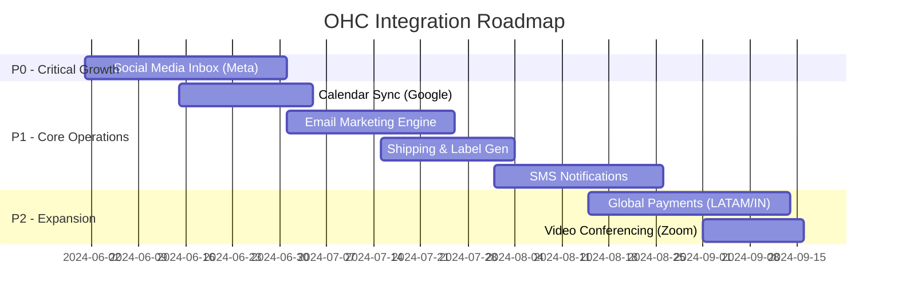

# OHC Integration Expansion: Tool Discovery Research Report

This report summarizes the findings from researching high-value tool integrations for the OneHumanCorp (OHC) platform. Our focus is squarely on the non-technical small business owner, ensuring all tools abstract complexity and amplify the power of our AI Agent Departments.

## 1. Executive Summary

OHC’s mission is radical simplicity. While our core platform handles the essentials, external integrations are required to bridge OHC with the real-world communication, logistics, and scheduling systems that small businesses rely on.

We evaluated seven critical integration categories: Social Media Inbox, Calendar Sync, Email Marketing, Payment Processing, Shipping & Logistics, SMS Notifications, and Video Conferencing.

**Key Findings:**
*   **The "All-In-One" Imperative:** Tools that require users to log into external dashboards (like Mailchimp or Klaviyo) break the OHC promise. We must use API-first providers (SendGrid, EasyPost, Twilio) to build native experiences inside OHC.
*   **OAuth is the Bottleneck:** For platforms where the user *must* bring their own account (Meta, Google Calendar, Zoom), the OAuth flow is the highest point of friction. Simplified, foolproof wizards are mandatory.
*   **AI as the Glue:** Integrations shouldn't just move data; they should trigger AI action. A webhook from Instagram shouldn't just show a message; it should trigger "The Ambassador" to draft a reply.

## 2. Persona Pain Point Analysis

| Persona | Primary Need | Evaluated Integration Solutions | AI Agent Value Add |
| :--- | :--- | :--- | :--- |
| **Maya (Home Baker)** | Misses Instagram DMs while baking; struggles with shipping costs for non-local orders. | **Social Media Inbox** (Meta Graph API), **Shipping Rates** (EasyPost). | *Ambassador* drafts DM replies; *Operations* prints labels. |
| **Carlos (Handyman)** | Double books himself; needs instant SMS to tell clients he's on the way. | **Calendar Sync** (Google Calendar), **SMS Notifications** (Twilio). | *Operations* auto-reschedules via SMS reply parsing. |
| **Priya (Boutique)** | Wants to email customers about new stock; needs alternative payments for international buyers. | **Email Marketing** (SendGrid), **Global Payments** (Mercado Pago). | *Promoter* drafts email campaigns based on inventory events. |
| **Leo (Music Tutor)** | Hates manually creating and emailing Zoom links for every lesson. | **Video Conferencing** (Zoom API). | *Operations* auto-generates and embeds secure links. |
| **Fatima (Food Cart)** | Needs instant, offline-capable alerts for incoming orders. | **SMS Notifications** (Twilio). | *Operations* sends robust SMS order alerts. |

## 3. Recommended Implementation Roadmap & Priority

## 4. Specific Actionable Recommendations

### OHC should prioritize the Meta Graph API (Instagram/FB) integration because:
*   **Evidence:** Social commerce is the primary acquisition channel for our core personas (Maya, Priya). Missing DMs directly equals lost revenue.
*   **Action:** Implement the P0 Issue Brief for the Unified Inbox, ensuring "The Ambassador" AI is tightly coupled to inbound webhooks.

### OHC should build a native Email Marketing Engine powered by SendGrid/SES because:
*   **Evidence:** Forcing users to connect Mailchimp introduces a second UI they must learn, violating our "Zero technical knowledge" value.
*   **Action:** Implement the P1 Email Marketing brief. Invest heavily in responsive templates so the "Promoter" agent only needs to generate content, not raw HTML.

### OHC should abstract SMS compliance (Twilio A2P 10DLC) away from the user because:
*   **Evidence:** US carrier compliance requires business registration forms that are intimidating for casual freelancers.
*   **Action:** Develop a shared-number strategy or a heavily guided wizard to handle Twilio compliance invisibly, as outlined in the P1 SMS brief.

### OHC should build a "Payment Gateway" abstraction before adding new providers because:
*   **Evidence:** Hardcoding Stripe logic prevents expansion into LATAM (Mercado Pago) and India (Razorpay), locking out huge SMB markets.
*   **Action:** Refactor the backend to support the P2 Global Payments brief, ensuring all transactions normalize to a common schema for the "Accountant" AI.

## 5. Next Steps
1.  Review the generated Issue Briefs in `docs/research/`.
2.  Assign the P0 `[social_media]_integration` brief to the Core Engineering swarm.
3.  Begin architectural spikes on the OAuth handling and Webhook Gateway to support the new integrations.