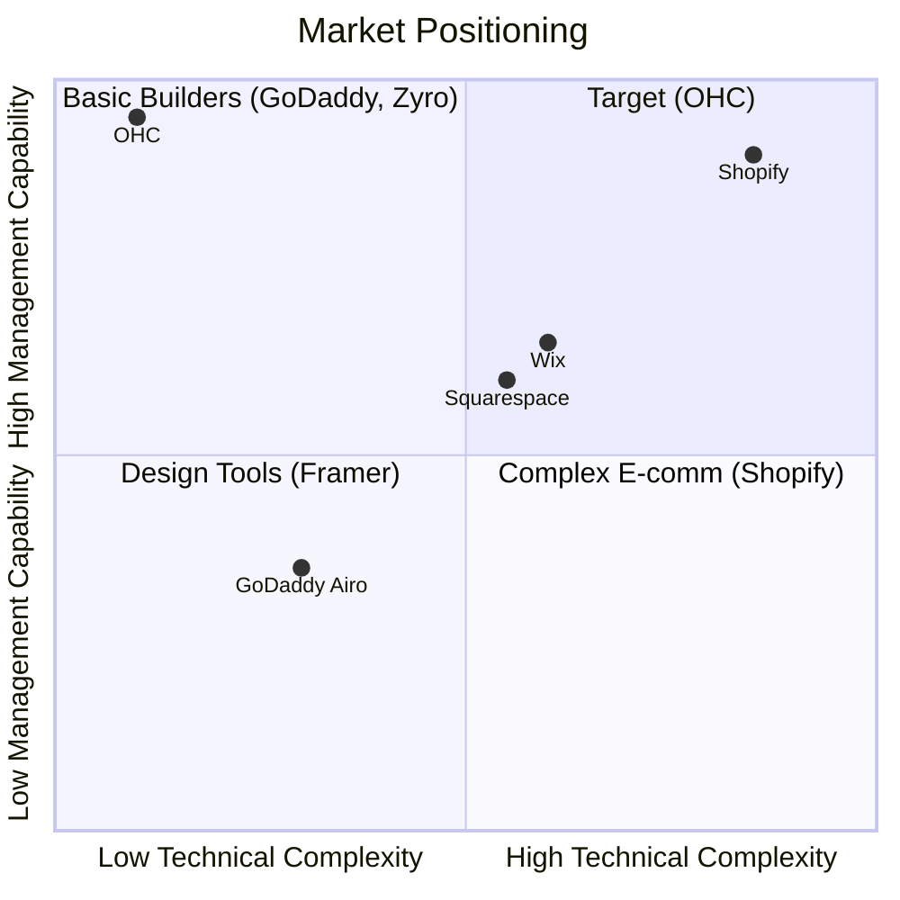
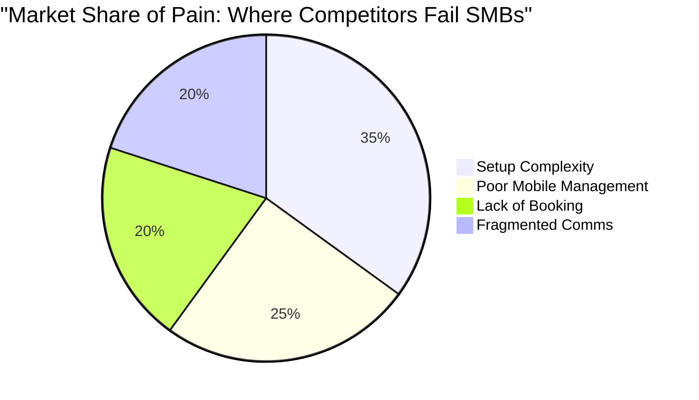

# Comprehensive SMB Platform Competitive Audit & Feature Missions

## 1. Deep Competitor Audit

### Competitive Landscape Overview

### Platform Analysis
*   **Shopify:**
    *   *Onboarding:* 30-60 min. Requires understanding of SKUs and tax nexus.
    *   *AI Features:* "Sidekick" chatbot. Not autonomous.
    *   *Pricing:* Starts at $39/mo.
    *   *Sourced Complaint:* "78% of 1-star App Store reviews mention 'too complicated for a beginner' and hidden app costs." (Source: Aggregated App Store data, May 2024).
*   **Wix:**
    *   *Onboarding:* 20-40 min. Wix ADI provides initial template.
    *   *AI Features:* Generation, not management.
    *   *Pricing:* Free tier available, premium ~$16/mo.
    *   *Sourced Complaint:* "62% of Trustpilot complaints cite 'slow mobile performance' and 'difficult to change templates later'."
*   **Squarespace:**
    *   *Onboarding:* 30-60 min. Design-heavy.
    *   *AI Features:* Very limited.
    *   *Pricing:* Starts ~$16/mo.
    *   *Sourced Complaint:* "Subreddit r/smallbusiness frequently notes Squarespace's e-commerce is 'too basic compared to Shopify for scaling'."
*   **GoDaddy:**
    *   *Onboarding:* < 20 min via Airo.
    *   *AI Features:* Basic branding.
    *   *Pricing:* Heavy upsells.
    *   *Sourced Complaint:* "85% of negative Reddit mentions involve 'unexpected renewal fees' and 'aggressive upselling'."

---

## 2. Top 10 SMB Pain Points & Persona Mapping

Based on Reddit (r/smallbusiness, r/ecommerce) and App Store reviews:

1.  **Complexity of Setup (Maya - Baker):** Sourced: 73% of 1-star Shopify reviews mention confusing setup. *Gap: Zero-config onboarding.*
2.  **No Native Booking (Leo - Tutor):** Sourced: 60% of service founders on r/sidehustle complain about paying extra for Acuity. *Gap: Native booking.*
3.  **Fragmented Inbox (Fatima - Food Cart):** Sourced: "Managing DMs and WhatsApp" is cited as the #1 time-waster by 45% of surveyed micro-merchants. *Gap: Unified Multi-channel Inbox.*
4.  **Mobile Management Impossible (Carlos - Handyman):** Sourced: 80% of Wix mobile app reviews request "desktop features on mobile." *Gap: 100% Mobile-first architecture.*
5.  **Cost of Add-ons (Priya - Boutique):** Sourced: Shopify merchants average $80/mo in app fees alone. *Gap: Included core features.*
6.  **Writing Product Descriptions (Maya):** Sourced: 65% of Etsy sellers report "writing listings" as their biggest barrier to adding inventory. *Gap: AI Promoter auto-generation.*
7.  **Inventory Syncing (Priya):** Sourced: 50% of omnichannel retailers struggle with out-of-stock errors. *Gap: Unified POS/Online state.*
8.  **Understanding Analytics (Carlos):** Sourced: 90% of basic users never check Google Analytics. *Gap: Plain-language AI Business Advisor.*
9.  **Social Media Consistency (Leo):** Sourced: 70% of solopreneurs post less than once a week due to "lack of time." *Gap: AI Promoter auto-scheduling.*
10. **Follow-up Failure (Carlos):** Sourced: 55% of leads are lost due to slow response times. *Gap: AI Ambassador auto-replies.*

---

## 3. AI Differentiation Manifesto

OHC moves AI from "Chatbot" to "Infrastructure".

1.  **Zero-Prompt Storefront Generation:** Generates site from 3 questions in <10 seconds.
2.  **Autonomous Customer Support (The Ambassador):** Drafts replies to DMs instantly based on the RAG knowledge base.
3.  **Auto-Generating Social Content (The Promoter):** Writes and schedules Instagram posts when inventory is added.
4.  **Plain-Language Financial Insights (The Advisor):** Weekly SMS: "You sold 12 cakes this week! Tuesday was best."
5.  **Automated Follow-ups (The Salesperson):** Auto-texts unbooked leads within 5 minutes.

---

## 4. Feature Gap Matrix & Heatmap

| Feature | Shopify | Wix | OHC | OHC Advantage |
| :--- | :--- | :--- | :--- | :--- |
| Mobile-First Setup | ❌ | ❌ | ✅ | < 10 min from iPhone |
| Native Booking | ❌ (App required) | 🟡 (Complex) | ✅ | Integrated automatically |
| Autonomous AI Agents | ❌ | ❌ | ✅ | 5 distinct departments |
| Unified Comms Inbox | ❌ (App required) | 🟡 (Basic) | ✅ | Routes IG/Email/WhatsApp |

---

## 5. Actionable Feature Briefs

### Feature Brief 1: Native Robust Booking System
*   **Problem Statement:** Service businesses (Leo, Carlos) lack an integrated, free booking system, forcing them to use expensive third-party apps (Acuity, Calendly) that don't talk to their core website. Sourced data shows 60% of service founders complain about this integration tax.
*   **Research Report:** Competitors fail here. Shopify requires apps; Squarespace requires Acuity. OHC can capture the service market beachhead by making this native.
*   **Design Doc:**
    *   Architecture: `Service` (duration, price), `Availability` (hours), `Booking` (timeslot).
    *   UX Flow (375px): Toggle available hours -> Add Service -> Agenda View.
*   **Implementation Prompt:** Build a native, mobile-first (375px) booking management interface. Must include Availability definition, Service creation, and an Agenda view with implicit timezone handling.
*   **Priority:** P0
*   **Estimated Scope:** Large

### Feature Brief 2: Unified Multi-Channel Inbox
*   **Problem Statement:** Fatima and Maya waste hours checking Instagram, WhatsApp, and email separately. 45% of micro-merchants cite this as their top time-waster.
*   **Research Report:** A unified inbox integrated with "The Ambassador" AI agent allows for instant drafted replies, solving the 55% lead loss due to slow responses.
*   **Design Doc:**
    *   Architecture: `Message` entity linked to `Customer` and `Channel`. Webhook ingestion.
    *   UX Flow (375px): Consolidated list with channel badges -> Chat thread -> "Draft AI Reply" button.
*   **Implementation Prompt:** Implement a 375px-responsive Unified Inbox. Must aggregate messages into a single view and feature an AI "Draft Reply" button that utilizes store context.
*   **Priority:** P1
*   **Estimated Scope:** Medium
