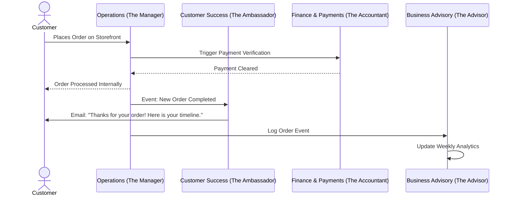

# [Architecture] AI Agent Department System

## Problem Statement
Running a small business is like juggling ten jobs at once. A typical business owner—like Maya the home baker or Carlos the handyman—doesn't just produce their goods or perform their services. They have to be the marketing manager, the customer support rep, the bookkeeper, the compliance officer, and the sales team. For non-technical people with zero time, setting up and managing all these separate software tools is overwhelming and paralyzing. They don't want "AI chatbot assistants"; they want a "Business Advisory team" that works invisibly in the background to handle the busywork so they can focus on their craft.

## Research Report
Current market solutions fail small business owners by treating AI as an afterthought or a novelty, rather than core infrastructure.
- **Shopify**: "Sidekick" is a reactive chat interface. The user has to know what to ask ("how do I set up a discount code?"). It doesn't proactively run the business for them.
- **Wix**: Uses AI for initial website generation, but the day-to-day operations still require manual intervention.
- **Squarespace**: AI generates text/images, but lacks deep workflow automation across different business domains.
- **GoDaddy**: Basic Airo tools, but highly limited in proactive operational support.

*Finding*: Non-technical owners understand functional "departments" intuitively. When a new order comes in, they expect the "Operations Manager" to track it, the "Customer Success Rep" to send a thank-you, and the "Accountant" to log the payment. AI agents should be structured this way.

## Design Doc

### Architecture Diagram

### Key Design Decisions and Why
1. **Departmental Agents**: AI is divided into intuitive departments (Operations, Marketing, Sales, Customer Success, Finance, Legal, Advisory). *Why*: This creates a mental model that a non-technical owner understands immediately. It feels like hiring a team, not configuring software.
2. **Trigger-Based and Schedule-Based Execution**: Agents are triggered by platform events (e.g., `order.created`, `customer.messaged`) or scheduled routines (e.g., `weekly.report.generated`). *Why*: Proactive work is more valuable than reactive chat. The owner shouldn't have to tell the agent to send an invoice.
3. **Approval Workflows**: High-stakes actions (e.g., issuing refunds, signing legal contracts) require the owner's manual approval, while low-stakes actions (e.g., drafting a social media post, answering FAQs) can be fully automated or set to "draft-for-review". *Why*: Builds trust. Owners won't let AI run amok with their money or reputation from day one.
4. **Memory and Context Sharing**: All departments read from a shared contextual memory layer (customer history, past interactions, owner preferences). *Why*: If a customer messages "The Ambassador" about a late order, the agent must instantly know the order status from "The Manager" without requiring the owner to connect systems.
5. **Budgeting and Throttling**: AI action limits are tied to subscription tiers (e.g., Free = 100 actions/mo, Pro = Unlimited). *Why*: Protects margins while ensuring users get value. Approaching the limit triggers an upsell notification.

### Mobile UX Flow (375px First)
- **Home Dashboard**: A unified feed showing activity from all departments.
  - *Card*: "The Ambassador drafted 3 replies to Instagram DMs. [Review & Send]"
  - *Card*: "The Accountant logged 5 payments today."
- **Department View**: Tapping into "Marketing & Advertising" shows the content calendar and active campaigns.
- **Approval Screen**: When an agent drafts a response, the screen shows the original customer message and the AI's suggested reply in a native-feeling chat bubble interface. A simple swipe right approves/sends, swipe left edits.
- **Settings**: A simple toggle list for each department: "Auto-send standard replies" vs. "Draft for review".

### AI Agent Integration Points
- **Event Bus**: Agents subscribe to internal platform events.
- **Shared Memory Layer**: Contextual storage of the business's tone of voice, product catalog, and interaction history.
- **Tool Execution**: Agents are given permissioned tools (e.g., `SendEmail`, `UpdateInventory`, `CreateDiscountCode`) that perform the actual side effects.

## Implementation Prompt
**Task**: Implement the foundational AI Department Engine.
**User-facing Outcome**: Business owners should be able to navigate to an "AI Team" tab on their mobile app, see the 7 departments, and toggle their autonomy levels ("Auto-pilot" vs "Draft for review"). They should see a feed of actions performed by these agents.
**Critical User Journey (CUJ)**:
1. Owner opens the app and navigates to "AI Team".
2. Owner taps "Customer Success" and toggles "Draft replies to new messages" to ON.
3. A customer sends a message via the storefront.
4. The system routes the event to the Customer Success agent, which generates a draft response.
5. The owner receives a push notification, reviews the draft in the app, and taps "Approve".
6. The message is sent.
**Acceptance Criteria**:
- The 7 defined departments exist as logical entities in the system.
- Agents can receive events and generate tool calls.
- Actions requiring approval are surfaced in a unified UI feed.
- Shared memory context is accessible to the agent during response generation.
- The UI strictly adheres to the 375px mobile-first Glassmorphism design system.
- Full E2E test coverage for the CUJ.

## Priority
P0

## Estimated Scope
Large
