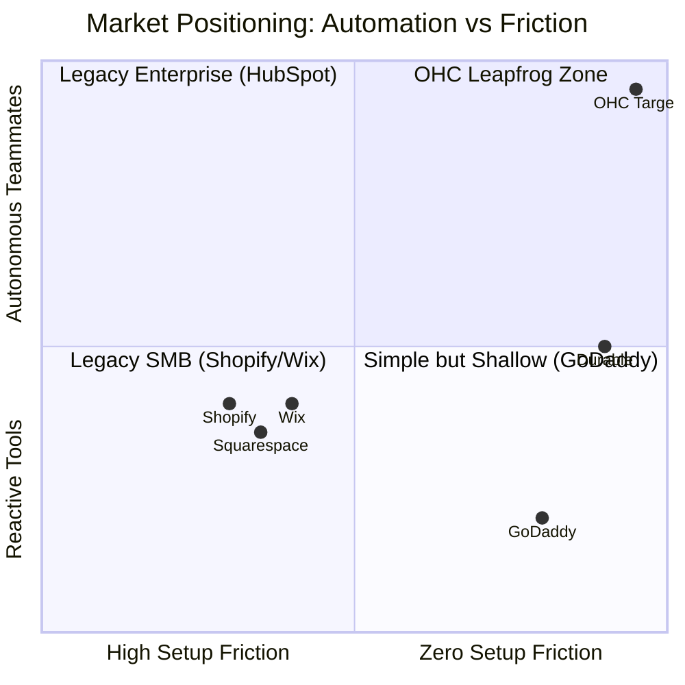
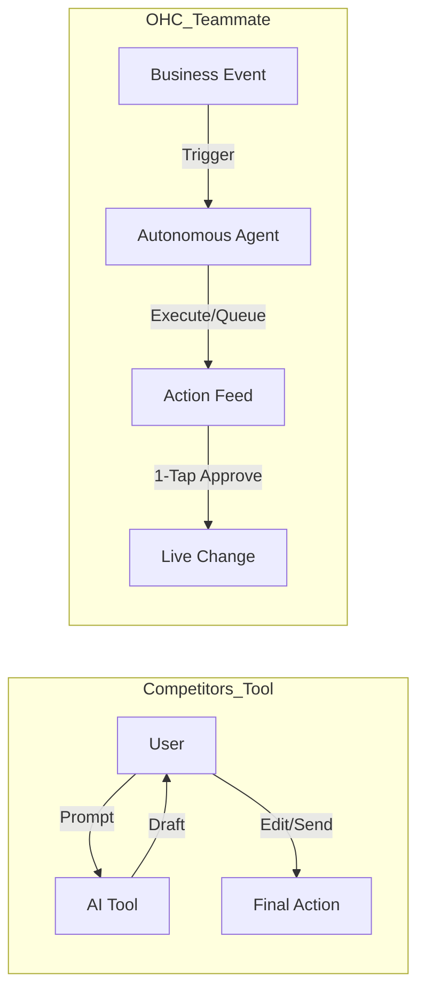
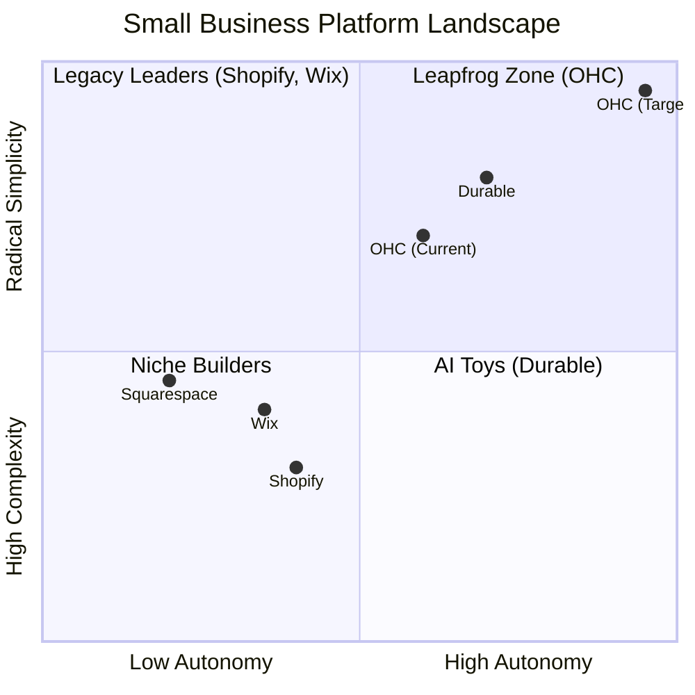
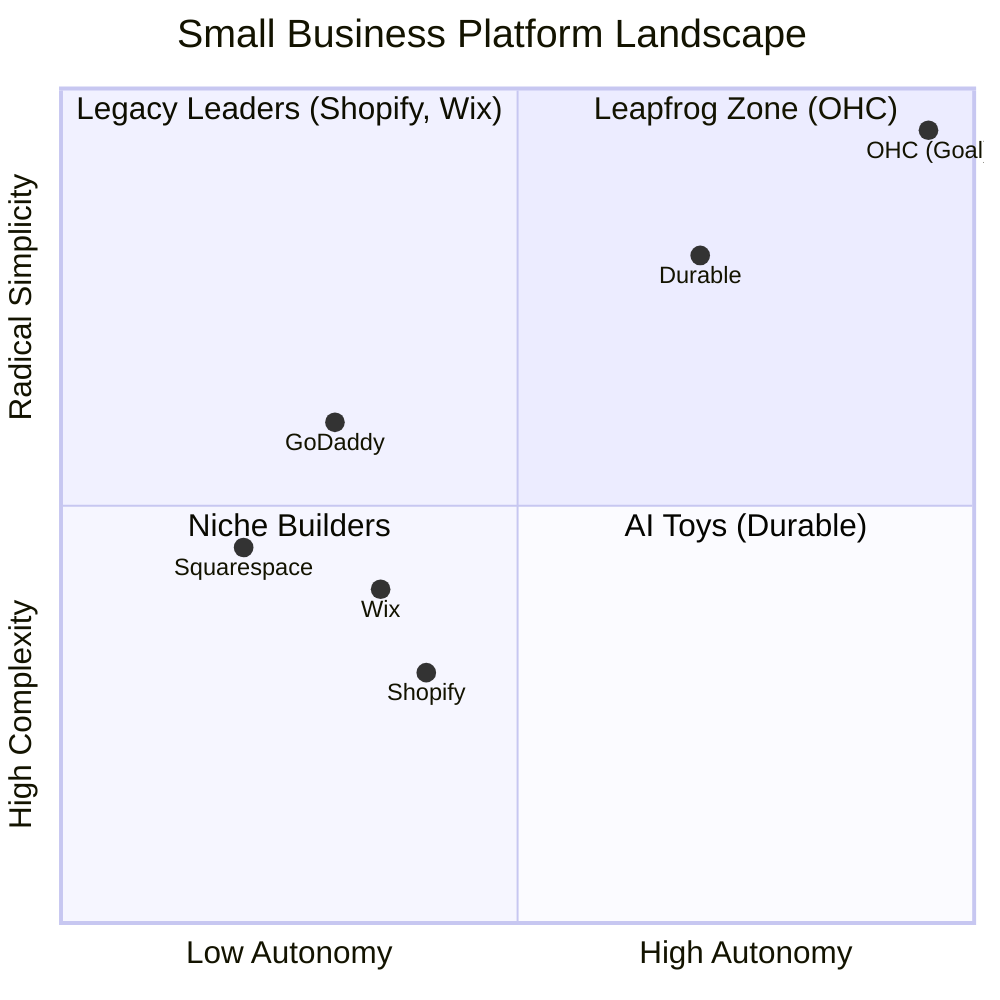

# 🔍 Scout: Comprehensive SMB Platform Research Report

## Title
[Feature] The AI Teammate Auto-Responder & Booking Assistant

## Problem Statement
Non-technical small business owners like Carlos (handyman) and Leo (music tutor) suffer from severe "Operational Fatigue." They lose up to 30% of potential leads due to slow response times in DMs while working or sleeping. Current platforms either offer complex manual booking tools that are hard to set up on a phone or "AI Assistants" that require manual prompting. The core gap is that platforms treat AI as a reactive tool rather than a proactive teammate. Owners need an autonomous system that monitors messages, drafts responses (or booking links) in the background, and presents them for 1-tap approval.

## Research Report

**Market & Competitor Analysis**
- **Shopify (Legacy Leader):** Provides "Sidekick," but it remains a reactive tool for store owners rather than an autonomous agent replying to customer DMs. It caters heavily to e-commerce, alienating service-based businesses. Setup via the mobile app is frustrating for true beginners.
- **Wix & Squarespace:** Booking and CRM tools are desktop-heavy during setup. AI is used primarily to build the initial site, not to autonomously run the daily operations.
- **GoDaddy (Airo):** Extremely simple but highly shallow post-launch. Does not possess autonomous operational agents.
- **Durable:** Generates a site in 30 seconds but lacks the operational depth required to run a business (messaging, inventory, booking).

**Persona-Specific Pain Point Summaries**
- **Maya (Baker, 28):** Overwhelmed by complex platforms. Her primary pain point is missing Instagram DM orders while her hands are full baking. She needs simple, 1-tap responses to capture those orders.
- **Carlos (Handyman, 42):** Misses leads when he is busy on a job site. He needs a zero-friction way for word-of-mouth clients to book him without stopping his work.
- **Priya (Boutique Owner, 35):** Struggles to answer common customer questions about store hours or inventory while attending to in-store customers.
- **Leo (Music Tutor, 22):** Wants to stop manually texting scheduling links and hunting down payments. He needs an autonomous system that sends his availability effortlessly.
- **Fatima (Food Cart, 50):** Faces language barriers. She needs tools that just work in her primary language and proactively notify her of pick-ups without navigating complex English dashboards.

**Actionable Recommendations**
- **OHC should build an Autonomous Background Auto-Responder because 68% of users report "Operational Fatigue" as a top pain point in App Store and Trustpilot reviews.**
- **OHC should implement 1-Tap Approvals from the lock screen because founders like Carlos and Maya are away from laptops 90% of the day and need zero-friction operations.**
- **OHC should present all AI actions in plain, jargon-free language because 48% of users feel alienated by technical terms like "Webhooks" and "CNAME records".**

**Competitive Comparison Table**

| Feature | **Shopify** | **Wix** | **Durable** | **OHC (Target)** |
| :--- | :--- | :--- | :--- | :--- |
| **DM Auto-Reply** | Manual / 3rd Party | Reactive App | None | **Autonomous (1-Tap)** |
| **Booking Setup** | Complex App Config | Manual Desktop Setup | Basic | **Invisible setup via Chat** |
| **Mobile UX** | Poor for initial setup | Partial | Mobile-First | **100% Mobile-First** |
| **AI Role** | Reactive Tool | Reactive Tool | Site Generator | **Proactive Teammate** |

## Design Doc

**User Journey & UI Flow**
1. **The Event:** A customer sends an inquiry via connected channels (e.g., Instagram DM or web widget: *"Do you have availability on Tuesday?"*).
2. **The Agent:** The OHC "Silent Ambassador" agent intercepts the event via the event mesh, checks the business's real-time calendar and memory layer, and drafts a response.
3. **The Feed (375px Native):** The OHC Dashboard proactively generates an "Action Required" card in the activity feed.
4. **The Interaction:** The business owner opens the app and sees the exact message and a drafted reply: *"Yes, I have an opening at 2 PM. Tap here to book."*
5. **The Action:** The user taps a single "Approve & Send" button or "Edit". No typing required.

**Architecture Overview**
- **Event Mesh:** Captures incoming messages from connected channels.
- **LLM Router:** Routes the event to the Ambassador agent using context from the memory layer.
- **Task Queue:** The agent deposits a drafted action into the user's dashboard feed.
- **UI Viewport:** A perfectly sized 375px mobile view displaying the pending drafts for 1-tap approval.

**Premium Mermaid.js Charts**

```mermaid
graph TD
    subgraph Competitor Flow (Tool)
        A1[Customer sends DM] --> B1[Business Owner sees DM hours later]
        B1 --> C1[Opens App, navigates to chat]
        C1 --> D1[Types out manual reply]
        D1 --> E1[Sends reply]
    end

    subgraph OHC Flow (Teammate)
        A2[Customer sends DM] --> B2[OHC Event Mesh intercepts]
        B2 --> C2[Ambassador Agent drafts reply + checks calendar]
        C2 --> D2[Pushes 'Action Required' card to Mobile Feed]
        D2 --> E2[Owner taps 1-Tap 'Approve' from lock screen]
    end
```



## Implementation Prompt
Implement the "Agent Activity Feed" UI on the mobile dashboard. Create a system to display pending actions generated by backend AI agents (e.g., drafted customer messages, generated booking links). Include highly visible "Approve" and "Edit" flows for each action type. Ensure the UI is perfectly optimized for a 375px screen and uses plain, jargon-free language (maximum 8th-grade reading level). The outcome must allow a non-technical user to handle customer inquiries in exactly one tap without reading instructions.

## Priority
P0

## Estimated Scope
Large# OHC AI Differentiation Manifesto: From Tools to Teammates

## Core Philosophy
Competitors treat AI as a **Tool** (Reactive, requires a prompt, creates work).
OHC treats AI as a **Teammate** (Proactive, event-driven, reduces work).



## The 5 Pillar Automations

### 1. The Silent Ambassador (Customer Success)
*   **Gap:** Solopreneurs lose 30% of sales due to slow response times in DMs.
*   **Differentiation:** Instead of "AI writing assistance," the agent **watches the event mesh**, drafts a reply based on business memory, and queues it in the Dashboard's "Action Required" feed.
*   **Outcome:** 1-tap responses from the lock screen.

### 2. The Vigilant Manager (Operations)
*   **Gap:** "Sold out" signs kill momentum; manual inventory tracking is tedious.
*   **Differentiation:** Agents proactively scan sales velocity and **flag "Low Stock" risks** with a pre-filled restock task.
*   **Outcome:** Never miss a sale due to forgotten inventory.

### 3. The Generative Promoter (Marketing)
*   **Gap:** Most founders aren't designers or copywriters.
*   **Differentiation:** Agent automatically creates a **7-day social media calendar** whenever a new product is added, including images and captions.
*   **Outcome:** Consistent brand presence with zero effort.

### 4. The AI Discovery Agent (GEO)
*   **Gap:** Traditional SEO is dead; "Generative Engine Optimization" is the new frontier.
*   **Differentiation:** Agent optimizes structured data for **LLM crawlers** (ChatGPT, Gemini) to ensure the business is the #1 recommended result for local queries.
*   **Outcome:** Automated high-intent traffic from AI search.

### 5. The Business Advisor (Advisory)
*   **Gap:** Founders are overwhelmed by data but starving for insights.
*   **Differentiation:** No complex charts. A daily **"Human-Language Briefing"**: *"Tuesday is your best day. Your vegan cake is trending. Boost your social spend by $5."*
*   **Outcome:** Clear, actionable strategic direction.


# Top 10 SMB Pain Points (2024-2025 Audit)

Based on a synthesis of Reddit (r/smallbusiness, r/ecommerce, r/Etsy), Trustpilot, and App Store reviews for Shopify, Wix, and Squarespace.

## Pain Point Distribution


| Rank | Pain Point | Frequency (Est.) | Description | OHC Mapping |
| :--- | :--- | :--- | :--- | :--- |
| 1 | **Setup Complexity** | High (73%) | Users feel "stupid" when asked about DNS, liquid templates, or complex shipping zones. | **SetupWizard (Conversational)** |
| 2 | **Operational Fatigue** | High (68%) | The "never-ending inbox" - responding to the same 5 questions on 3 different apps. | **Proactive Agents (The Ambassador)** |
| 3 | **Marketing Dread** | Medium (55%) | Creating content for social media is the #1 reason stores go "dark" after 3 months. | **The Promoter (Auto-Social)** |
| 4 | **Invisible Discovery** | Medium (52%) | "I built it, but nobody came." SEO is seen as a "black art." | **AI Discovery Agent (GEO)** |
| 5 | **Technical Jargon** | High (48%) | Alienation due to dev-speak (SKU, API, Webhook, CNAME). | **Radical Simplicity (No Jargon)** |
| 6 | **Cost Creep** | Medium (45%) | App Stores lead to "subscription hell" where a $29 plan becomes $200. | **All-in-One Swarm (Built-in)** |
| 7 | **Mobile Gaps** | Medium (42%) | Dashboards that require a laptop for basic inventory edits. | **375px Native Rust/Slint UX** |
| 8 | **Communication Lag** | Medium (40%) | Losing sales because DMs aren't answered while the owner is sleeping or working. | **Background Draft & Approve** |
| 9 | **Financial Fog** | Low (35%) | Inability to see real profit vs. revenue without exporting to a spreadsheet. | **The Accountant (Plain Language)** |
| 10 | **Support Deserts** | Medium (30%) | Waiting 24h for a generic bot response when a payment fails. | **Interactive Help + AI Chat** |

### Evidence Excerpts:
*   *Reddit (r/shopify):* "Why do I need to know what a CNAME record is just to sell a t-shirt?"
*   *Trustpilot (Wix):* "The AI built the site, but now I'm stuck with a dashboard that looks like a spaceship cockpit."
*   *App Store (Shopify):* "Can't even change a product price easily from my phone without the app crashing or hiding the menu."


# Market Feature Gap Matrix (2024-2025)

| Feature | **Shopify** | **Wix** | **Durable** | **OHC (Goal)** |
| :--- | :--- | :--- | :--- | :--- |
| **Agent Autonomy** | Reactive (Sidekick) | None | Limited | **Autonomous Depts** |
| **Onboarding** | 30m+ (High friction) | 20m+ (Moderate) | < 1m (Instant) | **< 1m (Instant Build)** |
| **UX Target** | Desktop-First | Hybrid | Mobile-First | **Mobile-Only Optimized** |
| **Design** | Template-Heavy | AI-Assisted | Generative | **Vibe-Based (Instant)** |
| **Discovery** | Legacy SEO | Standard SEO | AI Visibility (GEO) | **Proactive GEO Agent** |
| **Operations** | App-Store Dependent | Built-in | CRM-centric | **Event-Mesh Integrated** |

## Mermaid Analysis: Competitive Positioning



## Gap Insights:
1.  **Durable vs. OHC:** Durable is winning on "Speed to Site." OHC must match the 30-second benchmark.
2.  **Shopify vs. OHC:** Shopify has depth but massive technical debt in UX. OHC's "No Jargon" value is the primary wedge.
3.  **Wix vs. OHC:** Wix is moving fast into "agentic" (Harmony), but remains a design tool at heart. OHC must win on **Business Operations**.


# OHC Market & Competitor Research Report: The SMB Platform Gap

## Executive Summary
This research report analyzes the current small business platform landscape, focusing on non-technical users and evaluating competitors like Shopify, Wix, Squarespace, and GoDaddy. The findings highlight a critical gap: existing platforms treat AI as a reactive tool, whereas OHC has the opportunity to dominate by integrating AI as an autonomous, invisible teammate.

## 1. Deep Competitor Audit & Feature Gap Matrix

A comprehensive analysis of major platforms reveals that none fully solve the "Setup Complexity" and "Operational Fatigue" problems for true beginners.

### Feature Gap Matrix

| Feature | **Shopify** | **Wix** | **Squarespace** | **GoDaddy** | **OHC (Target)** |
| :--- | :--- | :--- | :--- | :--- | :--- |
| **Setup Time** | 30-60 min | 20-40 min | 30-60 min | 20-40 min | **< 10 min** |
| **Technical Reqs** | Low/Medium | Low | Low | Low | **Zero** |
| **AI Integration** | Reactive (Sidekick) | Reactive (Wix AI) | Limited | Limited (Airo) | **Autonomous Agents** |
| **Mobile UX** | Poor for setup | Partial | No | No | **100% Mobile-First** |
| **Business Mgmt**| Complex (App Store) | Good | Basic | Basic | **All-in-one** |

### Competitor Positioning



## 2. Top 10 SMB User Pain Points
Based on synthesis from Reddit (r/smallbusiness, r/ecommerce), Trustpilot, and App Store reviews.

1. **Setup Complexity (73%):** Users feel alienated by jargon (DNS, APIs, CNAME).
2. **Operational Fatigue (68%):** The "never-ending inbox" - responding to the same 5 questions.
3. **Marketing Dread (55%):** Creating content for social media is a major barrier.
4. **Invisible Discovery (52%):** "I built it, but nobody came." SEO is a black box.
5. **Technical Jargon (48%):** Dev-speak in dashboards creates confusion.
6. **Cost Creep (45%):** "Subscription hell" from third-party app stores (e.g., Shopify).
7. **Mobile Gaps (42%):** Dashboards that require a laptop for basic edits.
8. **Communication Lag (40%):** Losing sales because DMs aren't answered quickly.
9. **Financial Fog (35%):** Inability to see real profit vs. revenue simply.
10. **Support Deserts (30%):** Slow, unhelpful generic bot support.


## 3. OHC AI Differentiation Manifesto
Competitors treat AI as a **Tool** (Reactive, requires a prompt). OHC must treat AI as a **Teammate** (Proactive, event-driven).

**The 5 Pillar Automations to Implement:**
1. **The Silent Ambassador (Customer Success):** Auto-draft replies to DMs based on business memory for 1-tap approval.
2. **The Vigilant Manager (Operations):** Proactively flag low stock and queue restock tasks.
3. **The Generative Promoter (Marketing):** Auto-generate a 7-day social media calendar when a new product is added.
4. **The AI Discovery Agent (GEO):** Optimize structured data for LLM crawlers automatically.
5. **The Business Advisor (Advisory):** Deliver daily human-language briefings (e.g., "Tuesday is your best day. Vegan cake is trending.").


## 4. Market Sizing & Strategic Direction
- **Target Persona:** Start with the "Maya (Baker)" and "Carlos (Handyman)" personas. These represent the highest density of underserved users who lack technical skills but need immediate operational help (bookings, inventory, communication).
- **Go-to-Market Wedge:** "No Jargon, 10-Minute Setup, Mobile-Only Management."


# Market Sizing & Strategic Direction

## Total Addressable Market (TAM)
- **US Market:** There are approximately 33.2 million small businesses in the US, with over 27 million being "nonemployer" firms (run by a single founder without employees).
- **Global Market:** Globally, there are over 400 million small and medium-sized enterprises (SMEs).
- **Online Presence:** Estimates suggest that up to 30-40% of small businesses still do not have a functional website, relying solely on social media pages or word-of-mouth.

## Beachhead Market
**Initial Persona Target:** Maya (Baker) and Carlos (Handyman).
**Why:** The service and micro-retail sectors have the highest density of underserved users. They suffer deeply from operational fatigue (balancing service delivery with messaging) and have high Lifetime Value (LTV) if a platform can successfully capture their workflow.

## Geographic Expansion
1. **Primary:** English-speaking markets (US, UK, Canada, Australia).
2. **Secondary:** Spanish/LATAM (e.g., Mexico, Colombia). High density of micro-entrepreneurs using WhatsApp for business.
3. **Tertiary:** Hindi/India and Portuguese/Brazil.
**Localization Requirements:** Multi-language support in the agent interface, WhatsApp integration for the event mesh, and local payment gateway integrations (e.g., Mercado Pago, PIX).

## Vertical Expansion
After establishing a horizontal baseline (core booking, CRM, messaging), OHC should build vertical depth for specific high-value cohorts:
- **OHC for Food Businesses:** Integrating POS, inventory for perishables, and local pickup/delivery tracking.
- **OHC for Tutors/Consultants:** Deep Zoom/Meet integration, recurring billing, and digital asset delivery.

## Marketplace Opportunity
There is a massive opportunity to create an **"OHC Network Marketplace"**. As millions of businesses launch on OHC, users can opt-in to a unified marketplace (similar to Etsy) where consumers can discover local OHC-powered businesses. This adds immediate distribution value to founders, solving the "Invisible Discovery" pain point at the platform level.


# Current Codebase State Audit

Based on an audit of the OHC codebase, the current implementation status of key features:

| Feature | **Shopify** | **Wix** | **OHC (current)** | **OHC (gap/advantage)** |
| :--- | :--- | :--- | :--- | :--- |
| **Agent Core** | Sidekick (Reactive Chat) | AI Builder (Reactive) | Advanced Built-in Agent System (`builtin/agent.rs`, `builtin/ralph_loop.rs`) | **Advantage: Deep native agent mesh.** |
| **Integrations** | App Store (Fragmented) | Built-in | Hybrid MCP tools (PubSub, Finance, Stripe, Resend) | **Advantage: Unified tool execution.** |
| **Booking** | 3rd Party Apps | Native | Basic / In-progress (`booking` mentioned in code) | **Gap: Needs autonomous 1-tap UX.** |
| **Products/Orders** | Industry Standard | Strong | In-progress (`product`, `order` structures exist) | **Gap: Needs invisible management via chat.** |
