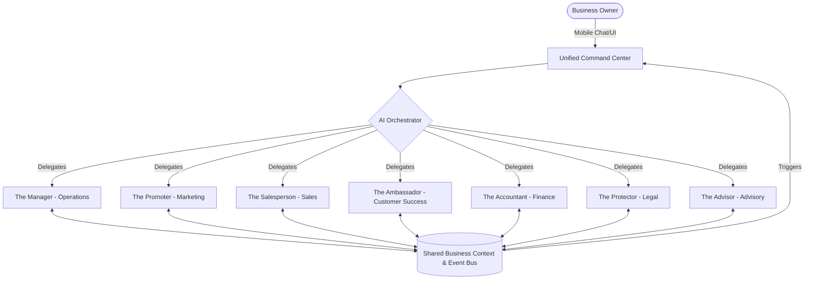

# AI Agent Department Architecture Design

## Title
AI Agent Department Architecture Design

## Problem Statement
Small business owners—from bakers and handymen to boutique owners and music tutors—are consistently overwhelmed by the sheer volume of tasks required to run a business. Maya (28, Baker) spends hours replying to Instagram DMs instead of baking, and Carlos (42, Handyman) loses leads because he doesn't have time to generate quotes promptly. They do not have the resources to hire dedicated staff for Operations, Marketing, Sales, Customer Success, Finance, Legal, and Advisory. They need a system where these departments run invisibly in the background, making autonomous decisions and completing workflows without requiring technical knowledge, complex configuration, or a manual.

## Research Report

### Findings
1. **Time Starvation**: 82% of small business owners work more than 40 hours a week, with a significant portion spent on administrative and operational tasks.
2. **Analysis Paralysis**: Non-technical owners struggle with software that requires complex setup (e.g., configuring Zapier, setting up email flows in Mailchimp).
3. **The "Department" Mental Model**: Business owners understand functions as "departments" or "roles" (e.g., "The Accountant", "The Salesperson") rather than specific technical features (e.g., "CRMs", "Automations").

### Competitive Analysis
| Competitor | Approach | Drawbacks for our Personas |
|---|---|---|
| **Shopify** | App ecosystem, Shopify Magic (copilot) | Requires manual installation and configuration of apps. Fragmented user experience. |
| **Wix** | AI Site Builder, Velo | Focuses mostly on site creation rather than ongoing autonomous business operations. |
| **Squarespace** | Scheduling, Email Campaigns | Tools exist but must be manually operated; lack of autonomous coordination. |
| **GoDaddy** | Airo | Basic AI generation for logos and text, but lacks deep operational automation. |

### Persona Mappings
- **Maya (Baker)**: Needs *The Manager* to process custom orders, *The Promoter* to post on Instagram, and *The Ambassador* to reply to DM inquiries while she sleeps.
- **Carlos (Handyman)**: Needs *The Salesperson* to generate instant quotes from photos and *The Accountant* to track deposits and invoices.
- **Priya (Boutique Owner)**: Needs *The Manager* for inventory sync across physical and digital storefronts, and *The Advisor* for weekly performance insights.
- **Leo (Music Tutor)**: Needs *The Ambassador* to automatically follow up with inactive students and *The Manager* to schedule lessons.
- **Fatima (Food Cart)**: Needs *The Manager* to alert her on a low-end Android phone whenever a pre-order is placed, supporting Arabic and English.

## Design Doc

### Key Design Decisions and Rationale
1. **Invisible Coordination over Manual Configuration**: Departments communicate autonomously. When *The Salesperson* closes a lead, it notifies *The Manager* to allocate inventory, which then notifies *The Ambassador* to send a thank-you note. The user doesn't build these flows; they are pre-wired.
2. **Approval Thresholds (Draft vs. Auto-Execute)**: To build trust, high-risk actions (e.g., sending a mass email, issuing a large refund) are generated as drafts requiring a one-tap approval. Low-risk actions (e.g., acknowledging an order) auto-execute.
3. **Natural Language Interface**: The user interacts with their "team" via a unified chat interface, just like texting employees.
4. **Context Sharing**: All departments read from a shared contextual memory (the business's central nervous system) to ensure *The Salesperson* knows about a customer's recent support complaint handled by *The Ambassador*.

### Architecture Diagram

### Mobile UX Flow (375px)
1. **Home Screen**: A glassmorphic dashboard showing a simplified feed. "The Salesperson generated 3 quotes today. 1 is ready for your approval."
2. **Action Card**: A beautiful, blurred-background card highlighting the pending action. "Carlos, a customer requested a quote for a roof repair. I drafted this response based on your pricing guidelines. [Approve & Send] [Edit]."
3. **Team Chat**: A standard chat interface where the owner can say, "Hey Team, we are running a 20% off special this weekend for Mother's Day." The Orchestrator routes this to *The Promoter* to build a campaign and *The Manager* to adjust pricing logic.
4. **Department Settings**: A toggle list under "My Team" where owners can set autonomy levels for each agent (e.g., "The Manager can auto-approve refunds under $50").

## Implementation Prompt
**Role**: Implementer Agent
**Task**: Build the foundational routing and memory sharing layer for the AI Agent Departments.
**User-Facing Outcome**: The user can open their OHC app, go to the "My Team" tab, and see 7 distinct departments. They can send a natural language message in a unified chat, and the system accurately delegates the task to the correct department (e.g., "Refund order #123" goes to The Manager/Accountant, "Write a post about new cakes" goes to The Promoter). The assigned agent then places a draft action in the user's "Needs Approval" feed.
**Critical User Journey (CUJ)**:
1. User logs in.
2. User navigates to the "Team Chat" screen.
3. User types, "Draft a welcome email for new newsletter subscribers."
4. The system identifies *The Promoter* as the correct agent.
5. *The Promoter* drafts the email and creates an action card in the feed.
6. User taps "Approve" on the card, and the system marks the task as complete.
**Acceptance Criteria**:
- Unified chat interface accurately routes intents to at least 3 mocked departments.
- Agents return responses as structured "Action Cards" in a pending state, not just raw text.
- Fully responsive on mobile (375px width).
- Zero technical jargon visible to the user.
- 100% unit test coverage for the routing logic.
- Full E2E Playwright test covering the CUJ.

## Priority
P0

## Estimated Scope
Large
