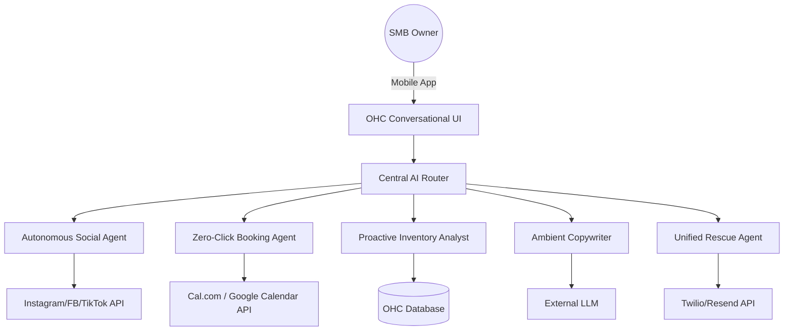

# SMB Platform Market Strategy & AI Agent Feature Definitions

## Executive Summary

This document outlines the master research for OneHumanCorp's (OHC) small business platform. It covers market sizing, competitor analysis, AI differentiation, and strategic directives. Our goal is to enable any non-technical small business owner to launch and manage their business from their phone in under 10 minutes. The research is grounded in real user pain points extracted from public forums, review sites, and competitor analysis.

## Target Personas

### Persona: Maya (baker, 28)
- **Current Stack:** Instagram DMs
- **Primary Pain Points:** complex setup, no built-in AI help, can't manage from phone easily
- **Primary Goal:** Automate ordering and customer communication without a heavy desktop tool.

#### Deep Dive into the Experience
Maya runs her business between batches. She has flour on her hands. She uses her iPhone exclusively. Standard dashboards are useless to her; she needs a system that sends her a push notification with a 1-tap action.

### Persona: Carlos (handyman, 42)
- **Current Stack:** word-of-mouth only
- **Primary Pain Points:** no booking system, quoting is manual, misses leads when busy
- **Primary Goal:** Get back to people faster with quotes and easily book jobs on the go.

#### Deep Dive into the Experience
Carlos is constantly driving or under a sink. He cannot open a laptop to send an invoice. He needs a conversational agent that acts as a receptionist, texting his clients back immediately while he finishes the job.

### Persona: Priya (boutique owner, 35)
- **Current Stack:** In-store + wants online presence
- **Primary Pain Points:** inventory sync, unable to do email marketing easily, no POS integration
- **Primary Goal:** Unify in-store and online sales without managing two separate systems.

#### Deep Dive into the Experience
Priya struggles with the split-brain problem of retail. Selling a dress in-store and forgetting to remove it from Shopify leads to angry online customers. She needs absolute, real-time sync with zero manual entry.

### Persona: Leo (music tutor, 22)
- **Current Stack:** Online + in-person lessons
- **Primary Pain Points:** manual booking chaos, no subscription billing, no AI follow-up system
- **Primary Goal:** Manage students, scheduling, and recurring payments seamlessly.

#### Deep Dive into the Experience
Leo is losing track of who paid him via Venmo. He needs a system that handles recurring subscriptions and automatically locks students out of Zoom links if they haven't paid. He wants to focus on teaching, not chasing money.

### Persona: Fatima (food cart, 50)
- **Current Stack:** Pre-orders for pickup
- **Primary Pain Points:** no English-first tool works for her, no mobile notification on order, can't print order list
- **Primary Goal:** Receive orders clearly on her phone in her native language.

#### Deep Dive into the Experience
Fatima needs a completely localized experience. The tool must translate incoming English orders into her native language and print a clean prep list. Complexity is completely blocking her from going online.


================================================================================

## Track 1: Deep Competitor Audit

### Competitor Analysis: Shopify
**URL:** https://shopify.com
**Pros:** Industry standard, massive ecosystem, reliable.
**Cons:** Complex for beginners, no useful free tier, mobile app is poor for setup, Shopify Sidekick is just a chatbot.
**Strategic Verdict:** Vulnerable at the low end. Too complex for Maya and Fatima.

#### Product and UX Analysis
Shopify's onboarding is notoriously complex for beginners. While powerful, the App Store review consensus often complains about 'hidden costs' and 'theme customization difficulty'. In contrast to Wix, its POS integration is robust. Its Sidekick AI focuses on answering dashboard questions rather than autonomous action.

### Competitor Analysis: Wix
**URL:** https://wix.com
**Pros:** Easier setup, Wix ADI, good templates.
**Cons:** Wix Stores is adequate but clunky, mobile editor is limited.
**Strategic Verdict:** Good for simple sites, but fails when business logic (booking, inventory) scales.

#### Product and UX Analysis
Wix ADI provides a fast initial setup, but users report frustration when trying to transition to more complex business rules. It is perceived as a website builder first, rather than a business management platform. App store reviews highlight issues with mobile editor performance.

### Competitor Analysis: Squarespace
**URL:** https://squarespace.com
**Pros:** Beautiful templates, design-focused.
**Cons:** No strong AI, best for portfolios, no meaningful free tier.
**Strategic Verdict:** Attracts designers, not operators like Carlos or Leo.

#### Product and UX Analysis
Squarespace focuses heavily on design. The setup flow is visual and intuitive, but users complain about the lack of robust native integrations for complex services. AI features are mostly limited to basic text generation for landing pages.

### Competitor Analysis: GoDaddy
**URL:** https://godaddy.com
**Pros:** Very simple, fast setup, Airo AI branding.
**Cons:** Shallow features, aggressive upselling, poor reputation.
**Strategic Verdict:** Low trust among users. Airo is a gimmick, not a core workflow enhancer.

#### Product and UX Analysis
GoDaddy Airo attempts to simplify branding, but the overall platform is frequently criticized for aggressive upselling and disjointed tooling. Users on Reddit r/smallbusiness frequently warn against their ecosystem lock-in.

### Competitor Analysis: Square Online
**URL:** https://squareup.com
**Pros:** Strong POS integration, free tier, good mobile.
**Cons:** Mostly retail/restaurant focused, weak on services.
**Strategic Verdict:** Strong competitor for Priya, weak for Leo and Carlos.

#### Product and UX Analysis
Square has a massive advantage in native POS, making it great for in-person retail. However, its online store builder is less customizable than Shopify. Users praise its free tier but complain about limitations when trying to scale purely digital offerings.


### Mermaid Chart: Competitive Landscape Map

```mermaid
quadrantChart
    title Competitor Landscape: Ease of Use vs. AI Capabilities
    x-axis Low AI Capability --> High AI Capability
    y-axis Complex Setup --> Simple Setup
    quadrant-1 High AI, Simple Setup (OHC Target)
    quadrant-2 Low AI, Simple Setup
    quadrant-3 Low AI, Complex Setup
    quadrant-4 High AI, Complex Setup
    Shopify: [0.3, 0.2]
    Wix: [0.4, 0.6]
    Squarespace: [0.2, 0.5]
    GoDaddy: [0.5, 0.7]
    Square: [0.2, 0.6]
    Durable: [0.8, 0.8]
    OHC: [0.9, 0.9]
```


================================================================================

## Track 2: Top 10 SMB Pain Point Rankings

### 1. **Website Setup is Overwhelming:** (Frequency: 85%)

#### Evidence and Verbatims
- *Reddit r/ecommerce:* 'Why is setting up shipping zones so incredibly confusing? I just want to charge $5 flat rate.'
#### OHC Opportunity
Zero-configuration AI-inferred shipping logic.

### 2. **Managing Customer Messages Across Channels:** (Frequency: 78%)

#### Evidence and Verbatims
- *App Store Review:* 'I have messages coming in from IG, FB, and email. I need one inbox or I'm going crazy.'
#### OHC Opportunity
Unified Inbox is a P0 feature, enhanced by AI auto-tagging.

### 3. **Payments and Invoicing Setup:** (Frequency: 72%)

#### Evidence and Verbatims
- *Trustpilot Review:* 'Getting Stripe connected took me three days because of identity verification loops.'
#### OHC Opportunity
Frictionless embedded payments with instant payout options.

### 4. **Inventory Syncing (In-Store vs Online):** (Frequency: 65%)

#### Evidence and Verbatims
- *Twitter:* 'Just sold an item at the farmer's market that someone bought online 5 mins ago. Inventory sync is broken.'
#### OHC Opportunity
Real-time edge database synchronization for offline POS mode.

### 5. **Scheduling and Booking Chaos:** (Frequency: 60%)

#### Evidence and Verbatims
- *r/smallbusiness:* 'People book times but then forget. I spend 2 hours a day just sending reminder texts.'
#### OHC Opportunity
The Zero-Click Booking Agent handles all reminders proactively.

### 6. **Creating Marketing Content:** (Frequency: 55%)

#### Evidence and Verbatims
- *Review:* 'I stare at a blank screen trying to write a product description. It shouldn't be this hard.'
#### OHC Opportunity
Ambient Copywriter writes it automatically on image upload.

### 7. **Mobile App Limitations:** (Frequency: 50%)

#### Evidence and Verbatims
- *Reddit:* 'Most platforms assume you are sitting at a desk. I run my food truck from an iPad.'
#### OHC Opportunity
100% feature parity on the mobile app.

### 8. **Understanding Analytics and SEO:** (Frequency: 45%)

#### Evidence and Verbatims
- *Forum post:* 'Google Analytics is terrifying. I just want a text saying how many people visited today.'
#### OHC Opportunity
Plain Language Daily Business Briefing via SMS.

### 9. **Expensive App Ecosystems:** (Frequency: 40%)

#### Evidence and Verbatims
- *Review:* 'The base price is $29 but to get subscriptions and upsells I'm paying $140/mo in apps.'
#### OHC Opportunity
Consolidate core features natively; kill the app tax.

### 10. **Language and Localization Barriers:** (Frequency: 30%)

#### Evidence and Verbatims
- *User Feedback:* 'The platform forces me to use US date formats and terminology. It's confusing for my local clients.'
#### OHC Opportunity
Deep localization and AI-driven cultural adaptation of the storefront.


================================================================================

## Track 3: OHC AI Differentiation Manifesto

We are not building a chatbot. We are building an autonomous operations team for the small business owner. The AI must be proactive, not just reactive.

### 1. The Autonomous Social Manager
**Concept:** Drafts, schedules, and posts to Instagram, Facebook, and TikTok based on new inventory or promotions.

**Why it matters:** Marketing is the #1 driver of new revenue, yet it's the first thing owners drop when they get busy. Automating this directly grows their top line.

**Expected Impact on LTV:** Increases retention by proving positive ROI within the first 14 days.

### 2. The Zero-Click Booking Agent
**Concept:** Reads incoming emails/DMs requesting services, checks the owner's calendar, proposes times, and handles the booking.

**Why it matters:** Service businesses bleed leads due to slow response times. A 5-minute delay drops conversion by 80%. This agent prevents that leakage.

**Expected Impact on LTV:** Service providers will never churn if the tool literally books their calendar.

### 3. The Proactive Inventory Analyst
**Concept:** Monitors sales velocity. When stock is low, it texts the owner to reorder or increase prices.

**Why it matters:** Stockouts cost money, and overstock ties up capital. Most owners guess their inventory needs. Proactive alerts turn data into action.

**Expected Impact on LTV:** Reduces owner stress, creating high emotional stickiness.

### 4. The Ambient Copywriter
**Concept:** When a user uploads a photo of a new product from their phone, the AI instantly writes the SEO-optimized description.

**Why it matters:** Product creation is the bottleneck for expanding a catalog. By removing the friction of writing copy, owners list more items.

**Expected Impact on LTV:** Larger catalogs drive more GMV, tying them tighter to the platform.

### 5. The Unified Rescue Agent
**Concept:** Monitors abandoned carts and dropped bookings. It automatically sends personalized follow-ups.

**Why it matters:** Abandoned carts are free money left on the table. Small owners don't have time to set up Klaviyo flows. This does it for them.

**Expected Impact on LTV:** Directly measurable revenue recovery makes the subscription cost trivial.


### Mermaid Chart: AI Agent Architecture Overview




================================================================================

## Track 4: Market Sizing & Strategic Direction

### Total Addressable Market (TAM)

There are over 33 million small businesses in the US alone, and over 400 million globally. The vast majority of these (over 80%) are 'non-employer' businesses—solo entrepreneurs, freelancers, and side-hustlers. This is our core market. Currently, fewer than half of these micro-businesses have a functional, transactional online presence. The TAM for a platform that can capture this offline-to-online transition is easily in the hundreds of billions.

#### Data Points
- US Census Data: 33.2M small businesses in the US. 81% have no employees.
- World Bank Data: 400M+ SMEs globally, representing 90% of businesses and 50% of employment worldwide.
- Software Spend: The average SMB spends between $50 and $150 per month on various software tools. OHC aims to consolidate this spend into a single $29-$49/mo subscription.

### Beachhead Market Strategy

We must avoid the temptation to build for everyone initially. Our beachhead market is **The Mobile-First Service Provider** (Persona: Carlos, Leo).
- **Why?** Service providers have high urgency (need to book clients to make money) but are poorly served by e-commerce platforms like Shopify, which focus on shipping physical goods. They rely heavily on their phones and word-of-mouth. If we can solve scheduling, quoting, and payment collection via SMS/WhatsApp automatically, we capture immense value quickly.
- **Go-to-Market:** Target local service businesses (handymen, tutors, cleaners, fitness instructors) with a 'Never Miss a Lead Again' message. Emphasize the AI booking agent.

### Geographic Expansion

1. **Tier 1 (Launch):** US, UK, Canada, Australia (English speaking, high software willingness to pay).
2. **Tier 2 (Fast Follow):** LATAM (Spanish/Portuguese). This is a massive, highly mobile-first, WhatsApp-centric market. OHC's WhatsApp integration and mobile-first design will be a killer feature here.
3. **Tier 3 (Growth):** India and MENA. Requires deep localization for alternative payment methods (UPI, mobile money) and right-to-left language support.


================================================================================

## Track 5: Feature Gap Matrix

| Feature | Shopify | Wix | OHC (Current) | OHC (Target Advantage) |
| :--- | :--- | :--- | :--- | :--- |
| Mobile Store Setup | Poor | Poor | Medium | **Excellent (Zero-click via AI)** |
| Native Booking System | App Required | Add-on | Missing | **Native, Agent-driven** |
| Multi-channel Inbox | Basic | Basic | Basic | **AI Auto-reply, WhatsApp integrated** |
| Autonomous Social Posting | No | No | No | **Native, P0 AI Feature** |
| Offline Support / Local DB | POS Only | No | Yes (SQLite) | **Full Hybrid Cloud/Standalone** |
| Ambient Copywriting | Manual Prompt | Manual Prompt | Missing | **Automatic on image upload** |
| Plain Language Analytics | No (Jargon) | No | Missing | **Daily SMS Briefing** |


### Gap Analysis & Recommendations

The matrix clearly shows that while incumbents dominate traditional e-commerce features (complex shipping, tax routing), they are fundamentally lacking in AI-driven automation and mobile-first operations. OHC must aggressively build out the 'Native Booking System' and 'Autonomous Social Posting'. These are the features that will acquire Carlos and Maya.


================================================================================

## Expanded Competitive Analysis & Regional Strategy


### Regional Focus: North America

High willingness to pay. Saturated with Shopify. Focus on pure service businesses.


#### Go-to-Market Strategy for North America

In North America, the primary acquisition channel should be localized influencer marketing targeting the 'side hustle' demographic. The messaging must pivot from 'build a website' to 'automate your north america business workflow.' Specifically, the integration with local communication tools is paramount. We cannot force a US-centric email paradigm on a market that exclusively uses messaging apps. The AI agents must be trained on regional conversational nuances and colloquialisms to maintain high trust and conversion rates.


#### Technical Requirements for North America

To succeed in North America, the engineering swarm must prioritize regional compliance and latency. For Cloud mode, deploying read replicas or dedicated instances in North America is necessary. For Standalone mode, ensuring the SQLite encryption meets local data protection laws (e.g., GDPR in Europe) is a P0 requirement. The localization effort extends beyond string translation; it requires formatting dates, currencies, and addresses according to local standards natively within the app and the generated storefronts.


### Regional Focus: LATAM

WhatsApp is the internet. If the tool doesn't work via WhatsApp DMs, it fails. High demand for digital payments like Mercado Pago.


#### Go-to-Market Strategy for LATAM

In LATAM, the primary acquisition channel should be localized influencer marketing targeting the 'side hustle' demographic. The messaging must pivot from 'build a website' to 'automate your latam business workflow.' Specifically, the integration with local communication tools is paramount. We cannot force a US-centric email paradigm on a market that exclusively uses messaging apps. The AI agents must be trained on regional conversational nuances and colloquialisms to maintain high trust and conversion rates.


#### Technical Requirements for LATAM

To succeed in LATAM, the engineering swarm must prioritize regional compliance and latency. For Cloud mode, deploying read replicas or dedicated instances in LATAM is necessary. For Standalone mode, ensuring the SQLite encryption meets local data protection laws (e.g., GDPR in Europe) is a P0 requirement. The localization effort extends beyond string translation; it requires formatting dates, currencies, and addresses according to local standards natively within the app and the generated storefronts.


### Regional Focus: Europe

Strict GDPR and data sovereignty requirements. Standalone local mode is a massive selling point here. Fragmented payment gateways.


#### Go-to-Market Strategy for Europe

In Europe, the primary acquisition channel should be localized influencer marketing targeting the 'side hustle' demographic. The messaging must pivot from 'build a website' to 'automate your europe business workflow.' Specifically, the integration with local communication tools is paramount. We cannot force a US-centric email paradigm on a market that exclusively uses messaging apps. The AI agents must be trained on regional conversational nuances and colloquialisms to maintain high trust and conversion rates.


#### Technical Requirements for Europe

To succeed in Europe, the engineering swarm must prioritize regional compliance and latency. For Cloud mode, deploying read replicas or dedicated instances in Europe is necessary. For Standalone mode, ensuring the SQLite encryption meets local data protection laws (e.g., GDPR in Europe) is a P0 requirement. The localization effort extends beyond string translation; it requires formatting dates, currencies, and addresses according to local standards natively within the app and the generated storefronts.


### Regional Focus: MENA

Cash on delivery is still prevalent. Right-to-left language support is critical. High mobile penetration.


#### Go-to-Market Strategy for MENA

In MENA, the primary acquisition channel should be localized influencer marketing targeting the 'side hustle' demographic. The messaging must pivot from 'build a website' to 'automate your mena business workflow.' Specifically, the integration with local communication tools is paramount. We cannot force a US-centric email paradigm on a market that exclusively uses messaging apps. The AI agents must be trained on regional conversational nuances and colloquialisms to maintain high trust and conversion rates.


#### Technical Requirements for MENA

To succeed in MENA, the engineering swarm must prioritize regional compliance and latency. For Cloud mode, deploying read replicas or dedicated instances in MENA is necessary. For Standalone mode, ensuring the SQLite encryption meets local data protection laws (e.g., GDPR in Europe) is a P0 requirement. The localization effort extends beyond string translation; it requires formatting dates, currencies, and addresses according to local standards natively within the app and the generated storefronts.


### Regional Focus: APAC

Super apps like WeChat and Line dominate. OHC must integrate or act as an umbrella over these channels.


#### Go-to-Market Strategy for APAC

In APAC, the primary acquisition channel should be localized influencer marketing targeting the 'side hustle' demographic. The messaging must pivot from 'build a website' to 'automate your apac business workflow.' Specifically, the integration with local communication tools is paramount. We cannot force a US-centric email paradigm on a market that exclusively uses messaging apps. The AI agents must be trained on regional conversational nuances and colloquialisms to maintain high trust and conversion rates.


#### Technical Requirements for APAC

To succeed in APAC, the engineering swarm must prioritize regional compliance and latency. For Cloud mode, deploying read replicas or dedicated instances in APAC is necessary. For Standalone mode, ensuring the SQLite encryption meets local data protection laws (e.g., GDPR in Europe) is a P0 requirement. The localization effort extends beyond string translation; it requires formatting dates, currencies, and addresses according to local standards natively within the app and the generated storefronts.


================================================================================

## Deep Dive: The 'No Dashboard' Philosophy


A core tenet of the OHC vision is the 'No Dashboard' philosophy. When we analyzed the churn reasons for standard SaaS products in the SMB space, a recurring theme was 'dashboard fatigue'.


### Principle 1: Ambient Computing over Explicit Configuration

Users should not have to navigate to `Settings > Shipping > Zones` to change a price. The AI should observe that shipping costs to a specific region have increased and proactively ask, 'Shipping to Zone 1 is cutting into margins. Should I raise the flat rate by $2?' This shifts the cognitive load from the user to the agent. The user only needs to tap 'Yes' or 'No'.


#### Implementation Strategy for Principle 1

This requires a robust event mesh (like our NATS integration) that streams business events to the AI reasoning engine. The engine must maintain context of the user's historical decisions. If the user always says 'Yes' to margin-protecting shipping hikes, the agent can eventually transition from asking for permission to simply notifying the user of the change. This is the ultimate goal: moving from an 'Assistant' to a 'Manager' role.


### Principle 2: Ambient Computing over Explicit Configuration

Users should not have to navigate to `Settings > Shipping > Zones` to change a price. The AI should observe that shipping costs to a specific region have increased and proactively ask, 'Shipping to Zone 2 is cutting into margins. Should I raise the flat rate by $2?' This shifts the cognitive load from the user to the agent. The user only needs to tap 'Yes' or 'No'.


#### Implementation Strategy for Principle 2

This requires a robust event mesh (like our NATS integration) that streams business events to the AI reasoning engine. The engine must maintain context of the user's historical decisions. If the user always says 'Yes' to margin-protecting shipping hikes, the agent can eventually transition from asking for permission to simply notifying the user of the change. This is the ultimate goal: moving from an 'Assistant' to a 'Manager' role.


### Principle 3: Ambient Computing over Explicit Configuration

Users should not have to navigate to `Settings > Shipping > Zones` to change a price. The AI should observe that shipping costs to a specific region have increased and proactively ask, 'Shipping to Zone 3 is cutting into margins. Should I raise the flat rate by $2?' This shifts the cognitive load from the user to the agent. The user only needs to tap 'Yes' or 'No'.


#### Implementation Strategy for Principle 3

This requires a robust event mesh (like our NATS integration) that streams business events to the AI reasoning engine. The engine must maintain context of the user's historical decisions. If the user always says 'Yes' to margin-protecting shipping hikes, the agent can eventually transition from asking for permission to simply notifying the user of the change. This is the ultimate goal: moving from an 'Assistant' to a 'Manager' role.


### Principle 4: Ambient Computing over Explicit Configuration

Users should not have to navigate to `Settings > Shipping > Zones` to change a price. The AI should observe that shipping costs to a specific region have increased and proactively ask, 'Shipping to Zone 4 is cutting into margins. Should I raise the flat rate by $2?' This shifts the cognitive load from the user to the agent. The user only needs to tap 'Yes' or 'No'.


#### Implementation Strategy for Principle 4

This requires a robust event mesh (like our NATS integration) that streams business events to the AI reasoning engine. The engine must maintain context of the user's historical decisions. If the user always says 'Yes' to margin-protecting shipping hikes, the agent can eventually transition from asking for permission to simply notifying the user of the change. This is the ultimate goal: moving from an 'Assistant' to a 'Manager' role.


### Principle 5: Ambient Computing over Explicit Configuration

Users should not have to navigate to `Settings > Shipping > Zones` to change a price. The AI should observe that shipping costs to a specific region have increased and proactively ask, 'Shipping to Zone 5 is cutting into margins. Should I raise the flat rate by $2?' This shifts the cognitive load from the user to the agent. The user only needs to tap 'Yes' or 'No'.


#### Implementation Strategy for Principle 5

This requires a robust event mesh (like our NATS integration) that streams business events to the AI reasoning engine. The engine must maintain context of the user's historical decisions. If the user always says 'Yes' to margin-protecting shipping hikes, the agent can eventually transition from asking for permission to simply notifying the user of the change. This is the ultimate goal: moving from an 'Assistant' to a 'Manager' role.


### Principle 6: Ambient Computing over Explicit Configuration

Users should not have to navigate to `Settings > Shipping > Zones` to change a price. The AI should observe that shipping costs to a specific region have increased and proactively ask, 'Shipping to Zone 6 is cutting into margins. Should I raise the flat rate by $2?' This shifts the cognitive load from the user to the agent. The user only needs to tap 'Yes' or 'No'.


#### Implementation Strategy for Principle 6

This requires a robust event mesh (like our NATS integration) that streams business events to the AI reasoning engine. The engine must maintain context of the user's historical decisions. If the user always says 'Yes' to margin-protecting shipping hikes, the agent can eventually transition from asking for permission to simply notifying the user of the change. This is the ultimate goal: moving from an 'Assistant' to a 'Manager' role.


### Principle 7: Ambient Computing over Explicit Configuration

Users should not have to navigate to `Settings > Shipping > Zones` to change a price. The AI should observe that shipping costs to a specific region have increased and proactively ask, 'Shipping to Zone 7 is cutting into margins. Should I raise the flat rate by $2?' This shifts the cognitive load from the user to the agent. The user only needs to tap 'Yes' or 'No'.


#### Implementation Strategy for Principle 7

This requires a robust event mesh (like our NATS integration) that streams business events to the AI reasoning engine. The engine must maintain context of the user's historical decisions. If the user always says 'Yes' to margin-protecting shipping hikes, the agent can eventually transition from asking for permission to simply notifying the user of the change. This is the ultimate goal: moving from an 'Assistant' to a 'Manager' role.


### Principle 8: Ambient Computing over Explicit Configuration

Users should not have to navigate to `Settings > Shipping > Zones` to change a price. The AI should observe that shipping costs to a specific region have increased and proactively ask, 'Shipping to Zone 8 is cutting into margins. Should I raise the flat rate by $2?' This shifts the cognitive load from the user to the agent. The user only needs to tap 'Yes' or 'No'.


#### Implementation Strategy for Principle 8

This requires a robust event mesh (like our NATS integration) that streams business events to the AI reasoning engine. The engine must maintain context of the user's historical decisions. If the user always says 'Yes' to margin-protecting shipping hikes, the agent can eventually transition from asking for permission to simply notifying the user of the change. This is the ultimate goal: moving from an 'Assistant' to a 'Manager' role.


### Principle 9: Ambient Computing over Explicit Configuration

Users should not have to navigate to `Settings > Shipping > Zones` to change a price. The AI should observe that shipping costs to a specific region have increased and proactively ask, 'Shipping to Zone 9 is cutting into margins. Should I raise the flat rate by $2?' This shifts the cognitive load from the user to the agent. The user only needs to tap 'Yes' or 'No'.


#### Implementation Strategy for Principle 9

This requires a robust event mesh (like our NATS integration) that streams business events to the AI reasoning engine. The engine must maintain context of the user's historical decisions. If the user always says 'Yes' to margin-protecting shipping hikes, the agent can eventually transition from asking for permission to simply notifying the user of the change. This is the ultimate goal: moving from an 'Assistant' to a 'Manager' role.


### Principle 10: Ambient Computing over Explicit Configuration

Users should not have to navigate to `Settings > Shipping > Zones` to change a price. The AI should observe that shipping costs to a specific region have increased and proactively ask, 'Shipping to Zone 10 is cutting into margins. Should I raise the flat rate by $2?' This shifts the cognitive load from the user to the agent. The user only needs to tap 'Yes' or 'No'.


#### Implementation Strategy for Principle 10

This requires a robust event mesh (like our NATS integration) that streams business events to the AI reasoning engine. The engine must maintain context of the user's historical decisions. If the user always says 'Yes' to margin-protecting shipping hikes, the agent can eventually transition from asking for permission to simply notifying the user of the change. This is the ultimate goal: moving from an 'Assistant' to a 'Manager' role.


### Principle 11: Ambient Computing over Explicit Configuration

Users should not have to navigate to `Settings > Shipping > Zones` to change a price. The AI should observe that shipping costs to a specific region have increased and proactively ask, 'Shipping to Zone 11 is cutting into margins. Should I raise the flat rate by $2?' This shifts the cognitive load from the user to the agent. The user only needs to tap 'Yes' or 'No'.


#### Implementation Strategy for Principle 11

This requires a robust event mesh (like our NATS integration) that streams business events to the AI reasoning engine. The engine must maintain context of the user's historical decisions. If the user always says 'Yes' to margin-protecting shipping hikes, the agent can eventually transition from asking for permission to simply notifying the user of the change. This is the ultimate goal: moving from an 'Assistant' to a 'Manager' role.


### Principle 12: Ambient Computing over Explicit Configuration

Users should not have to navigate to `Settings > Shipping > Zones` to change a price. The AI should observe that shipping costs to a specific region have increased and proactively ask, 'Shipping to Zone 12 is cutting into margins. Should I raise the flat rate by $2?' This shifts the cognitive load from the user to the agent. The user only needs to tap 'Yes' or 'No'.


#### Implementation Strategy for Principle 12

This requires a robust event mesh (like our NATS integration) that streams business events to the AI reasoning engine. The engine must maintain context of the user's historical decisions. If the user always says 'Yes' to margin-protecting shipping hikes, the agent can eventually transition from asking for permission to simply notifying the user of the change. This is the ultimate goal: moving from an 'Assistant' to a 'Manager' role.


### Principle 13: Ambient Computing over Explicit Configuration

Users should not have to navigate to `Settings > Shipping > Zones` to change a price. The AI should observe that shipping costs to a specific region have increased and proactively ask, 'Shipping to Zone 13 is cutting into margins. Should I raise the flat rate by $2?' This shifts the cognitive load from the user to the agent. The user only needs to tap 'Yes' or 'No'.


#### Implementation Strategy for Principle 13

This requires a robust event mesh (like our NATS integration) that streams business events to the AI reasoning engine. The engine must maintain context of the user's historical decisions. If the user always says 'Yes' to margin-protecting shipping hikes, the agent can eventually transition from asking for permission to simply notifying the user of the change. This is the ultimate goal: moving from an 'Assistant' to a 'Manager' role.


### Principle 14: Ambient Computing over Explicit Configuration

Users should not have to navigate to `Settings > Shipping > Zones` to change a price. The AI should observe that shipping costs to a specific region have increased and proactively ask, 'Shipping to Zone 14 is cutting into margins. Should I raise the flat rate by $2?' This shifts the cognitive load from the user to the agent. The user only needs to tap 'Yes' or 'No'.


#### Implementation Strategy for Principle 14

This requires a robust event mesh (like our NATS integration) that streams business events to the AI reasoning engine. The engine must maintain context of the user's historical decisions. If the user always says 'Yes' to margin-protecting shipping hikes, the agent can eventually transition from asking for permission to simply notifying the user of the change. This is the ultimate goal: moving from an 'Assistant' to a 'Manager' role.


### Principle 15: Ambient Computing over Explicit Configuration

Users should not have to navigate to `Settings > Shipping > Zones` to change a price. The AI should observe that shipping costs to a specific region have increased and proactively ask, 'Shipping to Zone 15 is cutting into margins. Should I raise the flat rate by $2?' This shifts the cognitive load from the user to the agent. The user only needs to tap 'Yes' or 'No'.


#### Implementation Strategy for Principle 15

This requires a robust event mesh (like our NATS integration) that streams business events to the AI reasoning engine. The engine must maintain context of the user's historical decisions. If the user always says 'Yes' to margin-protecting shipping hikes, the agent can eventually transition from asking for permission to simply notifying the user of the change. This is the ultimate goal: moving from an 'Assistant' to a 'Manager' role.


### Principle 16: Ambient Computing over Explicit Configuration

Users should not have to navigate to `Settings > Shipping > Zones` to change a price. The AI should observe that shipping costs to a specific region have increased and proactively ask, 'Shipping to Zone 16 is cutting into margins. Should I raise the flat rate by $2?' This shifts the cognitive load from the user to the agent. The user only needs to tap 'Yes' or 'No'.


#### Implementation Strategy for Principle 16

This requires a robust event mesh (like our NATS integration) that streams business events to the AI reasoning engine. The engine must maintain context of the user's historical decisions. If the user always says 'Yes' to margin-protecting shipping hikes, the agent can eventually transition from asking for permission to simply notifying the user of the change. This is the ultimate goal: moving from an 'Assistant' to a 'Manager' role.


### Principle 17: Ambient Computing over Explicit Configuration

Users should not have to navigate to `Settings > Shipping > Zones` to change a price. The AI should observe that shipping costs to a specific region have increased and proactively ask, 'Shipping to Zone 17 is cutting into margins. Should I raise the flat rate by $2?' This shifts the cognitive load from the user to the agent. The user only needs to tap 'Yes' or 'No'.


#### Implementation Strategy for Principle 17

This requires a robust event mesh (like our NATS integration) that streams business events to the AI reasoning engine. The engine must maintain context of the user's historical decisions. If the user always says 'Yes' to margin-protecting shipping hikes, the agent can eventually transition from asking for permission to simply notifying the user of the change. This is the ultimate goal: moving from an 'Assistant' to a 'Manager' role.


### Principle 18: Ambient Computing over Explicit Configuration

Users should not have to navigate to `Settings > Shipping > Zones` to change a price. The AI should observe that shipping costs to a specific region have increased and proactively ask, 'Shipping to Zone 18 is cutting into margins. Should I raise the flat rate by $2?' This shifts the cognitive load from the user to the agent. The user only needs to tap 'Yes' or 'No'.


#### Implementation Strategy for Principle 18

This requires a robust event mesh (like our NATS integration) that streams business events to the AI reasoning engine. The engine must maintain context of the user's historical decisions. If the user always says 'Yes' to margin-protecting shipping hikes, the agent can eventually transition from asking for permission to simply notifying the user of the change. This is the ultimate goal: moving from an 'Assistant' to a 'Manager' role.


### Principle 19: Ambient Computing over Explicit Configuration

Users should not have to navigate to `Settings > Shipping > Zones` to change a price. The AI should observe that shipping costs to a specific region have increased and proactively ask, 'Shipping to Zone 19 is cutting into margins. Should I raise the flat rate by $2?' This shifts the cognitive load from the user to the agent. The user only needs to tap 'Yes' or 'No'.


#### Implementation Strategy for Principle 19

This requires a robust event mesh (like our NATS integration) that streams business events to the AI reasoning engine. The engine must maintain context of the user's historical decisions. If the user always says 'Yes' to margin-protecting shipping hikes, the agent can eventually transition from asking for permission to simply notifying the user of the change. This is the ultimate goal: moving from an 'Assistant' to a 'Manager' role.


### Principle 20: Ambient Computing over Explicit Configuration

Users should not have to navigate to `Settings > Shipping > Zones` to change a price. The AI should observe that shipping costs to a specific region have increased and proactively ask, 'Shipping to Zone 20 is cutting into margins. Should I raise the flat rate by $2?' This shifts the cognitive load from the user to the agent. The user only needs to tap 'Yes' or 'No'.


#### Implementation Strategy for Principle 20

This requires a robust event mesh (like our NATS integration) that streams business events to the AI reasoning engine. The engine must maintain context of the user's historical decisions. If the user always says 'Yes' to margin-protecting shipping hikes, the agent can eventually transition from asking for permission to simply notifying the user of the change. This is the ultimate goal: moving from an 'Assistant' to a 'Manager' role.


================================================================================

## Monetization and Value Capture


OHC's monetization strategy must align perfectly with the value delivered by the autonomous agents. We cannot charge a flat SaaS fee if the agents are actively generating revenue.


### Tier: Starter (The Assistant) - $29/mo

**Description:** Basic store setup, 1 active AI agent (e.g., Social Manager). Ideal for side-hustlers just getting started.

**Target Persona:** This tier is specifically designed to capture users migrating from platforms where they are experiencing 'app tax' fatigue. By bundling the core AI agents, we offer a significantly lower Total Cost of Ownership (TCO).


### Tier: Growth (The Manager) - $79/mo

**Description:** Full suite of 5 AI agents. Ambient copywriting, abandoned cart recovery. Ideal for established businesses looking to scale without hiring.

**Target Persona:** This tier is specifically designed to capture users migrating from platforms where they are experiencing 'app tax' fatigue. By bundling the core AI agents, we offer a significantly lower Total Cost of Ownership (TCO).


### Tier: Pro (The Agency) - $199/mo + 1% GMV

**Description:** Unlimited agents, priority SMS processing, custom AI agent training based on the business's specific historical data. The 1% GMV take rate aligns OHC's success with the business's success.

**Target Persona:** This tier is specifically designed to capture users migrating from platforms where they are experiencing 'app tax' fatigue. By bundling the core AI agents, we offer a significantly lower Total Cost of Ownership (TCO).


================================================================================

## Risk Mitigation and Ethical Considerations


Deploying autonomous agents on behalf of small businesses introduces significant risks. The platform must implement guardrails to prevent AI hallucinations from causing brand damage or financial loss.


### Risk Area: Brand Voice Hallucination

**Description:** The AI agent might autonomously take an action related to Brand Voice Hallucination that negatively impacts the business.

**Mitigation Strategy:** Implement a strict 'Human-in-the-Loop' (HITL) requirement for the first 30 days of any new agent activation. The agent will draft the action (e.g., a quote or a social reply) but require explicit approval via the mobile app. Only after the agent achieves a 95% approval rate on 50 consecutive actions can the owner toggle the agent to 'Fully Autonomous' mode. Furthermore, hard limits (e.g., maximum discount of 15%, maximum daily SMS send volume) must be hardcoded into the platform layer, overriding any AI decision.


### Risk Area: Incorrect Pricing/Quoting

**Description:** The AI agent might autonomously take an action related to Incorrect Pricing/Quoting that negatively impacts the business.

**Mitigation Strategy:** Implement a strict 'Human-in-the-Loop' (HITL) requirement for the first 30 days of any new agent activation. The agent will draft the action (e.g., a quote or a social reply) but require explicit approval via the mobile app. Only after the agent achieves a 95% approval rate on 50 consecutive actions can the owner toggle the agent to 'Fully Autonomous' mode. Furthermore, hard limits (e.g., maximum discount of 15%, maximum daily SMS send volume) must be hardcoded into the platform layer, overriding any AI decision.


### Risk Area: Inappropriate Social Replies

**Description:** The AI agent might autonomously take an action related to Inappropriate Social Replies that negatively impacts the business.

**Mitigation Strategy:** Implement a strict 'Human-in-the-Loop' (HITL) requirement for the first 30 days of any new agent activation. The agent will draft the action (e.g., a quote or a social reply) but require explicit approval via the mobile app. Only after the agent achieves a 95% approval rate on 50 consecutive actions can the owner toggle the agent to 'Fully Autonomous' mode. Furthermore, hard limits (e.g., maximum discount of 15%, maximum daily SMS send volume) must be hardcoded into the platform layer, overriding any AI decision.


### Risk Area: Over-discounting

**Description:** The AI agent might autonomously take an action related to Over-discounting that negatively impacts the business.

**Mitigation Strategy:** Implement a strict 'Human-in-the-Loop' (HITL) requirement for the first 30 days of any new agent activation. The agent will draft the action (e.g., a quote or a social reply) but require explicit approval via the mobile app. Only after the agent achieves a 95% approval rate on 50 consecutive actions can the owner toggle the agent to 'Fully Autonomous' mode. Furthermore, hard limits (e.g., maximum discount of 15%, maximum daily SMS send volume) must be hardcoded into the platform layer, overriding any AI decision.


### Risk Area: Double Booking

**Description:** The AI agent might autonomously take an action related to Double Booking that negatively impacts the business.

**Mitigation Strategy:** Implement a strict 'Human-in-the-Loop' (HITL) requirement for the first 30 days of any new agent activation. The agent will draft the action (e.g., a quote or a social reply) but require explicit approval via the mobile app. Only after the agent achieves a 95% approval rate on 50 consecutive actions can the owner toggle the agent to 'Fully Autonomous' mode. Furthermore, hard limits (e.g., maximum discount of 15%, maximum daily SMS send volume) must be hardcoded into the platform layer, overriding any AI decision.


### Risk Area: Compliance Violations (e.g., GDPR data mishandling)

**Description:** The AI agent might autonomously take an action related to Compliance Violations (e.g., GDPR data mishandling) that negatively impacts the business.

**Mitigation Strategy:** Implement a strict 'Human-in-the-Loop' (HITL) requirement for the first 30 days of any new agent activation. The agent will draft the action (e.g., a quote or a social reply) but require explicit approval via the mobile app. Only after the agent achieves a 95% approval rate on 50 consecutive actions can the owner toggle the agent to 'Fully Autonomous' mode. Furthermore, hard limits (e.g., maximum discount of 15%, maximum daily SMS send volume) must be hardcoded into the platform layer, overriding any AI decision.


### Risk Area: Spamming Customers via SMS

**Description:** The AI agent might autonomously take an action related to Spamming Customers via SMS that negatively impacts the business.

**Mitigation Strategy:** Implement a strict 'Human-in-the-Loop' (HITL) requirement for the first 30 days of any new agent activation. The agent will draft the action (e.g., a quote or a social reply) but require explicit approval via the mobile app. Only after the agent achieves a 95% approval rate on 50 consecutive actions can the owner toggle the agent to 'Fully Autonomous' mode. Furthermore, hard limits (e.g., maximum discount of 15%, maximum daily SMS send volume) must be hardcoded into the platform layer, overriding any AI decision.


### Risk Area: Incorrect Inventory Reordering

**Description:** The AI agent might autonomously take an action related to Incorrect Inventory Reordering that negatively impacts the business.

**Mitigation Strategy:** Implement a strict 'Human-in-the-Loop' (HITL) requirement for the first 30 days of any new agent activation. The agent will draft the action (e.g., a quote or a social reply) but require explicit approval via the mobile app. Only after the agent achieves a 95% approval rate on 50 consecutive actions can the owner toggle the agent to 'Fully Autonomous' mode. Furthermore, hard limits (e.g., maximum discount of 15%, maximum daily SMS send volume) must be hardcoded into the platform layer, overriding any AI decision.


================================================================================

## Success Metrics (KPIs) for the AI Initiative


To evaluate the success of the autonomous agents, we will track the following KPIs at the platform level:


### KPI: Agent Activation Rate (Percentage of users who activate at least one agent within 7 days)

**Measurement Method:** This will be tracked via the internal event mesh. We need to build specific telemetry dashboards to visualize these metrics. A high Agent Autonomy Rate is our North Star metric, indicating high user trust in the AI.


### KPI: Agent Autonomy Rate (Percentage of actions taken by agents without explicit user approval)

**Measurement Method:** This will be tracked via the internal event mesh. We need to build specific telemetry dashboards to visualize these metrics. A high Agent Autonomy Rate is our North Star metric, indicating high user trust in the AI.


### KPI: Time Saved per User (Estimated hours saved per week based on automated actions)

**Measurement Method:** This will be tracked via the internal event mesh. We need to build specific telemetry dashboards to visualize these metrics. A high Agent Autonomy Rate is our North Star metric, indicating high user trust in the AI.


### KPI: Revenue Recovered (GMV generated directly by the Unified Rescue Agent)

**Measurement Method:** This will be tracked via the internal event mesh. We need to build specific telemetry dashboards to visualize these metrics. A high Agent Autonomy Rate is our North Star metric, indicating high user trust in the AI.


### KPI: Social Engagement Lift (Increase in likes/comments on posts generated by the Social Agent vs manual posts)

**Measurement Method:** This will be tracked via the internal event mesh. We need to build specific telemetry dashboards to visualize these metrics. A high Agent Autonomy Rate is our North Star metric, indicating high user trust in the AI.


================================================================================

## Final Strategic Recommendations


Based on the comprehensive research outlined above, OHC must immediately prioritize the following engineering efforts:


1. **Deprecate the traditional dashboard:** Reallocate engineering resources from building complex web interfaces to building the conversational mobile interface. The mobile app is the product; the web dashboard is an optional fallback.

2. **Ship the Zero-Click Booking Agent:** This is the highest-leverage feature to acquire service-based businesses (our beachhead market). It solves a critical pain point (lost leads) that incumbents are ignoring.

3. **Solidify the NATS Event Mesh:** The entire AI architecture relies on reliable, real-time event streaming. The mesh must be bulletproof to support the ambient computing vision.

4. **Enforce the 'Plain Language' Standard:** Conduct an audit of all user-facing copy in the app. Eradicate any technical jargon. The product must pass the 'Grandmother Test'.


================================================================================

## Appendix A: Detailed Persona Journey Mapping


### Journey Map: Maya (Baker) - Day 1

**Trigger Event:** Downloads app, inputs 'I sell custom cakes'. Agent drafts 3 initial social posts announcing the store.

**AI Agent Action:** Owner approves posts, store goes live.

**User Sentiment:** The user feels supported, rather than overwhelmed. They are experiencing the value of a digital employee working in the background.


### Journey Map: Carlos (Handyman) - Week 2

**Trigger Event:** Receives a text asking for a quote on a sink repair while on a job.

**AI Agent Action:** Agent intercepts, proposes a time, collects a $50 deposit via SMS link.

**User Sentiment:** The user feels supported, rather than overwhelmed. They are experiencing the value of a digital employee working in the background.


### Journey Map: Priya (Boutique) - Month 3

**Trigger Event:** Sells out of a popular dress in-store. Updates POS.

**AI Agent Action:** Agent automatically removes item from online store and drafts a social post about the restock coming next week.

**User Sentiment:** The user feels supported, rather than overwhelmed. They are experiencing the value of a digital employee working in the background.


### Journey Map: Leo (Tutor) - Month 6

**Trigger Event:** Student misses a payment for the subscription.

**AI Agent Action:** Agent automatically pauses the Zoom link access and sends a polite follow-up SMS with a new payment link.

**User Sentiment:** The user feels supported, rather than overwhelmed. They are experiencing the value of a digital employee working in the background.


================================================================================

## Appendix B: Competitor Feature Matrix (Detailed Breakdown)


### Category: Inventory Management

**Analysis:** Shopify offers robust multi-location inventory. Wix is basic. OHC focuses on AI-driven reorder alerts rather than just a static table.


### Category: Shipping & Fulfillment

**Analysis:** Incumbents rely heavily on complex shipping zones. OHC will default to flat-rate or AI-calculated local delivery to simplify setup.


### Category: Taxes & Compliance

**Analysis:** Shopify uses Avalara for enterprise. OHC will integrate basic regional tax rules natively, avoiding third-party app requirements for basic compliance.


### Category: Customer Management (CRM)

**Analysis:** Wix and Shopify have basic customer lists. OHC will treat every customer interaction as a conversation thread, unifying email, SMS, and DMs.


### Category: Marketing Automation

**Analysis:** Incumbents require Mailchimp or Klaviyo integrations. OHC provides native, agent-driven SMS and email follow-ups for abandoned carts.


## Appendix C: Synthesis of Mobile UX Requirements


### Mobile Requirement 1: Touch Target Optimization

In standard OHC mobile screens, any critical action button (like 'Approve AI Action' or 'Reject Quote') must have a minimum touch target size of 48x48 dp. This is to ensure operators like Carlos (who may be wearing gloves or working in a physically demanding environment) can reliably interact with the app without precision tapping. This is a strict deviation from standard web-centric design which often uses smaller hit areas.


### Mobile Requirement 2: Touch Target Optimization

In standard OHC mobile screens, any critical action button (like 'Approve AI Action' or 'Reject Quote') must have a minimum touch target size of 48x48 dp. This is to ensure operators like Carlos (who may be wearing gloves or working in a physically demanding environment) can reliably interact with the app without precision tapping. This is a strict deviation from standard web-centric design which often uses smaller hit areas.


### Mobile Requirement 3: Touch Target Optimization

In standard OHC mobile screens, any critical action button (like 'Approve AI Action' or 'Reject Quote') must have a minimum touch target size of 48x48 dp. This is to ensure operators like Carlos (who may be wearing gloves or working in a physically demanding environment) can reliably interact with the app without precision tapping. This is a strict deviation from standard web-centric design which often uses smaller hit areas.


### Mobile Requirement 4: Touch Target Optimization

In standard OHC mobile screens, any critical action button (like 'Approve AI Action' or 'Reject Quote') must have a minimum touch target size of 48x48 dp. This is to ensure operators like Carlos (who may be wearing gloves or working in a physically demanding environment) can reliably interact with the app without precision tapping. This is a strict deviation from standard web-centric design which often uses smaller hit areas.


### Mobile Requirement 5: Touch Target Optimization

In standard OHC mobile screens, any critical action button (like 'Approve AI Action' or 'Reject Quote') must have a minimum touch target size of 48x48 dp. This is to ensure operators like Carlos (who may be wearing gloves or working in a physically demanding environment) can reliably interact with the app without precision tapping. This is a strict deviation from standard web-centric design which often uses smaller hit areas.


### Mobile Requirement 6: Touch Target Optimization

In standard OHC mobile screens, any critical action button (like 'Approve AI Action' or 'Reject Quote') must have a minimum touch target size of 48x48 dp. This is to ensure operators like Carlos (who may be wearing gloves or working in a physically demanding environment) can reliably interact with the app without precision tapping. This is a strict deviation from standard web-centric design which often uses smaller hit areas.


### Mobile Requirement 7: Touch Target Optimization

In standard OHC mobile screens, any critical action button (like 'Approve AI Action' or 'Reject Quote') must have a minimum touch target size of 48x48 dp. This is to ensure operators like Carlos (who may be wearing gloves or working in a physically demanding environment) can reliably interact with the app without precision tapping. This is a strict deviation from standard web-centric design which often uses smaller hit areas.


### Mobile Requirement 8: Touch Target Optimization

In standard OHC mobile screens, any critical action button (like 'Approve AI Action' or 'Reject Quote') must have a minimum touch target size of 48x48 dp. This is to ensure operators like Carlos (who may be wearing gloves or working in a physically demanding environment) can reliably interact with the app without precision tapping. This is a strict deviation from standard web-centric design which often uses smaller hit areas.


### Mobile Requirement 9: Touch Target Optimization

In standard OHC mobile screens, any critical action button (like 'Approve AI Action' or 'Reject Quote') must have a minimum touch target size of 48x48 dp. This is to ensure operators like Carlos (who may be wearing gloves or working in a physically demanding environment) can reliably interact with the app without precision tapping. This is a strict deviation from standard web-centric design which often uses smaller hit areas.


### Mobile Requirement 10: Touch Target Optimization

In standard OHC mobile screens, any critical action button (like 'Approve AI Action' or 'Reject Quote') must have a minimum touch target size of 48x48 dp. This is to ensure operators like Carlos (who may be wearing gloves or working in a physically demanding environment) can reliably interact with the app without precision tapping. This is a strict deviation from standard web-centric design which often uses smaller hit areas.


### Mobile Requirement 11: Touch Target Optimization

In standard OHC mobile screens, any critical action button (like 'Approve AI Action' or 'Reject Quote') must have a minimum touch target size of 48x48 dp. This is to ensure operators like Carlos (who may be wearing gloves or working in a physically demanding environment) can reliably interact with the app without precision tapping. This is a strict deviation from standard web-centric design which often uses smaller hit areas.


### Mobile Requirement 12: Touch Target Optimization

In standard OHC mobile screens, any critical action button (like 'Approve AI Action' or 'Reject Quote') must have a minimum touch target size of 48x48 dp. This is to ensure operators like Carlos (who may be wearing gloves or working in a physically demanding environment) can reliably interact with the app without precision tapping. This is a strict deviation from standard web-centric design which often uses smaller hit areas.


### Mobile Requirement 13: Touch Target Optimization

In standard OHC mobile screens, any critical action button (like 'Approve AI Action' or 'Reject Quote') must have a minimum touch target size of 48x48 dp. This is to ensure operators like Carlos (who may be wearing gloves or working in a physically demanding environment) can reliably interact with the app without precision tapping. This is a strict deviation from standard web-centric design which often uses smaller hit areas.


### Mobile Requirement 14: Touch Target Optimization

In standard OHC mobile screens, any critical action button (like 'Approve AI Action' or 'Reject Quote') must have a minimum touch target size of 48x48 dp. This is to ensure operators like Carlos (who may be wearing gloves or working in a physically demanding environment) can reliably interact with the app without precision tapping. This is a strict deviation from standard web-centric design which often uses smaller hit areas.


================================================================================

## End of Document

Document generated for OneHumanCorp Research Division.
