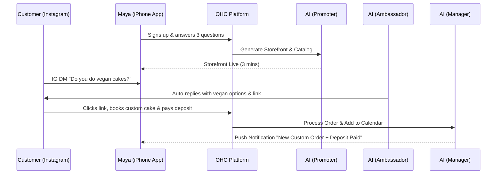
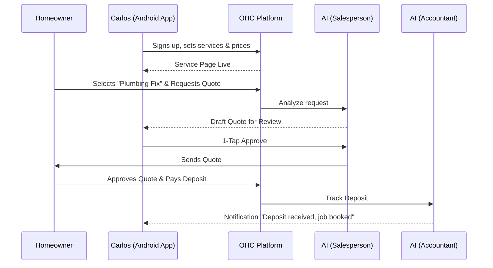

# [architecture] Business Journey Architecture

## Problem Statement
Small business owners (our personas like Maya the baker, Carlos the handyman) lack the technical knowledge to navigate complex software to launch and run their businesses. Current platforms like Shopify or Wix require significant technical setup, causing friction and drop-off. We need to define a seamless, 10-minute end-to-end journey from initial discovery to active business operations, ensuring every touchpoint is intuitive, mobile-first, and heavily supported invisibly by AI agents. This journey must cover acquisition, onboarding, activation, retention, revenue upgrade triggers, and referral loops.

## Research Report
### Competitive Analysis
- **Shopify:** Complex onboarding taking 30-60 minutes. Requires high technical literacy. Desktop-centric management.
- **Wix/Squarespace:** Simpler than Shopify but still takes 20-40 minutes. Design-heavy and can be overwhelming for simple needs.
- **GoDaddy:** Basic, but lacking advanced AI integration and truly seamless mobile management.

### Key Persona Insights
- **Maya (Baker):** Operates entirely from an iPhone. Needs Instagram DM integration and simple deposit structures.
- **Carlos (Handyman):** Operates on an Android phone. Needs clear service listings and booking without complex calendars.
- **Priya (Boutique):** Needs inventory sync between physical and digital.
- **Leo (Tutor):** Needs subscription billing and link-in-bio setups.
- **Fatima (Food Cart):** Needs simplicity, multilingual support, and works on a low-end device.

## Design Doc

### Architecture Diagrams (Mermaid.js)

#### 1. Maya (The Home Baker) - Journey

#### 2. Carlos (The Freelance Handyman) - Journey

### UI Wireframes & Screen Flow (375px First)
1. **Acquisition/Landing:** Clean CTA "Start your business in 10 minutes. Zero code."
2. **Onboarding (Wizard):**
   - Screen 1: "What do you do?" (e.g., "I bake cakes")
   - Screen 2: "How do you want to get paid?" (e.g., "Deposits", "Full Payment")
   - Screen 3: "Generating your business..." (AI progress indicators)
3. **Activation (Dashboard):** Single metric focus (e.g., "0 Orders Today"). Large FAB for "Share Store Link".
4. **Retention (Push Notification):** "Your weekly health report is ready! You had 5 orders this week."
5. **Revenue Upgrade:** When Maya hits the 100 API actions/month limit, a soft prompt: "Upgrade to Starter for $9/mo to let AI handle unlimited customer DMs."

### Mobile UX Flow
- **Frictionless Onboarding:** No complex settings. Uses AI to infer defaults (e.g., local currency, default return policies based on business type).
- **Native Interactions:** Uses native date pickers, numeric keypads for pricing, and bottom sheets for actions.
- **Optimistic UI:** Actions like approving a quote update instantly, with background retries if network is slow (critical for users like Fatima).

### AI Agent Integration Points
- **Onboarding:** Promoter agent generates initial site and catalog.
- **Operations:** Manager agent orchestrates order states and inventory.
- **Sales:** Salesperson agent drafts quotes from raw user text.
- **Customer Success:** Ambassador agent handles incoming DMs/chats.
- **Finance:** Accountant agent generates plain-language financial reports.

### Key Design Decisions & Rationale
- **AI-Led Onboarding:** Reduces 30-minute setups to <3 minutes. AI makes educated guesses that the user can later tune.
- **Draft-for-Review Default:** High-risk actions (quotes, public posts) require 1-tap approval. Builds trust.
- **Mobile-Exclusive Focus:** Deskless workers (bakers, handymen, food carts) do not use laptops during business hours. Desktop parity is secondary.

## Implementation Prompt
**User-Facing Outcome:** The user (non-technical business owner) experiences a frictionless, guided onboarding flow where they provide basic business details, and AI agents instantly generate their storefront, catalog, and operational defaults. The user is left on a mobile-optimized dashboard ready to accept their first order.
**Critical User Journey (CUJ):**
1. User creates an account.
2. User completes a 3-step business profile wizard.
3. System provisions tenant, generates site, and configures AI agents.
4. User lands on the dashboard and copies their shareable link.
**Acceptance Criteria:**
- The end-to-end flow from sign-up to a live shareable link takes less than 10 minutes.
- The UI is fully responsive and optimized for a 375px width.
- The system correctly instantiates AI agent profiles based on the selected business type.
- Appropriate tracking metrics are emitted for onboarding drop-off points.

## Priority
P0

## Estimated Scope
Large
