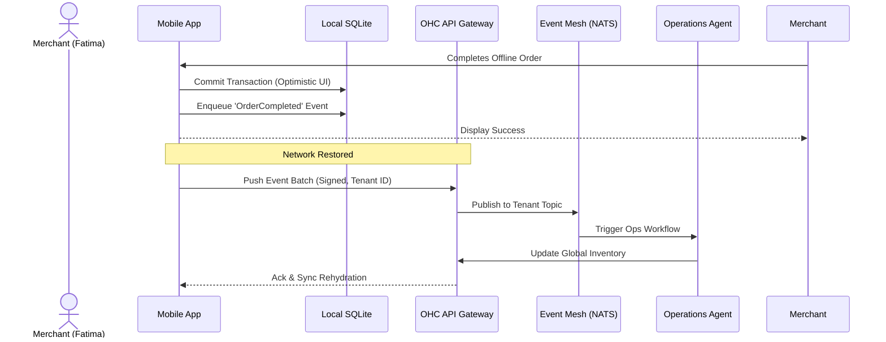

# [Architecture] Hybrid Event Mesh & Offline Sync

## Problem Statement

Small business owners using OneHumanCorp (OHC) need to manage their businesses seamlessly across mobile apps and potentially offline environments (e.g., a pop-up shop, food cart with spotty reception, or a local desktop standalone mode) while ensuring that data is ultimately synchronized and safe. Currently, there is a gap in achieving low-latency, scalable, and decentralized event routing that works seamlessly across multi-tenant cloud environments and local/offline instances without causing data loss, race conditions, or "Financial Fog". When a user creates an invoice offline or processes a tap-to-pay transaction, the system must guarantee synchronization with the cloud backend without requiring manual intervention, preserving multi-tenant isolation and strict Zero Trust security.

## Research Report

**Competitor Analysis:**
- **Shopify:** Primarily relies on cloud-first syncing. Offline POS transactions can be queued, but the logic is tightly coupled to their POS hardware ecosystem rather than a generic decentralized event mesh.
- **Wix:** Lacks robust offline-first synchronization capabilities. Mobile management is strictly dependent on network availability.
- **Square:** Offers an offline mode for transactions, but struggles with real-time multi-terminal inventory sync when network state is intermittent.

**Key Learnings:**
1.  **Network Resilience is a Feature:** Small businesses (like Fatima the food cart operator) cannot halt operations when the internet drops.
2.  **Conflict Resolution:** Bidirectional sync requires deterministic conflict resolution, typically using a robust event sourcing or distributed append-only ledger model.
3.  **Security at the Edge:** Multi-tenant isolation and Zero Trust identity (SPIFFE/SPIRE) must extend to the mobile/offline edge, ensuring that locally queued events are cryptographically signed before eventual transmission.

## Design Doc

### Key Design Decisions
- **Event-Sourced Edge Synchronization:** The mobile client and standalone desktop operate using an embedded SQLite database as an optimistic local cache and an append-only event queue.
- **NATS Hybrid Event Mesh:** Use a NATS-based (or similar lightweight, highly available pub/sub) hybrid event mesh that bridges the local client queue and the cloud Rust API server.
- **Multi-Tenant Isolation:** All events pushed to the cloud must include a strongly typed, validated `tenant_id`. The API gateway enforces multi-tenant boundary checks before passing events to the Orchestration Hub.
- **Zero Trust Security:** Edge clients authenticate via OIDC, mapping into short-lived SPIFFE/SPIRE identities to sign their event batches.
- **Mobile-First UX:** The user interface remains instantaneous (Optimistic UI). Sync status is indicated by subtle, non-intrusive icons (e.g., a small cloud icon on the dashboard card).

### Architecture Diagram (Mermaid.js)

```mermaid
graph TD;
    subgraph Edge Client (Mobile/Standalone)
        UI[Tauri/Mobile UI] --> LocalStore[(SQLite SIPDB)];
        UI --> EventQueue[Local Event Queue];
        EventQueue --> EdgeSyncDaemon[Edge Sync Daemon];
    end

    subgraph OHC Cloud (Multi-Tenant)
        API[Rust API Gateway / Auth] --> NATS[NATS Hybrid Event Mesh];
        NATS --> Orchestration[Orchestration Hub];
        Orchestration --> Agents[AI Agents];
        Orchestration --> Postgres[(Postgres Main DB)];
    end

    EdgeSyncDaemon -- "mTLS + Signed Events" --> API;
    API -- "State Rehydration" --> LocalStore;
```



### Mobile UX Flow (375px)
1.  **Offline Action:** Fatima creates an order while in a low-connectivity zone. She taps the primary action button.
2.  **Optimistic Success:** A success toast appears instantly. A subtle "sync pending" icon appears on the order card, adhering to the translucent glass material design.
3.  **Background Sync:** The `Edge Sync Daemon` waits for a stable connection. It does not block the UI or drain battery with aggressive polling.
4.  **Resolution:** Upon sync, the icon fades out. If a conflict occurs (e.g., double-booked inventory), an AI Agent intercepts it and sends a plain-language actionable notification ("Heads up: Stock adjusted for Order #123").

### AI Agent Integration Points
- **The Operations Agent:** Consumes synced events to reconcile global inventory and resolve conflicts.
- **The Finance Agent:** Processes offline tap-to-pay tokens synced to the cloud to finalize ledger entries.

## Implementation Prompt

**Prompt for Implementer Agent:**
Implement the Hybrid Event Mesh and Offline Sync infrastructure bridging the local Edge client (Tauri/Mobile SQLite) and the OHC Multi-Tenant Cloud. You must design a robust bidirectional sync daemon that handles intermittent connectivity gracefully. The system must utilize an append-only event logging pattern locally, guaranteeing at-least-once delivery to the cloud. Strict multi-tenant isolation and Zero Trust security protocols (SPIFFE/SPIRE/OIDC) must be enforced at the API gateway layer. Ensure that the mobile UI remains responsive (Optimistic UI) regardless of sync state. Provide the data structures and event schemas necessary to support conflict-free replication for core entities like Orders and Inventory.

## Priority
P0

## Estimated Scope
Large
