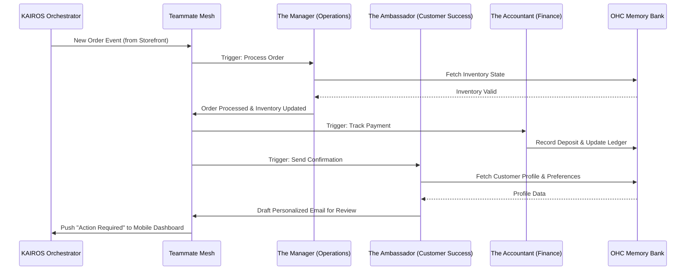

# [architecture] AI Agent Department Architecture

## Title
AI Agent Department Architecture: Invisible, Autonomous Teammates for Small Business Owners

## Problem Statement
Small business owners like Maya (baker) and Carlos (handyman) wear too many hats. They are acting as their own marketer, accountant, customer support rep, and operations manager, leaving little time for the actual craft they love. When they seek help, traditional platforms (Shopify, Wix) offer them complex "tools" (dashboards, email builders, analytics charts) that require time and technical knowledge to use. The opportunity is to move from providing "tools" to providing "teammates"—AI agents organized into familiar business departments that invisibly handle the complexity in the background, working while the owner sleeps.

## Research Report
- **Competitive Gap**:
  - *Shopify / Wix / Squarespace*: These platforms require the user to actively operate them. They have added "AI features" (e.g., text generation, image cropping) but these are still just reactive tools requiring a prompt.
  - *GoDaddy*: Offers basic setup AI but lacks ongoing operational automation.
- **The "Teammate" Model**: Instead of a generic "chatbot," OHC's agents are structured like a real company. A non-technical owner understands what an "Accountant" or a "Salesperson" does implicitly.
- **Findings**: Solopreneurs lose up to 30% of sales due to slow response times to inquiries and spend an average of 15 hours a week on administrative tasks. Proactive, event-driven agents that can draft responses and manage operations can reclaim this time.

## Design Doc

### Architecture Diagram

### UI Wireframes & Screen Flow (375px first)
1. **Home Feed (The Dashboard)**: A vertically scrolling, plain-language activity feed (Action Required vs. FYI). Glassmorphism cards represent agent actions.
2. **Action Required Card**: E.g., "The Ambassador drafted a reply to Sarah about vegan cakes."
   - **Primary CTA**: "Approve & Send" (Large, 44x44px minimum touch target).
   - **Secondary CTA**: "Edit" or "Reject".
3. **Department Overview Screen**: A grid of friendly avatars representing the 7 departments (Manager, Promoter, Salesperson, Ambassador, Accountant, Protector, Advisor). Tapping one shows recent actions and settings.

### Mobile UX Flow
- **Event Triggered**: A customer messages the business.
- **Background Processing**: The Ambassador agent drafts a reply based on past memories.
- **Notification**: The business owner receives a push notification: "New Draft Reply Ready."
- **1-Tap Action**: The owner opens the app directly to the Action Card, reads the summary, and taps "Approve." The app optimistically updates the UI, returning them to their day in under 30 seconds (The Grandmother Test).

### AI Agent Integration Points
- **The Manager (Operations)**: Integrates into the order flow and inventory sync mesh.
- **The Promoter (Marketing)**: Plugs into product catalog updates to trigger social media posts.
- **The Salesperson (Sales)**: Intercepts inbound booking requests to draft quotes.
- **The Ambassador (Customer Success)**: Listens to order status changes (e.g., shipped) to communicate with customers.
- **The Accountant (Finance)**: Hooks into payment gateways to summarize daily revenue.
- **The Protector (Legal)**: Scans new products for compliance and updates terms.
- **The Advisor (Advisory)**: Analyzes weekly aggregated data to produce simple insights.

### Key Design Decisions and Why
- **Event-Driven Over Prompt-Driven**: Agents respond to system events (e.g., `tenant.order.created`) via the KAIROS Orchestrator rather than waiting for user prompts. Why? Because small business owners don't have time to write prompts.
- **Draft-for-Review (1-Tap Approvals)**: High-risk external actions (sending emails, publishing posts, refunding money) must be approved by the owner. Why? To build trust and prevent rogue AI behavior while maintaining a frictionless UX.
- **Unified Memory Model**: All agents share access to a central `pgvector`-backed memory bank. Why? So the Salesperson knows what the Ambassador discussed with a customer last week, preventing disjointed experiences.
- **Department Personification**: Using friendly titles ("The Promoter") instead of technical terms ("Marketing Automation Workflow"). Why? Radical Simplicity and adherence to the non-technical persona.

## Implementation Prompt
**To Implementer Agent:**
Implement the core KAIROS event routing for the AI Agent Departments and the Draft-for-Review mobile UX flow.
- Build the orchestrator logic that listens for business events and routes them to the appropriate department.
- Implement the "Action Required" feed UI for the 375px mobile viewport, ensuring all touch targets are at least 44x44px and use OHC premium design tokens.
- **CUJ**: A new order is placed. The system routes this to Operations to update inventory, and then triggers Customer Success to draft a thank-you note. The drafted note appears in the owner's mobile feed, where they can approve it with a single tap.
- **Acceptance Criteria**: The event routing successfully connects two departments. A drafted action is displayed on the mobile UI. The 1-tap approval transitions the task state and executes the action. Ensure optimistic UI updates are used so the owner is not blocked waiting for network responses.

## Priority
P0

## Estimated Scope
Large
