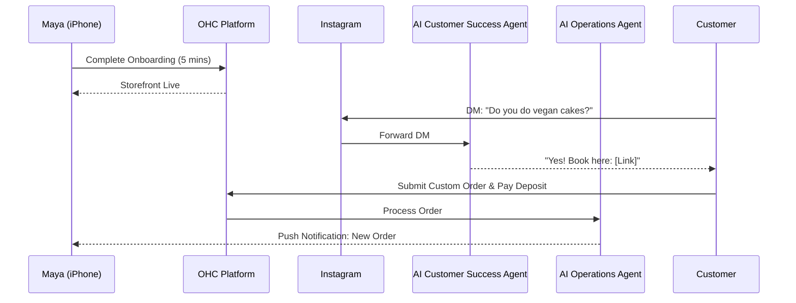
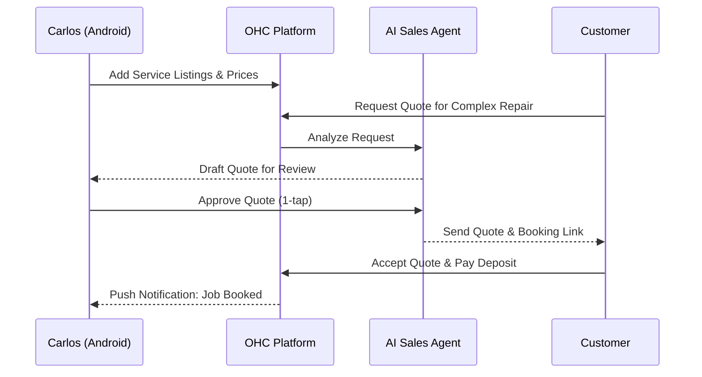
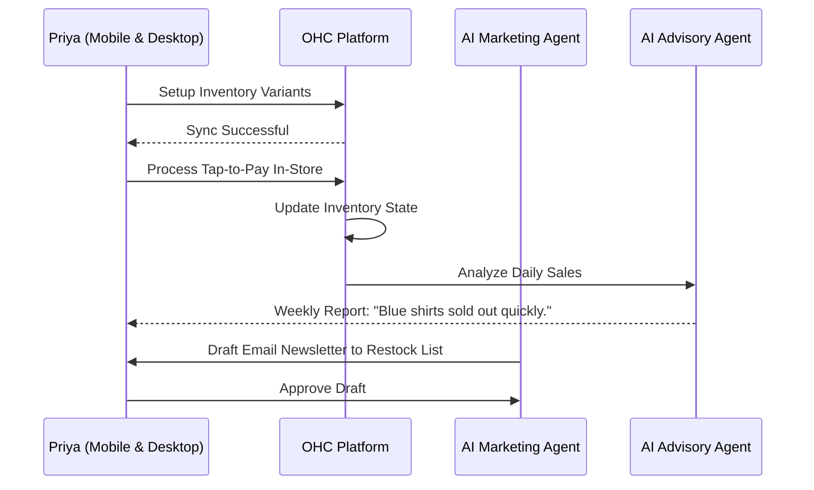
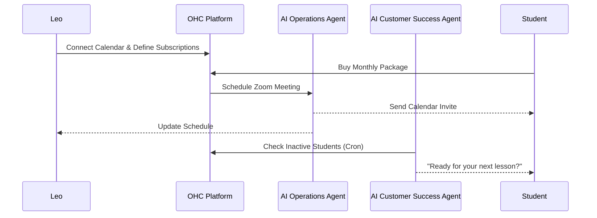
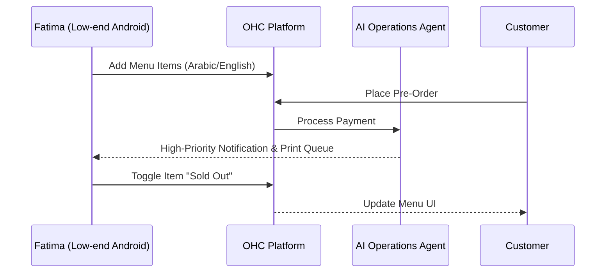

# Business Journey Architecture

## Problem Statement
The OHC platform aims to serve a wide range of non-technical small business owners. However, each user persona requires a distinct end-to-end journey from initial discovery to successful onboarding, active usage, and eventual business growth. There is currently no formalized architecture detailing how these distinct personas traverse the platform's acquisition, activation, retention, revenue, and referral funnels. This lack of definition risks creating disjointed user experiences, conflicting AI integrations, and suboptimal activation rates.

## Research Report
### Goal
To define the complete end-to-end user journey for five distinct personas:
- **Maya** (The Home Baker)
- **Carlos** (The Freelance Handyman)
- **Priya** (The Boutique Owner)
- **Leo** (The Music Tutor)
- **Fatima** (The Food Cart Operator)

### Analysis & Insights
- **Acquisition**: Many non-technical users find OHC through organic search, word of mouth, or direct links on social media platforms (e.g., TikTok, Instagram). The landing page CTA must clearly address their specific industry needs.
- **Onboarding**: A lengthy setup process is a primary cause of drop-off. The onboarding flow must be reduced to essential inputs (business name, primary product/service), deferring complex setups (e.g., SEO, advanced inventory) to AI agents or later stages.
- **Activation**: Success is typically defined by adding the first product/service and receiving the first booking or payment. AI agents are critical in bridging the gap between setup and first sale.
- **Retention**: Regular engagement is driven by daily notifications (e.g., new orders) and weekly AI-generated business health reports.
- **Revenue**: Upgrades from the Free tier to paid tiers (Starter, Pro) are often triggered by the need for custom domains, higher order limits, or advanced AI capabilities.

### Competitive Context
- **Shopify / Wix / Squarespace**: Focus on complex storefronts and portfolios. Their onboarding can take 30-60 minutes and requires some technical comfort.
- **OHC's Advantage**: Targets the "zero technical knowledge" user. The platform guarantees a live business in under 10 minutes via a mobile-first, AI-driven experience.

## Design Doc

### 1. Persona Journeys & Sequence Diagrams

#### Maya (The Home Baker)
**Journey:**
- **Acquisition:** Discovers OHC via an Instagram ad showing an easy mobile setup.
- **Onboarding:** Enters business name, uploads a few cake photos, sets custom order deposit requirements. The setup takes 5 minutes on her iPhone.
- **Activation:** Receives her first custom cake request via Instagram DM. The AI Customer Success Agent replies and directs the customer to the OHC booking link.
- **Retention:** Checks daily order notifications and delivery schedules.
- **Revenue:** Upgrades to the Starter tier when she needs a custom domain for a more professional look.
- **Referral:** Shares her storefront link with other local bakers.

**Sequence Diagram:**

#### Carlos (The Freelance Handyman)
**Journey:**
- **Acquisition:** Hears about OHC from a friend.
- **Onboarding:** Selects "Service" template, adds "Plumbing Fixes" and "General Repairs" with prices.
- **Activation:** A customer books a slot and pays a deposit.
- **Retention:** Uses the mobile app (Android) as his primary calendar and customer inbox. AI Sales Agent generates quotes for complex jobs.
- **Revenue:** Upgrades to Pro when he needs more than 100 bookings/month.
- **Referral:** Mentions the easy booking app to other contractors on job sites.

**Sequence Diagram:**

#### Priya (The Boutique Owner)
**Journey:**
- **Acquisition:** Searches Google for "easy online store for physical shop".
- **Onboarding:** Imports basic inventory details (sizes/colors) via the web dashboard.
- **Activation:** Makes her first in-person sale using OHC tap-to-pay, which syncs with her online inventory.
- **Retention:** Relies on daily mobile analytics (revenue, top-selling items) and AI Marketing Agent for automated email newsletters.
- **Revenue:** Requires Pro tier for unlimited products and advanced analytics.
- **Referral:** Demonstrates the tap-to-pay feature to neighboring store owners.

**Sequence Diagram:**

#### Leo (The Music Tutor)
**Journey:**
- **Acquisition:** Sees a TikTok video about OHC's link-in-bio and booking integration.
- **Onboarding:** Sets up lesson packages (subscriptions) and connects Google Calendar.
- **Activation:** First student purchases a monthly lesson package.
- **Retention:** AI Customer Success Agent automatically follows up with students who haven't booked recently.
- **Revenue:** Upgrades to Starter for advanced subscription management features.
- **Referral:** Adds "Powered by OHC" to his link-in-bio.

**Sequence Diagram:**

#### Fatima (The Food Cart Operator)
**Journey:**
- **Acquisition:** Local community organization recommends OHC for easy pre-orders.
- **Onboarding:** Simple UI (Arabic/English toggle) to add menu items and photos.
- **Activation:** Customer pre-orders lunch; Fatima receives a loud notification on her low-end Android device.
- **Retention:** Uses the app to quickly toggle items as "Sold Out" and prints daily order lists.
- **Revenue:** Remains on the Free or Starter tier, valuing simplicity and reliability.
- **Referral:** Word of mouth within the local food cart community.

**Sequence Diagram:**

### 2. UI Wireframes & Mobile UX Flow (375px First)

**Screen 1: Landing Page / CTA**
- **Header:** "The easiest way to run your business." (Glassmorphism nav bar, Outfit typography).
- **Body:** Dynamic text based on referring source (e.g., "Start your bakery online").
- **CTA:** "Get Started for Free" (Large touch target, ≥ 44x44px).

**Screen 2: Onboarding Wizard (Step 1)**
- **Header:** "What do you do?"
- **Input:** Single text field (native mobile keyboard) for business name.
- **Selection:** Visual grid of business types (Physical, Digital, Services, Food).

**Screen 3: AI-Assisted Setup**
- **Animation:** Subtle progress indicator. "Our AI is setting up your storefront..."
- **Result:** Preview of the generated mobile site.

**Screen 4: Dashboard (The Command Center)**
- **Top:** "Good Morning, Maya."
- **Cards (Glassmorphism panels):**
  - "New Orders (3)"
  - "Pending Reviews (1)" - Draft responses from AI Customer Success Agent.
- **Bottom Navigation:** Home, Orders, AI Agents, Settings.

**Screen 5: AI Draft Review**
- **Header:** "Review Quote for Carlos"
- **Content:** The AI-generated message.
- **Actions:** "Edit" (secondary) or "Approve & Send" (primary, gradient background).

### 3. AI Agent Integration Points
- **Onboarding**: AI Marketing Agent pre-fills website templates, descriptions, and basic SEO based on the selected business type.
- **Daily Operations**: AI Operations Agent automatically updates inventory counts and triggers reorder warnings.
- **Customer Interactions**: AI Customer Success Agent drafts replies for incoming messages (DMs, emails) and places them in a "Draft-for-Review" queue on the mobile dashboard.
- **Growth & Retention**: AI Advisory Agent analyzes the `tenant_id`'s metrics weekly and generates a plain-language summary card ("Your top seller was lemonade. Tuesday was your busiest day.").

### 4. Key Design Decisions
- **Mobile-First Exclusively**: Onboarding and daily management must be flawlessly executable on a 375px screen. Forms must leverage native mobile keyboards (e.g., numeric keypad for pricing).
- **Deferred Complexity**: Users are not asked about shipping zones or tax rules during initial setup. The AI handles basic defaults, and advanced settings are progressively disclosed later.
- **1-Tap Approvals**: To build trust, AI actions that interact with customers (sending quotes, replying to DMs) default to a draft state requiring the user to explicitly tap "Approve" on their phone.
- **Plain Language Analytics**: Dashboards display actionable sentences generated by the AI Advisor, not complex charts.

## Implementation Prompt
"Implement the foundational multi-tenant data models, API endpoints, and React/Flutter UI components to support the end-to-end user journeys defined for Maya, Carlos, Priya, Leo, and Fatima. The system must support a unified onboarding flow that dynamically adapts based on the selected business category (Physical, Digital, Services, Food). Ensure that the KAIROS Orchestrator is integrated to trigger the AI Marketing Agent during onboarding to auto-generate the initial storefront setup. All user-facing interfaces must adhere to the 375px mobile-first design system and utilize the OHC Premium Token library. Ensure robust telemetry is emitted during the onboarding funnel to track drop-off points."

## Priority
P0

## Estimated Scope
Large
