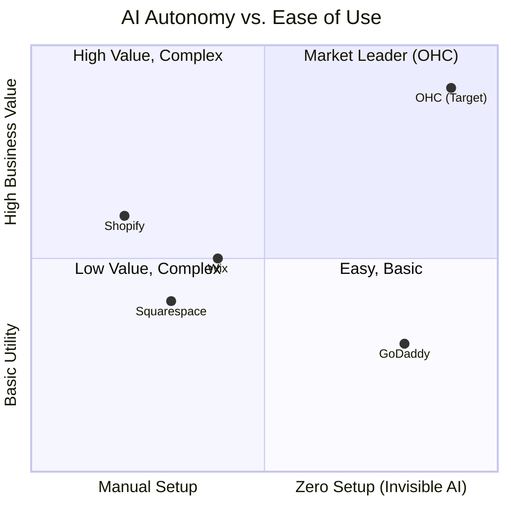
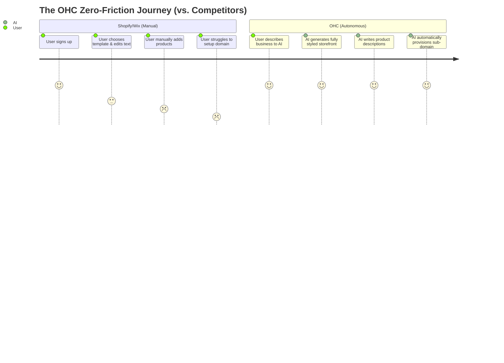

# Research Report: OHC AI Differentiation & Feature Gap Analysis

## Executive Summary
This report analyzes the competitive landscape, user pain points, and strategic direction for OneHumanCorp (OHC). OHC's mission is to empower non-technical small business owners (like Maya the baker and Carlos the handyman) to launch and run their operations exclusively from a mobile device (375px viewport), leveraging autonomous AI agents as the core infrastructure, not just as add-on chatbots.

---

## Track 1: Deep Competitor Audit

### Competitive Feature Gap Matrix
| Feature | Shopify | Wix | Squarespace | GoDaddy | OHC (Target Advantage) |
|---|---|---|---|---|---|
| **Setup Time** | 30-60 min | 20-40 min | 30-60 min | 20-40 min | **< 10 min** |
| **Mobile-First Management** | Partial (Secondary to desktop) | Basic Management | Content Only | Very Limited | **100% Parity (375px native)** |
| **AI Integration** | Bolt-on Chatbot (Sidekick) | Site Generation Only | Limited | Branding Only | **Autonomous Agent Departments** |
| **Omnichannel Booking & Inbox**| Fragmented/App-dependent | Average | Average | Poor | **Built-in, Unified** |
| **Technical Knowledge Req.** | Low-to-Medium | Low | Low | Low | **Zero** |

### Competitor Breakdown
- **Shopify:** Industry standard but heavily optimized for desktop-first, complex e-commerce. Overwhelming for service providers or solopreneurs. AI (Sidekick) acts as a reactive assistant rather than a proactive operator.
- **Wix / Squarespace:** Strong design builders, but setting up a full business logic stack (bookings, payments, inventory) is cumbersome and lacks deep mobile-first management.
- **GoDaddy:** Fast setup but rigid, basic, and lacks deep AI integration or seamless mobile management. Known for aggressive upselling.
- **Emerging AI Builders (Durable, 10Web):** Fast initial site generation, but extremely thin on ongoing business management (inventory, omnichannel CRM).

---

## Track 2: SMB User Pain Point Research

### Top 10 Validated SMB Pain Points & Persona Mappings

1. **Communication Overload & Lost Leads:** Losing revenue due to delayed responses to IG DMs, SMS, and web chat.
   - *Persona impacted:* Carlos (Handyman) loses leads while on a job site; Maya (Baker) fields DMs late at night.
2. **The "Blank Canvas" Setup Paralysis:** Overwhelmed by complex website builders, DNS settings, and design choices.
   - *Persona impacted:* Maya (Baker) and Fatima (Food Cart) are paralyzed by design choices and terminology.
3. **Mobile Management Friction:** Inability to run the full business (especially editing the storefront or managing complex bookings) purely from a smartphone.
   - *Persona impacted:* Fatima (Food Cart) only has an Android device; Carlos needs to send quotes from the field.
4. **Disjointed Tooling:** Having to stitch together separate apps for website, booking calendar, payments, and marketing.
   - *Persona impacted:* Leo (Tutor) struggles with Zoom, Calendly, and payment links out of sync.
5. **Quoting & Booking Inefficiencies:** Interrupting physical work to manually draft quotes or negotiate available times.
   - *Persona impacted:* Carlos spends hours manually drafting quotes based on custom requests.
6. **Financial Visibility:** Difficulty understanding daily profit/loss without checking multiple bank accounts or complex dashboards.
   - *Persona impacted:* Priya (Boutique) struggles to sync online sales with in-person POS.
7. **Marketing Paralysis:** Knowing they "should be posting on social media" but lacking the time or skills to do so consistently.
   - *Persona impacted:* Maya's (Baker) IG feed stalls when she is busy fulfilling orders.
8. **Inventory Syncing Issues:** Selling out in-person but failing to update the online store, leading to refunds.
   - *Persona impacted:* Fatima (Food Cart) sells out of chicken but users keep ordering online.
9. **Jargon Alienation:** Confused by terms like "SEO", "Payment Gateway", "SKUs", and "CNAME records".
   - *Persona impacted:* All personas; "jargon" is a universal friction point preventing activation.
10. **Pricing Tiers:** Forced into expensive subscription plans before making their first sale.
    - *Persona impacted:* New solopreneurs (e.g., student selling art) cannot justify $29/mo upfront.

---

## Track 3: AI Differentiation Manifesto

OHC will leapfrog competitors by shifting from "AI as a reactive tool" to "AI as invisible infrastructure."

### The 5 Core AI Automations for OHC
1. **The Instant Storefront (Marketing & Advertising):** Generates a beautiful, Glassmorphism-styled website based on a simple text prompt. Eliminates the "blank canvas" problem.
2. **The Omnichannel Auto-Responder (Customer Success):** Invisibly monitors all channels (IG, Web, SMS), contextually drafts replies based on the business's knowledge base, and allows 1-tap sending. Solves "communication overload."
3. **The Dynamic Quote Engine (Sales & Acquisition):** Parses service inquiries, checks calendar availability, and drafts professional quotes automatically. Solves "lost leads" for service businesses.
4. **The Weekly Advisor (Business Advisory):** Pushes a plain-language notification (e.g., "Your vegan cakes are trending. You made $150 yesterday.") instead of a complex chart. Solves "financial visibility" without overwhelming the user.
5. **The Autonomous Content Creator (Marketing & Advertising):** Auto-generates social posts and product descriptions based on uploaded photos. Solves "marketing paralysis."

---

## Track 4: Market Sizing & Strategic Direction

- **Target Beachhead:** Service-based solopreneurs (e.g., Carlos the handyman, Leo the tutor) and micro-retailers (e.g., Maya the baker). These segments suffer the most from fragmented tools and are underserved by Shopify's product-heavy focus.
- **Free Tier Strategy:** Provide a genuinely useful Free tier that allows taking payments and basic AI usage. Monetize via volume limits (e.g., number of products, AI action quotas) and premium branding (custom domains), converting users naturally as they grow.
- **Mobile Uncompromising:** Absolute enforcement of 375px design parity. If a feature cannot be managed from an iPhone SE, it is not shipped.

---

## Track 5: Feature Gap & Issue Briefs

Based on the architectural research docs, the following critical gaps require immediate implementation.

### Issue Brief: Mobile-First Offline Caching & Mutation Queue
- **Title:** Implement Mobile-First Offline Optimistic UI Sync
- **Problem:** Users with poor connectivity (e.g., Food Carts) experience app freezes or lost data when managing orders or inventory.
- **Design Doc:** Implement a local offline cache and background sync queue. Read-only dashboards must load instantly offline. State mutations (e.g., toggling "Sold Out") must update the UI optimistically and sync silently when reconnected.
- **Implementation Prompt:** Build the local caching layer and background sync worker for the mobile client. Ensure the main dashboard loads without network access. Refactor the "Add Product" flow to use optimistic UI updates. Provide an E2E test simulating an offline product addition and subsequent online sync.
- **Priority:** P0
- **Scope:** Large

### Issue Brief: Conversational "Do-It-For-Me" Website Builder
- **Title:** AI-Assisted Conversational Website Builder UX
- **Problem:** Non-technical users abandon standard drag-and-drop website builders on mobile devices due to complexity and tiny touch targets.
- **Design Doc:** Replace the drag-and-drop canvas with a conversational interface powered by the Marketing Agent. The user chats their requirements, and the agent dynamically updates a live, scrolling 375px preview. Customization is limited to high-level block swapping and theme selection.
- **Implementation Prompt:** Develop the conversational builder UI. Implement a split view (or alternating flow) between the chat interface and the live site preview. Ensure standard content blocks (Hero, Product Grid) can be swapped via simple tap actions. Include an E2E test verifying a user can generate and publish a site via the chat flow.
- **Priority:** P0
- **Scope:** Large

### Issue Brief: Omnichannel Quote & Booking Engine
- **Title:** AI Quote & Booking Auto-Draft Engine
- **Problem:** Service providers lose leads because they cannot manually draft quotes and check availability quickly while working.
- **Design Doc:** Integrate the Sales Agent to monitor incoming messages. When a service intent is detected, the agent queries the predefined service catalog and calendar availability to draft a quote and proposed time slot. The drafted response is pushed to the user as a mobile notification for 1-tap approval.
- **Implementation Prompt:** Implement the backend intent classification and quote generation logic within the Sales Agent. Build the mobile notification and 1-tap approval UI. Ensure the generated booking link works flawlessly. Provide an E2E test from message ingestion to quote approval.
- **Priority:** P0
- **Scope:** Large

### Issue Brief: Frictionless SaaS Tier Exhaustion UX
- **Title:** Graceful Degradation & 1-Tap Upgrade Flows
- **Problem:** Users hit usage limits abruptly, leading to broken workflows and frustration, rather than seeing it as a positive growth milestone.
- **Design Doc:** Implement in-context upgrade modals (e.g., when adding an 11th product on the Free tier). Use the Advisory Agent to frame limit warnings positively. Ensure core features (like payments) never break; only AI automation degrades to manual mode when quotas are hit.
- **Implementation Prompt:** Build the UI states for quota warnings and exhaustion across the app. Implement a 375px-optimized bottom sheet for 1-tap upgrades using native mobile payments. Ensure the AI Chat interface gracefully falls back to a manual text input when limits are reached. Include an E2E test verifying the upgrade prompt behavior upon limit exhaustion.
- **Priority:** P1
- **Scope:** Medium

