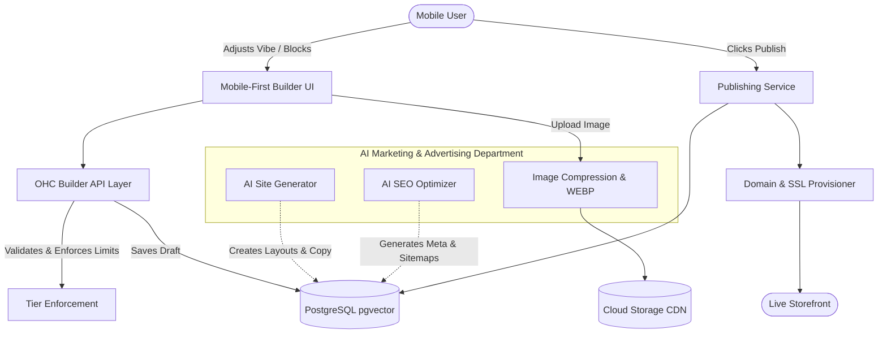

# [architecture]_website_storefront_builder

## Title
Website & Storefront Builder Architecture for Non-Technical Users

## Problem Statement
Small business owners like Maya (baker), Carlos (handyman), and Priya (boutique owner) need a professional, beautiful online presence to sell products, services, and manage bookings. Existing platforms (Shopify, Wix, Squarespace) require significant time (30-60 minutes) and technical or design knowledge to set up. OHC aims to allow anyone to go from idea to a live, professional business website in under 10 minutes, entirely from a mobile phone. The current OHC platform requires a formalized drag-and-drop website builder architecture that invisibly leverages AI for design, content generation, and SEO, while providing a frictionless, mobile-first customization experience.

## Research Report
### Competitive Analysis
- **Shopify:** Complex configuration, desktop-first management, assumes technical competency for theme customization. No built-in AI for complete layout generation.
- **Wix:** Powerful but overwhelming interface. Mobile editing is secondary. "Wix AI" requires multiple prompts and often produces generic results.
- **Squarespace:** Desktop-centric. Focuses on visual professionals, difficult for basic service providers (like Carlos) to configure quickly.
- **GoDaddy:** Basic builder, but rigid templates. Weak integrations for bookings and custom product variants.
- **OHC Advantage:** Zero-configuration required. AI "Marketing & Advertising" department generates a fully functional, personalized site (layout, copy, images, SEO) based on 2-3 initial questions. The builder interface is strictly mobile-first (375px baseline) and relies on intuitive content blocks rather than complex grid systems.

### Content Blocks
The builder will utilize a predefined set of intuitive content blocks:
- **Hero Section:** Headline, subtitle, call-to-action (CTA) button, background image/video.
- **Product Grid:** Synchronized with inventory, supports variants and "sold out" toggles.
- **Service/Booking:** Calendar integration for time slot selection and deposits.
- **Text/Image Duo:** For about us, story, or feature highlights.
- **Testimonials/Reviews:** Dynamic block pulling from Customer Success agent records.
- **Contact Form:** Directs inquiries to the Sales/Customer Success agent inbox.
- **Footer:** Auto-generated legal links, social media icons, and business hours.

### Templates & Customization
- **Theme Tokens:** Employs the OHC Premium Token library (Glassmorphism, Outfit/Inter typography, color palettes).
- **Customization:** Users adjust "Vibe" (e.g., Playful, Elegant, Minimal) rather than hex codes.
- **Publishing Flow:** "Draft" mode auto-saves. "Publish" triggers a seamless transition to live, provisioning OHC subdomain or custom domain instantly.
- **SEO & Domains:** AI automatically generates meta tags, alt text, and sitemaps. Custom domains are provisioned with automatic Let's Encrypt SSL.

## Design Doc

### Architecture Diagram

### Mobile UX Flow (375px Baseline)
1.  **Onboarding:** AI asks: "What's the name of your business?" and "What do you sell?"
2.  **Magic Generation:** Loading screen (max 5s) while AI generates the site.
3.  **Preview Screen:** Full-screen preview of the generated site. Floating action button (FAB) "Edit".
4.  **Edit Mode:** Tapping a section (e.g., Hero) slides up a bottom sheet with simple options: "Rewrite Text", "Change Image", "Swap Layout".
5.  **Global Style:** Tapping "Vibe" slides up predefined palettes (colors + fonts).
6.  **Publish:** Tap "Go Live" in header. Success animation, immediate shareable link provided.

### AI Agent Integration Points
- **Marketing & Advertising:** Generates the initial site, rewrites text on demand, auto-generates SEO meta descriptions, and creates alt text for uploaded images.
- **Operations:** Syncs the Product Grid block with active inventory.
- **Customer Success:** Feeds recent 5-star reviews into the Testimonial block.
- **Legal & Compliance:** Auto-generates Terms of Service and Privacy Policy pages based on the business type.

### Key Design Decisions
1.  **Vibes over Variables:** Users cannot pick arbitrary fonts or hex colors. They choose curated "Vibes" to ensure aesthetic excellence and prevent "ugly" sites.
2.  **Block-Based rather than Free-Form:** To ensure perfect mobile responsiveness and simplicity, layouts are constrained to predefined, interchangeable blocks.
3.  **Invisible AI:** AI is not a chatbot in the builder. It acts as an active assistant, pre-filling data and offering one-tap "improve" buttons.

## Implementation Prompt
**User-Facing Outcome:** Implement the backend APIs and frontend mobile-first UI for the OHC Website Builder. A user should be able to generate a complete site via the AI Marketing agent, edit content blocks (Hero, Product Grid, Text, Contact) via a bottom-sheet UI on a 375px screen, adjust the global "Vibe" (theme), and publish the site.
**Critical User Journey (CUJ):**
1. User starts site generation.
2. AI returns a fully populated site configuration.
3. User edits the Hero headline using the bottom-sheet UI.
4. User changes the global theme "Vibe".
5. User clicks "Publish".
6. System provisions the site and returns the live URL.
**Acceptance Criteria:**
- 100% functional on a 375px viewport.
- Data model correctly stores draft vs. published states.
- Publishing triggers domain/subdomain routing.
- At least 5 E2E Playwright tests covering the generation, editing, and publishing flow.

## Priority
P1

## Estimated Scope
Large
