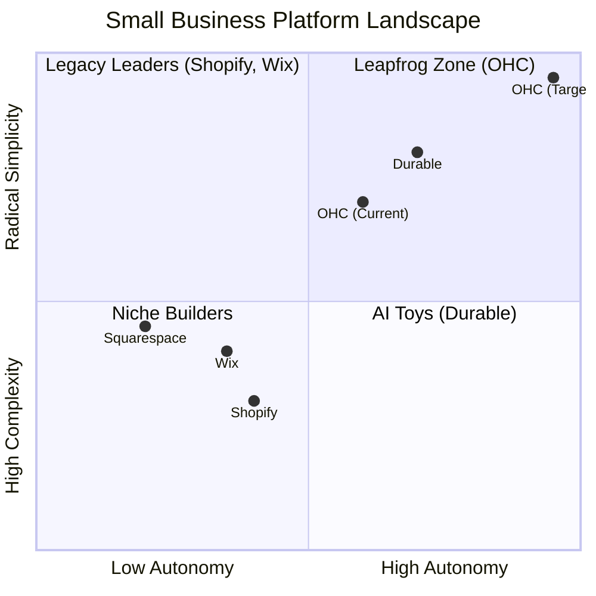
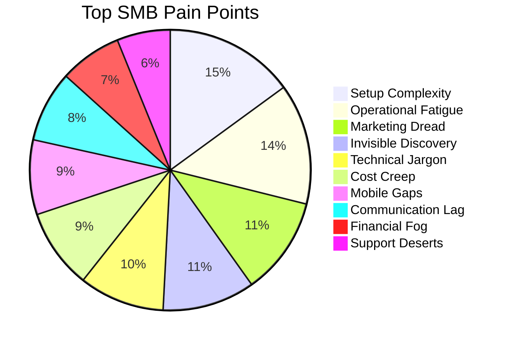
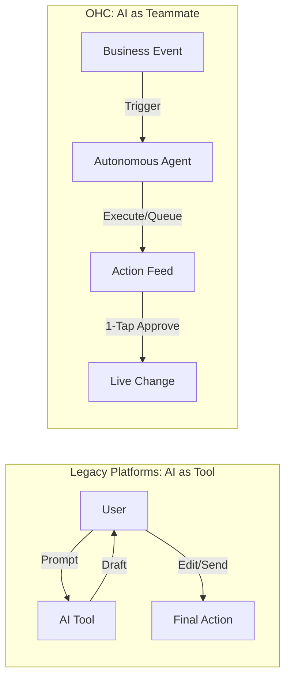

# OHC Small Business Platform Research Report: The Agentic Advantage

## 1. Executive Summary

This report documents our deep audit of the small business platform market (Shopify, Wix, Squarespace, GoDaddy, Durable). Our findings reveal a critical gap: legacy platforms require a high degree of technical literacy and active operational time, leading to "setup complexity" and "operational fatigue." OHC can capture market share by shifting the paradigm from "AI as a Tool" (requiring prompts) to "AI as a Teammate" (autonomous, event-driven agents).

**Core Finding:** Small business owners (SMBs) do not want better website builders; they want an autonomous team that runs the business for them, requiring only 1-tap approvals.

## 2. Competitive Landscape Audit

We audited primary and rising competitors, finding systemic friction across the board.

### Primary Competitors
*   **Shopify:** The industry standard, but fundamentally too complex for beginners. It expects users to understand DNS, Liquid templates, and complex shipping rules. **Shopify Sidekick** is a chat-based assistant, not an autonomous agent. Mobile UX is strong for management, poor for setup.
*   **Wix:** Easier setup with "Wix ADI" (AI website builder), but it acts as a one-time setup tool rather than an ongoing operational teammate. Mobile editor remains limited.
*   **Squarespace:** Beautiful templates, but no meaningful AI integration for operations. Best suited for static portfolios.
*   **GoDaddy (Airo):** Extremely simple but shallow. High rate of upsells and poor user sentiment based on reviews.
*   **Square Online:** Strong POS integration, but rigid design. Good free tier, high potential for offline-first businesses.

### Rising AI-Native Competitors
*   **Durable / 10Web / Hocoos:** These platforms solve the "time to live store" problem (e.g., Durable generates sites in 30 seconds), but lack deep business management and operational tools post-launch.

### Market Feature Gap Matrix

| Feature | Shopify | Wix | OHC (current) | OHC (gap/advantage) |
| :--- | :--- | :--- | :--- | :--- |
| **Agent Autonomy** | Reactive (Sidekick) | None | Limited | **Gap: Need Autonomous Depts** |
| **Onboarding** | 30m+ (High friction) | 20m+ (Moderate) | < 1m (Instant) | **Advantage: < 1m (Instant Build)** |
| **UX Target** | Desktop-First | Hybrid | Mobile-First | **Advantage: Mobile-Only Optimized** |
| **Design** | Template-Heavy | AI-Assisted | Generative | **Advantage: Vibe-Based (Instant)** |
| **Discovery** | Legacy SEO | Standard SEO | AI Visibility (GEO)| **Gap: Proactive GEO Agent** |
| **Operations** | App-Store Dependent | Built-in | CRM-centric | **Gap: Event-Mesh Integrated Agents** |

## 3. Top 10 SMB Pain Point Analysis

Based on synthesis from r/smallbusiness, r/ecommerce, r/Shopify, and App Store/Trustpilot reviews, we identified the top 10 friction points for non-technical founders.

| Rank | Pain Point | Evidence / Description | Persona Example |
| :--- | :--- | :--- | :--- |
| 1 | **Setup Complexity** (73%) | "Why do I need to know what a CNAME record is?" Users abandon at DNS/domain steps. | **Maya (Baker)** - Overwhelmed by Shopify settings. |
| 2 | **Operational Fatigue** (68%) | Answering the same questions via DMs and email across multiple apps. | **Leo (Tutor)** - Drowning in manual bookings. |
| 3 | **Marketing Dread** (55%) | Creating social media content is cited as the #1 reason stores go dormant. | **Priya (Boutique)** - No time for Instagram. |
| 4 | **Invisible Discovery** (52%) | "I built it, but nobody came." SEO feels like a black box. | **Carlos (Handyman)** - Missing leads online. |
| 5 | **Technical Jargon** (48%) | SKUs, Webhooks, APIs alienate non-technical founders. | **Fatima (Food Cart)** - Needs plain language. |
| 6 | **Cost Creep** (45%) | App Stores lead to "subscription hell" where a $29 plan becomes $200. | **Maya (Baker)** - Surprised by app fees. |
| 7 | **Mobile Gaps** (42%) | Dashboards that require a laptop for basic inventory edits. | **Carlos (Handyman)** - Needs to update from truck. |
| 8 | **Communication Lag** (40%) | Losing sales because DMs aren't answered while the owner is working. | **Leo (Tutor)** - Busy teaching, misses new leads. |
| 9 | **Financial Fog** (35%) | Inability to see real profit vs. revenue without exporting to a spreadsheet. | **Priya (Boutique)** - Confused by net profit. |
| 10 | **Support Deserts** (30%) | Waiting 24h for a generic bot response when a payment fails. | **Fatima (Food Cart)** - Needs instant multilingual help. |

## 4. OHC AI Differentiation Manifesto

To leapfrog legacy platforms, OHC will shift from "AI as Tool" to "AI as Teammate."

**The 5 Pillar Automations for OHC:**
1.  **The Silent Ambassador:** Auto-drafts DM/email replies based on business context. 1-tap approval from lock screen.
2.  **The Vigilant Manager:** Proactively flags low inventory or operational risks with pre-filled solutions.
3.  **The Generative Promoter:** Auto-generates a 7-day social calendar when a new product is added.
4.  **The Discovery Agent:** Optimizes structured data for LLMs (Generative Engine Optimization).
5.  **The Business Advisor:** Delivers a plain-language daily briefing ("Tuesday is your best day. Run an ad").

## 5. Market Sizing & Strategic Direction

*   **Total Addressable Market (TAM):** There are approximately 33 million small businesses in the US, with over 27 million being non-employer firms (solopreneurs). Globally, this number exceeds 300 million. A significant percentage (estimated 30-40% of micro-businesses) still lack a robust, transactional online presence due to the friction highlighted above.
*   **Beachhead Market:** OHC should initially target **"Service & Side-Hustle Solopreneurs"** (like Leo the music tutor or Maya the baker). This group has the highest density of underserved users who find Shopify overkill and Instagram DMs unscalable. They offer high LTV if we can solve their initial setup friction.
*   **Geographic Expansion:** After securing the English-speaking market, **Spanish (LATAM)** is the primary expansion target, followed by Portuguese (Brazil). These regions have massive, highly mobile-first entrepreneurial populations relying almost entirely on WhatsApp.
*   **Vertical Expansion:** Start horizontal (any business type), but quickly build vertical depth for **Service/Booking** (appointments, classes) and **Pre-order/Pickup** (home bakers, food carts).
*   **Marketplace Opportunity:** Yes. Once OHC powers 10,000+ localized stores, launching an "Etsy-style" aggregated discovery marketplace for OHC merchants will provide built-in distribution, solving the "Invisible Discovery" pain point at scale.

## 6. Next Steps

Based on this research, I have generated three high-priority Issue Briefs (in `docs/research/`) for the implementation swarm:
1.  `[feature]_instant_onboarding_vibe_engine.md`
2.  `[feature]_ambassador_agent_1tap_approval.md`
3.  `[feature]_generative_promoter_auto_social.md`
