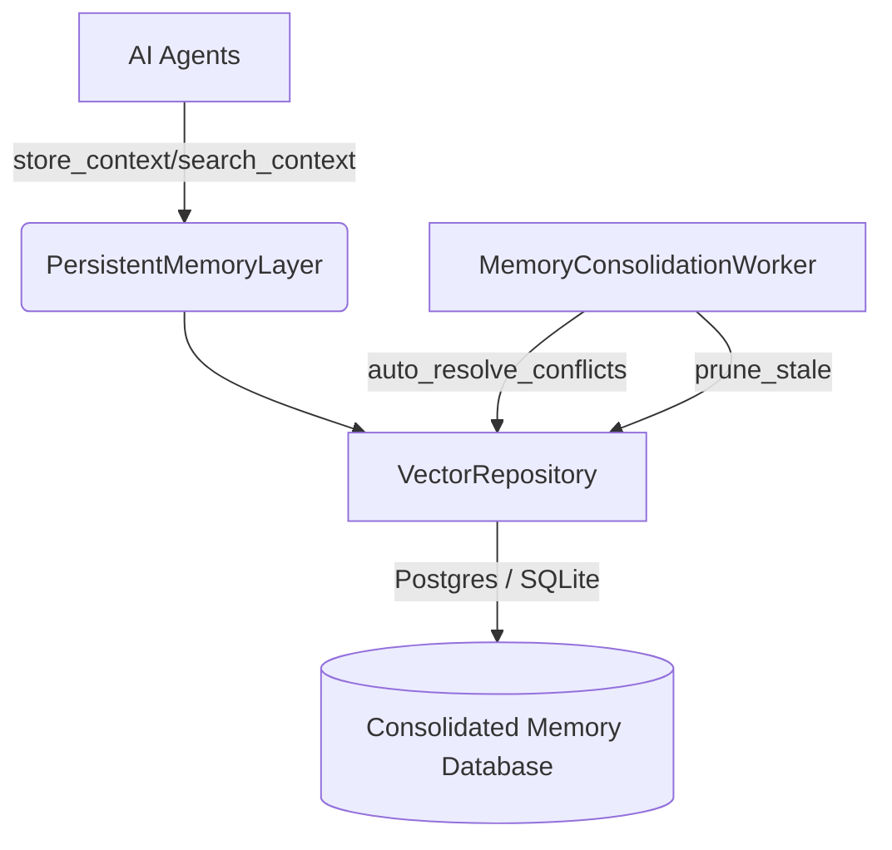

# Architecture Diagram: Persistent Memory Layer

## Conflict Resolution Logic
When conflicting memories are found (cosine similarity < 0.05), they are automatically resolved based on:
1. Owner override (`owner_override = TRUE` wins)
2. Reliability score (Higher score wins)
3. Recency (Newer memory wins)

## Stale Context Pruning
A background worker (`MemoryConsolidationWorker`) runs hourly to prune context:
- Removes records older than 180 days IF they are `TASK_SUMMARY`, not owner-overridden, and have a low reference count (< 5).
- Also removes records with `reliability_score < 20` that are not owner-overridden.
