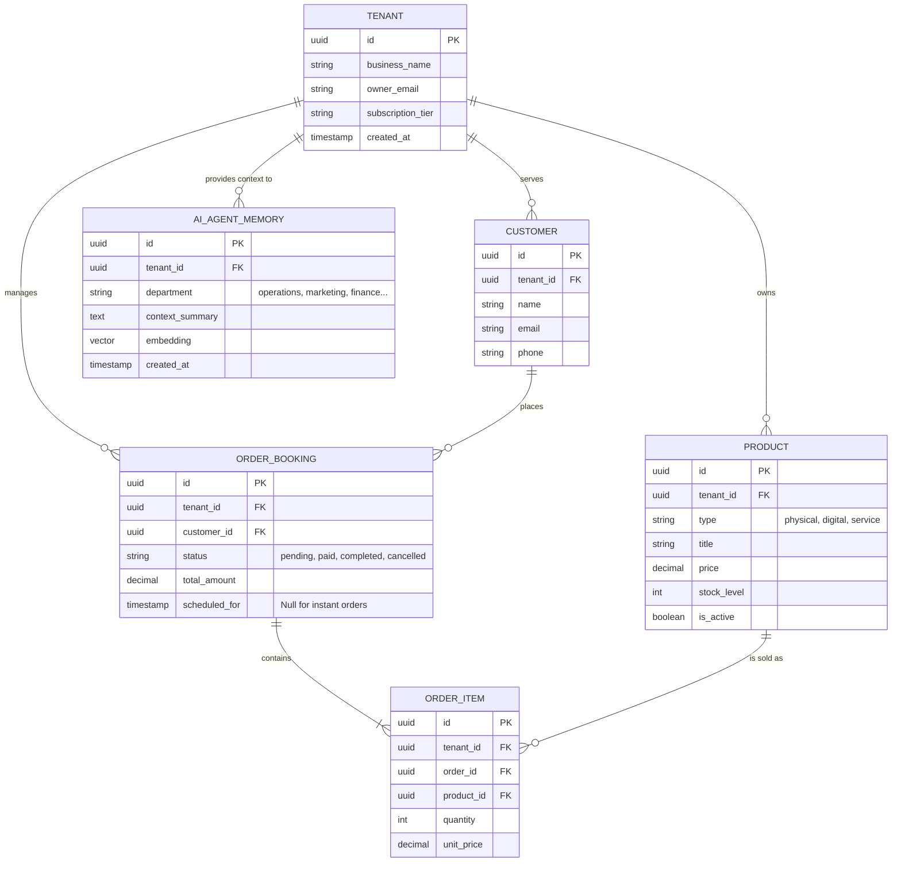

# [architecture] Data Model Architecture

## Problem Statement
Small business owners—from bakers like Maya to tutors like Leo—need a unified platform to manage their entire operation without understanding database tables or data silos. The core OHC platform requires a resilient, multi-tenant data model that can securely store diverse entity types (products, bookings, digital downloads, customer profiles, AI agent contexts) across Cloud-Native (PostgreSQL) and Standalone Desktop (SQLite) modes. Currently, the data structures need to be formally defined to ensure strict tenant isolation, optimal access patterns for mobile and AI agents, and frictionless synchronisation between online and offline states.

## Research Report
- **Goal:** Design the foundational Data Model Architecture for OHC that supports all business types (physical goods, services, digital products, subscriptions, portfolios) under a multi-tenant paradigm.
- **Context:** The system must guarantee that a business owner only accesses their own data (`tenant_id`), while enabling AI agents (e.g., The Operations Manager, The Advisor) to quickly query relevant context via `pgvector` memory embeddings.
- **Competitive Landscape:**
  - **Shopify:** Excellent physical product model, but weak on native service bookings.
  - **Wix:** Flexible, but relies heavily on bolted-on apps leading to fragmented data silos.
  - **OHC Advantage:** A single, cohesive schema where a "Booking" and a "Physical Product" are first-class peers handled by the same AI agents and reporting engines.
- **Key Challenges:** Maintaining strict row-level security (RLS) in a pooled connection environment and designing schemas that can gracefully degrade or sync when transitioning between Cloud PostgreSQL and local SQLite.

## Design Doc

### Entity Relationship Diagram

### Key Invariants
1.  **Strict Tenant Isolation:** Every single table (except global meta-tables) MUST include a `tenant_id` column.
2.  **Row-Level Security (RLS):** In PostgreSQL, `ENABLE ROW LEVEL SECURITY` must be applied to all tenant tables, with policies ensuring `tenant_id = current_setting('app.current_tenant')`.
3.  **Composite Primary Keys:** To enforce isolation and optimize indexing, primary keys should frequently be composite: `PRIMARY KEY (tenant_id, id)`.
4.  **Offline-First Compatibility:** For tables supporting hybrid sync, include `_sync_status`, `updated_at`, and `version` columns.
5.  **Agent Context Locality:** AI agent memories (`pgvector` embeddings) must be strictly partitioned by `tenant_id` to prevent cross-business data leakage during RAG operations.

### Migration Strategy
1.  **Initial Schema Baseline:** Establish the core tables (`TENANT`, `PRODUCT`, `CUSTOMER`, `ORDER_BOOKING`) in the initial migration script.
2.  **Hybrid DB Abstraction:** Utilize the `db.Provider` interface to ensure migrations are applied consistently to both PostgreSQL (using specific RLS commands conditionally) and SQLite.
3.  **Iterative Extension:** Add specialized metadata columns (e.g., JSONB for product variants or specific booking slots) in subsequent migrations rather than complex join tables to maintain read performance for mobile clients.
4.  **Vector Store Introduction:** Introduce the `pgvector` extension and `AI_AGENT_MEMORY` table in a dedicated migration, ensuring fallback mechanisms exist if the extension is unavailable in the Standalone mode.

## Implementation Prompt
"Implement the foundational database migrations and Go entity structs for the OHC Data Model Architecture. Create the initial SQL migration files to define `TENANT`, `PRODUCT`, `CUSTOMER`, `ORDER_BOOKING`, and `ORDER_ITEM` tables. Ensure every table includes a `tenant_id` column and explicit `ENABLE ROW LEVEL SECURITY` statements for PostgreSQL. Create the corresponding Go structs in `src/server/db/models/`, ensuring JSON tags are present for API serialization. Write tests validating that attempting to access a record without the correct `tenant_id` context fails."

## Priority
P0

## Estimated Scope
Medium

