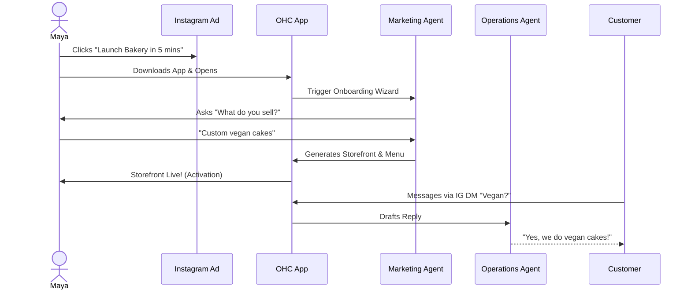
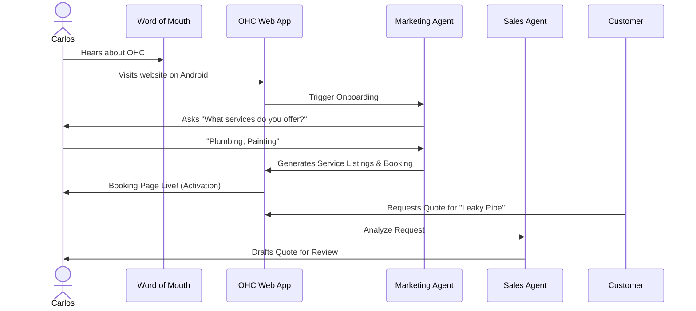
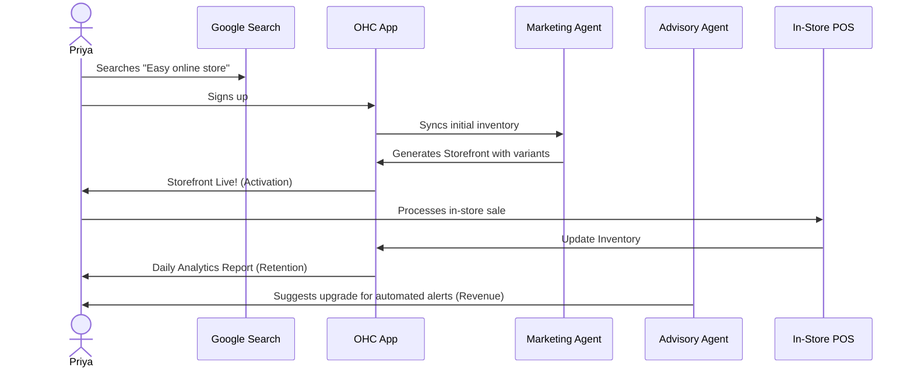
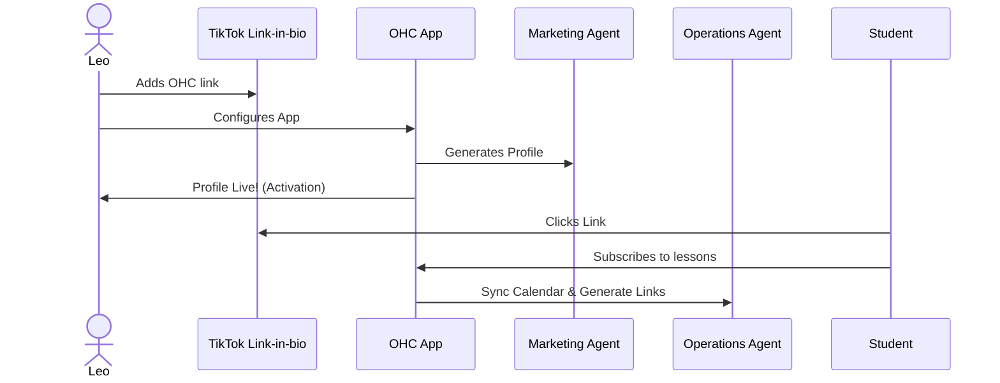
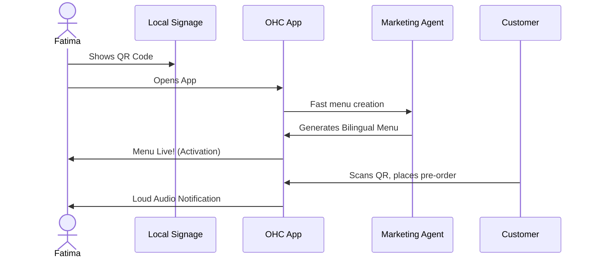

# Architecture: End-to-End Business Journey for OHC Personas

## Problem Statement
The OHC platform must serve a diverse set of real-world small business owners (e.g., Maya the Baker, Carlos the Handyman, Priya the Boutique Owner, Leo the Music Tutor, and Fatima the Food Cart Operator). These users share a common goal: launching and growing their business entirely from a mobile device without technical expertise. The overarching business journeys—from initial acquisition to sustainable revenue generation and referral loops—must be explicitly mapped out architecturally. This ensures the system naturally supports their progression through Acquisition, Onboarding, Activation, Retention, Revenue generation, and Referral, while identifying critical friction points where non-technical users might abandon the platform.

## Research Report

### Competitive Analysis
- **Shopify / Wix / Squarespace**: Focus primarily on semi-technical users and take 30-60 minutes to set up. Mobile management is partial or an afterthought.
- **OHC Advantage**: Zero technical knowledge required. We treat AI as infrastructure (not a bolted-on chatbot) to handle complex setup steps. The management platform is genuinely mobile-first (375px native focus).

### Journey Stages
- **Acquisition**: Initial discovery via organic search, social media ads (Instagram/TikTok), or word-of-mouth. The CTA promises a functional business setup in under 10 minutes.
- **Onboarding**: A highly guided, AI-driven wizard flow minimizing upfront data entry.
- **Activation**: The "Aha!" moment (e.g., live storefront, first booking, first payment).
- **Retention**: Engagement through actionable notifications and AI-generated weekly health reports.
- **Revenue**: Transitioning from free to paid plans based on reached limits or need for premium features (custom domains).
- **Referral**: Incentivized sharing creating a viral loop.

### Identified Friction Points
1. **Cognitive Overload**: Requesting too much setup information upfront causes drop-offs.
2. **Payment Gateway**: Technical jargon during Stripe integration stalls progress.
3. **Availability Sync**: Difficulties mapping real-world schedule availability to digital systems without intuitive AI assistance.

## Design Doc

### Key Design Decisions
- **Progressive Profiling**: The onboarding flow requests the absolute minimum required data. Advanced settings are dynamically suggested by the Business Advisory Agent post-activation.
- **AI-First Setup**: The Marketing & Advertising Agent generates the initial website layout and copy based on minimal inputs.
- **Mobile-First Constraint**: All journey flows must be designed and tested starting at the 375px breakpoint, utilizing native mobile keyboards.
- **Asynchronous Processing**: Non-critical setup tasks are handled via the KAIROS Orchestrator.

### Architecture Diagrams (Mermaid.js)

#### Maya (The Home Baker) Journey

#### Carlos (The Handyman) Journey

#### Priya (The Boutique Owner) Journey

#### Leo (The Music Tutor) Journey

#### Fatima (The Food Cart Operator) Journey

## Implementation Prompt
**To Implementer Agent:**
Implement the foundational user onboarding flow and dashboard state management that supports the progression from Acquisition to Activation across all platforms (Flutter/Go Router). Define the required entity types and relations (business, product, customer) using Go/Bazel struct definitions. Build the mobile-first (375px) UI wizard that guides a user through initial setup with minimal input. Provide 100% test coverage including an end-to-end flow from login to generated storefront.

**Priority**: P0
**Estimated Scope**: Large
