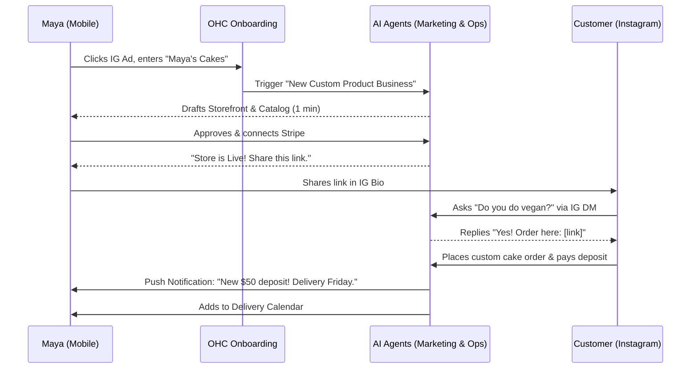
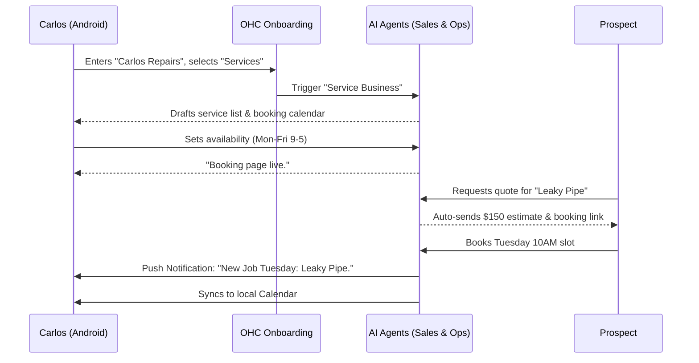
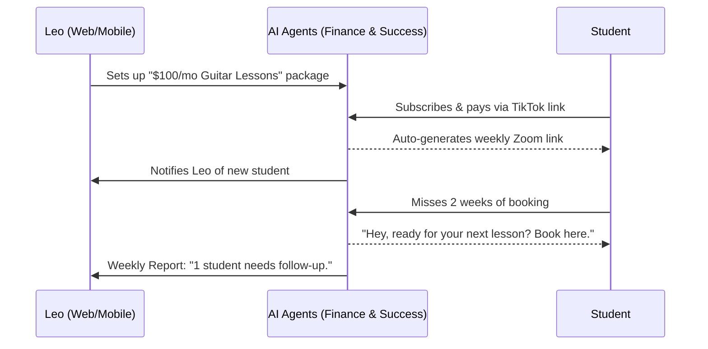

# Business Journey Architecture

## Title
Business Journey Architecture & Journey Mapping

## Problem Statement
Small business owners coming to OneHumanCorp (OHC) often abandon complex platforms like Shopify because they require technical knowledge to set up and manage. The onboarding and continuous operation flow must be seamless, guiding users like Maya (home baker), Carlos (handyman), Priya (boutique owner), Leo (music tutor), and Fatima (food cart operator) from discovery to revenue in under 10 minutes without manual coding or configuration. If the journey includes jargon, manual integrations, or unclear calls-to-action (CTAs), they will drop off. We need a unified architecture mapping for these journeys to ensure the "Zero Technical Knowledge" promise.

## Research Report

We evaluated the onboarding and business management journeys of major competitors.

| Feature | OHC Goal | Shopify | Wix | Squarespace | GoDaddy |
|---|---|---|---|---|---|
| **Time to live** | < 10 mins | 30-60 mins | 20-40 mins | 30-60 mins | 20-40 mins |
| **Technical knowledge** | Zero | Low/Medium | Low | Low | Low |
| **Mobile-first management** | Native & Complete | Partial | Partial | No | No |
| **AI assistance** | Proactive Agents | Reactive/Chat | Reactive | Limited | Basic |
| **Actionable Insights**| Plain language | Dashboard | Dashboard | Dashboard | Dashboard |

**Key Findings:**
1.  **Onboarding Drop-off:** Platforms that ask too many configuration questions upfront (e.g., shipping zones, tax rules) see massive drop-offs. OHC must defer these until necessary.
2.  **Mobile Management:** Most competitors treat the mobile app as a companion to the desktop dashboard. OHC users (like Carlos and Maya) are exclusively mobile. All journeys must start and complete on mobile.
3.  **Proactive vs. Reactive:** Competitors wait for the user to configure settings. OHC's AI agents must proactively set up default configurations and ask for user confirmation.
4.  **Journey Uniformity:** Whether selling a physical cake or a guitar lesson, the core flow (Attract -> Sell -> Fulfill -> Retain) is identical, but the terminology needs to adapt dynamically.

## Design Doc

### Key Architectural Decisions
1.  **Progressive Disclosure:** Users only provide critical info to launch (Name, Core Offering, Payment details). Non-critical info (detailed policies, advanced SEO) is deferred and handled by AI.
2.  **Event-Driven Progression:** Journey progression is driven by system events (e.g., `first_product_added`, `first_sale_made`).
3.  **AI Department Orchestration:** Agents handle the transitions between journey stages (e.g., Marketing agent creates the site, Sales agent kicks in once a lead arrives).

### Mobile UX Flow (375px First)

The entire management experience must be optimized for 375px width screens.

**Screen 1: The Spark (Discovery & Sign Up)**
- Full screen Glassmorphism background with AI generated welcome text.
- Large (44x44px minimum touch target) "Start My Business" button.
- Prompt: "What do you do?" (e.g., "I bake cakes", "I fix pipes").

**Screen 2: The Core Offering (Adding the First Product/Service)**
- AI auto-suggests categories based on Screen 1 input.
- Simple photo upload via native camera.
- Numeric keypad for entering price.
- "Next" button.

**Screen 3: Payment Setup (Stripe)**
- Single button integration: "Connect Bank Account".
- Uses native Apple Pay/Google Pay overlays for frictionless connection where possible.

**Screen 4: The Live Dashboard (Activation)**
- Large success animation.
- Shareable link prominent at the top with a "Copy Link" button.
- Bottom navigation bar: Home (Metrics), Inbox (Messages), AI Team, Orders.

### Persona Journey Maps & Friction Points

#### Maya (The Home Baker) - Custom Product Journey

**Friction Points Identified:**
- Taking good product photos (AI handles enhancement).
- Figuring out pricing for custom cakes (AI Advisor provides market comparisons).
- Setting up deposit logic (Operations Agent auto-configures 50% deposit rule).

#### Carlos (The Handyman) - Service Booking Journey

**Friction Points Identified:**
- Defining exact service scope (Sales Agent uses AI to ask clarifying questions to prospects).
- Managing schedule overlaps (Operations Agent hard-syncs with his existing Google Calendar).
- Requesting payment after a job (Finance Agent sends auto-invoices via SMS).

#### Leo (The Music Tutor) - Subscription Journey

**Friction Points Identified:**
- Tracking which student has paid for this month (Finance Agent tracks and highlights unpaid students).
- Reminding students to book their slot (Customer Success agent auto-sends SMS reminders).

## Implementation Prompt

**Implementer Agent Task:**
Design and implement the core State Machine and Event Bus for the "Business Journey" framework.

**Requirements:**
1.  **State Machine:** Create a robust state machine for a `Tenant` that tracks journey milestones (e.g., `ONBOARDING_STARTED`, `STORE_LIVE`, `FIRST_SALE`, `RETENTION_PHASE`).
2.  **Event Triggers:** Implement an event-driven mechanism where actions (e.g., adding a product, receiving payment) trigger state transitions.
3.  **AI Orchestration Hook:** Ensure each state transition emits an event to the `AI Job Queue` so relevant AI Departments can react proactively (e.g., sending a weekly report when hitting the `ACTIVE` state).
4.  **Mobile-First API:** Expose these states via gRPC/REST so the Flutter mobile client can render the correct onboarding UI or dashboard based on the tenant's current journey phase.

**Acceptance Criteria:**
*   A tenant can progress smoothly from `NEW` to `LIVE` via API calls simulating user actions.
*   The system accurately records timestamps for each milestone.
*   Events are demonstrably published to the message queue on state change.

## Priority
P0 (Critical)

## Estimated Scope
Large