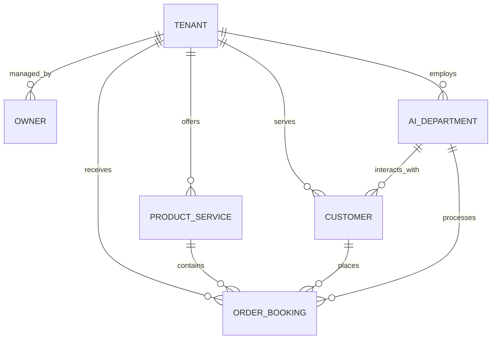
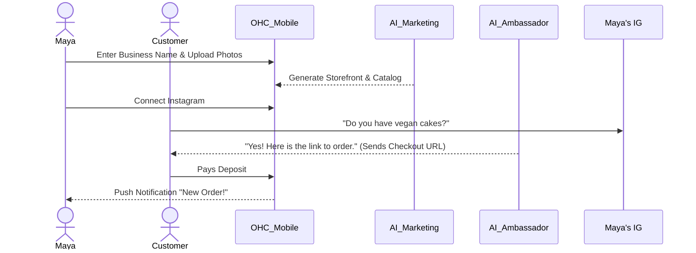
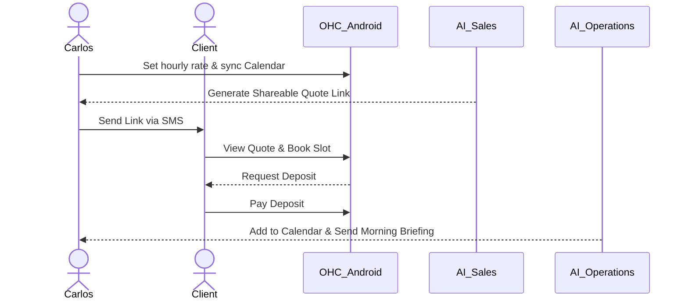

# 📏 Architect: Business Journey Architecture

## Problem Statement

The current ecosystem lacks a comprehensive, end-to-end architectural roadmap focusing purely on the user journey from a non-technical small business owner's perspective. Traditional onboarding, store setup, and management involve high friction, complex configuration, and technical jargon that drives away users like Maya (baker), Carlos (handyman), Priya (boutique owner), Leo (music tutor), and Fatima (food cart). There is an urgent need to design a platform where any business owner can launch, run, and grow their real-world business entirely from a mobile phone in under 10 minutes without writing a line of code or reading technical manuals.

## Research Report

**Market Observations:**
- **Shopify:** Powerful but overly complex for a single-person service or localized product business. Too desktop-heavy. Requires add-ons and theme coding for true customization.
- **Wix/Squarespace:** Website-first, not business-first. Lacks integrated business operations (invoicing, scheduling, integrated POS out of the box without complex plugins).
- **GoDaddy:** Often perceived as outdated and lacking modern AI capabilities.

**OneHumanCorp Opportunity:**
- **AI-First Abstraction:** Agents handle everything from SEO to customer replies. The UI should only ask for business intent.
- **Absolute Mobile Priority:** 100% of tasks, including initial setup, inventory sync, and complex workflows, must be performant and fully usable on a 375px screen.
- **Glassmorphism Premium Feel:** The interface must inspire trust and professionalism using the defined OHC premium design standards.

## Design Doc

### 1. Architectural Entities & Relationships (No DDL)

- **Tenant/Business:** The root entity representing the user's business (e.g., Maya's Cakes).
- **Owner:** The user managing the tenant (Maya).
- **Product/Service:** Offerings ranging from physical goods to digital downloads and booked time slots.
- **Order/Booking:** Customer transactions.
- **AI Agent (Department):** Invisible background workers (Operations, Marketing, Sales, Customer Success, Finance, Legal, Advisory) scoped per tenant.
- **Customer:** The end-users purchasing from the Tenant.

**Key Invariant:** Complete tenant isolation. A business owner and their AI agents can only read, write, and process data belonging to their specific `tenant_id`.

### 2. End-to-End Business Journeys (Personas)

**A. Maya (Baker, Custom Orders via Instagram)**
- **Acquisition:** Sees an Instagram ad: "Stop losing DMs. Get a beautiful ordering page in 2 mins."
- **Onboarding:** Downloads app. Enters business name: "Maya's Cakes". Takes 3 photos of cakes. AI automatically generates descriptions, prices, and an SEO-optimized storefront.
- **Activation:** Connects Instagram account. "The Ambassador" AI starts listening to DMs.
- **Revenue:** Customer DMs "Vegan cakes?". AI replies with a link to Maya's vegan portfolio and a checkout for a deposit. Maya gets a push notification of the sale.

**B. Carlos (Handyman, Service/Booking)**
- **Acquisition:** Word of mouth from a contractor friend.
- **Onboarding:** Opens OHC web on Android. Selects "Services". Inputs hourly rate and service list. AI asks for his availability and syncs Google Calendar.
- **Activation:** AI generates a shareable quote link.
- **Retention:** Carlos sends the link via SMS to a client. The client books and pays a deposit. Carlos receives a daily schedule push notification every morning.

### 3. AI Agent Department Architecture

Agents act as autonomous workers in the background, listening to events on the `tenant_id` scope.

- **Trigger Mechanisms:**
  - **Event-driven:** e.g., "New Order Received" triggers *Operations* to notify the user and *Customer Success* to email the receipt.
  - **Scheduled:** e.g., *Advisor* runs every Sunday at 8 PM to generate a weekly health report.
  - **On-demand:** User asks *Marketing* to "generate a Valentine's Day promo."
- **Coordination:** Agents communicate via an internal event bus.
- **Execution Approval:** Agents operate in `draft` mode for new users (user must approve actions). Once trust is established, users can toggle agents to `auto-execute`.

### 4. Mobile-First UX Flow & UI Wireframe (375px Baseline)

The UI must pass the **Grandmother Test** (no jargon, completed in <30s) and adhere to the **Visual Excellence Mandate** (Glassmorphism backdrop filters, Outfit/Inter fonts).

**Screen 1: The Magic Onboarding (375px)**
- **Header:** "Welcome to OneHumanCorp" (Outfit Font)
- **Content:** A single, large text input: "What do you do?" (e.g., "I bake cakes", "I fix pipes").
- **Action:** A glowing, glassmorphic button: "Launch Business" (44x44px minimum touch target).
- *Background:* Subtle animated gradient with a `backdrop-filter: blur(20px)`.

**Screen 2: The Daily Dashboard (375px)**
- **Header:** "Good Morning, Maya."
- **Metric Cards (Horizontal Scroll):** "Orders: 3", "Revenue: $120", "Unread DMs: 1".
- **AI Suggestion Card:** "The Advisor suggests: You have empty booking slots tomorrow. Send a 10% discount to past clients?" [Approve] / [Dismiss]
- **Bottom Nav:** Home, Store, Messages, AI Staff.

## Implementation Prompt

**To the Implementer Agents:**
Implement the mobile-first "Daily Dashboard" UI for OneHumanCorp.
- **User Outcome:** A small business owner opens the app and immediately sees their daily health metrics and an actionable suggestion from the "Advisor" AI agent.
- **CUJ:** The user logs in -> views daily orders/revenue -> reads the AI Advisor's suggested action -> clicks "Approve" to execute the action.
- **Acceptance Criteria:**
  - Fully responsive, starting at 375px width.
  - Uses OHC Premium Design Standards (Glassmorphism: `backdrop-filter: blur(20px) saturate(200%)`, Outfit font for headings, Inter for body).
  - Minimum touch targets must be 44x44px.
  - Must not use technical jargon.
  - *Note:* Do not define the backend database schema, API endpoints, or function signatures. Just build the UI components and the necessary state stubs to support the CUJ.

## Priority
`P0` (Critical - foundational architecture)

## Estimated Scope
Large