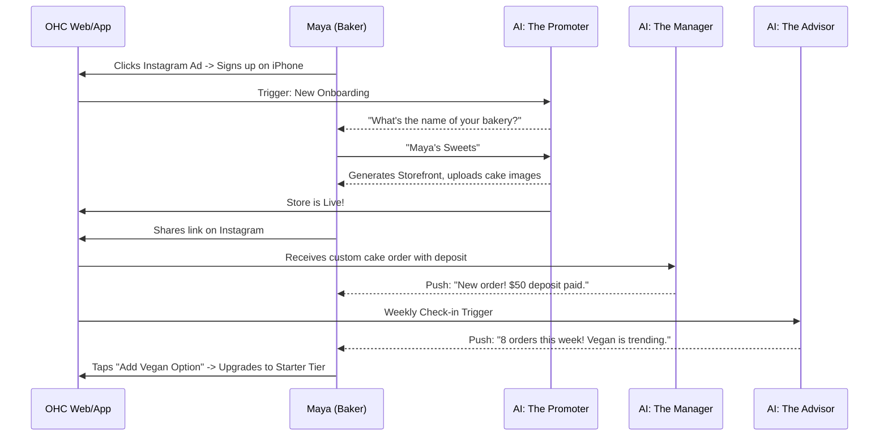
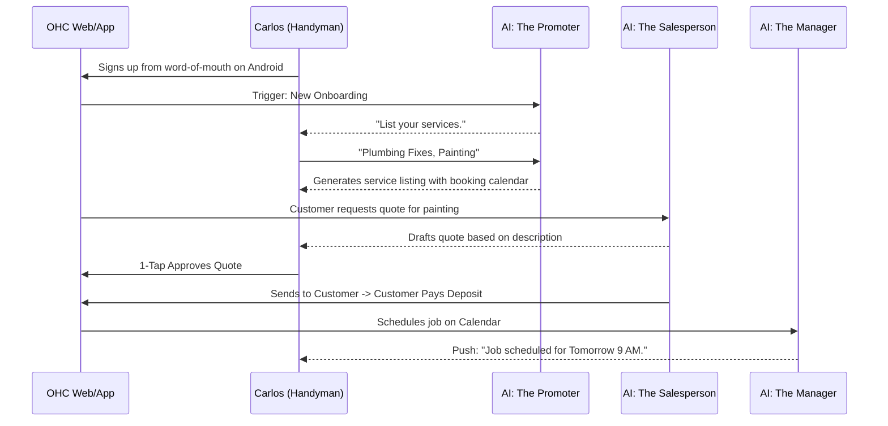
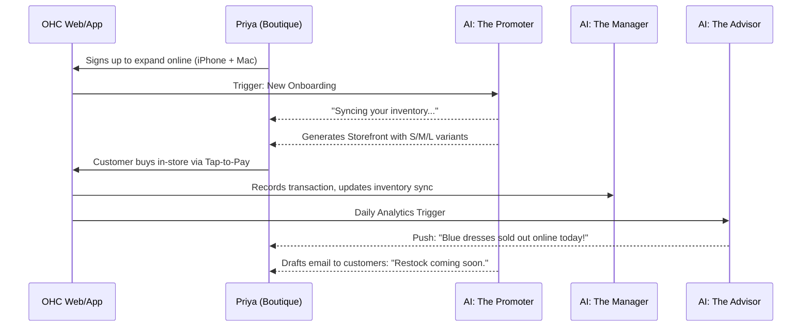
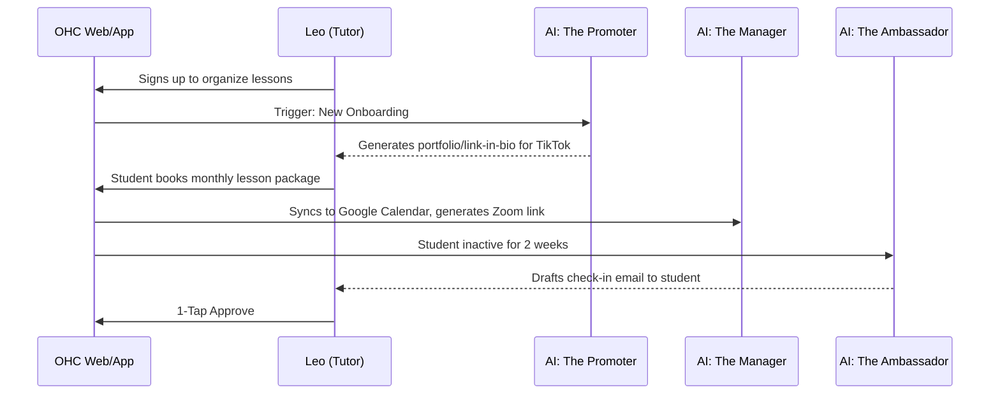
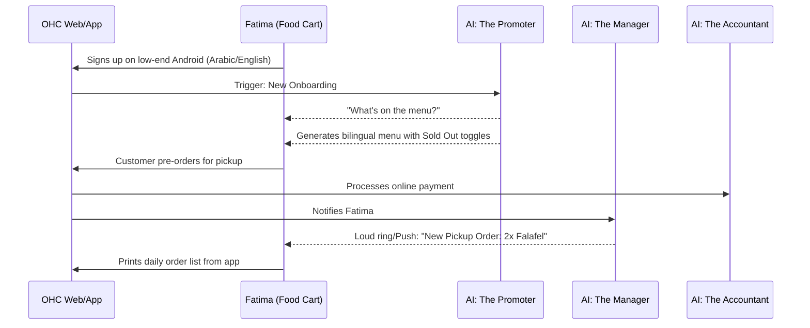

# Issue Brief: Business Journey Architecture

## Problem Statement
Small business owners, especially those without technical backgrounds (e.g., bakers, freelance handymen, music tutors), face immense friction when starting and operating their online businesses. They often abandon the setup process due to complexity, struggle with disjointed tools (website builder, calendar, invoicing), and miss growth opportunities because they don't know what to do next. We need a unified, end-to-end "Business Journey Architecture" that maps the user experience from initial discovery to active retention and revenue generation, ensuring that OHC guides them seamlessly to success within 10 minutes.

## Research Report
- **Market Analysis:** Platforms like Shopify and Wix require 30-60 minutes for initial setup and demand some level of technical proficiency. Squarespace focuses primarily on portfolios and simple stores but lacks integrated, invisible AI operations.
- **Pain Points:**
  - **Onboarding Drop-off:** Users abandon setup when asked for complex configurations (DNS, payment gateways) upfront.
  - **Activation Lag:** Time-to-first-sale is delayed because users don't know how to market their new site.
  - **Retention Risk:** Without clear, actionable feedback, users log in less frequently once the initial excitement wears off.
- **OHC's Edge:** By leveraging our 7 AI Departments invisibly, we can eliminate setup friction. "The Promoter" builds the site; "The Salesperson" handles quotes; "The Advisor" provides weekly plain-language reports.
- **Conclusion:** The business journey must be modeled as a continuous loop: Acquisition -> Onboarding -> Activation -> Retention -> Revenue -> Referral. Each phase must be heavily supported by proactive AI agents.

## Design Doc

### 1. High-Level Concept
The Business Journey Architecture defines the lifecycle of an OHC tenant. It ensures that at every touchpoint, the UI is hyper-simplified (mobile-first, 375px baseline) and AI agents handle the heavy lifting.

### 2. User Journey Flows

#### Maya - The Home Baker (Physical Products / Custom Orders)

#### Carlos - The Freelance Handyman (Services & Bookings)

#### Priya - The Boutique Owner (Physical Products + In-Person)

#### Leo - The Music Tutor (Subscriptions & Portfolios)

#### Fatima - The Food Cart Operator (Food & Beverage)

### 3. Key Phases & AI Integration Points
- **Acquisition:** Users arrive via social media or referrals. The landing page emphasizes "Live in 10 minutes."
- **Onboarding:** A conversational wizard (powered by *The Promoter*) gathers minimal info (Name, Business Type). The storefront is generated instantly.
- **Activation:** Success is defined by adding the first product or service, and receiving the first payment. *The Manager* and *The Accountant* handle the backend processing.
- **Retention:** *The Advisor* sends weekly plain-language reports. *The Ambassador* handles customer follow-ups automatically.
- **Revenue:** Upsells are context-aware. If Maya hits her 10-product limit, *The Advisor* suggests upgrading to the Starter tier ($9/mo) with a 1-tap upgrade button.
- **Referral:** Built-in sharing tools (QR codes, link-in-bio) generated by *The Promoter*.

### 4. UI Wireframes & Mobile UX Flow
- **Breakpoint:** 375px (Mobile First).
- **Onboarding Screen 1:** Large, friendly text: "What do you do?" with big, tappable category buttons (Baking, Repair, Tutoring, etc.). Minimum 44x44px touch targets.
- **Onboarding Screen 2:** "Give us 30 seconds..." (Loading animation with Glassmorphism effects while *The Promoter* builds the site).
- **Dashboard (Post-Launch):**
  - Top Card: Action Required (e.g., "Review draft reply to Instagram DM" from *The Ambassador*).
  - Middle Card: Quick Stats (Revenue this week).
  - Bottom Card: Advisor Insight ("Vegan cakes are trending.").
- **Navigation:** Bottom tab bar: Home, Inbox, Orders, Analytics, Settings.

### 5. Key Design Decisions
- **Deferred Complexity:** We do not ask for custom domains, tax details, or complex shipping rules during onboarding. These are deferred until the user actually needs them (e.g., right before the first payout).
- **Proactive Insights Over Dashboards:** Instead of complex charts, we push plain-language insights via notifications, reducing cognitive load.
- **Mobile-Exclusive Focus:** The entire journey from signup to daily management is designed to be completed one-handed on a smartphone.

## Implementation Prompt
Implement the end-to-end Onboarding and Dashboard flows for the new Business Journey.
- Create a mobile-first (375px) conversational onboarding wizard that collects business name and category, then triggers "The Promoter" AI agent to generate a basic storefront.
- Implement the primary mobile Dashboard containing the "Action Required" feed, simple revenue metrics, and a dedicated slot for weekly insights from "The Advisor".
- Ensure the critical user journey (CUJ) starts from a fresh signup, navigates the wizard, and lands on the functional dashboard.
- Acceptance criteria: The user can complete onboarding in under 3 screens, and the final dashboard displays mocked agent insights and action items clearly on a mobile viewport.

## Priority
P0

## Estimated Scope
Large
