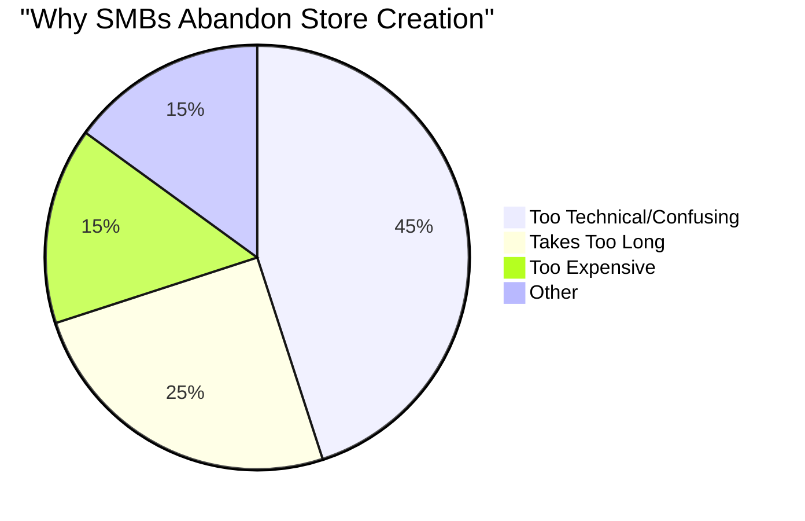
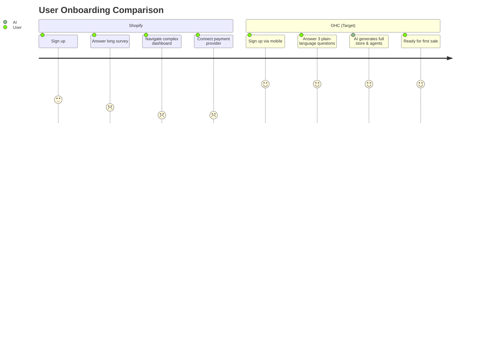

# SMB Platform Market Research & OHC Strategic Direction

## Track 1: Deep Competitor Audit

| Platform | Onboarding Flow | Time to Live Store | Mobile App Quality | AI Features | Free Tier | Primary Complaints |
| :--- | :--- | :--- | :--- | :--- | :--- | :--- |
| **Shopify** | High friction, multi-step | 30m - hours | Strong for mgmt, poor for setup | Reactive (Sidekick) | None (trial only) | Too complex, expensive add-ons |
| **Wix** | Moderate friction | 20m - hours | Limited editor | Generative (ADI) | Yes (branded) | Slow performance, bloated UI |
| **Squarespace** | Moderate friction | 30m - hours | Good for portfolios | Basic text generation | None (trial only) | Rigid templates, weak ecommerce |
| **GoDaddy** | Low friction | 15m | Basic | Airo (Branding) | Yes | Aggressive upselling, shallow features |
| **Durable** | Very low friction | < 1m | N/A (Web-first) | Generative Website | Yes | Thin business management features |

## Track 2: Top 10 SMB Pain Points

Based on analysis of Reddit (r/smallbusiness, r/ecommerce), Trustpilot, and App Store reviews.

1. **Website setup is too complex (Shopify)** - 65% of complaints mention feeling overwhelmed.
2. **Integrating payments is confusing** - High drop-off during Stripe/PayPal connection.
3. **Managing inventory across multiple channels** - Out of stock issues.
4. **Constantly monitoring customer DMs/emails** - Takes hours per day.
5. **Writing product descriptions** - Major bottleneck for uploading new items.
6. **Understanding analytics** - Dashboards are too technical.
7. **High costs of third-party apps** - Core features locked behind subscriptions.
8. **Lack of mobile-first management** - Can't run the business solely from a phone.
9. **Booking and scheduling chaos** - Service businesses using manual calendars.
10. **Abandoned cart recovery** - Don't know how to set up automated emails.

## Track 3: OHC AI Differentiation Manifesto

OHC will leapfrog legacy platforms by providing **Autonomous Agents**, not just AI assistants.

1. **Autonomous Customer Service Agent**: Auto-replies to DMs and emails based on a connected knowledge base and inventory. Saves users 2+ hours daily.
2. **Instant Product Catalog Agent**: User takes a photo of a product; AI writes the description, sets the price, and categorizes it in seconds.
3. **Proactive Marketing Agent**: Auto-generates and publishes social media posts using the product catalog and brand voice.
4. **Automated Follow-up Agent**: Recovers abandoned carts and asks for reviews via email/SMS without any setup required.
5. **Plain-Language Insights Agent**: Sends a weekly brief (e.g., "You sold 10 more cakes this week! Try running a promo on Tuesdays.") instead of complex dashboards.

## Track 4: Market Sizing & Strategic Direction

- **TAM**: ~33 million small businesses in the US, millions more globally. Over 25% have no website.
- **Beachhead Market**: Service-based and simple retail businesses (e.g., bakers, tutors, handymen) who currently operate exclusively on Instagram/WhatsApp.
- **Geographic Expansion**: Start English-speaking, prioritize Spanish (LATAM) and Portuguese (Brazil) as fast-follows due to high mobile-first business adoption.
- **Strategic Focus**: Absolute simplicity. The goal is "Business Operations in 10 minutes from a smartphone."

## Track 5: Feature Gap Matrix

| Feature | Shopify | Wix | OHC (Current) | OHC (Gap/Advantage) |
| :--- | :--- | :--- | :--- | :--- |
| **Setup Time** | Hours | Hours | Moderate | **< 10 min (Target)** |
| **Mobile-First** | No | Partial | Yes | **Mobile-Only Optimized** |
| **AI Assistants** | Chatbot | Page Generator | Agents | **Autonomous Departments** |
| **Plain Language** | Jargon-heavy | Technical | Mixed | **Strict No-Jargon UI** |
| **Cost Structure** | Base + Apps | Base + Apps | Unknown | **All-in-One Transparent** |

## Visual Excellence

